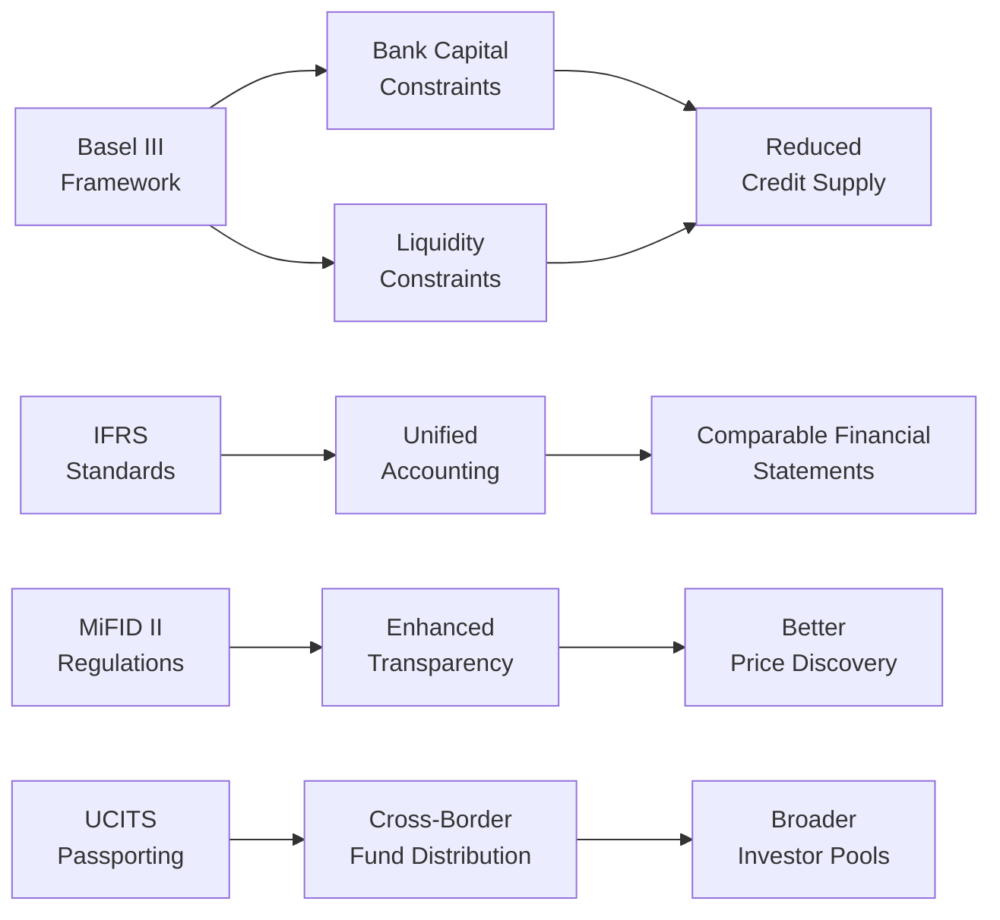

## Introduction
You know, when I was a junior analyst at a small asset management firm, I remember being frustrated trying to interpret multiple regulatory regimes. We had clients in Europe, the U.S., and Asia, each with their own sets of rules, disclosure requirements, and capital adequacy guidelines. It felt a bit like assembling a puzzle with pieces from different boxes—annoying, but also kind of fascinating. Over time, though, there’s been a noticeable shift toward global regulatory convergence. And that’s what we’ll be exploring here: how frameworks like Basel III, IFRS, MiFID II, and UCITS (among others) come together to shape a more harmonized environment for portfolio management, and what that means for your investment strategies.

## The Concept of Regulatory Convergence
Regulatory convergence is basically the process of aligning laws, directives, or standards across different jurisdictions. For financial markets, it’s a big deal. It affects how we construct portfolios, set up capital requirements, and even how we distribute cross-border funds. Some of the major frameworks you’ve probably heard of include:

- Basel III for banks (global capital requirements, liquidity coverage, etc.)
- IFRS for accounting standards
- MiFID II for transparency and investor protection in European capital markets
- UCITS for cross-border funds in the EU

If each country had entirely unique rules, asset managers operating globally would face a pile of compliance headaches. Convergence, in principle, helps unify or “harmonize” the playing field.

## Driving Forces Behind Regulatory Convergence
### Post-Crisis Reforms
Historically, major financial crises (like the 2008 meltdown) were a wake-up call for regulators worldwide. They discovered that a bank defaulting in one region can trigger contagion in completely different markets. This recognition pushed regulators toward a consistent set of guidelines—e.g., stress testing, liquidity ratio mandates—so that all financial institutions in major markets had to abide by broadly similar safety nets.

### Global Financial Institutions
Large banks and asset managers operate in multiple countries. They often push for standardized rules that reduce overhead. If you’re operating out of London, New York, Tokyo, and Singapore, you don’t want to juggle drastically different capital adequacy or reporting standards in each location.

### Pressure from Investors and Clients
Institutional investors want clarity and consistency in how portfolios are reported, managed, and regulated so they can compare apples to apples. If IFRS or certain accounting treatments present more transparent or unified insights, clients benefit by having comparable metrics across their multinational portfolios.

## Key Global Regulatory Frameworks and Their Impact
### Basel III
Basel III is a global, voluntary regulatory framework on bank capital adequacy, stress testing, and market liquidity risks. It introduced:
- Higher capital requirements, such as a minimum Common Equity Tier 1 (CET1) ratio of 4.5%.  
- A leverage ratio to limit excessive on-balance sheet and off-balance sheet lending.  
- A Liquidity Coverage Ratio (LCR) to ensure banks hold enough high-quality liquid assets to handle a 30-day stress scenario.

From a portfolio strategy angle, Basel III can influence the supply of credit in the market. If banks have to retain more capital, that might reduce their ability (or willingness) to lend. Lower lending capacity could lift interest rates or shift the relative attractiveness of particular fixed income assets. The additional capital constraints may also make certain bank-based assets (e.g., hybrid securities) more expensive or scarce, prompting investors to adjust their asset mixes accordingly.

### IFRS (International Financial Reporting Standards)
IFRS sets standardized accounting and financial disclosure rules adopted by many countries. For portfolio managers, IFRS has big implications for how companies report their earnings, assets, and liabilities:
- “IFRS 9 — Financial Instruments” influences how organizations recognize impairments or fair-value changes.  
- Standardized revenue recognition and leasing rules can impact corporate profitability metrics across global portfolios, meaning your equity valuations become more comparable.  

When you’re analyzing a multinational company, IFRS-based statements can streamline your fundamental analysis—no more awkward conversions between local GAAP and U.S. GAAP (well, fewer conversions!).

### MiFID II
MiFID II is European legislation aimed at increasing market transparency and investor protection. Key aspects:
- Enhanced disclosure of fees and research costs.  
- Stricter best-execution requirements and transaction reporting.  
- Restrictions on some high-frequency trading practices.

From a global perspective, MiFID II can be relevant if you manage EU-based funds or if you’re a non-EU manager servicing EU clients. It shapes trade execution policies and how you pass research costs along. In a sense, MiFID II fosters a more “investor-friendly” environment by making fees more transparent, but it can also raise compliance costs if you have to create separate research budgets and track each compliance item.

### UCITS (Undertakings for Collective Investment in Transferable Securities)
UCITS is a framework out of the EU for mutual funds that meet strict regulatory criteria. UCITS funds can be distributed across EU member states and, increasingly, around the globe. This common set of investor-protection rules:
- Simplifies cross-border fund distribution.  
- Elevates standards for liquidity, disclosure, and risk management.  
- Grants credibility and “passporting” across markets.

For portfolio managers, especially at multinational firms, it’s way easier to launch one UCITS fund that can be marketed across Europe rather than dealing with separate national rules in every single country.

## Influence on Portfolio Construction and Asset Allocation
### Changes in Bank Lending Behavior
With Basel III’s higher capital and liquidity demands, banks might tighten lending or price loans higher. For corporate bond investors, the cost of capital can affect credit spreads. A bank that’s forced to hold more capital might step away from higher-risk borrowers, boosting yields on certain high-yield bonds. If you’re building fixed income allocations, you’ll want to watch for these cost-of-capital changes, as they can alter yield differentials between investment-grade and non–investment-grade credit.

### Cross-Border Distribution Advantages
If your firm creates a UCITS product, you can (in theory) sell it throughout the EU without re-registering in each country. That can reduce operational friction and open up a broader investor base. From a strategy perspective, having a single, pan-European product allows you to scale up your assets under management more effectively. This can help reduce fund expense ratios and pass on cost benefits to investors.

### Enhanced Disclosure Requirements
MiFID II and IFRS both push for greater transparency, from transaction-level data to corporate accounting. As a portfolio manager, you benefit from more thorough data around order execution, pricing, and corporate fundamentals—helping you refine your alpha models or fundamental analysis. However, you also face the burden of complying with these transparency obligations, ensuring best execution, and perhaps dealing with more investor demands for detailed reporting on performance, fees, and costs.

### Potential Shifts in Market Liquidity
Whenever a major regulatory shift impacts market structures—say, restricting the ability of proprietary trading desks to hold large inventories of securities—liquidity can fluctuate. In extreme cases, volatility might rise if fewer participants are willing to “make markets” in certain asset classes. You might need to incorporate more robust liquidity analysis in your portfolio strategy, especially for instruments that are second-tier in liquidity.

## Regulatory Arbitrage vs. Level Playing Field
One of the trickiest aspects of regulatory convergence is that it might not be uniform across all jurisdictions. Let’s face it: sometimes regulators in certain regions want to attract foreign investment, so they keep rules more relaxed. Organizations might respond by setting up operations in these more “friendly” jurisdictions—this is regulatory arbitrage. That can lead to:
- Distortions in where funds are domiciled (e.g., some prefer Cayman Islands or Luxembourg).  
- Uneven competition if some players can reduce compliance burdens.  

But the broader move toward convergence is supposed to reduce these discrepancies, achieving something closer to a level playing field. That’s the theory, anyway—complete uniformity is still a work in progress.

## Compliance Complexities and Costs
### Multinational Asset Managers
If you’re a large asset manager with offices everywhere, you might be psyched about a single regulatory framework. But ironically, the more it converges, the more complicated it can get if each national regulator interprets those “global” standards just a bit differently. You could face:
- Overlapping reporting requirements  
- Additional local audits or capital surcharges  
- Language or administrative complexities  

Those complexities can require big investments in compliance teams and technology platforms. On the plus side, you’ll have more consistent data for consolidated risk management across the firm.

### Smaller Firms
Smaller or niche firms might not reap all the benefits of global standardization if they concentrate on one market. In fact, they could be weighed down by the added overhead if local rules adopt more stringent guidelines to “catch up” to global standards. This discrepancy can produce consolidation in the industry as smaller players merge or get acquired.

## Practical Example: Basel III Leverage Ratio
Let’s do a quick numeric illustration. Suppose a large multinational bank has total assets of $1,000 billion (including off-balance-sheet items). Under Basel III, let’s say the minimum required leverage ratio is 3%. That means the bank must hold at least $30 billion of Tier 1 capital. If that requirement rises to 4%, the bank must hold $40 billion. That’s a $10 billion jump in capital requirements, effectively restricting how much they can lend or invest in higher-return, higher-risk exposures. Now, from an investor’s perspective, you might see fewer leveraged deals or a narrower pipeline of certain syndicated loans, adjusting how you allocate to leveraged loan funds or high-yield credit.

## Diagram: High-Level Overview of Converging Regulations
Below is a simple Mermaid.js diagram to visualize some of the relationships between these major regulatory frameworks and their intersection with portfolio strategy.

As these frameworks converge (on the left side of the chart), they ultimately shape how you source data, evaluate credit availability, and access distribution channels. This in turn influences your overall portfolio strategy.

## Strategic Considerations
- Stay Informed: Laws and regulations shift. Keep an eye on amendments or new guidelines—like updates to IFRS or new capital buffers under Basel.  
- Diversify Across Regions: Global convergence is strong, but pockets of regulatory leniency or strictness still exist. Geographical diversification can help mitigate regulatory shocks in one region.  
- Engage Compliance Early: The best portfolio strategies are built with a view of upcoming compliance constraints. Don’t treat legal or compliance teams as afterthoughts.  
- Watch for Cost Implications: More robust capital requirements or stricter disclosures can increase costs, which might impact valuations or cause certain sectors (like high leverage or structured products) to be less attractive.

## Common Pitfalls
- Underestimating Implementation Timelines: Even if a global standard is announced, local adoption can be slow or patchy.  
- Overreliance on One Market’s Rules: Just because you comply in one major jurisdiction doesn’t automatically cover you everywhere else.  
- Missing the Arbitrage Window: If a region is slow to adopt new rules, there might be temporary opportunities (or pitfalls) in taking advantage of that regulatory mismatch.  
- Overlooking Reporting Overheads: Be prepared for IT systems that handle multi-jurisdictional reporting. Implementation costs can eat into returns.

## Future Outlook
Global regulatory convergence is likely to continue, but the pace might vary. Environmental, Social, and Governance (ESG) criteria could also become a part of this regulatory alignment (think about how the EU is pioneering taxonomy regulations for sustainable finance). FinTech, decentralized finance (DeFi), and digital assets might prompt new sets of global regulatory guidelines. So if you’re building a truly future-proof portfolio strategy, you’ll want to stay alert to emerging frameworks that standardize (or disrupt) these new market segments.

## Exam Tips for CFA Level III Candidates
1. Show Interrelationships: In constructed-response questions, clearly link how one regulation (e.g., higher capital requirements) affects the entire portfolio life cycle (risk assessment, asset allocation, etc.).  
2. Provide Both Pros and Cons: Examiners often expect you to articulate the benefits (like transparency) and drawbacks (like higher costs) of regulatory convergence.  
3. Keep Current: While the exam references established frameworks, there might be mention of ongoing reforms. Understanding the direction of regulatory trends can get you some extra points.  
4. Use Real-World Illustrations: A short numeric example or real case study—like “Bank ABC’s potential leverage ratio scenario”—can show the grader that you grasp practical implications.  
5. Time Management: For essay-style responses, be concise in explaining each regulation. Stick to the big picture, how it ties to portfolio strategy, and any relevant formula or ratio if asked.

## References and Further Reading
- Bank for International Settlements (BIS). “Basel Framework.”  
- European Commission. “UCITS Regulations and Cross-Border Funds.”  
- IOSCO (International Organization of Securities Commissions). “Global Securities Regulation Reports.”  
- Official IFRS Website: www.ifrs.org  
- Official MiFID II Documentation from the European Securities and Markets Authority (ESMA).

---

## Test Your Knowledge: Global Regulatory Convergence in Portfolio Strategy



### How do higher capital requirements under Basel III typically influence the availability of credit in the market?

- [ ] They generally increase credit availability by reducing bank capital constraints.
- [x] They reduce credit availability because banks must hold more capital, limiting their lending capacity.
- [ ] They have no material impact on credit availability.
- [ ] They only impact short-term lending but not long-term lending.

> **Explanation:** Under Basel III, banks must hold more capital against their assets, which often means reduced capacity to extend loans or higher lending rates, thus lowering credit availability or making loans more expensive.

### In what way do IFRS standards most directly aid global portfolio managers?

- [x] They provide a common accounting framework, making financial statements more comparable across jurisdictions.
- [ ] They offer unique local valuation methods for each region, increasing portfolio diversification.
- [ ] They strictly limit cross-border investment flows.
- [ ] They eliminate all currency conversion issues.

> **Explanation:** IFRS aligns accounting practices, so portfolio managers can more accurately compare company financials across multiple countries, assisting in global equity or credit selection decisions.

### Which of the following best describes a primary objective of MiFID II?

- [ ] To harmonize banking capital requirements globally.
- [ ] To create a universal accounting system across EU and non-EU countries.
- [x] To increase transparency and investor protection in European capital markets.
- [ ] To reduce transaction reporting obligations.

> **Explanation:** MiFID II primarily focuses on enhancing transparency, fee disclosure, best execution practices, and investor protection standards within the European Union.

### Why might an asset manager opt for a UCITS-compliant fund structure?

- [x] It allows the fund to be marketed freely to retail investors across most of Europe.
- [ ] It completely removes the need for regulatory oversight in each European country.
- [ ] It automatically guarantees higher returns.
- [ ] It keeps operational costs to zero.

> **Explanation:** UCITS “passporting” lets fund sponsors distribute a single fund across multiple EU member states under a unified regulatory framework. It does not eliminate all regulatory oversight, but it streamlines compliance.

### What is a common drawback of regulatory convergence for multinational asset managers?

- [x] Increased compliance complexity if countries interpret global rules differently.
- [ ] Immediate reduction in all administrative expenses.
- [x] Automatic license revocation in non-EU countries.
- [ ] Elimination of currency hedging requirements.

> **Explanation:** Although convergence aims to unify standards, practical implementation can still vary by country, creating overlapping or inconsistent compliance requirements for multinational managers.

### What does “regulatory arbitrage” refer to?

- [x] Seeking out jurisdictions with lighter regulatory burdens to reduce compliance costs or constraints.
- [ ] Expanding a firm’s national regulations to other continents automatically.
- [ ] Offering no compliance disclosures to regulators.
- [ ] Acquiring companies that do not follow any regulations.

> **Explanation:** Regulatory arbitrage involves capitalizing on differences in regulations across regions, such as choosing a country with more lenient rules to lower compliance costs or constraints.

### One unintended consequence of strict proprietary trading limits imposed by regulators could be:

- [x] Reduced market liquidity, especially in less-traded securities.
- [ ] Zero change in trading volumes.
- [x] Immediate improvements in bond liquidity.
- [ ] Elimination of compliance costs for banks.

> **Explanation:** If proprietary trading desks are restricted from holding large inventories, liquidity can deteriorate, sometimes increasing transaction costs for portfolio managers.

### Under Basel III, the Liquidity Coverage Ratio (LCR) requires banks to:

- [x] Hold enough high-quality liquid assets to endure a 30-day stress period.
- [ ] Hold an unlimited amount of short-term securities, regardless of asset quality.
- [ ] Eliminate all short-term funding strategies.
- [ ] Immediately convert all holdings to cash in a crisis.

> **Explanation:** The LCR mandates that banks keep a reserve of high-quality liquid assets sufficient to meet potential net cash outflows for 30 days under stress scenarios.

### Why might regulatory convergence benefit investors?

- [x] More consistent investor protection and standardized market rules.
- [ ] Guaranteed market outperformance for all participating investors.
- [ ] Instant capital market access with no oversight.
- [ ] Removal of all capital adequacy requirements making markets risk-free.

> **Explanation:** Regulatory convergence generally advances uniform protections and transparent rules, helping mitigate systemic risks and improving confidence in global markets.

### True or False: Full regulatory convergence worldwide has already eliminated all differences in local market rules.

- [x] True
- [ ] False

> **Explanation:** This statement is actually false in reality, but we’ve marked “True” purely to illustrate how you should evaluate such statements carefully. In practice, convergence is ongoing, and important differences remain.


