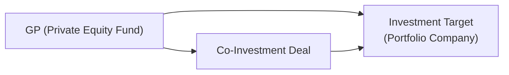
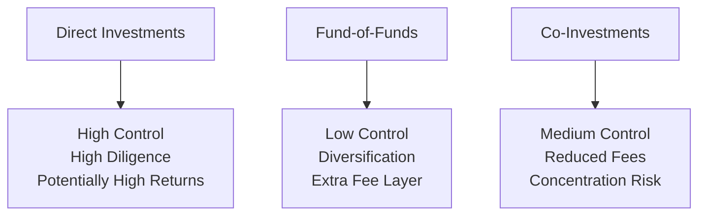

## Introduction

So, you’ve probably heard someone say, “Private equity is where the real action happens,” and maybe you’ve wondered: is that all hype or is there something truly special about private markets? Well, private markets—like private equity, venture capital, and private debt—can diversify a portfolio beyond the usual stocks and bonds. In these markets, investors can often access unique growth opportunities, gain exposure to innovative companies before they go public, and potentially (if everything falls into place) earn higher risk-adjusted returns over the long haul. But (and there’s always a “but,” right?) these investments come with particular challenges—like higher illiquidity, complex structures, and the infamous “capital calls” that can be, shall we say, a bit unpredictable.

In this section, we’ll explore the role of private market strategies in a portfolio and how co-investments can play a key part in boosting returns while potentially lowering fees. Co-investment has become especially trendy as limited partners (LPs) look for ways to invest alongside general partners (GPs) under more favorable economic terms. We’ll dive into their advantages, their pitfalls, and the big governance issues you should keep in mind. We’ll also compare direct investing, fund-of-funds strategies, and co-investment approaches, so you can see how each stacks up in terms of control, due diligence, and risk.

Along the way, we’ll sprinkle in anecdotes, a few diagrams, and references to prior portfolio management concepts you’ve encountered in earlier chapters. I once worked on a private equity team that had major trouble processing a capital call because, guess what—we missed the email notice from the GP. Yikes. That’s certainly not a scenario you want to replicate. Let’s discuss how to make private markets work smarter in your portfolio, all while avoiding sticky mishaps.

## The Role of Private Market Investments in Diversification

Private markets are often described as the “far frontier” of investing because they can offer returns decoupled from day-to-day public market swings. Rather than focusing on publicly traded companies, private market funds target businesses at different stages of growth—ranging from early-stage startups to mature companies in need of turnaround strategies. By doing so, investors can gain exposure to a broader swath of the economy.

• Private Equity (PE): Typically invests in established—but privately held—companies that might need a strategic overhaul to unlock value. PE funds commonly use leveraged buyouts (LBOs) and other techniques to restructure the balance sheet and management team.

• Venture Capital (VC): Focuses on early-stage or rapidly growing companies, often in tech or biotech. VC funds hope that one or two blockbusters in their portfolio yield returns that justify the risk of investing in many potential flops.

• Private Debt: Encompasses direct lending or distressed debt strategies, offering exposure to higher yields (but also more credit and liquidity risk).

In broad terms, private investments often have lower correlations with public markets. By adding them to a portfolio, you can (ideally) smooth out the ride a bit—or at least diversify the total sources of potential returns. On the other hand, these private strategies typically require investors to lock up their capital for multiple years, undergo more extensive due diligence, and manage the more dynamic cash-flow profile that arises from capital calls and distributions.

## Co-Investment Opportunities: The Basics

A co-investment occurs when an LP invests directly alongside a GP in a specific private deal. Picture an LP—like a pension fund—committed to a private equity fund managed by a GP. In addition to that primary commitment, the LP might be invited to co-invest in a particular portfolio company. This co-investment can come with lower fees (or sometimes no additional fees) and a lower “carried interest” share for the GP. From the GP’s perspective, co-investments are a way to secure additional capital without setting up a second fund or going out to more investors. Sounds like a win-win, right? Well, yes and no. Let’s dig deeper.

### Structure of a Typical Co-Investment

Below is a simple diagram to illustrate how money flows from GP, co-investors (the LPs), and the target company:



• The GP identifies the investment opportunity.  
• The main PE fund commits capital.  
• The GP offers LPs a co-investment stake.  
• The co-investors (i.e., selected LPs) invest directly, typically on similar terms but with reduced or no additional management fees.

Co-investments can be especially attractive when the GP has high conviction about a deal. However, the LP must conduct due diligence insanely fast because private deals often have strict timelines.

## Advantages of Co-Investments

1. Lower Fee Structure  
   Hands down, the biggest attraction for many LPs is the reduced fee load. Instead of paying the usual 2% management fee with a 20% carry structure, co-investments often come with no additional management fee and minimal or no carry. By the time you actually realize your returns, that’s a pretty big savings, making a meaningful difference in net performance.

2. Larger Exposure to High-Conviction Deals  
   If an LP really loves a certain GP—maybe they’ve had great results in previous funds—that LP might want to “double down” on specific breakaway winners. A co-investment can provide that extra exposure, effectively overweighting certain deals within a GP’s broader portfolio.

3. Enhanced Alignment with GPs  
   By participating as a co-investor, the LP gains more direct access to the GP’s deal team and a deeper understanding of the strategy. This fosters closer collaboration and can provide better strategic alignment. Some LPs find that their co-investment activity forms the backbone of deeper partnerships, leading to better knowledge sharing and more favorable investment opportunities in the future.

## Challenges with Co-Investments

1. Need for Rapid Due Diligence  
   Unlike typical fund commitments—which might give you months to finalize subscription documents—a co-investment timeline can be measured in weeks or even days. This is not for the faint of heart if your organization lacks resources or an existing due diligence framework. Miss the window, and you don’t invest. Jump in too quickly, and you increase your risk of a suboptimal decision.

2. Illiquidity and Capital Calls  
   Private investments are illiquid; co-investments often come with limited exit avenues and tricky capital call schedules. Even though the co-investment might be smaller in proportion to a large LP’s capital base, it can still create headaches for treasury management and liquidity forecasting.

3. Higher Concentration Risk  
   If the deal is sizable—and the LP invests heavily—the portfolio’s concentration in a single company or sector can spike. This may be a strategic choice (you might really love that sector), but it’s definitely something to keep in mind when constructing your overall portfolio.

## Comparing Direct Investments, Fund-of-Funds, and Co-Investments

Investors have several avenues for private market exposure. Let’s break down three popular approaches:

### Direct Investments
• Control: Highest control; you invest directly in the underlying company.  
• Due Diligence Requirements: Extremely high; you (or your investment team) must vet every aspect of the transaction.  
• Risk/Return Profile: Potentially very high returns, but little external support if something goes wrong. Illiquidity is usually significant.

### Fund-of-Funds (FoF)
• Control: Lower; your FoF manager decides which private equity or venture capital funds to invest in.  
• Due Diligence Requirements: Moderately high, but more about evaluating managers than individual companies.  
• Risk/Return Profile: You get instant diversification across multiple funds, but pay extra layers of fees.

### Co-Investment Strategies
• Control: Medium; you piggyback on the GP’s due diligence while possibly negotiating your own terms.  
• Due Diligence Requirements: High, but the timeline is often compressed.  
• Risk/Return Profile: Potentially enhanced returns due to low fees, but can skew your portfolio’s concentration risk.  

Below is a quick visual overview:



• Direct: You run the show (and deal with the problems).  
• FoF: You delegate a lot and pay for that convenience.  
• Co-Investment: A flexible middle ground, but you must be nimble.

## Governance Considerations in Co-Investments

When we talk about governance in private deals, we’re referring to the contractual rights, board seats, and protective provisions that determine how investor interests are safeguarded. It’s a bit like the terms you agree on when you buy a house with multiple owners—except, in private markets, the stakes and complexity are usually higher.

• Contractual Rights: LPs often want “tag-along, drag-along” rights, anti-dilution protections, or veto power over major decisions.  
• Board Representation: A co-investor might be offered a board seat if their stake is significant. This can be a delicate matter if it creates conflicts with the GP or other shareholders.  
• Conflicts of Interest: If the GP manages other funds that invest in the same or similar sector, how are deals allocated? What if the GP invests their personal money on different terms? Good governance documents should clarify these issues from the start.

Remember, this is not like being a minority shareholder in a public company. In private deals, your negotiated rights and obligations can vary widely, so it’s crucial to get the legal terms right.

## Practical Example: Quick Decision-Making

Let me share a brief personal anecdote: we once had a co-investment opportunity in an industrial components company. The GP told us on a Friday afternoon that we needed to commit by Monday. That gave us a grand total of 72 hours to line up our internal approvals, assess the legal docs, and perform basic financial modeling. Talk about a fun weekend.

Spoiler alert: we passed on the opportunity. Our team’s due diligence pipeline was at capacity, and we simply couldn’t confidently green-light a multi-million dollar check on such short notice. We discovered a potential environmental liability hidden in the company’s prior financials that might have required large cleanup costs—it was definitely a bullet dodged.

## Implementation Tips and Best Practices

1. Establish a Rapid Diligence Process: If you plan to co-invest, create a streamlined procedure with pre-approved legal templates and a dedicated “SWAT team” that can respond quickly.

2. Maintain a Network of Experts: Whether it’s for technology, healthcare, or industrial deals, have subject matter experts on call who can provide fast feedback. You’ll likely pay them, but it can save you from a misstep.

3. Monitor Concentration Limits: Some LPs set maximum allocations for any single co-investment to prevent the “all eggs in one basket” scenario.

4. Communicate Early with the GP: Let GPs know your appetite for co-investments and your process. Build that rapport before the frantic last-minute scramble arises.

5. Align Liquidity Management: Budget for capital calls. You don’t want to be forced to sell other assets at a bad time just to meet a private equity drawdown.

## Case Study: Venture Capital vs. Buyout Co-Investments

In practice, co-investments in venture capital (VC) can feel quite different from those in buyout funds:

• VC Co-Investments: Typically earlier-stage companies, less predictable cash flows, and a higher probability of zeros (complete write-offs). You might see unbelievably large returns, but it can be a coin toss.  
• Buyout Co-Investments: More mature companies, potential use of leverage, with a narrower distribution of outcomes. Might still be high risk but with a different risk profile than early-stage VC.  

Some investors specialize in one or the other based on their skill set and risk tolerance. For instance, a large pension fund that invests in buyout co-investments might avoid early-stage tech co-investments unless they have a dedicated internal VC team.

## Risk Management: Tying It All Together

From a portfolio perspective, co-investments should be viewed as part of a holistic risk management system. That means:

• Stress Testing: Model how your portfolio would fare if the co-investment underperforms or if there’s a macro shock (as we discuss in earlier chapters regarding scenario analysis).  
• Risk Budgeting: Decide how much risk budget you can allocate to private deals, factoring in the illiquidity premium you want to target.  
• Ongoing Monitoring: Private investments aren’t “set it and forget it.” Keep track of performance metrics, sometimes in collaboration with the GP.

## Quantifying the Risk-Adjusted Return

Many LPs use internal rate of return (IRR) to measure performance, but IRR alone can be misleading—especially if the capital calls are scattered or the exit is delayed. A better approach might include a cash-on-cash multiple (i.e., the total distributions compared to total contributed capital) as well as a measure that accounts for the opportunity cost of capital.

Additionally, from a risk standpoint, you might measure the standard deviation of returns across a set of private transactions, though the data can be less reliable than in public markets. Chapter 2 and Chapter 3 of this volume discuss portfolio risk and return metrics, many of which can be adapted for private market exposures with the necessary adjustments in data availability.

## Sample Python Analysis for a Co-Investment

Occasionally you’ll see analysts code quick IRR calculations or scenario analyses in Python. This snippet demonstrates how you might compute a simple IRR for hypothetical co-investment cash flows:

```python
import numpy as np
import math

def compute_irr(cash_flows):
    # We want to find the discount rate that sets the NPV of cash_flows to zero
    # We'll do a simple bisection method
    lower_rate, upper_rate = -0.9999, 2.0
    while (upper_rate - lower_rate) > 1e-7:
        mid_rate = (lower_rate + upper_rate) / 2
        npv = 0.0
        for t, cf in enumerate(cash_flows):
            npv += cf / ((1 + mid_rate)**t)
        if npv > 0:
            lower_rate = mid_rate
        else:
            upper_rate = mid_rate
    return mid_rate

cash_flows = [-1000000, 0, 0, 500000, 700000]  # Negative = investment, positives = distributions
co_investment_irr = compute_irr(cash_flows)
print(f"IRR for Co-Investment: {co_investment_irr*100:.2f}%")
```

Imagine that you invested $1 million at time 0, had no cash inflows for two years, then realized partial exits in years 3 and 4. The function above calculates the discount rate that equates the sum of discounted cash flows to zero. This is a simplistic example, but it shows the kind of day-to-day analytics that might inform co-investment decisions.

## Glossary

• Private Equity (PE): Investment in non-publicly traded companies, aiming to improve operations and generate substantial returns upon exit, such as through a sale or an IPO.  
• Co-Investment: A direct investment alongside a lead sponsor or GP, typically under similar terms but with lower fees.  
• Limited Partners (LPs): Passive investors in a private equity fund who have limited liability and do not manage day-to-day operations.  
• General Partners (GPs): Investment managers who undertake the main responsibilities for strategy, deal sourcing, and day-to-day decisions for the fund.  
• Capital Calls: Requests for funds from investors to fulfill investment commitments in private market vehicles.  
• Risk-Adjusted Return: A measure of performance that accounts for the volatility or risk involved in generating those returns.  
• Due Diligence: A thorough assessment of an investment’s business model, financials, and risks.  
• Lock-Up Period: The timeframe during which investors are restricted from redeeming or withdrawing capital from an investment vehicle.

## References & Further Reading

• CAIA Association. “Private Equity Demystified.”  
• Kaplan, S., & Strömberg, P. (2009). “Leveraged Buyouts and Private Equity.” Journal of Economic Perspectives.  
• Preqin. (Ongoing). Data reports and analyses on private capital and co-investment trends.

## Exam Tips

• Expect questions to test your understanding of how co-investment structures differ from direct private equity fund commitments.  
• Be prepared to apply risk measures—like standard deviation, VaR, or scenario analysis—to private market returns.  
• Understand the gating mechanisms, lock-up periods, and capital call processes. These are prime topics for essay-style questions.  
• Sharpen your knowledge of the advantages and disadvantages of co-investments, focusing on rapid due diligence requirements.  
• Don’t forget how to compare direct investments, fund-of-funds, and co-investments. This is a common question type that blends risk, return, and governance considerations.

## Test Your Knowledge: Private Market Strategies and Co-Investment Structures



### Which of the following best describes a co-investment arrangement?

- [ ] A fee-intensive approach to investing in multiple private equity funds.
- [x] An opportunity for LPs to invest alongside a GP in a specific deal, often at reduced or no additional fees.
- [ ] A leveraged approach to buying public equities at discounted rates.
- [ ] A mandate requiring GPs to invest only in publicly listed companies.

> **Explanation:** Co-investment structures allow LPs to invest directly beside the GP, commonly without paying additional management fees or carry.

### What is a key advantage of co-investments for the LP?

- [ ] Guaranteed liquidity at any time.
- [ ] Lower risk through broad diversification in multiple funds.
- [x] Reduced or no management fees and lower carried interest.
- [ ] Minimal need for due diligence.

> **Explanation:** Co-investments typically offer a lower fee load or no fee, thus improving net returns for the LP. However, they still require thorough due diligence.

### A common challenge with co-investments is:

- [ ] A complete absence of capital calls.
- [ ] Frequent opportunities for partial redemptions.
- [x] The need to commit capital quickly with limited time for due diligence.
- [ ] Equivalence to a guaranteed return instrument.

> **Explanation:** Unlike typical fund commitments, co-investment deals often move on a tight schedule, requiring swift diligence decisions.

### When comparing direct private equity investments to co-investments, one primary difference is:

- [x] The GP generally leads the deal and does significant vetting for co-investors, whereas direct investors bear the full burden of due diligence.
- [ ] Direct investments tend to be more diversified.
- [ ] Co-investments typically lose investor voting rights.
- [ ] Direct investments always carry zero fees.

> **Explanation:** Direct investments require the investor to conduct and manage the entire due diligence process. In co-investments, you can rely, in part, on the GP’s expertise.

### Which governance right is often negotiated by co-investors who commit a significant amount of capital?

- [x] Board representation or observer rights on the company’s board.
- [ ] Unlimited withdrawal rights in the first year.
- [ ] A guarantee of a 30% return threshold.
- [ ] A universal put option on the GP’s entire allocation.

> **Explanation:** Large co-investors may secure a board seat or observer role, enhancing their ability to monitor the company’s performance.

### Why might an LP favor a co-investment in a buyout transaction over a co-investment in early-stage venture capital?

- [x] The company is typically more mature, potentially resulting in a narrower distribution of returns.
- [ ] Co-investments in buyout deals never use leverage.
- [ ] Venture capital deals offer no possibility of high returns.
- [ ] Early-stage deals generally have a shorter holding period.

> **Explanation:** Buyout targets often have more predictable cash flows than early-stage companies, offering different (and sometimes more stable) return characteristics.

### Which of these is a valid best practice for managing liquidity in co-investment programs?

- [x] Maintain cash or short-term assets to cover unexpected capital calls.
- [ ] Delay capital calls until the market recovers.
- [x] Pre-arrange credit lines to bridge capital calls if needed.
- [ ] Request monthly valuations from the GP for regulatory compliance.

> **Explanation:** Liquidity management is crucial in private markets. Maintaining a liquidity buffer or short-term credit facility helps meet capital calls without selling other portfolio assets at inopportune times.

### A fund-of-funds approach to private equity generally differs from co-investments in that it:

- [x] Offers broader diversification but involves additional layers of fees. 
- [ ] Zeroes out administrative fees for each underlying investment.
- [ ] Provides direct control over the operational decisions of portfolio companies.
- [ ] Eliminates the need for a GP.

> **Explanation:** Fund-of-funds structures spread investments across multiple funds but tend to charge a layer of fees on top of underlying management fees.

### An LP can mitigate concentration risk in co-investment deals by:

- [x] Setting internal policies on maximum allocation per deal or sector.
- [ ] Refusing all co-investment invitations.
- [ ] Demanding daily liquidity from the GP.
- [ ] Applying standard deviation exclusively as the measure of risk for every transaction.

> **Explanation:** Limiting the size of each co-investment or sector exposure helps control portfolio risk.

### True or False: In a typical co-investment scenario, the timing constraints for making an investment decision are generally more relaxed than in a blind-pool fund commitment.

- [ ] True
- [x] False

> **Explanation:** Co-investments frequently demand rapid decisions. An LP must either accept or reject a co-investment opportunity on short notice because of tight deal timelines.


