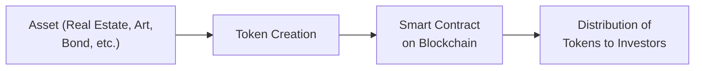
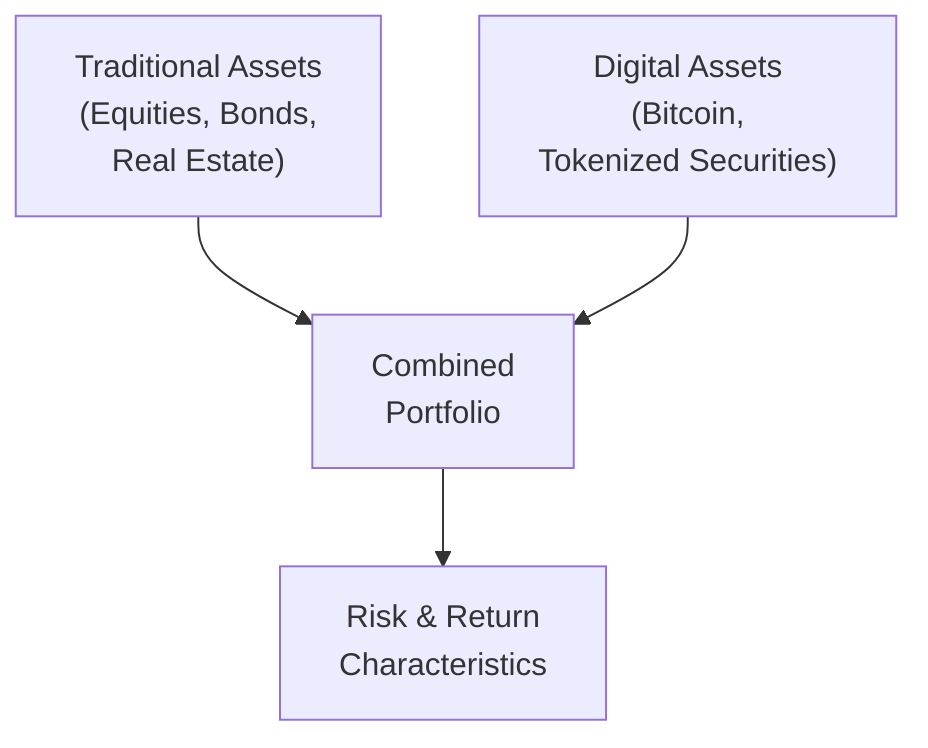

## Introduction
Have you ever found yourself scratching your head over the idea of owning a fraction of a painting, or maybe earning yield on a digital coin you’ve never actually touched? Well, welcome to the world of digital assets and tokenized securities. It’s a realm where technology meets traditional finance in ways that can feel, at first, a bit sci-fi. But as I realized during a conversation with a friend who swore she “owned part of a museum-worthy painting via a token,” this is no longer a futuristic fantasy. In this section, we’ll explore what digital assets are, how tokenization works, why it might transform portfolios, and what pitfalls and opportunities await. So buckle up—this gets interesting quickly.

## Understanding Digital Assets
Digital assets refer to electronic files or tokens that carry value in a decentralized or centralized digital environment. Cryptocurrencies like Bitcoin or Ether are one branch of digital assets. Meanwhile, tokenized securities take more traditional forms (like equity or debt) and embed them into a digital format on a blockchain.

### Another Look at Cryptocurrencies
Cryptocurrencies—think Bitcoin, Ether, or stablecoins pegged to fiat—use cryptography for security and frequently operate on a distributed ledger (a blockchain). They’re designed to serve as mediums of exchange, although many also see them as speculative assets (a fancy way of saying their prices can be, well, up and down like a roller coaster). While in Chapter 5 we discussed behavioral biases, these biases become especially relevant in crypto markets, where hype and speculation can overshadow fundamentals.

### Tokenized Securities in a Nutshell
Tokenized securities are the digital representation of real-world assets, like bonds, stocks, real estate, or fine art, issued and sometimes traded on a blockchain platform. Each token can represent a fractional share of that underlying asset. This approach potentially makes investing more democratic: instead of needing enough money to buy an entire commercial building, you own a small piece through fractional tokens.

## The Tokenization Process
Tokenization splits an asset—whether intangible like intellectual property or tangible like real estate—into digital tokens. These tokens are created (or “minted”) on a blockchain, typically via smart contracts, and define the ownership rights and transaction rules.

Below is a simple visual representation of the tokenization flow:

• Asset: The underlying property or security (e.g., a building).  
• Token Creation: The process of creating digital tokens that represent fractional ownership.  
• Smart Contract on Blockchain: Automatically enforces rules around token transfer, governance, and ownership.  
• Distribution of Tokens to Investors: Investors purchase or receive these tokens, which are now recorded on the blockchain.

Anyway, the core principle here is that these tokens are transferrable, potentially globally, in near real time.

## Regulatory Classifications
Let’s talk about the dreaded R-word—Regulation. In some places, digital assets are treated as commodities (Bitcoin is labeled a commodity in certain jurisdictions), while others call them currencies or securities. With tokenized securities, well, the name says it all: they’re often handled under existing securities laws. A big challenge is that the definitions can vary widely by jurisdiction.

From a CFA exam perspective, you might see scenario-based questions about how an asset qualifies as a security (and thus subject to strict disclosure and compliance) versus a commodity or currency with different rules. Remember that classification affects reporting requirements, tax treatments (maybe you recall from Chapter 4 the role of taxes in portfolio planning), and even custody solutions.

## Potential Benefits of Tokenization
Tokenizing assets might sound complicated, but it’s not just a technology gimmick; there are practical upsides.

### Fractional Ownership
You don’t need a million dollars to invest in a million-dollar asset. Tokenization can split that asset into fractions, lowering barriers and inviting broader participation. I once had a student from a small town who was able to invest in a commercial property project via tokenization for only $1,000. Normally that sort of investment was reserved for large institutional players.

### Enhanced Liquidity
Some assets—think real estate or fine art—are traditionally illiquid. They take a while to sell, and the costs can be high. With tokens, trading is potentially faster and cheaper. A token owner can list their fractional ownership stake on digital exchanges, seeking buyers around the world, theoretically 24/7. Liquidity in these secondary markets, however, can be patchy—a risk we’ll address later.

### Faster and Cheaper Settlement
We’ve all encountered settlement delays in bond or equity trades, sometimes waiting days for final confirmation. Blockchain-based transactions can reduce that settlement cycle down to hours or minutes. Smart contracts can automatically confirm ownership changes as soon as the buyer’s funds are received.

## Inherent Risks
Remember from our discussions in Chapter 6 on risk management frameworks: new technology means new risks. Don’t let the bright lights overshadow the hidden pitfalls.

### Technological Failures or Hacks
Blockchains can be robust, but they’re not bulletproof. Hacks and security breaches do happen. Forgetting private keys or relying on flawed smart contract code can lead to permanent loss. Just as with online banking credentials, proper custody solutions—whether hardware wallets or institutional custodians—are critical.

### Regulatory Uncertainty
Digital assets and tokenized securities exist in a patchwork of global rules. One jurisdiction might be supportive, another might ban them outright. Shifting regulatory environments can freeze liquidity, restrict trading, or create compliance nightmares for cross-border investors.

### Liquidity Mismatches
While tokenization promises improved liquidity, that liquidity is not guaranteed. Suppose you invest in tokens representing a niche real estate property. If few people want those tokens, you’re stuck. Price discovery can also be erratic when the underlying market is unclear. This reminds me of a scenario where a friend tried selling a fractional art token at a decent price but found zero buyers on the marketplace—so “listed” doesn’t always mean “sold.”

## Fitting Digital Assets Into a Portfolio
You know, just a few years ago, many saw cryptocurrencies only as speculation. Now, some are exploring them as alternative diversifiers, akin to commodities or gold. Key points to consider:

- **High Risk, High Reward**: The volatility of digital assets often far exceeds traditional equities.  
- **Correlation With Traditional Assets**: During normal market conditions, we might see low correlation, which in theory offers diversification. But during financial stress, correlations can rise unexpectedly.  
- **Long-Term Outlook**: Some argue that in the long run, blockchain technology could reshape finance. Others remain skeptical about sustained growth.  

In advanced portfolio optimization techniques (see Chapter 2 and Chapter 3 for risk and return fundamentals), we often account for correlation structure. Keep an eye on how correlations might change, especially if more institutions adopt digital assets (potentially driving the correlation to broader markets higher).

## Best Practices and Implementation Tips
There’s a lot of chatter, um, especially on social media, about "just buy the coin and wait." However, well-informed portfolio managers approach digital assets with a risk-aware mindset:

- **Diversify**: Even if you believe that digital assets have a bright future, limit your exposure to an allocation that fits your risk tolerance.  
- **Custody Arrangements**: Choose reputable custodians or secure, self-managed solutions. Lapses here can be catastrophic.  
- **Stay Updated on Regulations**: Laws around digital assets change rapidly. This can affect how you record them on your balance sheet and how you handle investor disclosures.  
- **Incorporate Risk Tools**: Stress testing and scenario analysis (discussed in Chapter 6) are crucial, given the volatile history of cryptocurrencies.  

## Diagram: Portfolio Integration Considerations
It might help to see how digital assets fit into a broader portfolio strategy alongside other holdings. Here’s a simplified diagram:

• Traditional Assets: Core holdings in many portfolios.  
• Digital Assets: Complementary or alternative investments.  
• Combined Portfolio: The aggregated set of positions.  
• Risk & Return: The net impact on the overall portfolio’s profile.

## Glossary
Here’s a quick recap of key terms, just to be sure we’re on the same page:

- **Cryptocurrency**: A digital currency secured by cryptography and operating on decentralized blockchain technology.  
- **Tokenization**: Converting the value of an asset into a digital token on a blockchain, allowing fractional ownership and easier transfer.  
- **Blockchain**: A distributed ledger technology that records transactions in a secure, transparent, and tamper-proof way.  
- **Smart Contracts**: Self-executing digital contracts with terms written into code, triggering actions when certain conditions are met.  
- **Custody Solutions**: Services that hold and secure digital assets (e.g., hardware wallets or institutional custodians).  
- **Stablecoin**: A cryptocurrency pegged to a stable asset (like the U.S. dollar) to reduce volatility.  
- **Decentralized Exchange (DEX)**: A peer-to-peer market for digital assets, using smart contracts to handle trades without a central intermediary.  
- **Initial Coin Offering (ICO)**: An often-unregulated mechanism to raise capital by selling new digital tokens to early backers.

## Practical Examples and Case Studies
Let’s take real estate as an example. Say you have a commercial building worth $10 million. Typically, you'd need a bank loan or partner with big investors to buy something so large. But if the issuer tokenizes that property into 10 million tokens at $1 each, smaller investors can easily invest. They might receive proportional rental income or potential capital gains if the tokens appreciate. However, if the overall property market tanks or the building can’t find tenants, the tokens lose value accordingly, possibly dropping below $1.

For tokenized corporate bonds, each token could represent a certain face value. Investors receive interest payments as coded in the smart contract. Settlement is near-instant when tokens exchange hands, reducing time and cost. Of course, if the issuing company defaults or the regulatory environment changes, trading in these tokens might freeze.

## Exam Relevance and Final Insights
For your CFA exam, digital assets and tokenized securities might appear in scenario-based questions testing your understanding of novel asset classes, risk-return trade-offs, and regulatory frameworks. especially with references to the growing interest in blockchain as a tool for settlement, governance, and fractional ownership. Don’t overlook how the classification of an asset can drastically alter compliance requirements. Existing risk management models (discussed in Chapter 2, 3, and 6) need to be adapted to handle these new instruments, especially in stress scenarios.

## Tips for the Exam
• Be prepared to link tokenization concepts with portfolio diversification benefits or pitfalls.  
• Understand how fractional ownership structures could change the conventional approach to liquidity risk.  
• Practice analyzing correlation data between digital assets and broad equity markets.  
• Pay attention to custody, security, and regulatory compliance viewpoints—these can be prime areas for short-answer or multiple-choice questions.

## References & Further Reading
- CFA Institute. (2022). “Cryptoassets and Blockchain.”  
- BIS (Bank for International Settlements). Publications on digital currencies and financial stability.  
- World Economic Forum. “The Tokenization of Assets and Potential Implications.”  

## Test Your Knowledge of Digital Assets and Tokenized Securities



### Which of the following best describes tokenized securities?
- [ ] Completely digital currencies that have no backing
- [x] Traditional assets represented on a blockchain for fractional ownership
- [ ] Government-backed cryptocurrencies meant for stable payments
- [ ] Derivative instruments priced off cryptocurrency indices

> **Explanation:** Tokenized securities are traditional, real-world assets (like equity or real estate) converted into digital form and traded on a blockchain.

### What is the primary advantage of fractional ownership enabled by tokenization?
- [x] It offers lower barriers to entry for investors with smaller capital
- [ ] It completely removes volatility for large-scale investors
- [ ] It makes the underlying asset risk-free
- [ ] It hides ownership from regulatory authorities

> **Explanation:** Fractional ownership allows smaller investors to participate in high-value assets, such as real estate or fine art, reducing entry barriers.

### In the context of digital assets, stablecoins aim to:
- [x] Reduce price volatility by pegging to a more stable asset
- [ ] Eliminate the need for blockchain technology
- [ ] Serve purely as unregulated securities
- [ ] Replace government bonds as the primary safe-haven investment

> **Explanation:** Stablecoins are designed to maintain a stable value by linking to an underlying reserve or fiat currency, mitigating the wild price swings common in other cryptocurrencies.

### One key risk associated with digital asset custody is:
- [x] The potential loss of private keys or wallet hacks
- [ ] Immediate settlement of trades over blockchain
- [ ] Over-regulation by global authorities
- [ ] Unlimited liquidity in any market condition

> **Explanation:** If private keys are compromised or lost, it typically results in irretrievable loss of the digital asset, making robust custody solutions critical.

### Which of the following statements about regulatory classification for digital assets is correct?
- [x] Classifications often vary greatly by jurisdiction
- [ ] Digital assets are globally recognized only as currencies
- [ ] They are not regulated in any country
- [ ] All digital assets have to be regulated as securities

> **Explanation:** Regulatory frameworks differ internationally; some treat digital assets as commodities, others as securities, and some as currency. There is no single global standard.

### When evaluating digital assets in portfolios against traditional equities, you should:
- [x] Consider correlation changes during market stress
- [ ] Ignore digital assets, as they can’t be integrated in a portfolio
- [ ] Assume zero correlation in all market conditions
- [ ] Always expect digital assets to outperform stocks

> **Explanation:** Correlation studies between digital and traditional assets require ongoing analysis. Correlations can change, especially during market downturns.

### Tokenization offers which key benefit to historically illiquid assets such as real estate or fine art?
- [x] Potentially improved liquidity through fractional trading
- [ ] Guaranteed zero risk exposure
- [x] Broader market access for smaller investors
- [ ] Elimination of market price volatility

> **Explanation:** Tokenization can improve liquidity and provide broader access, but it cannot guarantee risk-free conditions or eliminate volatility.

### A decentralized exchange (DEX) differs from a centralized exchange primarily because it:
- [x] Facilitates peer-to-peer trades without a central intermediary
- [ ] Charges the highest fees of all digital asset exchanges
- [ ] Always guarantees pricing that is favorable to sellers
- [ ] Is restricted to institutional investors only

> **Explanation:** DEX platforms leverage smart contracts to allow users to trade directly, removing a central authority in the transaction.

### Why might regulatory uncertainty be a significant concern for tokenized securities?
- [x] Changing regulations can freeze trading or impose additional compliance burdens
- [ ] Regulatory clarity always eliminates liquidity risk
- [ ] Because all tokenized securities are banned globally
- [ ] Because regulators prefer to use stablecoins

> **Explanation:** Regulatory uncertainty can halt trading, require new registrations, or impose costs, making it a substantial risk for market participants.

### True or False: Tokenized securities allow for fractional ownership, often enabling smaller investors to participate in assets previously out of reach.
- [x] True
- [ ] False

> **Explanation:** Tokenized securities split the ownership of an asset into smaller, tradable tokens, broadening investor accessibility.


