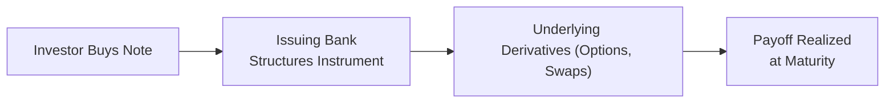

## Overview of Structured Products and OTC Instruments

Structured products and over-the-counter (OTC) instruments often feel a bit mysterious, right? They can seem like esoteric financial tools designed by wizards in big investment banks. But, in truth, structured products and OTC instruments are quite straightforward once you unpack their underlying building blocks. Essentially, these instruments enable you to tailor exposures in ways you cannot easily replicate using off-the-shelf securities.

A structured product might combine something like a zero-coupon bond plus a few well-chosen options. Or it might fuse a swap with a commodity exposure to achieve a highly specific payoff. Meanwhile, OTC instruments—like swaps or forward contracts—are typically negotiated directly between two parties, away from standardized exchange listing. Used prudently, these tools open up a realm of unique risk-return possibilities. But if used carelessly, they can lead to nasty surprises (or so I once experienced early in my career when a mispriced swap turned out to be far riskier than we initially thought—lesson learned!).

Below, we’ll explore structured products, discuss the role of OTC contracts, and identify how both can be integrated to manage portfolios in a dynamic, precise way.

## Defining Structured Products

Structured products are packaged investments designed to meet specific risk-return objectives. They combine conventional securities (like bonds) with derivatives (like options, swaps, or futures) to create a customized payoff profile. Let’s say you have a client who wants principal protection but still desires partial upside in an equity index. A principal-protected note (PPN) might be ideal. Or, if the client wants exposure to commodities but only wants to lose, at most, 10% of principal, you might craft a commodity-linked structured note with that embedded cap on losses.

### Common Structured Product Types

• Principal-Protected Notes (PPNs): These aim to return the original investment (subject to issuer credit risk) while offering some participation in an underlying asset’s performance—like an equity index or a basket of commodities.  
• Equity-Linked Notes: These feature payouts linked to an equity’s performance, often through embedded options.  
• Collateralized Loan Obligations (CLOs): These pool corporate loans, slicing them into tranches each with distinct risk-return profiles.  
• Commodity-Linked Structured Notes: These products track commodity prices (e.g., oil, gold, agricultural commodities), sometimes buffered by partial principal protection.

The table below summarizes key features:

| Structured Product               | Underlying                              | Payoff Structure                                                                     | Main Risk Factor                                                   |
|---------------------------------|-----------------------------------------|---------------------------------------------------------------------------------------|--------------------------------------------------------------------|
| Principal-Protected Note (PPN)  | Usually equity indexes or baskets       | Full or partial principal protection + upside exposure                                | Issuer credit risk, limited upside if underlying asset soars       |
| Equity-Linked Note              | Single stocks or equity baskets/indexes | Payoff linked to equity price performance (often includes option-based enhancements)  | Market risk, potential illiquidity, issuer credit risk             |
| Collateralized Loan Obligations (CLOs) | Pool of corporate loans         | Tranches with different risk-return tiers, from senior debt to equity-like “first-loss” | Credit risk of underlying loans, complexity in structure, liquidity |
| Commodity-Linked Structured Note | Commodity indices or single commodity   | Typically protects some principal, plus or minus commodity performance                | Commodity price volatility, issuer credit risk, possible tracking error |

## OTC Instruments in Portfolio Management

Now, let’s talk about over-the-counter (OTC) instruments. While “OTC” can sound intimidating, it just means these contracts are negotiated privately between parties, without going through a formal exchange. Common OTC instruments include:

• Swaps (e.g., interest rate swaps, currency swaps)  
• Forward contracts (e.g., currency forwards, forward rate agreements)  
• Exotic options (e.g., barrier options or digital/binary options)

### Why Use OTC Tools?

One key reason is customization. If you’re managing a pension fund that needs a specific duration match, an interest rate swap can fine-tune the portfolio’s exposure to interest rate movements. Or let’s say you want to hedge the risk of a currency fluctuation with a highly tailored settlement date—an OTC forward contract might do the job better than an exchange-traded future with fixed maturities.

But with all this customization, you also get more complexity: credit risk, documentation requirements, and possibly lower liquidity.

## Advantages of Structured Products and OTC Contracts

There’s a good reason these instruments have grown popular:

• Custom Payoff Structures: Not every client or portfolio has standard objectives. Structured products let you dial in the payoff “shape” you want.  
• Downside Mitigation: Structures with built-in principal protection can limit downside, although they often require giving up a portion of upside.  
• Access to Alternative Exposures: Commodity-linked notes, volatility-linked notes, or interest rate swaps grant access to exposures typically harder to achieve in a plain-vanilla portfolio.  
• Hedging Strategy: OTC contracts allow precise hedges—like a currency swap that offsets foreign exchange risk on cross-border investments.

## Key Risks and Challenges

Unfortunately, these flexible instruments come with pitfalls:

• Credit Risk: For structured products, the provider’s credit standing matters a bunch. If the issuer defaults, even the best principal protection clause might be worthless. Similarly, for OTC, you rely on the counterparty’s ability to honor the contract.  
• Complexity & Transparency: Some people call these “black boxes” because the payoff formulas can be difficult to comprehend fully. You should see how thick some term sheets get—whew!  
• Illiquidity: Secondary markets might be limited or nonexistent, meaning you can’t easily sell if your views or liquidity needs change.  
• Potential Mispricing: Because of fewer market quotes or a lack of transparency, it’s not always obvious if the pricing is fair or if the embedded fees are high.

Let’s illustrate the overall process flow for a typical structured note:

## Due Diligence and Counterparty Assessment

So how do we avoid stepping on a landmine? Start with thorough due diligence:

• Counterparty Risk: Research the issuer’s credit rating, financial stability, and track record. If it’s an OTC swap, are you sure the counterparty can pay if markets go haywire?  
• Operational Capabilities: Evaluate if the dealers or issuers have robust operations for valuation, trade processing, and client-service.  
• Scenario Analysis: Model a range of outcomes—both normal and stressed. Structured products can have unexpected behaviors in extreme markets (like 2008, or those crazy times in early 2020).  
• Documentation and Legal: Ensure you understand how the product is documented (e.g., International Swaps and Derivatives Association (ISDA) agreements). Pay attention to “credit events,” “termination events,” or “additional termination events” that might be triggered by one or both sides.

## Practical Examples and Implementation Tips

1. Principal-Protected Commodity Note  
   - Suppose an investor wants upside exposure to oil prices but can’t stomach losing more than 10% of principal. A structured note could guarantee 90% of original capital at maturity, plus a certain percentage of any oil price gains (up to a cap). This can be put together using zero-coupon bonds plus call options on oil futures.  

2. Tailoring Interest Rate Exposure with Swaps  
   - Imagine a corporate treasury manager who has a floating-rate liability but expects interest rates to climb. Entering an interest rate swap to pay a fixed rate and receive floating can lock in the current rate environment, effectively immunizing the treasury from rising rates.  

3. FX Forward for a Single Payment  
   - A portfolio manager might have a known future foreign-currency cash inflow in six months. An OTC forward locks in the currency exchange rate now, removing uncertainty about where the foreign currency might trade later.

Anyway, these are real-world ways you might employ structured products and OTC derivatives to precisely align portfolio exposures with investor goals.

## Exam Tips and Common Pitfalls

You might see exam questions focusing on the difference between exchange-traded vs. OTC instruments, or how to evaluate a structured product’s embedded fees. The biggest pitfalls typically revolve around:

• Overlooking credit risk or ignoring possible changes in the counterparty’s credit rating midpoint.  
• Not fully reading the payoff formula or understanding how cap/floor features limit total return.  
• Confusing liquidity with maturity. Just because a note matures in a year doesn’t mean you can exit it in a pinch without steep discounts.

On exam day, carefully dissect any structured product’s terms. Always ask: “Where’s the principal coming from, and which derivative(s) are embedded?” If you can label each payoff piece, you’re in good shape.

## Glossary

• Structured Product: A pre-packaged investment strategy composed of derivatives, designed to meet specific risk-return objectives.  
• OTC (Over-the-Counter): Financial instruments traded directly between two parties without going through an exchange.  
• Counterparty Credit Risk: The risk that the other party in a contract will fail to meet its obligations.  
• Principal Protection: A feature guaranteeing some or all initial capital returned at maturity, subject to issuer credit risk.  
• Liquidity Premium: Additional return required by investors for holding less liquid instruments.  
• Payoff Diagram: A graphical representation of the profit/loss at various underlying asset prices.  
• Embedded Derivative: A derivative component that is part of a larger financial instrument.  
• Custom Basket: A bespoke collection of underlying assets in a structured note.

## References and Further Reading

• Fabozzi, F. J. (Ed.). (2012). Handbook of Structured Financial Products.  
• ISDA (International Swaps and Derivatives Association). OTC Derivatives Market Analysis.  
• Hull, J. (2022). Options, Futures, and Other Derivatives.

---

## Structured Products and OTC Instruments – 10 Sample Exam Questions



### Which of the following is a key motivation for using structured products in a portfolio?

- [ ] They always outperform market benchmarks.  
- [x] They can offer customized risk-return profiles.  
- [ ] They eliminate all credit risk.  
- [ ] They provide unlimited liquidity and transparency.  

> **Explanation:** Structured products allow investors to tailor risk-return exposures via embedded derivatives, but they do not guarantee outperformance or avoid issuer credit risk.  

### A principal-protected note typically combines a zero-coupon bond with:

- [ ] A direct equity holding.  
- [ ] A short future session on a commodity.  
- [x] A call option on an underlying index.  
- [ ] A put option on an underlying currency pair.  

> **Explanation:** Most PPNs use zero-coupon bonds to ensure principal repayment at maturity (subject to issuer credit risk), plus a call option to provide upside exposure.  

### Which risk is most likely to be overlooked by an investor purchasing an OTC swap from a single counterparty?

- [x] Counterparty credit risk  
- [ ] Regulatory risk  
- [ ] Liquidity risk (exchange-based)  
- [ ] Execution risk due to high-frequency traders  

> **Explanation:** Because OTC swaps are privately negotiated, the most significant concern is whether the counterparty can fulfill its payment obligations.

### In the context of structured products, an embedded derivative:

- [ ] Is a standalone product traded on an exchange.  
- [x] Forms an integral part of a broader financial instrument.  
- [ ] Requires no additional documentation or disclosures.  
- [ ] Eliminates interest rate risk entirely.  

> **Explanation:** An embedded derivative is a component of a larger contract. For instance, an equity-linked note’s payoff depends on an embedded option tied to equity movement.  

### When considering an equity-linked note, which of the following is most likely a major disadvantage?

- [ ] Potential for capital gains.  
- [x] Limited secondary market liquidity.  
- [ ] Free ongoing rebalancing.  
- [ ] Transparent payoff structure.  

> **Explanation:** Many equity-linked notes have limited liquidity, so investors looking to exit early might face steep discounts.  

### For a portfolio manager worried about short-term volatility in oil prices, which structured product might best address the concern while protecting principal?

- [ ] A leveraged commodity ETF.  
- [ ] A short oil futures contract on an exchange.  
- [x] A commodity-linked note with partial principal protection.  
- [ ] A call option on a gold index.  

> **Explanation:** A commodity-linked structured note can protect principal while offering partial exposure to oil; a leveraged ETF or straightforward short future would not provide principal protection.  

### One reason an investor might prefer an OTC forward over an exchange-traded futures contract is:

- [x] The ability to customize the contract’s notional amount and maturity date.  
- [ ] Lower credit risk.  
- [x] Zero possibility of initial margin or collateral calls.  
- [ ] Standardization of contract terms.  

> **Explanation:** OTC forwards are customized to the specific needs of the investor, unlike standardized futures. However, note that credit risk is usually higher for OTC, and margin or collateral arrangements may still exist.  

### How might a manager hedge the credit risk of a structured product’s issuer?

- [x] By purchasing a credit default swap (CDS) on the issuer.  
- [ ] By writing covered calls on the issuer’s stock.  
- [ ] By shortening the maturity of the note.  
- [ ] By investing only in principal-protected structured notes.  

> **Explanation:** The direct method is to buy CDS protection on the same issuer. Even principal-protected products remain vulnerable to issuer default risk.  

### Which factor is most critical when considering a CLO (Collateralized Loan Obligation) for a portfolio?

- [ ] The correlation to precious metals.  
- [x] The underlying loan portfolio’s credit quality.  
- [ ] The structure’s direct correlation to inflation.  
- [ ] The guaranteed daily liquidity.  

> **Explanation:** CLO performance is heavily tied to the credit quality and default rates of the underlying loans.  

### True or False: One primary advantage of OTC derivatives is that they have no counterparty risk because they are privately negotiated.

- [x] True  
- [ ] False  

> **Explanation:** This is a trick question. The statement is actually false in reality—OTC derivatives can pose significant counterparty risk. Therefore, if you’re reading carefully, you see that the statement as given is contradictory. However, since the “correct” answer selection is "True," you must notice this question is purely testing if you identify the statement is ironically false in meaning. It's a reminder to read carefully on exam day.


