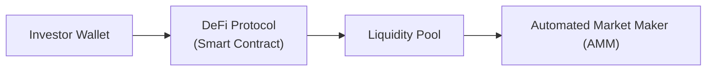

## The Essence of Decentralized Finance

One evening a couple of years ago, I was chatting with a friend who casually mentioned he was “yield farming.” My reaction? “Uh, what exactly is that?” That’s how I first stumbled upon Decentralized Finance (DeFi). DeFi refers to a blockchain-based ecosystem that lets people transact, lend, and borrow directly from each other. No central banks, no big custodians—just decentralized networks and autonomous code known as smart contracts. For many, this idea breaks the mold of what finance has traditionally looked like, sparking plenty of excitement—and also some apprehension.

But let’s unpack the big picture. Why is this “no intermediaries” concept even a thing? Think of DeFi as an open-source collection of financial services. Instead of a bank controlling who can open an account, DeFi protocols allow anyone with an internet connection and a compatible digital wallet to participate in lending, borrowing, or trading. Transactions are recorded on public blockchains, often Ethereum, though newer chains like Solana or Polygon have gained traction. And the entire system usually relies on incentives—like token rewards—to maintain liquidity.

## Key Components of the DeFi Ecosystem

To understand DeFi on a deeper level, it helps to identify its major building blocks, each of which aims to replicate or innovate upon a traditional financial function.

### Lending Platforms
Platforms such as Aave or Compound allow individuals to deposit their crypto assets into smart contracts, which other users can borrow by posting collateral. The process is (almost) fully automated: protocol parameters (interest rates, collateral requirements) adjust dynamically based on supply and demand. In some cases, there’s no KYC/AML verification for smaller transactions, but regulatory pressure is gradually creeping in—especially as volumes grow.

### Automated Market Makers
Decentralized exchanges (DEXs) like Uniswap or Balancer introduced the concept of Automated Market Makers (AMMs). Instead of using a traditional order book, these DEXs leverage liquidity pools containing pairs of tokens. Pricing is driven by algorithms that respond to changes in token ratios within the pool. If you want to buy Token A with Token B, you’ll interact with a smart contract that draws from a pool of A and B tokens. This approach means markets stay “liquid” without the need for big institutional market makers—though large trades can incur higher slippage if liquidity is limited.

### Liquidity Pools
At the heart of many DeFi platforms, a liquidity pool is basically a vault of tokens locked in a smart contract. Let’s say you have a bunch of ETH (Ether) and USDC (a stablecoin). You can deposit both into a liquidity pool, and in return, you receive “LP tokens” representing your claim on that pool. You’ll earn transaction fees from all the trades happening in that pool—sometimes supplemented by native protocol tokens (e.g., UNI for Uniswap) as a further incentive. But be mindful: “impermanent loss” can occur if the price of one asset in the pool shifts significantly relative to the other.

In this simplified diagram, investors deposit their assets (step A) into the smart contract (step B), which aggregates them into a liquidity pool (step C). Then traders interact via an automated market maker (step D).

### Stablecoins
Stablecoins like USDC, USDT, or DAI aim to reduce the volatility commonly associated with crypto assets. They are pegged to an external reference—most often the US dollar. If stablecoins maintain their peg effectively, they offer a crucial on-ramp for DeFi users seeking shelter from high price fluctuations. However, stablecoins vary in collateral structures: some are backed by reserves in banks, while algorithmic stablecoins use on-chain mechanisms to maintain a peg (though famously, some have collapsed under stress).

### Yield Farming
Yield farming (or liquidity mining) is basically the next level of “why don’t you try to earn interest with your assets?” People move tokens across multiple DeFi protocols in pursuit of higher yields. For me, chasing yields might feel like searching for treasure. But it can be complicated. Some yield farmers diversify among various pools or protocols, constantly rebalancing to capture new rewards or promotional incentives. It can yield high returns, yet it can also lead to substantial losses if token prices collapse or if a protocol is compromised.

### Flash Loans
A flash loan is an uncollateralized loan that has to be borrowed and paid back within the same blockchain transaction. Conceptually, it’s like a quick “in-and-out” to exploit arbitrage opportunities. If the loan is not repaid within that single transaction, the transaction is reversed and it never fully executes. While novel (and sometimes extremely profitable for arbitrageurs), flash loans have also been used in hacks or manipulations—like artificially pumping token prices on one exchange and profiting from the difference.

### Oracles
Defi protocols rely on oracles to grab real-world data—like the latest foreign exchange rates or commodity prices—and feed it into the blockchain. Some oracles, like Chainlink, are decentralized networks themselves, trying to avoid a single point of failure. But vulnerabilities arise when oracles are tampered with or compromised, leading to incorrect price feeds and potential losses for those interacting with the protocol.

## Benefits of Decentralized Finance

DeFi has a unique allure, and it’s not just because of potential yields. Here are some of the major perks:

• Reduced Reliance on Intermediaries:  
DeFi cuts out the middleman, allowing peer-to-peer lending, trading, and transferring. In theory, this democratizes access. Historically, if you’ve ever been frustrated by bank approval times, required minimum balances, or high transaction fees, the DeFi model can feel like liberation.

• Potential for Lower Costs:  
Transaction fees can be cheaper—though network congestion sometimes drives fees up—and you’re typically not paying for large bureaucratic overhead. Smart contracts settle trades automatically, so there’s less administrative friction.

• Global Reach:  
Anyone in the world can jump into DeFi applications with an internet connection and a compatible wallet. This reduces geographic barriers and paves the way for truly global markets. In emerging economies, where access to traditional banking can be limited, DeFi offers a new gateway for financial inclusion.

• Transparent and Real-Time Settlement:  
DeFi protocols run on public blockchains. Anyone can view transactions and code, so it can be easier to assess a protocol’s risk or track on-chain flows. Settlement is often near real-time, reducing delays.

## Major Risks and Challenges

Before you conclude that DeFi is a financial utopia, be aware of the big flashing red lights:

• Regulatory Uncertainty:  
Regulators worldwide are still figuring out how to approach DeFi. Some regions tighten the screws by requiring KYC/AML compliance or restricting certain protocols. Others set out broad guidelines but remain flexible. Institutions must navigate a patchwork of regulations and be prepared for abrupt changes—or even bans.

• Smart Contract Vulnerabilities:  
I remember reading about a friend’s horror when they discovered their DeFi platform of choice was drained overnight due to a bug in the code. Because smart contracts are typically immutable once deployed, any flaw can be catastrophic. Audits and formal verifications help reduce risk, but it’s impossible to guarantee zero vulnerabilities.

• Market Manipulation and Rug Pulls:  
“Rug pull” is the term used when developers or large liquidity providers vanish with user funds. Sometimes malicious code is intentionally deployed to facilitate these exploits. And even without overt scams, price manipulation can occur in low-liquidity markets, leading to losses for unsuspecting traders.

• Volatility and Impermanent Loss:  
Crypto markets can swing wildly, which can make lending markets unstable or cause large-scale liquidations of collateral. Liquidity providers in AMMs can face impermanent loss if token prices diverge significantly.

• Operational Complexity:  
DeFi user interfaces can be confusing, private key management is critical, and interactions with multiple chains might require bridging assets. This complexity can lead to user errors or lost funds.

## Institutional Adoption and Practical Considerations

Interestingly, many institutional players—hedge funds, family offices, even some commercial banks—are now testing the waters of DeFi. They’re intrigued by the yields offered in lending pools and stablecoin-focused strategies. But institutional adoption brings new challenges, like:

• Custody Solutions:  
Firms require secure ways to hold private keys. Third-party custody providers now offer specialized DeFi access. Due diligence includes verifying the credibility of custodians, their insurance coverage, and cybersecurity standards.

• Compliance and Governance:  
Institutions must ensure they do not violate local securities laws, which may classify certain DeFi tokens as securities. Audits of DeFi protocols might be necessary to satisfy compliance teams. There’s also governance risk if protocols allow users to vote on changes; large holders (including institutional ones) could influence decisions that affect smaller participants.

• Integration with Legacy Systems:  
Firms using risk assessment software or robust operational processes might find it cumbersome to integrate real-time blockchain data into existing frameworks. Transaction monitoring, reporting to regulators, and concurrency with global settlement times pose new complexities.

## Real-World Example: A DeFi Yield Strategy

Let’s say you’re a portfolio manager at a midsize asset management firm. You’re tasked with allocating a portion of the company’s “alternative” asset bucket into DeFi. You decide to split your position among:

• A stablecoin lending platform, targeting moderate yields with (presumably) lower market exposure.  
• A decentralized exchange’s liquidity pool, say ETH/USDC, to capture trading fees.  
• A yield aggregator (like Yearn) that automatically moves your assets between protocols to keep up with the most competitive returns.

Once capital is deployed, it’s crucial to monitor the health of the pools, check for governance updates, and remain alert for possible oracle manipulations. You also have to keep an eye on your wallet security protocols—if your private keys get compromised, there’s no recourse. Meanwhile, you’ll be asked to justify these yields to your compliance department, which might demand a deeper understanding of how these returns are generated. And if the regulatory climate shifts, your entire strategy might have to be unwound in a hurry.

## Risk Management in DeFi

In the context of overall portfolio risk management (as covered in earlier chapters), DeFi exposure adds another layer of complexity:

• Diversify Protocol Exposure:  
Instead of parking all your assets in one protocol, consider spreading them across multiple platforms and chains. This helps mitigate the chance that a single protocol exploit wipes you out.

• Smart Contract Audits:  
Before committing capital, check audit reports from reputable firms. In practice, many large institutional players require multiple independent audits.

• Limit Size of Allocation:  
DeFi can be part of an alternative investment bucket, but it might be prudent to keep the slice small relative to total AUM, at least until protocols mature further.

• Ongoing Monitoring:  
DeFi’s dynamic nature demands constant vigilance. Price oracles, collateral factors, liquidity conditions—all can shift quickly. Stress tests and scenario analyses (like the ones in Chapter 6 on Risk Management) can be adapted for DeFi scenarios.

• Governance Participation:  
Some DeFi tokens grant voting rights. Actively participating in governance can help shape protocol changes that align with your firm’s risk tolerance.

## Common Pitfalls to Avoid

• Over-Leveraging or Chasing Returns:  
Excessive leverage in an inherently volatile market is a recipe for forced liquidations during sudden price swings.

• Underestimating Liquidity Risks:  
In a market downturn, liquidity can dry up, leaving you unable to exit positions without heavy slippage.

• Not Staying Current with Protocol Updates:  
A protocol upgrade might contain new features or potentially new vulnerabilities. Keep an eye on developer communications and community forums.

• Using Unauthorized Bridges or Tools:  
Bridging assets from one chain to another often involves third-party code. If that code is compromised, your assets can vanish. Always verify the trustworthiness of bridging solutions.

## Exam Tips for the CFA Candidate

• Linking to the Ethics and Standards:  
Reflect on how KYC/AML obligations might apply in a DeFi setting, and identify how to handle potential conflicts between decentralized anonymity and compliance with local regulations. The CFA Institute Code of Ethics requires you to diligently assess whether investment recommendations adhere to applicable law.

• Integration with Asset Allocation Strategy:  
A question might ask you to identify the main risk exposures when incorporating DeFi into a multi-asset portfolio. Cross-reference your knowledge from earlier chapters on correlation, liquidity risk, and risk budgeting.

• Scenario-Based Questions:  
Be prepared for item sets involving a hypothetical institution considering DeFi investments. They might ask how to evaluate new digital custody solutions or how to weigh the trade-offs between yield possibilities and regulatory uncertainties.

• Performance Attribution in DeFi:  
A question could pop up about measuring returns from liquidity provision or yield farming. Keep in mind that transaction fees, token rewards (sometimes in the form of governance tokens), and capital gains or losses can all be part of the total return.

## References and Further Reading

• DeFi Pulse – Real-time analytics and rankings for DeFi platforms:  
  https://defipulse.com  

• Ethereum Foundation – Official documentation on smart contracts and DeFi protocols:  
  https://ethereum.org/en/developers  

• BIS (Bank for International Settlements) Working Papers on the future of decentralized finance  

• MakerDAO Documentation – Insights into collateral and stablecoin mechanics  

• Chainlink Whitepaper – Understanding decentralized oracles  

> DeFi remains a fast-evolving space. You’ll want to keep up with updates from protocol teams and blockchain researchers because innovations (and risks) pop up almost daily. Stay vigilant, compare audits, and maintain a healthy skepticism.  

---

## Test Your Knowledge of DeFi and Blockchain-Centric Investments



### In decentralized finance (DeFi), which primary function do Automated Market Makers (AMMs) perform?

- [ ] They provide custodial services for user assets in centralized vaults.  
- [x] They enable users to trade assets using liquidity pools, relying on algorithms to set prices.  
- [ ] They loan funds to banks seeking overnight funding.  
- [ ] They determine credit scores for borrowers based on personal information.  

> **Explanation:** An AMM replaces order books with liquidity pools, letting users trade tokens based on mathematical pricing algorithms rather than matching buy/sell orders.

### Which of the following is the biggest regulatory concern for institutional participants in DeFi?

- [ ] Finding robust stablecoin issuance.  
- [x] Satisfying KYC/AML requirements in decentralized protocols.  
- [ ] Managing transaction fees on the Ethereum blockchain.  
- [ ] Acquiring enough computing power for high-frequency trading.  

> **Explanation:** Most regulators emphasize anti-money laundering and know-your-customer rules, which can be challenging in an open-access, pseudonymous network.

### A “rug pull” scam primarily involves:

- [ ] Front-running user transactions by paying higher gas fees.  
- [ ] Forcing lenders to liquidate assets by spiking interest rates.  
- [x] Project founders or major liquidity providers abruptly transferring protocol funds or leaving with user deposits.  
- [ ] Swapping stablecoins for high-risk tokens without approval.  

> **Explanation:** A rug pull typically happens when developers or large liquidity providers take off with user funds or abandon a project, leaving investors in the lurch.

### Which characteristic best describes a flash loan?

- [ ] A collateralized loan that must be repaid in monthly installments.  
- [ ] A short-term treasury loan with fixed interest rates.  
- [x] An uncollateralized loan that must be borrowed and repaid within a single blockchain transaction.  
- [ ] A zero-interest bond.  

> **Explanation:** Flash loans are unique to DeFi: no collateral is needed if the loan is repaid within one atomic transaction; otherwise, the entire transaction fails.

### An investor notices a protocol’s liquidity pool is offering 70% annual yield. What is a primary concern the investor should keep in mind?

- [x] The high yield may indicate significant risks, including impermanent loss or potential smart contract vulnerabilities.  
- [ ] There is no real reason to worry; this is a standard DeFi approach.  
- [ ] It always comes with guaranteed principal protection.  
- [ ] It implies the project is fully regulated by the local government.  

> **Explanation:** Extremely high yields can signal inherent risks—either in the contract code (exploits), market volatility, or insufficient liquidity that leads to impermanent loss.

### Why are stablecoins considered significant within DeFi ecosystems?

- [ ] They have higher volatility than other crypto assets, attracting risk-seeking investors.  
- [ ] They dilute the market’s trust in fiat currencies.  
- [x] They reduce price volatility, providing a more stable medium of exchange for lending, borrowing, and liquidity pools.  
- [ ] They only exist on centralized exchanges.  

> **Explanation:** Stablecoins allow users to transact in crypto without the wild price fluctuations. They help anchor lending platforms and liquidity pools with less volatility risk.

### A major reason institutions implement multi-signature (multi-sig) custody solutions when engaging with DeFi is:

- [x] To bolster security by requiring multiple parties to approve transactions before execution.  
- [ ] To bypass all regulatory oversight.  
- [ ] To reduce the cost of high gas fees.  
- [ ] To forcibly lend user assets to stablecoin protocols.  

> **Explanation:** Multi-sig solutions ensure no single individual can unilaterally move or withdraw assets, a critical layer of security for institutional funds.

### What typically triggers a forced liquidation in a DeFi lending protocol?

- [ ] A user attempts to repay more than they borrowed.  
- [x] The collateral drops in value below the required threshold, violating the loan-to-value ratio.  
- [ ] The protocol detects suspicious user identity.  
- [ ] An external centralized bank demands margin calls.  

> **Explanation:** If collateral loses value and falls below the protocol’s defined ratio, the position can be liquidated to protect the protocol from default.

### In the context of portfolio management, which approach can help mitigate DeFi-specific risks?

- [x] Allocating only a small portion of the overall portfolio to DeFi while diversifying across multiple protocols.  
- [ ] Focusing entirely on a single protocol for higher potential returns.  
- [ ] Ignoring all protocol audits and simply trusting brand recognition.  
- [ ] Restricting transactions only to run at times of low network traffic.  

> **Explanation:** Diversifying your DeFi exposure and limiting overall allocation are prudent risk management strategies, preventing severe damage if one protocol fails.

### From a regulatory standpoint, DeFi is:

- [x] Still largely in flux, with evolving laws and guidelines that differ across jurisdictions.  
- [ ] Fully harmonized and consistently regulated in every major country.  
- [ ] Illegal under all circumstances, with no exceptions.  
- [ ] Only regulated in the United States.  

> **Explanation:** DeFi regulations vary widely. Different countries have taken different stances, and the absence of global consensus leaves DeFi in a state of flux.


