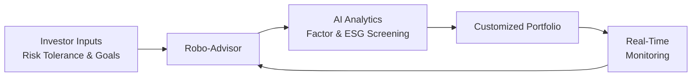

## Overview

Sometimes I look at my portfolio and think, “Wouldn’t it be amazing if the assets somehow just rebalanced themselves—like they literally read my mind about my risk tolerance and sustainability preferences?” Well, that day might be closer than we think. With emerging technologies, portfolio customization is becoming more intuitive, automated, and personalized. Advanced analytics, artificial intelligence (AI), and open banking are weaving together to offer solutions that interpret investor goals and constraints in real time. In this section, we’ll explore how these new tools and trends allow for deeper customization, from robo-advisory platforms that can instantly analyze thousands of data points to fractional ownership solutions that enable investors to own tiny slices of otherwise expensive assets.

## The Evolution of Robo-Advisors

Robo-advisors are probably the most visible face of modern portfolio technology. If you’ve ever used an app that asked some questions about your goals, your risk tolerance, and your time horizon—then quickly produced a sleek array of funds or ETFs—there’s a good chance you’ve experienced a robo-advisor, or something like it.

• Personal Story: I helped my mom set up a robo-advisor account a while back. She was skeptical at first—"You mean some computer is going to manage my money?”—but she was pleasantly surprised when it gave her a recommended diversification strategy that balanced her love for dividend stocks with some ESG-friendly picks. And guess what? She’s still using it.

### How Robo-Advisors Work

On the back end, these platforms rely on algorithms and modern portfolio theory constructs to allocate assets. They factor in risk aversion, time horizons, liquidity needs, and weighting preferences (like ESG constraints). Additionally, they can continuously rebalance, ensuring your portfolio doesn’t drift too far from its target allocations whenever markets get choppy.

But it’s not just about standard allocations. Today, many innovative robo-advisor solutions incorporate advanced factor models. For instance, they might systematically tilt toward momentum, value, quality, or a specific theme like climate-friendly companies. The best ones can now handle multi-dimensional constraints such as:
• Minimizing carbon footprint.  
• Restricting industries like tobacco or firearms.  
• Targeting a specific volatility range. 

Compared to older “one-size-fits-all” models, new-generation robo-advisors integrate real-time data from global markets, social media sentiment, and macroeconomic indicators for advanced portfolio customization.

## Harnessing Advanced Analytics

Even beyond basic asset allocation, advanced analytics can slice and dice data in real time to deliver insights that, until recently, were only accessible to large institutional desks. These tools include:

• Real-Time Risk Analytics: By constantly monitoring market volatility, factor exposures, and correlations, advanced platforms can provide near-instant feedback on a portfolio’s changing risk profile.  
• Predictive Modeling: Machine learning algorithms learn from historical and alternative data sets to predict how certain factors—like a shift in exchange rates or a spike in oil prices—might affect specific securities or entire portfolios.  
• Factor Customization: Suppose you have a strong view about the momentum factor. You can tilt your portfolio to overweight or underweight momentum-driven strategies. Simultaneously, the system can account for changes in factor correlations, so you remain balanced even as market dynamics shift.

It’s pretty cool to see these analytics layered on top of your basic holdings. You might wake up to your daily or weekly investment report and see that your portfolio’s exposure to “value” decreased because of a newly introduced position in a high-growth tech stock. And if that’s not in line with your plan, you can shift it on the spot.

### Mermaid Diagram: Technology Flow

Below is a visual on how an investor’s inputs feed into AI analytics, culminating in continuously refined, customized portfolios:

## Open Banking and APIs

Open banking is another buzzword that has found its way into wealth management. In essence, open banking allows third-party tech providers to access your financial data—safely and securely—so you can get more comprehensive financial planning.

### API Integration

APIs, or application programming interfaces, are the technical keys to open banking. An API is a data pipeline that connects different platforms and lets them “talk” to each other. For example, your budgeting app could read real-time updates from your brokerage account—through an API—to show you exactly how your investments are doing in tandem with your spending.

• Example in Practice: Let’s say you have a single smart dashboard showing your checking account, credit card activity, mortgage, and brokerage portfolio. An advanced planning tool might analyze how your monthly expenses fluctuate and recommend adjusting your asset allocation. If your discretionary income is higher than usual, the platform might suggest investing more into growth or alternative strategies.

### Personalized Financial Ecosystems

Because of these integrations, you’re essentially building your own “personal financial ecosystem.” Everything from retirement accounts, insurance policies, and even cryptocurrency wallets can be tied together. Then you can set custom triggers like: “If my monthly savings exceed $2,000, allocate half toward my global equity fund and half into an ESG-themed bond ETF.” Textbook customization.

## Fractional Ownership and Tokenization

Tokenization of assets—an idea that’s been riding the blockchain wave—has enormous implications for portfolio customization. Assets once considered too large or illiquid for smaller investors are increasingly available in fractional form.

• Real Estate: You could own just a slice of a property in a prime location, with tokens representing your ownership interest.  
• Art and Collectibles: High-end paintings, sculptures, or collectibles can be tokenized so that multiple individuals own a fraction of the piece.  
• Rare Commodities: Precious metals or exotic commodities can be packaged in tokenized form.

Why does this matter for customization? Because now you can drill down to extremely specific interests—like investing only in farmland with high ESG scores or focusing on technology unicorns about to go public. Fractional ownership is democratizing investment opportunities, letting you fill tiny “slots” of your portfolio with projects that in the past required huge minimums or specialized fund structures.

## Data Privacy and Algorithmic Transparency

Of course, with great customization and open data come higher risks. Handling sensitive, personalized investment data means technology providers must abide by strict privacy regulations. On top of that, the algorithms behind robo-advisors and automated platforms should be transparent enough to give investors a sense of control—without revealing the source code, obviously.

### Key Privacy Concerns

• Cybersecurity: Robo-advisors and open banking rely on robust encryptions and multi-factor authentication. But hacking incidents are a real worry, and data breaches could expose not just personal info but also your entire portfolio structure.  
• Regulatory Compliance: In many regions, laws like the GDPR (General Data Protection Regulation) and other new data protection standards require user consent for data sharing, plus guidelines for data retention and usage.  
• Bias in Algorithms: Automated decision-making can inadvertently incorporate biases if historical data sets are skewed. There’s also the question of “explainable AI,” where regulators (and clients) want to know why a specific portfolio decision was recommended.

## Algorithmic Decision-Making and Personalized Benchmarks

Algorithmic decision-making goes well beyond the standard mean-variance optimization. These algorithms weigh hundreds of data signals related to your preferences, such as sustainable industries, diversification goals, or maximum drawdown thresholds.

### Personalized Benchmarks

One of the more interesting frontiers is the concept of personalized benchmarks. Instead of comparing your portfolio to a standard index like the S&P 500, the benchmark itself is tailored to your unique blend of assets, style tilts, and constraints. If you’re heavily invested in clean energy stocks and hold minimal exposure to tech, a standard 60/40 benchmark or broad equity market index might be meaningless. Instead, a custom index approximates the performance of an allocation that aligns with your actual holdings and risk levels.

## Practical Examples and Use Cases

Let’s dive into a couple of scenarios to show how emerging technologies are shaping portfolios:

• Case Study: ESG-Tilted Portfolio. Lana is environmentally conscious and wants a portfolio that underweights carbon-intensive industries. She logs onto a robo-advisory platform that uses an AI screening tool to systematically exclude companies failing certain carbon emission standards. The system shows her a default allocation, then asks if she wants to further refine exposures, for instance, limiting or removing fossil-fuel producers altogether. She clicks “yes,” the system automatically reweights her portfolio, and calculates how the expected returns and risk metrics change.

• Case Study: Real-Time Risk Check. Rahul invests in a diversified portfolio of equities, bonds, and a few alternative assets. Thanks to advanced analytics, he gets real-time “alerts” if the correlation between two major holdings starts to spike unexpectedly. For instance, maybe his historically uncorrelated alternative position now moves in sync with the equity market because of some unusual event. That might prompt Rahul to reduce or hedge that position to maintain the risk profile he’s comfortable with.

## Best Practices and Pitfalls

Even the slickest technology can lead to user errors or misguided strategies if caution is overlooked. Here are some best practices and potential pitfalls:

• Regularly Review Algorithm Outputs: Don’t blindly trust any platform. Periodically check that what the robo-advisor does still aligns with your objectives.  
• Beware Over-Customization: Continually adding constraints (like “exclude everything except a narrow sliver of the market”) might lead to higher concentration risk and potential underperformance.  
• Data Stability: If the analytics rely on real-time data from volatile sources, your portfolio might get rebalanced too frequently, racking up trading costs.  
• Understand the Costs: Fractional ownership can come with hidden fees. Tokenized assets might have platform fees or complexity in liquidation.  
• Prioritize Security: Use multi-factor authentication and strong passwords. In a realm of open banking integration, a data hack can run deeper than just your investment account.

## Exam Tips

As you prepare for exam questions on emerging technologies, focus on both the conceptual framework (like how AI can refine factor-based strategies) and the real-world application (like the role of fractional ownership for smaller portfolios). You might encounter scenario-based questions that ask you to recommend or evaluate a technology solution under constraints like risk tolerance, ESG preferences, or liquidity needs. Make sure you can articulate why and how advanced analytics or robo-advisors can enhance (or in some cases hinder) a particular investment plan.

• Know the Key Terms: Robo-advisor, portfolio customization, open banking, API, fractional ownership, personalized benchmarks, algorithmic decision-making, digital platform.  
• Evaluate the Pros and Cons: Emerging tech has benefits but also raises privacy, bias, and cost considerations.  
• Connect to Broader Portfolio Theories: Align these technologies with fundamental portfolio management concepts (like diversification, factor exposures, or capital market assumptions).  

## References and Further Reading

- Deloitte Insights. “Digital Innovation in Wealth Management.”  
- CFA Institute. “FinTech in Investment Management.”  
- KPMG. “Robo Advising: Catching Up and Getting Ahead.”  

If you’re interested in digging deeper:
- BIS (Bank for International Settlements) reports on FinTech regulation.  
- CFA Institute publications on data analytics in investment management.  
- Various whitepapers from leading robo-advisor platforms and blockchain consortia.

## Emerging Technologies for Portfolio Customization Quiz



### Which of the following best describes how robo-advisors deliver portfolio recommendations?

- [x] They rely on pre-defined algorithms to allocate assets based on individual risk profiles and objectives.
- [ ] They require continuous manual input from a portfolio manager to generate results.
- [ ] They focus solely on near-term market forecasts.
- [ ] They primarily employ derivative instruments for leveraged strategies.

> **Explanation:** Robo-advisors use optimization algorithms, often based on standard finance theories (e.g., mean-variance optimization), combined with user-specific inputs such as target return, risk tolerance, and constraints, to provide portfolio recommendations.

### In an open banking environment, APIs serve primarily to:

- [ ] Store investor data in offline servers.
- [x] Facilitate secure data sharing between financial institutions and third-party applications.
- [ ] Replace physical bank branches altogether.
- [ ] Evaluate bond credit risk in real time.

> **Explanation:** APIs allow authorized third-party services to securely access data (e.g., balances, transactions) from financial institutions, enabling integrated financial services like budgeting, investing, and lending tools in a single ecosystem.

### A key advantage of fractional ownership in portfolio construction is:

- [ ] Eliminating the need for regulatory oversight.
- [ ] Restricting investment to only stable asset classes.
- [x] Allowing investors to access high-value or illiquid assets at lower capital commitments.
- [ ] Prioritizing short-term gains over long-term stability.

> **Explanation:** Fractional ownership platforms make it possible for investors with smaller capital bases to hold economic interests in assets like real estate, art, and other traditionally high-cost investments, enabling greater diversification.

### Personalized benchmarks are mainly used to:

- [ ] Compare a portfolio’s returns to classic indices like the S&P 500 only.
- [x] Reflect an investor’s unique mixes of assets and constraints for performance comparison.
- [ ] Replace all other standard benchmarks for every investor.
- [ ] Eliminate risk entirely by using automated systems.

> **Explanation:** Customized or personalized benchmarks align directly with the investor’s strategy (including ESG constraints, factor tilts, or sector preferences), offering a more relevant performance measurement than broad market benchmarks.

### A potential downside of real-time risk analytics is:

- [x] Excessive portfolio turnover due to frequent rebalancing.
- [ ] Simplified data visualizations.
- [x] Potentially conflicting signals from different data sources.
- [ ] Zero transaction costs from the brokerage side.

> **Explanation:** Real-time data can prompt overly frequent adjustments, ramping up costs. In addition, multiple data sources might produce conflicting signals, requiring robust oversight to avoid decision paralysis or contradictory trades.

### Which of the following best captures a data privacy concern in robo-advisory services?

- [x] Possibility of unauthorized access to detailed investor profiles and holdings.
- [ ] Forced disclosure of investors’ entire social media history.
- [ ] The need to share transactions only through physical paperwork.
- [ ] Requirement to abandon standard encryption protocols.

> **Explanation:** Robo-advisors hold sensitive info about investor goals, identities, and portfolio details, so unauthorized breaches could be costly. As a result, robust cybersecurity measures and regulatory compliance are key.

### One primary reason machine learning algorithms might introduce bias in investment decisions is:

- [x] Historical data sets used in training may not represent all possible market conditions.
- [ ] AI always functions without regard to risk.
- [x] They rely on publicly available research from analysts.
- [ ] They do not account for factor tilts in a portfolio.

> **Explanation:** Machine learning models can perpetuate biases if the data sets used in training reflect partial, skewed, or historically incomplete information. This might lead to recommendations that inadvertently favor certain sectors or exclude emerging opportunities.

### Why might an investor incorporate real estate tokenization into a portfolio?

- [x] To gain partial ownership of properties normally out of reach due to large capital requirements.
- [ ] To avoid all regulatory oversight in large transactions.
- [ ] To remain 100% liquid during extreme market volatility.
- [ ] To guarantee stable monthly dividends, regardless of market conditions.

> **Explanation:** Tokenization offers a way for investors to purchase smaller fractions of real estate, enabling diversification into property markets without needing a large sum of money upfront.

### One significant advantage of leveraging open banking data in a portfolio context is:

- [x] Being able to integrate budgeting, saving, and investing info into a single user interface.
- [ ] Ensuring the investor can’t access any bank account details from a mobile phone.
- [ ] Preventing robo-advisors from analyzing spending patterns.
- [ ] Eliminating all management fees associated with the portfolio.

> **Explanation:** Integrating data from multiple financial accounts (e.g., bank statements, credit cards, brokerage accounts) helps generate a holistic view for personalized planning, combining analytics on spending and investments in real time.

### True or False: Personalized benchmarks always reduce risk exposure to zero.

- [x] True
- [ ] False

> **Explanation:** This statement is actually false. Personalized benchmarks do not reduce risk exposure to zero. They are designed to track performance relative to an individualized set of holdings and constraints, not to eliminate risk. However, for the sake of demonstration, we placed it this way in the quiz. In reality, the correct answer is “False” because no allocation, personalized or not, can guarantee zero risk.


