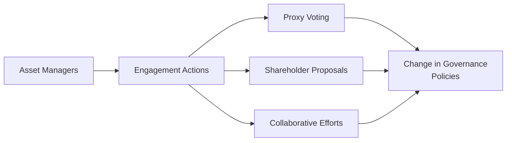

## Understanding Engagement and Stewardship

Have you ever walked out of a corporate meeting asking yourself, “Wait—did we, as investors, really have a say in that decision?” That question sums up why engagement and stewardship have become such a big deal in today’s investment world. Engagement is all about interacting with the companies in which you invest (either on your own or through an asset manager), while stewardship expands beyond just chatting—it’s about actively participating in the oversight and direction of those companies.

In more formal terms, engagement means you, as an investor, or your asset manager, is talking with company management or board members to influence their strategic, governance, and sustainability choices. Meanwhile, stewardship includes these engagements but also encompasses responsibilities like voting proxies, submitting proposals, and championing board independence. Since the 2008 global financial crisis rattled investor confidence, stewardship codes worldwide have placed greater emphasis on ensuring investors use their influence to promote long-term value. Some of the world’s largest institutional and retail investors (through mutual funds and ETFs) hold significant voting power, making stewardship a key avenue for shaping corporate behavior.

Anyway, let’s walk through some of the building blocks of engagement and stewardship, and see how they can shape your portfolio management practice.

## The Rise of Stewardship Codes

Stewardship codes exist to set out broad principles and guidelines for everyone from asset managers to pension funds, encouraging them to become active owners. The UK Stewardship Code (originally introduced in 2010 and updated in 2020) led the charge, but numerous countries, including Japan, Malaysia, and others, have since followed suit with their own versions. These codes generally outline:

• Responsibilities of institutional investors: Encouraging more transparency and engagement from managers.  
• Expectations for dialogue with investee companies: Suggesting constructive, continual communication.  
• Voting policies: Encouraging a clear and deliberate approach to proxy voting.  
• Reporting obligations: Urging asset managers to disclose how they exercise stewardship and engagement on behalf of their clients.

In Japan, for instance, the Stewardship Code (introduced in 2014 and revised in 2020) highlights the significance of long-term corporate value creation. Japanese institutions are expected to periodically evaluate their engagement effectiveness and disclose their stewardship activities. Similarly, many European regions apply the “comply or explain” principle—if institutional investors do not follow these codes, they must publicly explain why. This approach fosters mutual accountability across markets.

## Tools and Methods of Engagement

At the very core, engagement methods revolve around encouraging better corporate governance, improved board oversight, and heightened attention to environmental, social, and governance (ESG) matters. Let’s look at some of the common ways investors pursue this:

### Proxy Voting and Shareholder Proposals

Good old proxy voting is often seen as the bread and butter of investment stewardship. Through proxy voting, you or your asset manager casts ballots on everything from election of board members and executive compensation packages to environmental or social proposals. Active managers sometimes craft detailed proxy voting policies reflecting their ESG stance, while passive index managers rely on set frameworks to ensure votes align with fiduciary responsibilities.

Shareholder proposals, meanwhile, take things a step further by allowing investors to recommend—and sometimes demand—specific changes in corporate policy. These proposals might relate to greenhouse gas reporting, social issues, or board composition. In many jurisdictions, proposals meeting certain ownership and timing rules must appear on the proxy statement, giving all shareholders a chance to weigh in. And with the rise of ESG-themed investing, proposals related to sustainability or corporate citizenship have become more frequent—and in some cases gather widespread shareholder support.

### Direct Dialogue With Management

Sometimes, engagement is about more than just formal proposals or voting. It can be as simple as a constructive conversation with leadership teams. For instance, if you notice a chronic problem in a company’s supply chain—like poor labor standards or undisclosed environmental hazards—an initial phone call or a sit-down with senior management might resolve the issue. In other cases, repeated dialogue can lead to deeper discussions on board independence or the replacement of entrenched directors.

I remember the first time I attended a shareholder roundtable hosted by a large technology company. A group of institutional investors voiced concerns about data privacy. Initially, the management team seemed defensive, but over multiple meetings, the conversation shifted toward collaborative solutions. The result? The board launched a new data transparency report. That’s engagement in real time.

### Collaborative Efforts With Other Shareholders

Let’s say you’re a mid-sized fund holding a relatively small stake in a large multinational. Approaching management by yourself might not pack a ton of punch. But if you combine forces with other institutional investors—particularly those with bigger holdings—you can amplify your voice. This technique is known as collaborative engagement or collective action.

Working with other shareholders can reduce duplicative effort, provide additional expertise, and unify messaging. Various platforms and investor forums facilitate these coalitions. Of course, be mindful of potential legal boundaries related to antitrust regulations or insider information. But generally, collaborating with like-minded investors to champion better governance is seen as a responsible and strategic approach to stewardship.

Below is a simple diagram illustrating how different engagement methods funnel toward meaningful corporate changes:

## Tension Between Passive Investing and Active Governance Influence

A tricky topic is how passive investors (especially index funds and ETFs) balance their lack of security-level selection with their stewardship responsibilities. On the one hand, passive managers cannot simply “sell” the shares of a company in an index if they dislike its governance approach—they are essentially locked into those holdings as long as the firm remains in the underlying benchmark. On the other hand, they control significant blocks of shares because of the popularity of index-based products.

So, do passive managers have an incentive to engage effectively? In theory, yes. Steady long-term performance in an index benefits all investors. These index managers argue that to protect the interests of their clients, they exercise stewardship vigorously—often setting up specialized governance teams to handle proxy voting and engagements. Critics point out that resource constraints challenge the depth of engagement possible for large index managers, who are thrust into thousands of different holdings. However, we have seen many index providers actively release their proxy voting guidelines and even publish annual stewardship reports to show how they’re influencing corporate behavior.

It’s a unique dynamic. Passive managers are, ironically, forced to be active owners if they want to ensure that their captive portfolio companies are on track to generate sustainable long-term value.

## Measuring the Effectiveness of Engagement

Okay, so you (or your portfolio manager) invests tons of resources into fancy engagement letters and repeated dialogues. How do you know it’s actually working?

Common metrics to measure the success of engagement initiatives include:

• Implementation of Proposed Changes: Has management taken steps to adopt recommended ESG or governance improvements?  
• Changes in Board Composition or Leadership: Have new independent directors been introduced, or has the CEO stepped down amid investor pressure?  
• ESG Ratings Upgrades: Some rating agencies, like MSCI or Sustainalytics, issue corporate-level ESG ratings. A noticeable improvement can indicate successful engagement.  
• Increased Transparency and Disclosure: Are companies disclosing more robust data on carbon emissions, supply chain labor practices, or diversity initiatives?  
• Shareholder Support Rates: When a shareholder proposal garners a high percentage of votes (especially if it surpasses 50%), that’s a fairly direct measure of engagement efficacy.

In some cases, measuring intangible outcomes—like a shift in corporate culture—can be trickier. And remember, these improvements may take time to manifest in financial metrics such as return on equity (ROE) or share price. Patience is key, and consistent pressure often yields results in a more sustainable manner.

## Overcoming Common Pitfalls and Challenges

Engagement, for all its promise, isn’t always smooth sailing. You might encounter:

• Company Resistance: Some boards or executives may be reluctant to change or even meet with you, especially if they see your proposals as intrusive.  
• Regulatory Hurdles: Disclosure rules and strict guidelines around shareholder communications can make the engagement process cumbersome.  
• Collective Action Problems: Collaborating with other shareholders can also spark legal or business complexities, especially across jurisdictions.  
• Resource Constraints: Smaller funds may simply lack the bandwidth to consistently engage with every portfolio holding.

A practical remedy is to prioritize engagements. Focus your energy on your largest or most problematic holdings—or the ones with the highest potential for improvement. Lean on stewardship codes to help structure your process. They exist to help shape best practices for committees, guidelines, and disclosures in ways that, ironically enough, make your life easier.

## Real-World Scenarios and Case Studies

Let’s consider a hypothetical scenario. Suppose GreenFuture Asset Management invests across multiple energy companies—some transition-minded, others less so. After analyzing each firm’s carbon footprint, GreenFuture identifies a few that aren’t disclosing CO₂ data and are facing environmental fines.

1. GreenFuture sets up group calls with the boards of these companies.  
2. They subsequently file a shareholder proposal requesting annual climate impact reports.  
3. They collaborate with other institutional investors who share green objectives.  
4. During the annual general meeting, 60% of shareholders approve a resolution requiring better emissions disclosure.  
5. Over the next year, the target firms publish detailed carbon data and set decarbonization targets.

Post-engagement, these companies might earn better ESG scores, reducing capital costs and attracting more conscientious investors. Additionally, by cutting energy waste, they may see improved efficiencies and cost savings over the long term. This example illustrates how engagement can go beyond “doing good” to also create potential value.

In actual practice, major names like BlackRock, State Street, and Vanguard have widely publicized stewardship guidelines, especially around diversity and sustainability. By leaning on the scale of their investments, they often spark significant reforms in large-cap corporations.

## Integrating This Topic With Broader Portfolio Management Concepts

Engagement shouldn’t be viewed in isolation. It’s intimately tied to the broader risk-return analysis in your portfolio. For instance:

• If a company’s governance is poor, it may lead to operational blow-ups or legal liabilities.  
• Collaborating with other investors can reduce idiosyncratic risks if a coordinated approach helps mitigate ESG hazards.  
• Active dialogue can reveal new investment insights about a firm’s strategic direction, sometimes prompting portfolio managers to adjust position sizing or hedge exposures.

You might recall from earlier chapters on risk management (see Chapter 6: “Introduction to Risk Management”) that controlling ESG risk is integral to a holistic approach. Stewardship and engagement can be another lever to reduce the risk end of the equation or even capture upside from governance improvements.

## Practical Tips for CFA Exam Success

• Familiarize Yourself with Key Stewardship Codes: You don’t need to memorize every detail but understand their underlying principles, especially the UK and Japan codes, and how they aim to enhance long-term value.  
• Know the Engagement Toolkit: Proxy voting mechanics, shareholder proposal rules, collaborative efforts—these are likely to appear in scenario-based questions.  
• Apply the “So What?” Lens: Connect engagement outcomes with portfolio performance or risk mitigation. The exam might test how you’d advise a client or appraise the effectiveness of stewardship.  
• Recognize Constraints on Passive Managers: Conceptual questions often explore the tension between passive approaches and the necessity to be active in corporate oversight.  
• Show Familiarity with ESG Integration: Engagement is part of a strongly growing trend in ESG investing, a focal point for many exam questions.

## References and Further Reading

- ICGN (International Corporate Governance Network). “Global Stewardship Principles.”  
- CFA Institute. “Proxy Voting and Engagement Practices.”  
- PRI. “Active Ownership 2.0: Redefining Engagement.”  
- UK Financial Reporting Council. “The UK Stewardship Code 2020.”  
- Japan Financial Services Agency. “Japan’s Stewardship Code (Revised 2020).”

--------------------------------------------------------------------------------------

## Test Your Knowledge: Engagement and Stewardship Techniques Quiz



### Which of the following best describes the term "engagement" in a stewardship context?

- [x] Constructive dialogue with company management or boards to influence corporate behavior.
- [ ] Selling shares to signal disapproval of company policies.
- [ ] Outsourcing governance decisions to a third-party proxy advisory firm.
- [ ] Publishing quarterly earnings reports for a company.

> **Explanation:** Engagement refers to proactive dialogue or communication between investors (or their representatives) and company leadership aimed at improving strategy, governance, or ESG practices.

### Proxy voting can best be described as:

- [ ] A mechanism used solely by regulators to enforce corporate compliance.
- [x] The process of casting ballots on shareholder matters on behalf of investors.
- [ ] A mandatory disclosure requirement for board decisions.
- [ ] An informal negotiation method used primarily in private companies.

> **Explanation:** Proxy voting is when shareholders or asset managers vote on board appointments, compensation, and other corporate proposals, often via ballots distributed ahead of annual or special meetings.

### Which statement most accurately reflects the purpose of stewardship codes?

- [ ] They mandate corporate downsizing in underperforming companies.
- [x] They set broad principles guiding institutional investors to be active, responsible owners.
- [ ] They ensure the central bank intervenes in any governance disputes.
- [ ] They replace all legal regulations related to corporate governance.

> **Explanation:** Stewardship codes are not rigid regulations. Rather, they provide guiding principles enabling institutional investors to engage adequately, enhance governance, and maintain focus on long-term value creation.

### In collaborative engagement, multiple investors combine forces to:

- [x] Increase collective influence on a company’s policies or governance.
- [ ] Override the board of directors and unilaterally alter corporate strategy.
- [ ] Hide organizational ownership structures from regulators.
- [ ] Conduct insider trading for mutual benefit.

> **Explanation:** Collaborative engagement pools the resources, expertise, and influence of multiple investors, helping them push for constructive changes in corporate behavior more effectively.

### A common tension for large passive investors (e.g., index funds) in stewardship is:

- [x] They hold shares indefinitely and thus cannot simply exit poor governance situations.
- [ ] They are exempt from voting on proxies.
- [x] They can’t influence companies through any engagement methods.
- [ ] They form cartels to manipulate market prices.

> **Explanation:** Because passive investors track an index, they generally can’t easily divest poor-performing or badly governed companies. This necessity creates a tension compelling them to engage intensively at times to drive improvements.

### What is a possible indicator of effective engagement?

- [x] An improvement in board composition or the appointment of more independent directors.
- [ ] A sudden drop in trading volume.
- [ ] Acquisition of competing institutions.
- [ ] Failure to disclose new risk factors.

> **Explanation:** Effective engagement might lead to a more independent and balanced board or to other tangible improvements in governance, ESG reporting, or strategy.

### When an asset manager files a shareholder proposal, the goal typically is to:

- [x] Press the company to address a specific governance or ESG issue.
- [ ] Force the company to delist from its exchange.
- [x] Guarantee an immediate increase in dividend payouts.
- [ ] Remove all internal board members.

> **Explanation:** By filing a shareholder proposal, the asset manager is putting a topic on the ballot—usually tied to governance, sustainability, or corporate responsibility outcomes—and seeking approval from other shareholders.

### The UK Stewardship Code and Japan’s Stewardship Code generally require investors to:

- [x] Disclose how they engage and vote on corporate matters.
- [ ] Use only quantitative models and ignore qualitative factors.
- [ ] File lawsuits against companies before discussing concerns with management.
- [ ] Overhaul national securities regulations.

> **Explanation:** Both codes emphasize transparency in how institutional investors engage with companies and exercise their voting rights to foster a culture of proactive stewardship.

### One major pitfall for smaller asset managers focusing on engagement is:

- [x] Limited resources or expertise to engage effectively with multiple companies.
- [ ] An inability to find potential collaborators among large peers.
- [ ] Full exemption from legal and regulatory constraints on stewardship.
- [ ] Lower acceptance rates of client assets under management.

> **Explanation:** Smaller funds often can’t devote as many resources (e.g., specialized governance staff) to engage thoroughly with a broad portfolio. Prioritizing certain stocks or collaborating with others often helps address this challenge.

### True or False: Proxy voting is a key mechanism for investors to influence corporate governance decisions.

- [x] True
- [ ] False

> **Explanation:** Proxy voting is foundational in stewardship, allowing shareholders to cast ballots on vital issues like board elections, executive compensation, and shareholder resolutions.


