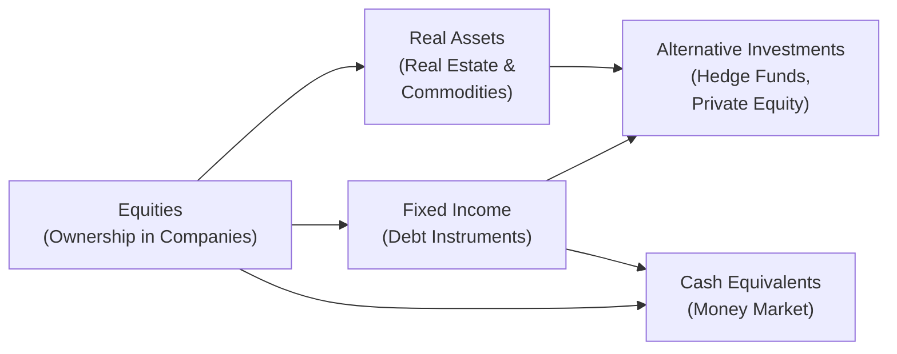

## Introduction
I remember once chatting with a friend who was just starting to invest, and they were so confused about where to put their money—“Do I buy stocks? Bonds? Real estate, or gold?” They must’ve asked me a hundred questions about each instrument! Truth is, choosing the right mix of asset classes can feel overwhelming. Each type of asset behaves differently, carries varying levels of risk, and can play a distinct role in a portfolio. With the right knowledge, though, we can figure out a pretty nice blend that aligns with our goals.

In this section, we’ll walk through the core asset classes—Equities, Fixed Income, Cash Equivalents, Real Estate, Commodities, and Alternative Investments (like hedge funds and private equity). We’ll explore how each one can fit into a broader portfolio, considering historical performance, typical risk–return characteristics, correlations, and practical considerations like liquidity and transaction costs. You might find, for example, that a small slice of real estate or commodities can significantly reduce your portfolio’s overall swings, even if those slices themselves are a bit volatile. Let’s dive right in.

## Major Asset Classes: An Overview
An asset class is basically a group of securities or investments that share similar characteristics, match up under the same regulatory frameworks, and often move based on similar drivers of value. Think of them as broad “buckets” in which you can invest.



Above is a simple visual showing some of the broad categories for major asset classes. Each has typical risk–return patterns, liquidity, and correlation relationships that can influence your overall portfolio structure.

---

## Equities
Equities represent ownership shares in a company, so if you buy a stock, you become a partial owner of that business. That sounds pretty cool, right? But with ownership comes risk. Let’s outline the key attributes:

• Risk–Return Profile: Historically, equities have delivered higher returns than most other asset classes over the long run. But they can also experience significant drawdowns—sometimes more than 30% in a year during market crashes.  
• Market Liquidity: Stocks, especially those traded on major exchanges, are typically quite liquid. You can usually buy or sell them quickly with minimal price impact.  
• Drivers of Value: Company earnings, broader economic conditions, interest rates, and market sentiment can affect stock prices.  
• Use in Portfolios: Equities are often a primary growth engine for portfolios, especially if the investor has a relatively long time horizon.

### Historical Performance
If you look at data from sources such as “Investments” by Bodie, Kane, and Marcus, you’ll see that equities in developed markets (like the U.S. or Western Europe) have averaged returns in the high single digits to low double digits annually over the past several decades, albeit with plenty of volatility. For instance, total returns (including dividends) for U.S. large-cap stocks over the last century hovered around 9-10% on average per year. Emerging markets have sometimes offered even higher returns—though with significantly higher risk.

### Example: Role in Strategic Allocation
Imagine you’re building a portfolio for a 35-year-old investor who doesn’t need to tap their retirement savings for another 30 years. Because of the time horizon and the potential for growth, you might allocate somewhere between 50% to 80% of the portfolio to equities, depending on their risk tolerance (which is also influenced by their willingness and ability to bear volatility).

---

## Fixed Income
When we talk about fixed income, we’re typically referring to bonds or debt instruments. You act like the lender here. Companies, governments, or other entities borrow from you and pay interest. Eventually (hopefully), they repay the principal.

• Risk–Return Profile: Generally lower risk than equities, with more stable returns. But that’s not always the case—high-yield (“junk”) bonds can behave somewhat like stocks.  
• Market Liquidity: Highly dependent on the type of bond and the market. Sovereign bonds (like U.S. Treasuries) are usually very liquid, while some corporate or municipal bonds can be less so.  
• Drivers of Value: Interest rates, credit risk, inflation expectations, and central bank policies.  
• Use in Portfolios: Fixed income helps dampen overall volatility and can provide steady income streams.

### Historical Performance
Over the long haul, high-quality government bonds have delivered returns in the low single digits but with fairly low volatility. Corporate bonds often yield a bit more, reflecting higher credit risk. During times of economic stress, higher-rated bonds often gain as investors flee riskier assets.

### Example: Reducing Portfolio Volatility
Folks who want a smoother ride often include a substantial chunk of fixed income. For instance, a retiree might hold 60% or more in high-quality bonds—especially if they need the stable income or can’t stomach a big drawdown in equity markets.

---

## Cash Equivalents
Ah, cash equivalents (like money market funds, Treasury bills, and short-term commercial paper) are sometimes overlooked because they provide modest returns. However, they do bring unique benefits:

• Risk–Return Profile: Very low risk, very low return. They’re often the safest anchor in your portfolio but won’t beat inflation in the long run.  
• Market Liquidity: Extremely high liquidity. You can typically convert them to cash almost instantly.  
• Drivers of Value: Short-term interest rates set by central banks, supply and demand in the short-term credit market.  
• Use in Portfolios: They offer a place to store “dry powder” for future opportunities or for short-term expenses.

### Historical Performance
If you track T-bills in U.S. markets or similar short-term government instruments elsewhere, their yield tends to follow the central bank’s policy rate. Over extended periods (decades), you may even see negative real returns after inflation. However, during market downturns, cash equivalents represent stability.

### Example: Short-Term Needs
Let’s say you anticipate a big expense—maybe you want to buy a house in a year. Storing the portion of your money needed for a down payment in equities could be too risky. Cash equivalents make sense as you can’t risk a potential 20% tumble in the stock market that might wipe out the deposit.

---

## Real Estate
Real estate is typically classified as a “real asset,” meaning it has intrinsic value and physical substance. Real estate includes commercial properties, residential properties, farmland, and everything in between.

• Risk–Return Profile: Over the very long term, real estate has offered moderate to high returns (depending on the property type and region) with certain tax advantages. However, it’s not always smooth sailing. Real estate values can stagnate or drop, especially if financed with leverage in a downturn.  
• Market Liquidity: Physical property is often quite illiquid—you can’t just sell an office building overnight. Real Estate Investment Trusts (REITs) are far more liquid since they’re traded on the stock market, though their prices can be quite volatile.  
• Drivers of Value: Supply and demand in the particular geographic area, interest rates, financing conditions, and overall economic growth.  
• Use in Portfolios: Real estate can provide diversification benefits because it sometimes moves differently from equities or bonds and can generate steady income (rental yields).

### Historical Performance
History shows that property investments have generally kept pace with inflation or slightly exceeded it, especially in regions with robust economic growth. However, real estate cycles can be long, and prices can be hammered during major credit crunches (think 2008).

### Example: Diversification Benefits
Including 5-10% in real estate (through REITs or direct investment) in a traditional stock-bond portfolio can produce both income and diversification. During certain periods, real estate returns have low correlation with equity markets.

---

## Commodities
I recall the first time I bought gold—honestly, it felt neat to own a precious metal that has been a store of value for centuries. Commodities refer to raw materials like precious metals (e.g., gold, silver), energy products (e.g., oil, natural gas), agricultural products (e.g., wheat, coffee), and more.

• Risk–Return Profile: Commodities can be volatile, and unlike equity or bonds, they don't produce cash flow (with the exception of some roll-yield strategies in futures). They are mostly used as inflation or crisis hedges.  
• Market Liquidity: Futures markets for major commodities are generally quite liquid. Physical commodities can be less so.  
• Drivers of Value: Supply shocks (weather, geopolitical events, production cuts), global demand cycles, currency fluctuations.  
• Use in Portfolios: Diversification and hedging, particularly for inflation or geopolitical risk.

### Historical Performance
Commodities have had long stretches of low or negative returns, especially during periods of stable inflation and moderate economic growth. But in inflationary or crisis periods, certain commodities (notably gold) can surge. Over the past two decades, for instance, we’ve seen times when energy and metals soared, then crashed, reflecting high volatility.

### Example: Inflation Hedge
Adding 5% gold in a portfolio might help soften the impact of rising inflation or major market disruptions. While that 5% might lag equities in a booming economy, it can shine (pun intended) during crisis years.

---

## Alternative Investments
Now let’s move on to the “cool kids” of investing—or at least they’ve become quite popular over the last few decades. Alternatives can include hedge funds, private equity, infrastructure, and even more niche areas like venture capital and collectibles (art, vintage cars, wine, etc.). For our conversation, we’ll focus on hedge funds, private equity, and infrastructure.

• Risk–Return Profile: It’s tricky. Some alternatives may offer high returns with lower correlation to traditional markets, but they often come with higher fees, lower transparency, and sometimes significant leverage.  
• Market Liquidity: Many alternative vehicles have lock-up periods (e.g., a private equity fund might require a 7- to 10-year commitment), making them illiquid.  
• Drivers of Value: Manager skill for hedge funds (long–short strategies, macro bets, event-driven trades), specialized operational improvements for private equity, or stable cash flows (e.g., toll roads) for infrastructure.  
• Use in Portfolios: Potential to enhance returns and diversification, but they require advanced due diligence and acceptance of complexity and illiquidity.

### Historical Performance
Hedge funds overall have underperformed a broad equity index in some stretches—particularly after fees. Still, top-performing hedge funds can outperform, especially in turbulent markets. Private equity can yield higher returns than public markets, but with greater risk, less liquidity, and the possibility of complete capital loss if deals go sour.

### Example: Illiquidity Premium
An institution might allocate 10-15% to alternatives to seek higher returns, expecting to hold such investments for a decade or more. In theory, the illiquidity premium should deliver higher expected returns over time—but that’s not guaranteed.

---

## Correlations and Their Shifts
One of the main reasons to blend these asset classes is correlation—or how similarly they move in response to market events. 

• Equities and high-yield bonds tend to have a moderately positive correlation (they often move together in expansions or recessions).  
• High-quality government bonds can have near-zero or negative correlation with equities in stable times—making them a standard “risk-off” choice.  
• Real estate often shows moderate correlation with equities, but it can sometimes diverge, especially if local or sector-specific factors dominate.  
• Commodities tend to offer low correlation to a traditional stock–bond portfolio, though certain commodity groups (like metals or energy) can sync up when global growth changes.  
• Alternatives run the gamut—some hedge fund strategies might correlate highly with equities, while others behave more like market-neutral or event-driven strategies.

In crisis moments, correlations can converge (“all correlations go to 1,” as the saying goes), meaning everything falls in tandem except perhaps cash or some safe government bonds. That’s when you discover that your “diversifiers” may not provide as much dampening as you hoped. However, over multi-year horizons, these different asset classes often deliver meaningful diversification benefits.

### Quick Python Example: Correlation Matrix
Below is a small snippet showing how you might calculate correlations among asset classes using Python. Let’s assume you have monthly returns in a DataFrame.

```python
import pandas as pd

# with columns: ['Equities', 'Bonds', 'RealEstate', 'Commodities']

cor_matrix = returns_df.corr()
print(cor_matrix)

#              Equities     Bonds  RealEstate  Commodities
# Bonds         0.2342    1.0000     0.1060      -0.0250
# Commodities   0.1120   -0.0250     0.0810       1.0000
```

You might see that equities and bonds have a modest positive correlation, while commodities have a lesser correlation with either.

---

## Historical Variability of Returns
One big lesson from history: asset class returns are not constant. Equities can average 9% over a half-century, but in a given year they might drop 30% or climb 25%. Bond returns vary with interest rates and credit conditions—like in the 1980s when double-digit coupon rates were all the rage, or in periods of near-zero yields. Real estate soared in certain decades and came crashing down in others. Commodities might go nowhere for years, then jump on supply shocks.

## Practical Considerations
• Transaction Costs: Stocks and bonds can be relatively cheap to trade in developed markets. Real estate, however, has broker fees, closing costs, and sometimes maintenance expenses. Alternatives often have management and performance fees.  
• Tax Treatment: Some asset classes enjoy favorable tax structures (like municipal bonds in the U.S.). Real estate can benefit from depreciation and tax deductions, while short-term capital gains on equity trades can be taxed heavily.  
• Custody: Ensure your assets are held with reputable custodians. Alternatives may require specialized custodians or separate legal structures.  
• Regulatory Restrictions: Certain investments—like private equity or hedge funds—require investors to be “accredited” or meet other legal requirements.

---

## Combining Asset Classes for Lower Volatility
Let’s do a quick example. Suppose you have a portfolio with 80% equities and 20% bonds that yields an annualized standard deviation of around 15%. Now you’re thinking of adding 5% in commodities, taking a bit from both equities and bonds. Even if commodities have a standard deviation of, say, 25%, they might have a low correlation (like 0.10) with equities and bonds, potentially dragging down the overall portfolio volatility to around 14%. It’s not a massive drop, but that 1% difference in volatility matters when we talk about big sums of money over long periods.

Here’s a simplified formula illustration:
  
Let σₚ denote portfolio volatility. For a two-asset portfolio:

σₚ = √(w₁²σ₁² + w₂²σ₂² + 2w₁w₂σ₁σ₂ρ₁₂)

Where:  
• w₁, w₂ = weight of each asset class in the portfolio,  
• σ₁, σ₂ = standard deviation of each asset class,  
• ρ₁₂ = correlation between the two asset classes.

When you add more asset classes, the formula expands to include additional correlation terms. The idea is that if you introduce an asset class with a relatively low or even negative correlation, you might reduce the portfolio’s overall volatility—despite that asset’s own volatility.

---

## Best Practices and Pitfalls
• Don’t Overestimate Diversification: Correlations can spike during crises. Even if an asset class is uncorrelated in normal times, it might become highly correlated when markets panic.  
• Beware Illiquidity: If you invest in private equity or real estate you can’t easily sell, you could be forced to hold through market cycles.  
• Watch Fees: High management fees can eat away at returns (particularly in hedge funds, private equity, or certain commodity funds).  
• Rebalance Periodically: Over time, market movements can shift your allocation away from its target.  
• Align with Time Horizon and Goals: Risk–return preferences, liquidity needs, and your stage in life should guide the asset mix.

---

## Final Exam Tips
• Understand the Drivers of Value: The exam might throw a scenario about interest rate hikes and ask how it affects equities vs. fixed income.  
• Correlation Calculations: Be comfortable with correlation formulas and how to interpret them in a portfolio context.  
• Behavioral Pitfalls: You might see question vignettes about investors being overconfident in alternative investments or ignoring liquidity risk; highlight these pitfalls in your answers.  
• Focus on Real-World Applications: CFA exam questions often revolve around case studies showing how to incorporate real estate or commodities into a strategic asset allocation.  
• Master Terminology: Terms like “Asset Class,” “Liquidity,” “Correlation,” and “Alternative Investments” appear frequently in item sets.

---

## References
• CFA Institute’s Official Study Materials (2025 Curriculum).  
• Bodie, Z., Kane, A., & Marcus, A. (Latest Edition). "Investments."  
• Brinson, G., Hood, R., & Beebower, G. (and subsequent works). “Determinants of Portfolio Performance” & “Global Asset Allocation.”  

---

## Test Your Knowledge: Major Asset Classes Correlation & Characteristics



### Which of the following asset classes typically offers the highest long-term returns but also the highest volatility?

- [x] Equities
- [ ] Cash equivalents
- [ ] Government bonds
- [ ] Money market instruments

> **Explanation:** Historically, equities have delivered higher average returns but with larger swings in value than bonds or cash.

### Which major driver directly impacts the value of commodities?

- [ ] Regulatory changes in municipal bonds
- [x] Supply disruptions and global demand conditions
- [ ] Management fees and performance-based compensation
- [ ] Depreciation deductions for real property

> **Explanation:** Commodities are primarily influenced by supply shocks (e.g., droughts, geopolitical tensions) and global demand cycles, which affect raw materials prices.

### If an investor wants a safe haven asset to preserve capital during market downturns, which of the following is most appropriate?

- [x] Cash equivalents
- [ ] High-yield corporate bonds
- [ ] Private equity investments
- [ ] Preferred shares

> **Explanation:** Cash equivalents like T-bills or money market funds are typically the go-to for short-term stability and minimal risk of capital loss.

### How do real estate investments often improve diversification in a traditional equity-bond portfolio?

- [ ] By being perfectly correlated with equities
- [x] By providing exposure to a tangible asset class with potentially low/medium correlation
- [ ] By offering automated rebalancing features
- [ ] By eliminating the risk of default

> **Explanation:** Real estate often has a lower correlation to equities and can contribute to diversification by providing alternative sources of return and different risk dynamics.

### Why might private equity be considered less liquid than publicly traded equities?

- [ ] Because share prices are posted daily
- [ ] Because high trade volumes exist
- [x] Because investments are locked up for long periods, with no active secondary market
- [ ] Because they have no management team

> **Explanation:** Private equity funds typically have multiple-year lock-up periods, and selling shares early is either impossible or limited, making them far less liquid than public equities.

### What is a primary concern when incorporating hedge funds into a portfolio?

- [ ] High correlation with traditional assets in normal markets
- [x] High fees and potential lack of transparency
- [ ] Guaranteed returns above the market
- [ ] Low risk profiles relative to government bonds

> **Explanation:** Hedge funds often charge management and performance fees, and many employ complex or opaque strategies. This elevates cost and due diligence requirements.

### When we say that two asset classes are negatively correlated, it implies:

- [ ] They deliver identical return streams.
- [x] Their returns tend to move in opposite directions.
- [ ] They offer the exact same volatility level.
- [ ] They cannot be combined in a portfolio.

> **Explanation:** A negative correlation means that when one goes up, the other tends to go down, which can help to smooth overall portfolio performance.

### A retiree with a low risk tolerance would likely benefit from which of the following allocations?

- [x] A higher allocation to investment-grade bonds vs. equities
- [ ] A high concentration in emerging-market equities
- [ ] Primarily real estate and alternatives
- [ ] 90% in commodities

> **Explanation:** Retirees often need lower-volatility, regular income streams, so high-quality bonds typically form a substantial portion of their portfolio.

### A small addition of commodities to a predominantly stock-and-bond portfolio may:

- [ ] Increase volatility in all market conditions
- [ ] Have no effect on portfolio risk
- [x] Potentially lower portfolio volatility due to low correlation
- [ ] Guarantee higher returns each year

> **Explanation:** Because commodities often have a relatively low correlation to stocks and bonds, a small allocation can help smooth out portfolio fluctuations.

### True or False: Real estate is always negatively correlated with equities.

- [ ] True
- [x] False

> **Explanation:** While real estate can provide some diversification benefits, the correlation with equities can vary across market cycles and is not consistently negative.


