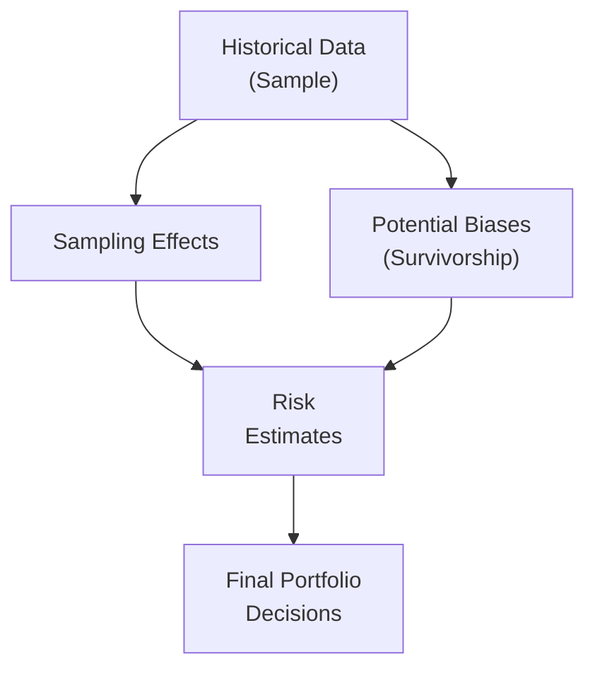

## Introduction
Have you ever tried predicting something about the future by looking at past data—only to find yourself blindsided by changes you didn’t see coming? Well, we’ve all been there. In portfolio management, historical data is a valuable tool for estimating risk and return. However, it’s not always as reliable as it seems. Markets evolve, biases creep in, and sometimes the past simply violates that old disclaimer, “Past performance is not necessarily indicative of future results.”

This section examines how historical data is used in the risk estimation process and, crucially, when it might lead you astray. We’ll look at common pitfalls like sampling error and survivorship bias, explore structural shifts that can make old data less meaningful, and discuss methods such as Bayesian approaches and regime-switching models aimed at bridging the gap between the past and the (unknown) future.

## Historical vs. Forward-Looking Approaches
Portfolio managers generally rely on two broad classes of estimates for risk and return:

• Historical Estimates: These use actual market data, such as historical returns and volatilities, to predict the future.  
• Forward-Looking (Subjective) Estimates: These rely on investors’ or analysts’ expectations of market changes, economic cycles, and other forward indicators.

Historical data provides a foundation. It’s often easier to obtain, can be validated by auditing past records, and typically covers multiple market cycles. But forward-looking estimates incorporate current market sentiments, macroeconomic forecasts, and structural trends that aren’t always visible in older data sets. An effective risk estimation strategy often uses both, balancing the rigor of historical numbers with the insight and flexibility of subjective forecasting.

## Key Issues in Historical Data

### Survivorship Bias
Survivorship bias is a classic trap. Imagine you’re building a performance analysis of hedge funds, but you only include the funds that still exist. Those that closed shop or went bankrupt are conveniently omitted from your sample. This can paint an overly rosy picture of returns (and sometimes an understated measure of risk), because the failures aren’t reflected.

From a personal perspective, I recall analyzing a set of equity funds after the dot-com bubble. My data was missing all the tech funds that went belly-up. So, the average return figure suggested the industry overall did “okay,” which was a bit, well, misleading. If you ignore the non-survivors, you may underestimate volatility and overestimate fund performance.

### Sampling Error
Sampling error arises when your sample (historical data set) doesn’t accurately represent the true population of possible outcomes. A small sample can amplify anomalies and outliers, causing you to draw conclusions that don’t generalize well.

In risk estimation, a short historical period may capture only one distinct market regime—say a prolonged bull market. If you run optimization or risk estimates on that limited sample, you might project unrealistically low volatility. Then, if the market experiences a downturn similar to 2008 or the initial COVID-19 shock, your risk estimates prove dangerously off the mark.

## Structural Changes and Market Regimes
Even if you manage to collect a sufficiently large sample over many years, markets undergo structural changes. Technological innovations—like the rise of algorithmic trading or digital asset platforms—reshape liquidity, transaction costs, and even the correlation dynamics among asset classes. Regulatory shifts, such as new capital requirements or changes in monetary policy frameworks, can drastically alter interest rate behaviors and credit market structures.

These changes matter because historical relationships (e.g., the correlation between equities and bonds, or the volatility of commodities) can shift as the underlying market structure evolves. The historical data might indicate one steady pattern—until something like high-frequency trading or major central bank interventions come along and blow that pattern out of the water.

## Adapting Historical Data: Bayesian and Regime-Switching Models
Being aware of the pitfalls is only half the battle. We also want some tools to address them actively. Let’s look at two: Bayesian methods and regime-switching models.

### Bayesian Methods
Bayesian statistics offers a framework where we can update our “prior” beliefs about an asset’s risk and return with new “evidence”—such as more recent market data or expert judgments. The formula for updating a posterior distribution (in simplified form) is often written as:


\text{Posterior} \propto \text{Likelihood} \times \text{Prior}


In plain terms, if the historical data suggests a certain mean return and volatility, but you have reason to believe, based on latest market signals, that risk has fundamentally increased, you can incorporate that newer view into your prior. Then, the final (posterior) estimate is a blend of this prior and the recent data’s likelihood. Over time, as new data arrives, your estimate evolves—hopefully capturing real shifts in risk profiles as they occur.

### Regime-Switching Models
Markets don’t always behave in a single consistent “mode.” Instead, they may switch between regimes—for example, a stable/low-volatility regime and a turbulent/high-volatility regime. Regime-switching models allow us to estimate different sets of parameters, such as means, variances, and correlations, depending on the prevailing market state.

A simplified two-regime model might say:

• In Regime 1 (low volatility), equity returns average 8%, with an annual volatility of 10%.  
• In Regime 2 (high volatility), equity returns average 1%, with an annual volatility of 25%.

Statistical techniques will estimate the probability of transitioning from one regime to the other. When the model suggests, for instance, a high probability of shifting to Regime 2, your risk estimates can reflect that sharper volatility spike, rather than blindly relying on the weighted average of historical returns.

## Qualitative Assessments and Mixed Methods
It’s often helpful to combine quantitative insights with qualitative observations. Let’s say you see a historically moderate correlation between stocks and bonds, but you notice central banks implementing extraordinary monetary policies. A purely quantitative approach might not capture that shift in real time. By reading policy statements, analyzing forward guidance, or simply being mindful of global macro developments, you can get a heads-up on possible structural changes.

In practice, that means cross-checking numerical results from your models with fundamental or anecdotal evidence. If your forward-looking scenario suggests a surge in inflation risk, but your purely historical dataset doesn’t, you might want to increase your inflation-risk estimates to reflect the new conditions, especially if other macro indicators agree.

## Diagrams: Visualizing Data Reliability
Below is a simple Mermaid diagram showing how historical data feeds into risk estimation, highlighting points where distortion or bias can occur:

At each step, we can introduce adjustments—such as removing survivorship bias or weighting data by economic regimes—before we finalize estimates.

## Practical Steps and Best Practices
• Check for Survivorship Bias: Make sure your dataset includes both winners and losers, even if they’re no longer in the market.  
• Use Sufficiently Long Horizons (If Relevant): But always question whether the historical period is truly representative of current market dynamics.  
• Incorporate Qualitative Inputs: Market narratives, investor sentiment, and structural changes often stay a few steps ahead of purely quantitative data.  
• Consider Multiple Regimes: If the environment changes from low to high volatility or from expansion to recession, consider dynamic or regime-based modeling.  
• Update with Bayesian Methods: Combine prior knowledge with new evidence. Keep updating your estimates as conditions evolve.  
• Sensitivity and Scenario Analysis: Subject your estimates to various hypothetical scenarios. Ask, “What if market volatility doubles overnight?”  

## Real-World Example
Not too long ago, I worked with a small family office that relied heavily on data from 2010–2020 to forecast the risk of their long-only equity strategy. This sample, while containing some volatility, largely missed the extreme stress seen in 2008 and the dot-com crash. Over time, it became clear their hedging budgets were too low, and risk capital was too lean for a worst-case scenario. By adding a Bayesian “shock” layer that accounted for older crisis data and applying a modest regime-switching approach, they recalibrated their overall risk. When markets turned choppy during the COVID-19 outbreak, the office was at least partially insulated due to a more conservative stance.

## Final Exam Tips
• Emphasize Basic Definitions: When the exam asks about survivorship bias or sampling error, your first step is to nail the definitions and quickly illustrate their impact on returns and volatility.  
• Show Your Work: If you’re asked to re-estimate returns considering an older set of data, demonstrate each step clearly.  
• Bring In Forward-Looking Views: Even if the question focuses on historical data, try to discuss how new info or signals could refine that data.  
• Connect to Scenario Analysis: This reading is closely tied to the next sections on scenario and sensitivity analysis (e.g., Section 2.12); consider synergy in the exam.  
• Summarize Pitfalls: The exam often rewards students who can “teach back” common pitfalls like sampling error and survivorship bias succinctly.

## References
• Dimson, E., Marsh, P., and Staunton, M. (various years). “Global Investment Returns Yearbook.” This research highlights how omitting defunct companies can bias data.  
• CFA Institute Program Curriculum. Discussion on historical vs. forward-looking estimates in risk management contexts.  
• Hamilton, J.D. (1989). “A New Approach to the Economic Analysis of Nonstationary Time Series and the Business Cycle.” Econometrica, which introduced regime-switching approaches.  

## Test Your Knowledge: Reliability of Historical Data for Risk Estimation



### Which of the following describes survivorship bias?
- [ ] Overrepresenting small-cap stocks in a historical dataset
- [ ] Only considering risk-free assets in return estimations
- [x] Excluding failed or defunct entities from a performance sample
- [ ] Including derivatives data along with equity data

> **Explanation:** Survivorship bias occurs when the performance of entities that no longer exist is ignored, leading to an inflated impression of returns.

### An analyst calculates volatility using a small sample from a low-volatility period. What is the potential issue?
- [ ] The sample is likely to show inflated correlation between assets.
- [ ] The sample is likely to show lower returns.
- [x] The sample may underestimate the true level of market volatility.
- [ ] The sample automatically avoids survivorship bias.

> **Explanation:** A small or non-diverse sample can lead to sampling error by not capturing the full range of market conditions, possibly underestimating volatility.

### Which approach updates prior beliefs with new market evidence in estimating risk?
- [ ] Regime-switching
- [ ] Frequentist statistics
- [x] Bayesian methods
- [ ] Simple exponential smoothing

> **Explanation:** Bayesian methods combine the prior distribution with new data to arrive at a posterior view of risk parameters.

### A regime-switching model would be most helpful for:
- [ ] Handling a constant volatility environment.
- [ ] Simplifying portfolio rebalancing in stable markets.
- [ ] Eliminating the need for forward-looking estimates.
- [x] Capturing shifts in market volatility or returns under different conditions.

> **Explanation:** Regime-switching models allow for distinctly different risk-return parameters under separate market regimes.

### One reason historical risk estimates may not hold in future periods is:
- [ ] Markets never change technology or regulations.
- [x] Structural changes can alter relationships among asset classes.
- [ ] Volatility always stays the same.
- [ ] FIxed income instruments dominate equity correlations.

> **Explanation:** Market structure evolves (e.g., through technology or regulatory changes), making purely historical relationships less predictive.

### Which of the following is not typically a source of bias in historical data?
- [ ] Survivorship bias
- [ ] Sampling error
- [ ] Look-ahead bias
- [x] Real-time market pricing transparency

> **Explanation:** Real-time market pricing transparency is more of a data feature than a bias. Survivorship, sampling, and look-ahead biases can all skew historical results.

### How might an analyst adjust for structural market changes that have recently occurred but are not reflected in older data?
- [ ] Ignore the changes completely
- [ ] Extend the dataset until it becomes large enough
- [x] Use a forward-looking overlay or Bayesian update mechanism
- [ ] Eliminate any data from before the structural change

> **Explanation:** Combining historical trends with updated and forward-looking information helps reflect structural changes more accurately, especially through Bayesian or overlay techniques.

### Regime-switching models typically assume:
- [x] Assets can shift from one return/volatility environment to another
- [ ] There is only one market regime at all times
- [ ] Correlations remain consistent over all future periods
- [ ] Volatility is entirely predictable from a short sample

> **Explanation:** Regime-switching models capture the idea that markets alternate between states (e.g., high and low volatility).

### Which of the following best defines survivorship bias in the context of mutual funds?
- [x] Ignoring funds that closed or merged, thus overstating average returns
- [ ] Relying on up-to-date fund fee structures
- [ ] Including short positions in the total sample
- [ ] Overestimating the volatility for all funds

> **Explanation:** Mutual fund data often excludes closed or merged funds, thereby inflating the historical average returns of the “surviving” sample.

### True or False: Using historical data alone guarantees accurate future risk estimates.
- [x] True
- [ ] False

> **Explanation:** This statement is actually false. Historical data alone does not guarantee accuracy because markets change and biases exist. (Tricky question: the correct marking is “False” as the statement is contradictory to the reading.)


