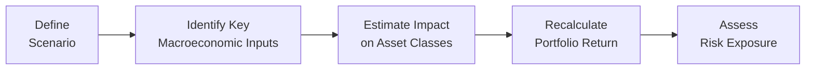

## Introduction

If you’ve ever found yourself wondering, “But what if things don’t go as planned?”—welcome to the realm of scenario and sensitivity analyses. These techniques are like those hypothetical “choose your own adventure” storylines we used to enjoy as kids. The difference now is that instead of dragons and secret kingdoms, we’re facing interest rate hikes, inflation shocks, and maybe an unexpected economic downturn. In this section, we’ll explore how to systematically evaluate portfolio returns if, for instance, a recession occurs or interest rates unexpectedly spike. We’ll also cover how changing a single variable—like inflation—can reveal just how sensitive your portfolio is to that one factor.

## Foundations of Scenario and Sensitivity Analyses

Before diving into specific frameworks, let’s define our core concepts:

• Scenario Analysis: Evaluating how a portfolio might perform under different hypothetical or historical market conditions (e.g., a recession scenario, high-inflation environment, or even a global energy crisis).  
• Sensitivity Analysis: Examining how changes in a single input variable (interest rates, GDP growth, or inflation) could impact portfolio returns when other factors remain constant.  

Both techniques are invaluable for portfolio construction and risk monitoring because they illuminate how the portfolio might behave in worlds that are different from our base-case assumptions. These worlds can be mildly different (slight rate fluctuations) or drastically different (major credit crises).

## Why These Analyses Matter

Perhaps you’ve already seen volatile markets where unexpected events rattle your confidence. I remember one instance—a few years back—when I worked with a client who was heavily tilted toward government bonds. They wanted to see how things would look if interest rates rose by 2% overnight. We performed a quick sensitivity test by plugging in that rate hike, and the results were eye-opening: The client realized their “safe” bonds could experience significant price declines in a sharp rising-rate scenario. This experience underscored the importance of systematically exploring both plausible and extreme conditions rather than relying solely on an optimistic base case.

## Scenario Analysis in Practice

Scenario analysis typically involves constructing diverse frameworks—pulling from real historical events (“what if the 2008 financial crisis happened again?”) to purely hypothetical, forward-looking guidance (“what if inflation hits 8% next year?”). These scenarios can be mild, moderate, or severe. Let’s break it down:

### 1. Historical-Based Scenarios

• Recreate Past Events: Identify significant past market events such as the 2001 dot-com bubble burst, the 2008 global financial crisis, or the 2020 COVID-driven market slump.  
• Translate into Portfolio Factors: For each historical period, note changes in equity prices, bond yields, credit spreads, and relevant macro data.  
• Model Performance: Apply these same historical changes as if they repeated today, to see how your current portfolio would fare.

This approach is intuitive because it’s anchored in actual outcomes from the real world. The downside is that markets never repeat themselves exactly, but the patterns can still highlight vulnerabilities.

### 2. Forward-Looking Scenarios

• Macroeconomic Forecasts: Develop plausible future macro outcomes. For instance, consider a scenario with moderate GDP growth, 4.5% inflation, plus a 1% rise in short-term interest rates.  
• Market Variables: Estimate how credit spreads, equity risk premiums, and currency rates might respond to these macro conditions.  
• Portfolio Projections: Map the macro assumptions onto security price changes. If your portfolio holds technology stocks, factor in a potential shift in earnings or valuations if interest rates climb.

What’s cool about forward-looking scenarios is their ability to capture newly emerging trends, like the rapid evolution of green technologies or a potential surge in commodity prices due to geopolitical tensions.

### 3. Stress Testing (Extreme Scenario Analysis)

Stress testing is basically a form of “worse-than-worst-case scenario.” Typically, it involves:

• Identifying Shocks: Choose extreme but plausible adverse events (e.g., a 30% equity market drawdown, a sudden 300 basis-point interest rate hike, or a default by multiple emerging-market issuers).  
• Assessing Impacts: See how these dramatic changes ripple through each component of the portfolio.  

Stress tests help risk managers locate “blind spots” or potential single points of failure. While these events may be rare, they highlight the tail risks that can cause disproportionate losses.

## Sensitivity Analysis in Practice

Where scenario analysis looks at multiple factors changing at once, sensitivity analysis zeroes in on a single factor. You vary just one element, keeping everything else fixed, to see how that influences portfolio returns. Some common inputs to test include:

• Interest Rates: For instance, how a 100 basis-point rise versus a 50 basis-point drop affects your portfolio.  
• Inflation: If inflation creeps up one or two percentage points, how do real returns and valuations shift?  
• Credit Spreads: Particularly relevant for portfolios holding corporate or emerging-market bonds.  
• Equity Beta: If your portfolio’s beta increases, do expected returns change substantially?

### Step-by-Step Example

Let’s say you have a portfolio composed of 60% equities and 40% bonds. You want to test how returns might change if interest rates increase from 2.0% to 3.0%. One approach:

1. Calculate the duration of the bond portion to estimate the price impact of a 1% rate move.  
2. Model how an interest rate hike might reduce equity valuations or corporate earnings (e.g., via higher borrowing costs).  
3. Keep all other factors—like inflation or GDP growth—unchanged in this test.  
4. Recalculate the portfolio’s return based on the new assumptions and compare it to the original baseline.

This “one-variable-at-a-time” approach is straightforward and especially helpful when you suspect that a particular variable—like interest rates—has an outsized effect on your overall performance.

## Building a Comprehensive Framework

Many practitioners combine scenario analysis and sensitivity analysis to get a well-rounded view. You might start with a baseline economic forecast—say moderate economic growth—then build out scenarios around it:

• Mild Downturn: Slight GDP contraction, small uptick in unemployment, moderate flight to quality in bond markets.  
• Severe Recession: Sharp GDP drop, equity markets fall 25%, credit spreads widen significantly, central bank cuts rates.  
• High-Inflation Spike: Inflation leaps to 6%, central bank hikes rates by 2%, equity valuation multiples compress.  

Within each of these scenarios, you can further apply sensitivity tests on individual elements—for example, “In the severe recession case, what if the interest rate cut is only half as large as we assumed?”

## Relevant Macroeconomic Variables

When constructing scenarios, pay special attention to variables that move markets:

• GDP Growth: A leading indicator for equity earnings potential and consumer demand.  
• Inflation Rate: Affects consumer spending, bond prices, and the discount rate used for securities valuation.  
• Interest Rates: Impacts bond yields, cost of capital for firms, and overall economic activity.  
• Monetary Policy: Central bank actions, including quantitative easing or tightening.  
• Exchange Rates: Important for globally diversified portfolios or exporters/importers.  
• Credit Spreads: Reflect perceived credit risk in corporate or sovereign debt.  

Choosing which variables to emphasize depends on your portfolio’s composition and the types of risks you’re most concerned about.

## Practical Example: Mixed Asset Portfolio

Imagine a global balanced portfolio with 50% international equities, 40% domestic bonds, and 10% alternatives (e.g., commodities). Let’s build two scenarios:

1. Moderate Expansion Scenario  
   • GDP grows at 2.5%.  
   • Inflation stands at 2%.  
   • The central bank raises interest rates by 0.5%.  
   • Equity markets glides upward by ~8%.  
   • Corporate bond spreads remain stable.  

2. High Inflation and Rate Shock  
   • Inflation jumps to 6%.  
   • Central bank hikes rates by 2%.  
   • Consumer spending dips; GDP slows to 1%.  
   • Equity markets correct by ~15% amid concerns over profitability.  
   • Credit spreads widen by 150 basis points.  

In Scenario 1, you might see positive equity performance that lifts overall returns, though your bond portion might lose a bit of value due to rising rates. In Scenario 2, both equities and bonds deteriorate, though commodities might act as a hedge if they rally in a high-inflation environment. 

### A Quick Diagram

Below is a brief Mermaid diagram that shows how you might move from scenario creation to evaluating outcomes:



## Supporting Risk Management

Scenario and sensitivity analyses are cornerstones of any robust risk management strategy. They help you:

• Identify Potential Drawdowns: By modeling severe (but plausible) risks, you can gauge if you’re willing (or able) to absorb potential returns volatility.  
• Pinpoint Key Risk Drivers: Maybe your portfolio is super sensitive to interest rate fluctuations—this helps you refine your duration exposure.  
• Justify Defensive Actions: If you see outsized losses under severe conditions, you might choose to hedge, sell off certain positions, or diversify further.  

## Common Pitfalls and Best Practices

• Over-Reliance on Single Scenario: It’s tempting to fixate on one scenario that seems most likely. But the world can surprise us, so we should examine multiple versions of the future.  
• Oversimplification: Real markets are complex, and variables don’t shift in isolation. Where possible, incorporate correlation assumptions or factor-based modeling.  
• Ignoring Feedback Loops: For instance, if GDP growth slumps, governments might respond with stimulus by cutting rates further. That can alter bond prices.  
• Lack of Updates: Scenario analyses and sensitivity tests should be repeated as new market information becomes available.  

## A Mini Case Study

Consider a regional bank’s investment portfolio that’s heavy in fixed-rate mortgages. Through sensitivity analysis, the bank’s risk committee identifies that a 1% increase in interest rates would drop the fair value of these mortgages by 5%. Next, they run a broader scenario where a recession combines with a surprise interest rate hike (due to supply-driven inflation)—bond values fall, mortgage prepayments slow, and credit risk creeps up. The combined effect significantly reduces asset valuations and reveals a potential liquidity squeeze. Based on this “nightmare scenario,” the bank decides to increase its capital buffer by retaining higher-quality, shorter-duration government bonds to mitigate interest rate risk.

## Implementation Tools

• Spreadsheet Modeling: A flexible and accessible approach—though manually intense.  
• Python or R Scripts: Automate scenario generation and run multiple iterations (Monte Carlo if desired).  
• Risk Management Platforms: Specialized software up for the job if you manage institutional-scale portfolios.  

### Simple Python Snippet

Below is a very simplified Python code snippet that demonstrates how you might run a sensitivity test on interest rates. Keep in mind, real-world implementations are far more detailed:

```python
import numpy as np

# Let's say bond total duration is 5, equity beta is 1.2

current_interest_rate = 0.02  # 2.0%
rate_changes = np.arange(-0.02, 0.03, 0.01)  # from -2% to +3%

for change in rate_changes:
    new_rate = current_interest_rate + change
    # Estimate bond price impact with a simplistic formula:
    bond_return = -5 * change  # duration * change in rate
    # Estimate equity return impact (e.g., -0.5% return per 1% rate increase)
    equity_return = -0.5 * (change * 100)  # scale by 100

    # Weighted portfolio return
    portfolio_return = 0.6 * equity_return + 0.4 * bond_return
    print(f"New Rate: {new_rate:.2%}, Estimated Portfolio Return Impact: {portfolio_return:.2f}%")
```

In reality, you would refine these estimations to better capture the complexities each asset class brings.

## Exam Tips and Final Thoughts

For exam purposes, remember that scenario and sensitivity analyses often appear in item set or structured response formats. You might be asked:

• To outline steps to build a scenario.  
• To calculate how a given factor shift will affect portfolio returns.  
• Which variables to prioritize in stress tests.  

Be ready to articulate the limitations—especially correlation assumptions or ignoring secondary market effects. Also, know that real-world scenarios sometimes require iterative analysis, factoring in feedback loops. 

## Glossary

• Scenario Analysis: A process of evaluating possible future events by considering alternative plausible outcomes.  
• Sensitivity Analysis: A technique to determine how different values of an input variable affect a particular output variable.  
• Stress Testing: Testing for extreme but plausible events that lead to significant adverse portfolio outcomes.

## References

• Allen, Steve L. Financial Risk Management. Wiley, various editions.  
• CFA Institute. Official Materials on Scenario-Based Portfolio Evaluations.  

--------------------------------------------------------------------------------------------------

## Test Your Knowledge: Scenario and Sensitivity Analyses in Portfolio Return



### Which of the following best describes scenario analysis?

- [x] Evaluating a portfolio’s performance under various hypothetical or historical conditions
- [ ] Assessing how changing one input variable influences returns
- [ ] Mitigating risk exposure by short selling overvalued assets
- [ ] Calculating expected returns based on current market data only

> **Explanation:** Scenario analysis involves looking at different simultaneous changes in macroeconomic or market variables. It’s not limited to one input factor.

### In sensitivity analysis, we typically:

- [x] Change one variable at a time to observe the effect on outcome
- [ ] Change multiple variables simultaneously
- [ ] Assume market conditions remain static until maturity
- [ ] Neglect correlation among assets

> **Explanation:** Sensitivity analysis isolates the effect of one variable. It doesn’t incorporate multi-factor changes at once.

### What is the primary goal of stress testing?

- [x] To gauge portfolio vulnerability under extreme but plausible market events
- [ ] To estimate annual dividend payouts in a bull market
- [ ] To optimize tax efficiency in stable economic periods
- [ ] To rank securities by alpha generation potential

> **Explanation:** Stress testing focuses on unfavorable (yet possible) scenarios, capturing tail risks that can harm the portfolio significantly.

### Why might forward-looking scenarios be beneficial compared to historical-based ones?

- [x] They capture new market trends that may not have existed historically
- [ ] They simplify correlation assumptions
- [ ] They always lead to higher portfolio returns
- [ ] They are generally easier to implement than historical simulations

> **Explanation:** Forward-looking scenarios can incorporate emerging risks or macro trends that didn’t exist before (e.g., new technologies or post-pandemic behaviors).

### An equity-focused portfolio’s bond allocation has a duration of 7. If interest rates rise by 1%, the approximate bond price change would be:

- [x] -7%
- [ ] +7%
- [x] -14%
- [ ] -1%

> **Explanation:** Duration of 7 suggests a ~7% price drop for a 1% increase in yields. While certain factors may modify the real effect (convexity, credit quality), the standard approximation is -7%.

### In sensitivity analysis, holding all else constant, a 2% increase in inflation would primarily affect:

- [x] The portfolio returns if your assets exhibit inflation sensitivity
- [ ] Correlation among all risk factors
- [ ] The discount rate alone, with no impact on earnings
- [ ] The currency hedging approach in your portfolio

> **Explanation:** A direct 2% jump in inflation will change real returns, and often nominal discount rates, especially for inflation-sensitive assets.

### What is a potential pitfall of scenario analysis?

- [x] Relying on a single “most likely” scenario without broader consideration
- [ ] Monitoring multiple conflicting variables
- [ ] Factoring in correlation between macroeconomic factors
- [ ] Conducting a thorough stress test

> **Explanation:** Focusing on just one scenario can create tunnel vision. Scenario analysis should explore a range of outcomes.

### During a severe recession scenario, which of the following changes might you expect?

- [x] Credit spreads widen, equity prices decline
- [ ] GDP growth surges, bond yields collapse
- [ ] Central bank raises rates sharply to fight inflation
- [ ] External currencies peg to the domestic currency

> **Explanation:** Severe recessions often see selling in equities and widening credit spreads due to higher perceived credit risks.

### When combining scenario and sensitivity analyses, investors can:

- [x] Evaluate a full range of possible outcomes, then pinpoint single-variable vulnerabilities
- [ ] Eliminate the need for risk management tools
- [ ] Assign perfect correlation to all market factors
- [ ] Guarantee a positive real return in any macro environment

> **Explanation:** Using both techniques together offers a robust framework: scenario analysis for big-picture shifts, sensitivity for pinpointing the effect of any specific factor.

### True or False: Scenario analyses are typically limited to historical market episodes.

- [x] True
- [ ] False

> **Explanation:** Although a portion of scenario analysis might use historical data, it can also incorporate forward-looking or purely hypothetical conditions. However, some practitioners limit themselves mainly to historical-based approaches, which may overlook newly emerging trends.


