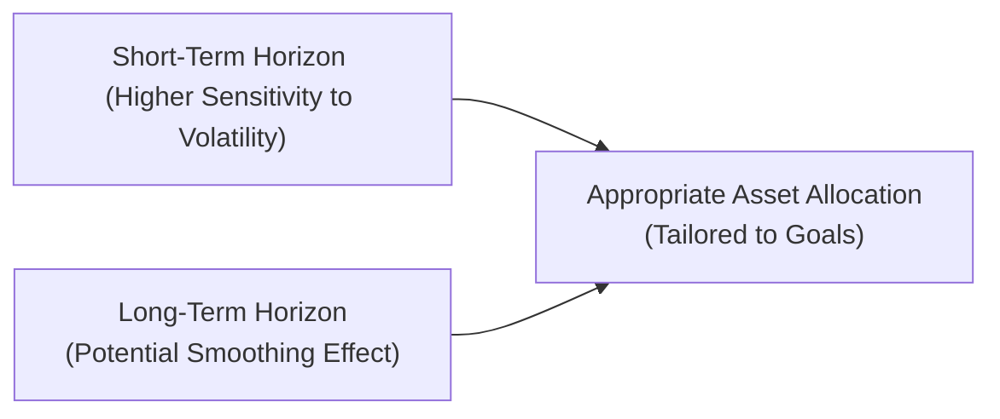

## Introduction

I remember the first time I tried to save for a near-term goal. The markets were volatile, and every tiny dip looked catastrophic. But when I started putting money aside for retirement—a decades-long horizon—I noticed I could handle short-term swings more calmly. This shift in perspective is at the heart of how time horizon affects our perception of risk and our expected (and realized) returns. Time horizon is more than just a number of years on a calendar; it’s a fundamental lens that completely changes how we measure, interpret, and manage risk in a portfolio.

In portfolio management, investors typically divide themselves into “short-term” and “long-term” camps. However, as we will explore, the nuance goes far beyond these two labels. As soon as you define your time horizon, you’re essentially framing the potential path your portfolio might take and how likely you are to achieve your intended goals. Let’s walk through the nature of time horizon, how it interacts with risk, how path dependency can complicate our lovely assumptions, and why a retiree’s approach to risk might differ significantly from that of an endowment fund.

## Why Time Horizon Matters

Time horizon, simply put, is the length of time over which an investment is expected to be held. However, in practice, defining that horizon can be tricky. Many of us have multiple goals that compete for the same pot of capital. For instance, a 45-year-old might be investing for retirement (20+ years away) but could also be setting aside funds for a child’s education (10 years away) or saving to buy a home (5 years away). Each of these goals has a distinct time horizon—and that means each goal has a distinct risk profile.

• Shorter horizons: In a shorter time frame, markets can be downright unpredictable (or so it feels). Volatility often appears to cluster, and one poor market spell can take a significant bite out of returns.  
• Longer horizons: The hope is that positive returns outweigh the negative episodes over time, potentially smoothing the ride. Yet there’s no absolute guarantee, and large drawdowns, especially early in the investment period, can affect a portfolio for years to come.

### Short-Term vs. Long-Term Perceptions

Short-term investors—particularly those managing daily or even intraday portfolios—focus on immediate price movements, market sentiment, and factors driving near-term volatility. These changes can feel dramatic. The S&P 500, for instance, might fluctuate more in a week than some would anticipate—it’s not uncommon.

Long-term investors, including pension funds or endowments, can diversify extensively and ride out cyclical swings, trusting that markets exhibit upward drift over long periods, reflecting general economic growth. However, they are not immune to risk. Large drawdowns, especially if they occur early in the investment period or just before expected withdrawals, can derail projections substantially.

## Volatility and the Clustering Effect

A common refrain is that “volatility smooths out over the long run.” But, how exactly does that work? Consider the concept of “volatility clustering,” observed in financial time series: high-volatility days tend to be followed by high-volatility days, and low-volatility days by low-volatility days. This phenomenon can create periods of sharp, gut-wrenching swings in asset prices followed by calm, more placid market conditions.

In the short term, volatility clustering can make returns extremely unpredictable from one trading session to the next, or even from month to month. Over a longer horizon, it all might average out to a more stable, expected statistical measure. Yet if those large negative swings happen to come at the worst possible time (like right before retirement withdrawals), the portfolio’s final value remains impacted—even if the average annual volatility metric looks “reasonable” over 20 years.

### Real-World Illustration

Imagine an investor who puts $1,000 into a portfolio with an expected annual return of 6% and an annualized volatility of 15%. That volatility is not spread evenly in tiny increments each day; sometimes entire monthly returns can be significantly positive or negative. If you only need that money two years from now and it suddenly plunges 15% under short-term market stress, the horizon to recover might be too short. On the other hand, if your horizon is 30 years, you might ride out that dip more comfortably, anticipating that eventual market recoveries could bring you back to trend—or beyond.

But even over 30 years, a 30% drawdown in the early years can leave your portfolio compounding from a much lower base, so the impact persists.

## Navigating Path Dependency

Path dependency means that the final outcome is not just about the average return but also about the sequence in which returns occur. If you have a portfolio where you’re systematically withdrawing funds—say you’re retired and taking out living expenses each year—a drawdown early in your retirement can have a more significant impact than the same drawdown later on.

When returns happen is often as important as what returns happen. A 20% drop in the first two years of retirement can be devastating because subsequent withdrawals happen when the portfolio value is already diminished. That’s the core of path dependency.

### Example of Sequence Risk

Think of a portfolio starting with $1 million. Suppose it’s subject to the following annual returns, but the owner withdraws $50,000 each year for living expenses:

• Year 1: –10%  
• Year 2: +15%  
• Year 3: +7%  
• Year 4: –5%  
• Year 5: +10%  

Compare that sequence with the same returns but in a different order. Even though the average annual return might look the same on paper (about 3.4% in either sequence), the final portfolio value can differ significantly based on when the negative returns hit and when the withdrawals occur.

## Tailoring Risk and Asset Allocation to Time Horizon

Portfolio managers typically examine a client’s time horizon to determine an appropriate asset allocation mix—stocks, bonds, alternatives, or cash—and to clarify how volatility or drawdowns might affect the investor. A person nearing retirement age usually can’t withstand prolonged volatility or severe drawdowns, so they might shift to more stable assets. An endowment serving a university with, say, a “perpetual” horizon might take on more equity risk, hoping to capture higher long-term returns.

### Strategic Considerations

• Liquidity Needs: Short-term horizons require more liquid, lower-volatility assets. Think of a money market fund or short-duration bonds (though with current yields and credit risk carefully considered).  
• Growth Objectives: Longer horizons can accommodate equities, real estate, and other growth-oriented assets, allowing time to recover from market downturns.  
• Diversification: Even if you’re a long-term investor, diversification can help—because significant sector downturns or business cycle collapses can delay portfolio recovery for years.

## The Math of Holding Period Returns

It’s useful to think mathematically about how time horizon affects the evaluation of returns. Suppose you have an asset whose returns each year are \\( r_1, r_2, \ldots, r_T \\). The cumulative return over \\( T \\) years is:


(1 + r_1) \times (1 + r_2) \times \cdots \times (1 + r_T) - 1.


The average geometric return per year is:


\Bigl[\prod_{t=1}^T (1 + r_t)\Bigr]^{\frac{1}{T}} - 1.


Oddly enough, a few rough patches in the early years can shrink the product significantly, dragging down your eventual compound return. Even if the later years offer great returns, they apply to a smaller principal, underscoring the significance of path dependency.

## Python Simulation Example

Here’s a simple Python snippet (a bit contrived, but helpful) that simulates portfolio values under different sequences of returns for a short (5-year) horizon vs. a longer (30-year) horizon. It’s worth noting how random sequences of returns create varied final portfolio outcomes.

```python
import numpy as np

np.random.seed(42)

start_value = 100000
years_short = 5
years_long = 30
annual_return_mean = 0.06
annual_return_std = 0.15  # approximate daily volatility annualized

def simulate_portfolio_value(initial_value, mean, std_dev, years):
    values = [initial_value]
    for year in range(years):
        # Simulate annual return
        rand_return = np.random.normal(mean, std_dev)
        new_value = values[-1] * (1 + rand_return)
        values.append(new_value)
    return values

short_horizon_values = simulate_portfolio_value(start_value, annual_return_mean, annual_return_std, years_short)
long_horizon_values  = simulate_portfolio_value(start_value, annual_return_mean, annual_return_std, years_long)

print("Short Horizon Final Value: ", short_horizon_values[-1])
print("Long Horizon Final Value: ", long_horizon_values[-1])
```

If you run this code multiple times, you’ll see how final values differ for short vs. long horizons, often more dramatically for the longer horizon if there are large negative shocks early on. Of course, you might also see the long horizon offering a recovery opportunity, depending on the sequence.

## Diagram: Time Horizons and Their Influence

Below is a simple Mermaid diagram illustrating how short-term and long-term horizons flow into the notion of matching asset allocation with investor goals:



For short-term horizons, a single market shock can loom large. For long-term horizons, the market shock might get somewhat smoothed over time (assuming eventual recoveries), yet large drawdowns still have the potential to impede growth, especially when they strike early in the timeline or if there are ongoing withdrawals.

## Client Examples

### Retiree Nearing Distribution Phase

Picture someone at age 63. They anticipate retiring in two years. They have substantial equity holdings. If a negative shock hits, they may need to delay retirement or accept a smaller nest egg, because they don’t have enough time to replenish losses. A portfolio manager might suggest holding more high-quality bonds or even considering annuities (depending on the client’s preference and risk appetite) to mitigate the impact of a market meltdown right before retirement.

### Endowment with an Indefinite Horizon

University or foundation endowments intend to last forever. The annual distribution might be something like 4–5% of the portfolio’s moving average. Because of their perpetual lifespan, these funds can usually tolerate more equity risk (and the associated volatility) in pursuit of higher returns. Yet path dependency remains relevant if the distribution is a fixed percentage each year. Sharp declines in portfolio value during a recession can reduce the absolute dollar amount available for institutional needs or scholarships.

## Large Drawdowns and Lasting Effects

There’s an old adage: “Losses hurt more than gains help.” A 50% loss requires a subsequent 100% gain to get back to where you started. For example, say you invest $100, and it drops to $50 in a downturn, you now need your $50 to double just to recover the original $100. This effect is magnified if you’re also making withdrawals or if you have a rigid liability schedule. Over a short-term horizon, you might not see any chance to recoup these losses before it’s too late. Over a longer horizon, there’s more of a chance—though not a certainty.

## Volatility Smoothing? Caveats Apply

While average annual volatility for an asset class may look moderate when measured over a few decades, the markets do not dish out that volatility in a neat, predictable pattern. The Great Financial Crisis of 2008–2009, the dot-com bubble burst of 2000–2002, and even the global pandemic shock in 2020 (and the subsequent market reactions) highlight how extraordinary events can erupt suddenly.

Moreover, smoothed historical data can be misleading: consider survivorship bias and the equity risk premium puzzle, identified by scholars like Mehra and Prescott. The question remains: how do we reconcile the historical record of high equity returns with forward-looking estimates that might be lower or more uncertain?

## Practical Management Strategies

• **Segmentation:** Some advisors practice “asset-liability matching” or segment a portfolio according to short-term, medium-term, and long-term goals, each with its own asset allocation.  
• **Glide Path Strategies:** For individuals, especially those with retirement goals, “glide paths” gradually decrease equity exposure as the target date approaches. This is typical in target-date funds, popular in certain pension or retirement accounts.  
• **Dynamic Asset Allocation:** Long-term investors, such as endowments, may shift exposures if valuations or macroeconomic conditions suggest that certain asset classes are over- or undervalued.  
• **Rebalancing:** This is critical but can be tricky. Rebalancing forces a disciplined process—buy low, sell high—provided you adhere to a schedule or trigger-based approach that suits your horizon.

## Common Pitfalls

1. **Oversimplifying Risk**: Looking solely at average annual returns can mask severe short-term swings and path dependency.  
2. **Failing to Plan for Liquidity**: Even a great long-term strategy can go awry if liquidity constraints force asset sales at unfavorable prices.  
3. **Ignoring Sequence of Returns**: Especially for retirees or any scenario with ongoing withdrawals, ignoring the order of returns can be disastrous.  
4. **Overconfidence in “Mean Reversion”**: While markets may revert to long-term averages over decades, the short term can see extended deviations (cue extended bull or bear markets). Mean reversion might not occur quickly enough to help a short-horizon investor.  
5. **User Behavior**: Clients or even professional managers can get jittery during short-term drawdowns, panic-selling at inopportune times. This emotional aspect interacts heavily with time horizon.

## Ethical and Fiduciary Considerations

Fiduciaries have to consider the client’s time horizon carefully. Placing a retiree’s capital into an overly aggressive asset allocation may be profitable if markets surge, but ethically and professionally, the real question is: does it align with the client’s risk tolerance and time horizon? Similarly, an endowment manager must answer to multiple stakeholders, ensuring the portfolio can sustain intergenerational spending while preserving principal for future beneficiaries.

## Additional Insights from Behavioral Finance

Behavioral finance teaches us that clients may perceive risk differently depending on the time horizon. Loss aversion can be more intense in short-term contexts, where every perceived loss is nerve-wracking. Experienced managers will factor these emotional responses into communications and planning to help keep clients committed to a well-structured strategy aligned with their time horizons.

## Exam Tips: Time Horizon in Practice

• In exam scenarios, carefully evaluate the individual or institution’s objectives, constraints, and time horizon. The time horizon might be multi-staged (long until retirement, then short after retirement begins).  
• Expect questions that test your understanding of sequence risk, path dependency, and the effect of withdrawals.  
• Be ready to explore the interplay between portfolio decisions (like rebalancing or changing asset allocation) and how those decisions might differ across short and long horizons.  
• You may be asked to identify the most suitable asset classes or strategies for a given time horizon and risk tolerance.

## Conclusion

Time horizon shapes every aspect of portfolio management. It informs the optimal asset allocation, clarifies how much volatility you can truly tolerate, influences the impact of path dependency, and guides your response to market shocks. If you’re focusing on a short goal—maybe a big purchase next year—you probably can’t ride a wave of volatility. On the other hand, if you’re a 25-year-old saving for retirement (and you have the emotional fortitude!), you might endure short-term swings to capture higher returns in the long run.

Ultimately, the conversation around time horizon never exists in isolation; it interacts with risk tolerance, liquidity needs, and the investor’s broader life circumstances. Understanding this interplay is key not just for passing an exam, but for delivering sound, empathetic investment advice in practice.

## References

• CFA Institute, Historical Holding Period Returns and Portfolio Management Readings.  
• Mehra, R., & Prescott, E. C. (1985). “The Equity Premium: A Puzzle.” Journal of Monetary Economics.  
• Basic coverage of financial time series volatility clustering in advanced econometrics texts, such as Engle’s ARCH/GARCH frameworks.  
• Behavioral finance discussions in the CFA® curriculum and various academic research articles related to time horizon and investor behavior.

## Test Your Knowledge: Time Horizon and Portfolio Outcomes



### Which statement best explains why a retiree’s time horizon is often considered short term?

- [ ] Retirees typically invest only in bonds.  
- [ ] Retirees have no goal of preserving capital for future generations.  
- [x] Retirees often need regular withdrawals soon, so market downturns can severely impact them.  
- [ ] Retirees do not face inflation risks.  

> **Explanation:** A retiree’s focus is on drawing income quickly, so losses are more immediately harmful than they might be for investors with longer horizons.

### How does a large drawdown early in an investment period affect a long-term portfolio?

- [x] It reduces the future compounding base and can permanently lower final wealth.  
- [ ] It has no significant impact, as markets will always revert to the mean.  
- [ ] It only matters if the portfolio is heavily leveraged.  
- [ ] Potential losses are fully offset by volatility smoothing.  

> **Explanation:** A steep early loss shrinks the principal, reducing the base for future compounding, thus lowering final value despite subsequent gains.

### What is path dependency in the context of portfolio returns?

- [ ] The idea that asset prices always follow a random walk.  
- [x] The outcome depends on the sequence and timing of returns, not just the overall average.  
- [ ] The principle that bonds and stocks always move in opposite directions.  
- [ ] A method of rebalancing portfolios based on standard deviation triggers.  

> **Explanation:** Path dependency emphasizes that the specific order in which returns occur can affect the portfolio’s final outcome, especially when withdrawals or contributions happen along the way.

### A short-term investor with a high liquidity need is most likely to pick which type of asset?

- [ ] Long-dated corporate bonds.  
- [ ] Real estate investment trusts (REITs).  
- [x] Treasury bills or high-quality money market instruments.  
- [ ] A large allocation to high-volatility stocks.  

> **Explanation:** Treasury bills and money market instruments are generally viewed as low-volatility, highly liquid investments suitable for meeting short-term goals.

### Which factor most strongly differentiates endowment investing from individual retirement investing?

- [ ] Endowments never experience volatility.  
- [x] Endowments often have an indefinite or perpetual time horizon.  
- [ ] Endowments must invest only in large-cap equities.  
- [ ] Endowments have no accountability to stakeholders.  

> **Explanation:** Endowments typically assume a perpetual horizon and can often afford to tolerate more volatility to capture higher long-term returns.

### How does sequence of returns risk affect retirees differently than endowments?

- [ ] It affects both groups identically.  
- [ ] Retirees can ignore market fluctuations.  
- [x] Retirees draw down assets more rapidly, meaning early losses can be deadly to final wealth.  
- [ ] Endowments generally have no need to invest for growth.  

> **Explanation:** Because retirees are often making steady withdrawals, early losses reduce principal precisely when distributions continue, compounding negative impacts.

### Which of the following is most likely a pitfall in assessing long-term performance using only annualized returns?

- [x] Neglecting the effect of path dependency.  
- [ ] Overstating the role of standard deviation.  
- [ ] Failing to account for annual risk-free returns.  
- [ ] Overemphasizing growth assets.  

> **Explanation:** Although annualized returns show average performance, they don’t highlight the damaging effects of negative returns hitting at inopportune times.

### When an investor references “volatility clustering,” they are most likely describing:

- [ ] The idea that risk is always highest early in the morning.  
- [x] How high-volatility days tend to follow high-volatility days, and low-volatility days follow low-volatility days.  
- [ ] The reversion of bond yields toward a mean.  
- [ ] A phenomenon only observable in currencies.  

> **Explanation:** Volatility clustering is a well-documented feature in financial markets where volatile days (or periods) tend to cluster together.

### Which strategy is an example of targeting different time horizons for different needs?

- [ ] Putting all assets in one single equity mutual fund.  
- [ ] Avoiding dynamic asset allocation.  
- [x] Segmen tation of a portfolio into multiple buckets (short, medium, long).  
- [ ] Maintaining constant equity exposure regardless of age.  

> **Explanation:** Bucket strategies or segmentation allocate different portions of the portfolio to meet short-, medium-, and long-term needs separately.

### True or False: Mean reversion always ensures that a short-term decline will be offset by long-term gains.

- [x] True  
- [ ] False  

> **Explanation:** While many markets do exhibit tendencies toward mean reversion over extended periods, the offset is not guaranteed for every investment horizon or sequence of returns. In reality, “always” is too strong a word—mean reversion trends are not guaranteed to play out in every scenario or within a particular time frame.


