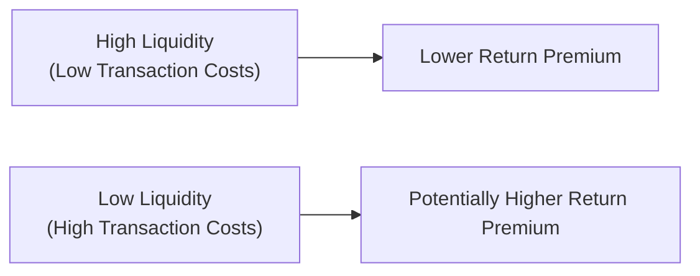

## Introduction
Liquidity is one of those underappreciated aspects of portfolio construction—until you really need it, of course. Many times, we think about the risk and return trade-off purely in terms of volatility and expected returns. But liquidity risk looms as a key dimension to factor in when deciding on an allocation to, say, a frontier market stock or a private equity fund with a multi-year lock-up. In this section, we’ll dive into the ways liquidity (or the lack thereof) can shape your overall portfolio risk profile, why certain investments carry liquidity premiums, and how you can manage liquidity more proactively.

I can’t help but remember a personal situation I once faced (a few years back) when I had some money tied up in a private partnership. The partnership promised potentially higher returns, but it required a lock-up of three years. Well, everything was fine until...a sudden family emergency demanded immediate cash. I realized that my capital was essentially stuck, and any early redemption attempt would result in a huge discount—not fun at all. That experience taught me a big lesson about the importance of balancing return potential with access to your funds when you need them.

## Defining Liquidity Risk
Liquidity risk is essentially the risk that you can’t buy or sell an asset quickly at (or near) its prevailing market price. In more formal terms, it’s the potential cost or inability to exit an investment promptly at a fair price. So if you hold a thinly traded bond or a private equity stake, you might face a large price concession—or, in extreme cases, no takers at all. This can be especially painful if you need to raise cash in a hurry.

### Market Depth
A key element of liquidity is market depth, which refers to a market’s ability to handle large transactions without significantly moving the price. In a deep market, you can typically trade big blocks of shares or large notional amounts of bonds with minimal price impact. On the flip side, if you invest in a niche sector or a small frontier market, even modest trades can trigger big price swings.

### Lock-up Periods
Lock-up periods often come into play with hedge funds, private equity funds, and some real estate vehicles. These periods restrict your ability to liquidate your holdings for a designated timeframe. The advantage, presumably, is that it provides the manager with stable capital to pursue strategies that might yield higher returns. But if you find yourself in a pinch for cash mid-lock-up, you might be forced to sell your stake in an illiquid secondary market at a substantial discount.

## The Liquidity-Return Trade-off
A standard principle in capital markets is that less liquid assets often, though not always, offer higher expected returns as compensation for the higher risk. This extra kick to returns is sometimes called a liquidity premium—basically, an additional yield or return that investors collectively demand for tying up their capital in an asset that’s harder to exit.

Below is a short Mermaid diagram to visualize this relationship:



This diagram is a simplified representation, of course. There’s no guarantee that an illiquid investment will deliver higher returns, but in general markets, you can expect some extra yield or alpha from holding something that’s not as easily tradable.

### A Quick Look at the Amihud Illiquidity Measure
Academics often quantify the degree of illiquidity using formulas. One famous approach is the Amihud illiquidity measure, which captures how much price moves relative to trading volume. Some forms of it are expressed as:


\text{ILLIQ}_t = \frac{| R_t |}{\text{Volume}_t}


where \\( R_t \\) is the asset’s return on day \\( t \\) (absolute value) and \\(\text{Volume}_t\\) is the daily trading volume in currency units. A higher ratio might indicate a higher price impact from trades, implying lower liquidity.

## Less Liquid Assets in Portfolio Construction
Less liquid assets—like private equity, infrastructure, real estate, and certain classes of hedge funds—can be appealing because they promise diversification and, often, a higher return potential. For instance, real estate has historically provided stable returns in many markets, plus a steady stream of rental income. But if you need to reallocate your money quickly—maybe because you see an opportunity in equities—selling a property or unwinding a private equity position is not as straightforward as offloading a large-cap stock.

### An Illustrative Table of Asset Classes and Their Typical Liquidity

| Asset Class               | Typical Liquidity Level     | General Lock-Up or Redemption Constraints             |
|---------------------------|-----------------------------|--------------------------------------------------------|
| Government Bonds (Developed Markets) | Very high | Daily liquidity; minimal constraints                   |
| Large-Cap Equities        | High                        | Daily liquidity; minimal constraints                   |
| Corporate Bonds           | Moderate                    | Some issues less liquid depending on credit quality    |
| Private Equity            | Low                         | Multi-year lock-ups, periodic capital calls            |
| Real Estate (Direct)      | Very low                    | Potentially months or years to sell property           |
| Hedge Funds (varies)      | Low to moderate             | Lock-up periods, often quarterly or annual redemptions |
| Commodities (Futures)     | Generally high              | Most well-traded futures have decent liquidity         |

These categories aren’t set in stone—liquidity can vary significantly within each class. But it gives you a flavor of how they line up.

## Real-World Examples of Liquidity Crises
Liquidity crises surface when everyone suddenly rushes to the exits, but buyers are nowhere in sight. The 2008 global financial crisis is a classic example: markets for mortgage-backed securities (MBS) froze almost overnight, forcing holders to mark down assets dramatically. Even seasoned institutions like major banks couldn’t offload MBS at anything close to “fair” value. This meltdown magnified downside risk because investors had no choice but to accept huge price discounts if they wanted to liquidate. Not only did this erode capital, but it also triggered margin calls and forced liquidations in other parts of their portfolios.

I still remember hearing stories from fellow analysts who saw AAA-rated tranches trading at 70 or even 60 cents on the dollar—prices that would have been unthinkable just a year prior. This phenomenon underscored how, in times of stress, the relationship between fundamentals and actual transaction prices can break down completely when liquidity dries up.

## How Illiquid Positions Can Magnify Downside Risk
When assets become illiquid, price discovery can become sporadic, and forced sellers might get stuck unloading assets at fire-sale prices. If leveraged investors start receiving margin calls, they have no choice but to sell whatever they can. But if the entire market is trying to do that, it can trigger a vicious cycle of price collapses.

Picture a hedge fund that holds a big position in an emerging market bond that’s normally not traded in large volumes. In a crisis scenario, even a modest sell order might tank the bond’s price, quickly dragging down the hedge fund’s net asset value (NAV). This can cause more margin calls, leading to more forced selling—a brutal feedback loop.

## Best Practices for Managing Liquidity
Managing liquidity risk doesn’t mean you should avoid illiquid investments altogether. Often, these can provide attractive returns or diversification. But you probably want to set up your portfolio in a way that you can handle short-term liquidity needs or volatility:

- Maintain Adequate Cash Reserves: Especially if you anticipate upcoming cash outflows—like tuition fees, business expenses, or personal emergencies—think about having a cash buffer or a short-term liquid investment that can be sold quickly without major price concessions.
- Ladder Maturities in Fixed Income: If you hold a bond portfolio, one best practice is to “ladder” maturities—i.e., spread out bond maturities over time. This approach ensures that you’ll have bonds maturing at regular intervals, so if you suddenly need cash, there’s a good chance something will come due without forcing a sale at a discount.
- Diversify by Liquidity Profile: Instead of putting all your eggs in a private equity basket or tying up everything in long-term real estate, consider balancing out with highly liquid assets. That way, if you need to rebalance or meet a short-term margin requirement, you can tap into the liquid portion of your portfolio.
- Match Investments with Time Horizon: If you’re investing in something that has a multi-year lock-up, be sure your capital is genuinely “long-term” money. This might seem obvious, but you’d be surprised how often people forget that they’ll need that money in, say, two years to buy a new home or pay for a major life event.
- Stay Informed on Fund Redemption Terms: Many hedge funds allow quarterly or annual redemptions, but they often come with notice periods—like you have to tell them 90 days before you want out. Watch for gates (which limit total withdrawals when redemptions exceed a certain threshold) and rolling lock-ups.

## Incorporating Liquidity into Portfolio Risk Management
When building or rebalancing portfolios—particularly in the context of strategic asset allocation (discussed in Section 4.4 on Asset Class Definitions and Strategic Asset Allocation)—investors typically gauge the liquidity of each asset class. Liquidity constraints can affect your portfolio’s ability to adapt to market shifts or reallocate capital in a timely manner:

- Scenario Analysis and Stress Testing: It’s a good idea to incorporate liquidity stress tests. For instance, you can ask: “What if credit markets seize up again, and spreads blow out 300 basis points? Which positions will be hardest to exit, and how would that impact our portfolio’s overall solvency?”
- Rebalancing Costs: Higher transaction costs in illiquid markets can make rebalancing expensive. You might want to set slightly wider rebalancing bands for less liquid assets, to avoid incurring massive transaction costs every time a position drifts away from your target allocation.
- Liquidity Coverage Ratios: Some large institutions actually track the ratio of liquid to illiquid assets in a portfolio. If that ratio goes below a certain threshold, it triggers an internal review or rebalancing procedure to maintain a minimum target for liquidity.

## A Quick Python Example to Illustrate Liquidity Impacts on Returns

Below is a contrived snippet of Python code that demonstrates how returns might be impacted by a “liquidity shock factor.” Suppose we start with a list of assets and their baseline returns, and we then impose a liquidity shock that reduces returns by a certain percentage if the asset is illiquid:

```python
import pandas as pd

data = {
    'Asset': ['Large-Cap Equity', 'Private Equity', 'Govt Bond', 'Real Estate'],
    'Avg_Return': [0.08, 0.15, 0.03, 0.10],     # Suppose these are annual returns
    'Illiquidity_Score': [1, 5, 1, 4]          # 1 = highly liquid, 5 = highly illiquid
}

df = pd.DataFrame(data)

def apply_liquidity_shock(row):
    if row['Illiquidity_Score'] > 1:
        # Example: reduce returns by 2% for each illiquidity level above 1
        shock_penalty = 0.02 * (row['Illiquidity_Score'] - 1)
        return row['Avg_Return'] - shock_penalty
    else:
        return row['Avg_Return']

df['Adjusted_Return'] = df.apply(apply_liquidity_shock, axis=1)

print(df)
```

This simplistic illustration is intended to show how you can penalize less liquid assets’ expected returns if you’re factoring in additional intangible costs or higher required compensation for illiquidity. Obviously, in the real world, the modeling can be more nuanced and robust.

## Examples of Liquidity Management for Institutions
You’ll typically see big institutional investors, like pension funds or endowments, setting policies to manage portfolio-level liquidity. They might invest a certain percentage in “purely liquid” instruments—like Treasury bills or large-cap equities—while allowing a specific slice, say 20%, to be in private equity, real estate, or other illiquid alternatives. Then they track that ratio over time, ensuring they can meet obligations such as benefit payments or capital calls without having to sell illiquid assets at an inopportune time.

## Lessons from Past Crises for Liquidity Management
From the 2008 crisis to the more recent episodes of market stress (like the volatility seen in early 2020), the big takeaway is that markets can become illiquid very quickly when panic spreads. The price for liquidity in those stressed markets jumps dramatically—and it can scramble your carefully laid plans if you haven’t built in robust liquidity management.

One best practice: regularly model a “worst-case scenario” where multiple asset classes lose liquidity simultaneously. That might feel grim, but it’s better to plan for the worst and not need it, than to be caught off guard.

## Exam Tips and Common Pitfalls
• Don’t underestimate the cost of illiquidity: On the exam (and in real life!), you’ll need to consider the frictional costs of trading illiquid instruments.  
• Watch out for forced selling under margin constraints: If a question scenario includes leverage, think about liquidity risk intensifying.  
• Connect liquidity risk to rebalancing strategy: In essay questions, mention how illiquid assets might cause you to adopt less frequent rebalancing or hold more liquid reserves.  
• Be mindful of lock-up periods and notice requirements: If a case vignette mentions a private equity or hedge fund holding, highlight how that affects short-term capital needs.

## Conclusion
Liquidity may not be the hottest topic in finance textbooks, but it plays a central role in shaping portfolio outcomes—especially in times of stress. Balancing the pursuit of higher returns from illiquid investments with the need for readily available funds is a juggling act. Maintain a thoughtful liquidity buffer, ladder fixed income maturities, and be honest with yourself about how soon you might need those funds. By doing so, you’ll have a portfolio that’s more robust against unforeseen shocks and better equipped for strategic rebalancing opportunities.

## References
• Amihud, Yakov. “Illiquidity and Stock Returns: Cross-Section and Time-Series Effects.” Journal of Financial Markets, 2002.  
• CFA Institute. (Various years). CFA Program Curriculum—selected readings on Liquidity Premiums and Market Microstructure.  
• Further reading: “Liquidity: How to Value Risk and Return in Illiquid Alternatives,” multiple academic and professional research archives.  


## Glossary
• Liquidity Risk: The potential cost or inability to exit an investment promptly at a fair price.  
• Market Depth: The market’s ability to sustain relatively large orders without significant impacts on price.  
• Lock-up Periods: A window of time in which investors cannot redeem or sell shares (common in hedge funds or private equity).


## Test Your Knowledge: Impact of Liquidity on Asset Class Risk



### Which of the following best defines liquidity risk?
- [ ] The risk of a portfolio losing value due to foreign currency fluctuations.
- [x] The risk that an investor may be unable to buy or sell an asset quickly enough without a significant price concession.
- [ ] The risk that dividends will decrease over time.
- [ ] The risk of corporate bonds defaulting.

> **Explanation:** Liquidity risk specifically addresses the potential challenge of converting an asset into cash at a fair market price within a short timeframe.

### What is “market depth” in the context of liquidity?
- [ ] The day-to-day variability of asset returns.
- [ ] A measure of volatility in leveraged positions.
- [x] The market’s capacity to handle large trades without significantly moving the asset’s price.
- [ ] The length of time you must hold an asset before a capital gains tax applies.

> **Explanation:** Market depth describes how much volume a market can absorb without substantial price impacts.

### Which asset class is typically considered to have the highest liquidity?
- [x] Government bonds in developed markets.
- [ ] Private equity funds.
- [ ] Direct real estate holdings.
- [ ] Frontier market equities.

> **Explanation:** Government bonds in most developed markets typically see high daily trading volume, making them more liquid than other asset classes listed.

### What is a lock-up period most commonly associated with?
- [ ] Day trading of penny stocks.
- [ ] Passive index ETF investments.
- [x] Hedge funds or private equity funds.
- [ ] High-frequency trading strategies.

> **Explanation:** Hedge funds and private equity funds often require investors to commit their capital for a certain lock-up period before they can redeem.

### Which of the following is a best practice for managing liquidity risk in a bond portfolio?
- [ ] Concentrate all bonds in a single maturity date for convenience.
- [ ] Only invest in junk bonds for higher yield.
- [ ] Keep primarily floating-rate notes that never mature.
- [x] Ladder bond maturities so that they mature at staggered intervals.

> **Explanation:** Laddering maturities ensures a steady stream of bonds coming due, improving liquidity.

### In a severe liquidity crisis, how can illiquid positions magnify downside risk in a portfolio?
- [ ] They become risk-free assets that maintain value.
- [x] They may require significant price concessions if forced to sell.
- [ ] Illiquid positions typically become the most liquid assets to offload first.
- [ ] They are unaffected by broader market conditions.

> **Explanation:** Illiquid assets can see dramatic price declines if many sellers try to exit at once, resulting in large losses when forced to liquidate.

### When might an investor require a “liquidity premium”?
- [x] When an investment is thinly traded and hard to exit.
- [ ] When an investment has very high daily trading volume.
- [x] When assets have long lock-up periods or redemption gates.
- [ ] When assets have extremely short durations.

> **Explanation:** A liquidity premium compensates for the inconvenience or additional risk associated with being unable to quickly sell an asset.

### During the 2008 financial crisis, how did liquidity issues affect mortgage-backed securities (MBS)?
- [x] Investors found it extremely difficult to sell MBS at fair prices, forcing them to accept large discounts.
- [ ] MBS were unaffected by the crisis and remained highly liquid throughout the period.
- [ ] MBS saw their prices increase due to increased demand.
- [ ] The government purchased all MBS at par value immediately.

> **Explanation:** The MBS market dried up, resulting in massive price drops and margin calls for institutions forced to sell.

### Which statement is true regarding liquidity risk and leverage?
- [x] Leverage can amplify liquidity risk because margin calls may force rapid asset sales.
- [ ] Leverage reduces the need for liquid assets, as borrowed funds always remain available.
- [ ] Leveraged portfolios never face liquidity stress.
- [ ] Higher leverage automatically lowers required yields on illiquid assets.

> **Explanation:** When highly leveraged, even moderate drops in asset values can trigger margin calls, forcing a portfolio to sell into potentially illiquid markets.

### A “liquidity buffer” in a portfolio typically:
- [x] Involves holding readily marketable securities or cash to meet short-term cash needs.
- [ ] Requires the use of complex derivatives to increase gains.
- [ ] Reduces the value of all investments automatically.
- [ ] Only applies to long-term real estate holdings.

> **Explanation:** A liquidity buffer is generally a cushion of easily sold assets or cash set aside to handle unexpected outflows or market dislocations.


