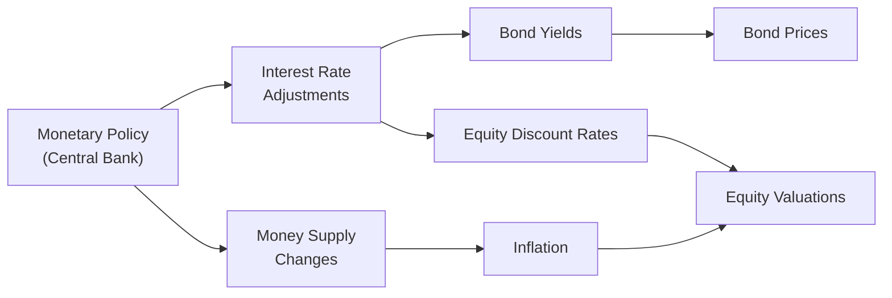

## Introduction
Macroeconomic forces have a way of sneaking up on all of us. I remember having a friendly debate with a colleague about how a slight uptick in inflation could trigger waves in the bond market or nudge the stock market in surprising directions. While you can’t keep an eye on every economic release 24/7 (that might drive you nuts!), understanding the major macro variables—such as GDP growth, inflation, interest rates, and exchange rates—becomes crucial for forecasting asset prices in a portfolio context.

So, how do these variables actually sway equities, bonds, real estate, or that edgy new commodity you might be analyzing? Here, we’ll dip into the nuts and bolts: we’ll look at how these macro factors exert their influence and how you can build a framework to interpret them. It’s not just about memorizing facts for an exam; it’s also about developing an almost “sixth sense” for perceiving how the economy can shape your portfolio performance over time.

## Key Macroeconomic Variables
If you skim back to prior sections (e.g., “2.1 Characteristics of Major Asset Classes”), you’ll see we’ve been discussing how assets differ in risk, return potential, and liquidity. Now, let’s overlay the big macro drivers on those assets and see what happens.

### GDP Growth
Gross Domestic Product (GDP) growth is often viewed as the pulse of an economy. When GDP is rolling along, corporate earnings may rise (especially if the growth is broad-based), and employment tends to climb. This typically fosters a supportive environment for equity prices. Imagine a scenario where your local economy’s output is booming: people are buying more, corporate revenues go up, and eventually, equity values often follow. However, strong GDP growth can also come with downsides like rising interest rates if policymakers want to keep inflation in check.

A cautionary note: it’s easy to get excited about growth. But watch out for cyclical sectors like consumer durables or industrials that might roar ahead when GDP is surging, then slam on the brakes if a recession looms unexpectedly. Remember, the next downturn might arrive faster than you expect—and it can drastically shift the outlook for different asset classes.

### Inflation
Inflation is that persistent upward movement in general price levels for goods and services. It often creeps up quietly, but if you’ve ever seen double-digit inflation, you’ll know how quickly it can erode real returns. In a high-inflation environment, nominal returns might look impressive at first glance, but real returns (i.e., inflation-adjusted returns) can turn negative if price growth outpaces portfolio performance.

Inflation also connects directly to bond yields. As investors demand higher yields to offset the reduced purchasing power of future coupon payments, bond prices typically fall. Here’s a simple formula for real returns:


\text{Real Return} \approx \frac{1 + \text{Nominal Return}}{1 + \text{Inflation Rate}} - 1


That’s just a fancy way of saying: if inflation is high, your real returns might end up a lot lower than you expect. Equity markets, meanwhile, can be a bit more complex when it comes to inflation, since some companies can pass along higher costs to consumers, but others cannot. You might see equity valuations drop if inflation spikes enough to hurt corporate margins or push central banks into more aggressive policy tightening.

### Interest Rates
Interest rates are one of the most powerful pieces of the macroeconomic puzzle. A small hike can trickle through bond pricing, equity valuations, and currency exchange rates. For instance:
• Higher rates → Usually lead to lower bond prices, since newly issued bonds yield more competitive rates.  
• Higher rates → Also raise discount rates for equities, meaning future corporate cash flows are “discounted” more heavily, which can dampen stock valuations.  
• Higher rates → May attract capital from abroad, driving up the currency’s exchange rate if foreign investors wish to benefit from higher yields.

Let’s reflect on a personal anecdote. In my first job, I had to monitor how a single quarter-point change in a central bank’s policy rate could jolt the entire bond sector. I wondered: “How could 25 basis points matter so much?” Well, it does—bond markets are especially interest-rate sensitive, and that sensitivity can cascade into equity markets when changes in rates alter corporate borrowing costs and investor required returns.

### Currency Exchange Rates
Currencies might feel a bit intangible if you haven’t traded them before, but exchange rates deeply influence your global asset allocation. A strengthening currency can reduce returns on foreign investments when translated back into your home currency. This is known as currency risk. Conversely, a weak currency can amplify gains realized abroad if exchange rates move in your favor upon repatriation.

Geopolitical events, sudden capital flows, and interest rate differentials between countries are typically prime suspects behind currency volatility. You can hedge exchange rate risk using derivatives, but keep in mind that hedging introduces its own costs, complexities, and potential tracking errors. If you’d like a deeper look, see Chapter 10 where we unpack currency overlays and hedging strategies.

## How Macroeconomic Influences Transmit Into Asset Classes
It’s helpful to visualize how a single macro variable, such as monetary policy, can ripple across markets.

This diagram shows an overview of how interest rate changes can directly increase bond yields (thus lowering bond prices) and simultaneously alter equity valuations through discount rates. The money supply changes can stoke inflation if monetary policy is overly loose, creating an additional channel of influence on equities and fixed income.

## Inflationary Environments and Real vs. Nominal Returns
A crucial issue in high-inflation environments is the risk of misinterpreting returns. If your portfolio gains 8% nominally but inflation is 6%, your real return is only around 2%. In extreme cases, inflation can outpace nominal returns, yielding negative real returns. Real assets (like real estate or commodities) are sometimes considered partial hedges if they maintain intrinsic value in inflationary periods. But watch out for correlation flips—historically reliable inflation hedges don’t always behave as expected in every scenario, especially if demand drivers shift drastically.

## Interest Rate Movements and Bond Pricing
Bonds have an inverse relationship with interest rates. Conceptually, when interest rates go up, the present value of a bond’s fixed coupon and principal payments decreases, causing the bond’s price to drop. The standard pricing formula for a coupon bond looks like this:


\text{Bond Price} = \sum_{t=1}^{T} \frac{C_t}{(1 + r)^t} + \frac{F}{(1 + r)^T}


where \\( C_t \\) is the coupon payment, \\( F \\) is the face value (or par value) of the bond at maturity, and \\( r \\) is the yield (i.e., discount rate). If central banks hike rates, \\( r \\) moves up, compressing the bond price. Simple, right? Yet in a dynamic world, every revision of interest rates can produce micro and macro ripples—impacts on credit spreads, shifts in the yield curve, and even changes in the relative attractiveness of equities.

## Central Bank Policy, Fiscal Policy, and Geopolitical Events
Central banks and governments have some powerful levers to pull. Monetary policy sets short-term interest rates, influences money supply, and can also involve unconventional tools such as quantitative easing. Fiscal policy uses government spending and taxation to manage economic growth. Both can impact the risk appetite in markets.

Then you add in geopolitical events—things like political elections, trade disputes, or wars—and the markets can exhibit heightened volatility. An abrupt policy shift (for example, imposing new tariffs) can weigh heavily on certain export-heavy equities, while simultaneously yanking about currency exchange rates. You’ll want to keep an eye on the interplay between all these forces, because market participants tend to price in forward expectations rather than just reacting to immediate events.

## Analyzing Macroeconomic Data Releases
Because data is constantly flowing, constructing a framework to interpret new releases systematically is important. You might base your approach on:
• Yield Curve Analysis: Observe the shape of the curve—flat, steep, inverted—to derive signals about future economic activity.  
• Leading Economic Indicators: Metrics like building permits, new orders, and consumer confidence can forecast expansions or slowdowns.  
• Coincident and Lagging Indicators: Employment data, GDP, and corporate earnings might confirm where we are in the economic cycle.

A slow reading of GDP growth might push central bankers toward more accommodative policies, lowering interest rates to stimulate expansion. Meanwhile, a strong labor market reading might feed inflation fears. You’ll typically see prompt reactions in equity and bond markets, sometimes within seconds after data is published.

## Practical Example and Case Study
Consider the 2008 Global Financial Crisis. As GDP sank and unemployment soared, central banks worldwide slashed interest rates to near zero (and in some cases below zero) to spur lending and investment. Equity markets initially collapsed, but in the long run cheap money provided a floor (and eventually soared). Bond prices rose as yields plummeted. This event perfectly highlights the connection between macro policy, interest rates, and asset class returns.

Another example is the more recent COVID-19 pandemic era, which brought massive fiscal stimulus checks and highly accommodative monetary policies. This contributed to a spike in certain equity valuations, real estate booms in various regions, and concerns about eventual inflationary pressures.

## Best Practices and Common Pitfalls
• Keep an eye on real versus nominal returns. Focusing on nominal might blind you to inflation’s bite.  
• Watch for data revisions. The initial GDP estimate or inflation print can get revised later. Markets might have already moved, or you might need to rebalance after revised data.  
• Mind correlations. The relationships between asset classes can shift when macro conditions change drastically. A historically uncorrelated asset might suddenly become correlated under stress.  
• Avoid overreacting. Some data points are just noise. Use a structured approach to weigh each release’s importance, rather than chasing every headline.

## Conclusion and Exam Relevance
Understanding macroeconomic variables and their influence on different asset classes is a fundamental skill for any portfolio manager. In real-world practice (and in the CFA exams), you’ll benefit from a clear, consistent framework that connects GDP growth, inflation, interest rates, and currency exchange rates with return drivers. You’ll also need to incorporate these insights into your strategic and tactical asset allocations, and be prepared to interpret how shifting policies and events can reshape market valuations almost overnight.

When you approach exam questions, be prepared to interpret scenario-based prompts. They might give you an unexpected shift in monetary policy or a surge in inflation data, and you’ll need to figure out how that impacts, say, both equities and fixed income. Keep these broad macro relationships in mind: they’ll guide you on how to respond.

## Glossary
• GDP Growth: The expansion rate of a country’s economic output. High growth can support equities but may trigger rate hikes.  
• Inflation: The rate at which the general level of prices for goods and services rises, lowering purchasing power.  
• Monetary Policy: Central bank actions (setting interest rates, open market operations) to influence money supply and borrowing costs.  
• Fiscal Policy: Government decisions on spending and taxation that affect aggregate demand and economic growth.  

## References
• Mankiw, N. Gregory. “Macroeconomics.” Worth Publishers.  
• CFA Institute. “CFA Program Curriculum” (Macroeconomic Analysis in Investment Decisions).  

---

## Test Your Knowledge: Macroeconomic Factors and Asset Class Performance



### Which of the following statements best describes how rising inflation typically affects bond prices?

- [ ] Rising inflation reduces bond yield requirements.
- [ ] Rising inflation increases the present value of future bond coupons.
- [x] Rising inflation pushes yields higher, driving bond prices lower.
- [ ] Rising inflation does not affect nominal bond prices.

> **Explanation:** When inflation rises, investors demand higher yields to offset future purchasing power losses, which drives bond prices down.

### Which variable is most directly linked to the discount rate used in valuing equities?

- [ ] GDP growth
- [ ] Currency exchange rate
- [x] Interest rate
- [ ] Commodity prices

> **Explanation:** Equity valuations often rely on discounting future cash flows at a rate tied to market interest rates. When interest rates climb, the discount rate increases, placing downward pressure on present values.

### In a high-inflation environment, what is a key risk when focusing solely on nominal returns?

- [x] Real returns could be significantly lower or even negative.
- [ ] Nominal returns always overestimate real purchasing power gains.
- [ ] Inflation risk can be perfectly hedged by ignoring bond investment.
- [ ] Inflation has no impact on nominal returns.

> **Explanation:** If you focus only on nominal returns, you may ignore the erosion of purchasing power. Real returns account for inflation, revealing the actual gain or loss in wealth.

### A steepening yield curve is typically taken as an indication of:

- [x] Expectations of stronger economic growth and potentially higher interest rates in the future.
- [ ] An upcoming recession.
- [ ] Immediate corrective action by the central bank.
- [ ] An overnight rate locked by the central bank.

> **Explanation:** A steep yield curve often signals that investors expect stronger growth or higher inflation, resulting in higher longer-term interest rates relative to short-term rates.

### Which of the following scenarios best captures a potential result of expansionary fiscal policy?

- [x] Increasing government spending can raise GDP growth, potentially leading to higher interest rates over time.
- [ ] Increasing government spending always lowers inflation risks.
- [x] Expansionary fiscal policy can crowd out private investment if rates rise sharply.
- [ ] Commercial banks will automatically reduce lending rates.

> **Explanation:** While expansionary fiscal policy may stimulate economic growth, it can also push interest rates up, making borrowing more expensive in the private sector and potentially crowding out investment.

### Which of the following is true regarding currency exchange rates?

- [x] A strengthening home currency can reduce returns on foreign investments when translated back to the investor’s base currency.
- [ ] Currency risks have no relevance for long-term equity investors.
- [ ] Currencies only move in response to inflation announcements.
- [ ] Central bank actions do not influence exchange rates.

> **Explanation:** If the home currency appreciates, foreign returns shrink when converted. Multiple factors beyond inflation, such as interest rates and monetary policy, drive currency movements.

### If a central bank unexpectedly tightens monetary policy:

- [x] Bond prices generally fall because higher rates reduce bond valuations.
- [ ] Bond prices generally rise because investors chase fixed coupon payments.
- [x] Equity valuations can come under pressure due to higher discount rates.
- [ ] Currency typically falls as investors seek to avoid the tightening market.

> **Explanation:** Tighter monetary policy means higher interest rates, which drive down bond prices and raise discount rates for equities, hurting valuations. The currency often appreciates as investors are attracted by higher yields.

### An inverted yield curve is often viewed as:

- [x] A signal of economic recession.
- [ ] A guarantee of positive GDP growth in the next quarter.
- [ ] A situation where long-term rates are higher than short-term rates.
- [ ] An irrelevant metric for portfolio managers.

> **Explanation:** An inverted curve occurs when short-term rates exceed long-term rates and has historically been associated with impending economic downturns.

### Which of the following statements about inflation is correct?

- [x] Inflation causes the purchasing power of currency to decline.
- [ ] Inflation is always beneficial for bondholders.
- [ ] Inflation can be perfectly predicted using GDP growth rates.
- [ ] Inflation has no effect on equity valuations.

> **Explanation:** Inflation erodes the real purchasing power of money. It can harm bondholders by causing yields to rise (and prices to decline). Equity valuations could also be impacted if discount rates rise or if firms cannot pass on price increases.

### True or False: Central bank policies and geopolitical events can lead to asset price volatility.

- [x] True
- [ ] False

> **Explanation:** Central banks can directly influence interest rates and money supply, while geopolitical events create uncertainty. Both factors often spark volatility in bond, equity, and currency markets.


