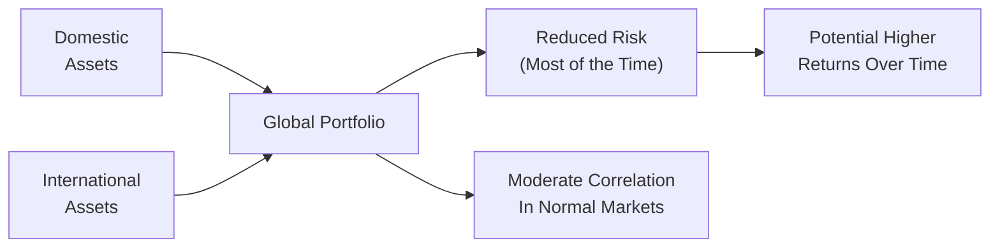
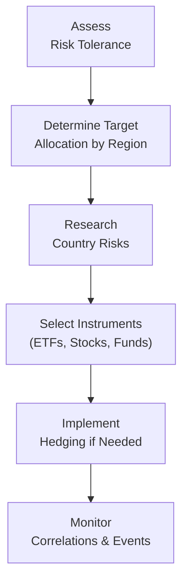

Global diversification is one of those topics that, at first glance, might seem intimidating—like you’re stepping into a world of endless currencies, countless stock exchanges, and new sets of rules. But frankly, exploring international markets can be a great way to reduce overall risk in a portfolio by tapping into broader growth opportunities. Even if you’re a beginner, the key idea is that by investing in different countries—beyond your home market—you can potentially benefit from uncorrelated returns and mitigate volatility that might come from any single economy underperforming.

Diversification across geographical regions has become a core concept in modern portfolio management, discussed thoroughly in the context of risk mitigation, potential returns, and the interplay of various macroeconomic scenarios. This section will guide you through the rationale for global investing, the associated risks (like currency swings and political uncertainties), and practical ways to integrate offshore assets.

Benefits of Spreading Across Borders  
Sometimes I recall an experience early in my career: I was overly concentrated in the equities of one country while ignoring the huge world outside. Then, a local economic downturn caused my portfolio to dip significantly. That wake-up call led me to realize, “Ah, it’s time to look beyond domestic borders.” The notion of global diversification is exactly that—one spreads investments across multiple regions so that a downturn in one part of the world doesn’t wipe out your entire portfolio.

By investing in developed markets, emerging markets, and frontier markets, you capture different economic cycles, industrial strengths, and consumption patterns. If the automotive sector in one nation stumbles, you might still find stable returns in technology or consumer staples in another country. Historically, investors who included a healthy dose of foreign stocks or bonds saw a smoother ride over the long term, at least until short-term crises hit—but we’ll get to that in a moment.

Currency Risk and Return Implications  
Of course, global investing is not just a free lunch of diversification. Once you step outside your home market, currencies become a big deal. Let’s say you’re a US investor buying shares in a European company priced in euros. If the euro weakens against the dollar, even if your European stock rises locally, you could end up with less money once it’s converted back to dollars. So currency risk can either enhance or erode your returns.

Mathematically, if R is the return on the foreign asset in its local currency and C is the percentage change in the exchange rate, your total return in home currency can be approximated as:

\text{Return in home currency} \approx (1 + R) \times (1 + C) - 1

If, for instance, the asset goes up by 10% in local currency (R = 0.10) but your home currency appreciates by 5% relative to the investment currency (C = -0.05 from the viewpoint of the foreign currency), your net return could be significantly altered by these fluctuations.

Political Risk and Regulatory Differences  
Moving beyond currencies, the idea of country risk becomes crucial. Differences in government stability, regulation, tax laws, and capital controls can all shape your ultimate return. I once encountered a situation where a government changed its tax policy overnight, imposing a heavy levy on foreign investors. This blindsided many portfolio managers. In emerging markets, factors such as capital controls can materialize, limiting how much foreign capital can move in or out of the country. That’s not nearly as common in highly developed market economies, but it’s still something to keep on your radar.

When investing internationally, thoroughly understand the legal system where you’re putting your funds. Are investor rights strong? Is the economy prone to unexpected expropriations? If yes, you should demand a higher expected return to compensate for these hazards—or simply avoid allocating too heavily there.

Correlation Spikes During Crises  
Interestingly, what truly highlights the complexity of global diversification is how correlations tend to shift during periods of market stress. While assets across different regions might display relatively low correlation in stable times, they can suddenly become highly correlated during a crisis. We saw this in the 2008 Global Financial Crisis and even during the COVID-19 pandemic when most equity markets tanked simultaneously.

From a quantitative standpoint, correlation (ρ) between two assets X and Y is given by:

\rho_{X,Y} = \frac{\text{Cov}(X,Y)}{\sigma_X \sigma_Y}

While the covariance term might be low in tranquil markets, a systemic shock that reverberates across the globe can push asset prices to move in sync, raising correlation values sharply. Thus, an important lesson is that global diversification lowers risk most of the time, but in the face of severe global meltdowns, those benefits can temporarily diminish.

Allocating Between Developed and Emerging Markets  
A central question in portfolio construction is how to split global allocations between developed markets (like the US, UK, Germany, or Japan) and emerging markets (say, Brazil, India, or South Africa). Developed markets typically provide more stability, robust institutions, and liquidity: it’s easier to move in and out of positions quickly. Emerging markets, on the other hand, may offer higher growth potential but can bring additional volatility, less predictable political environments, and less robust legal frameworks.

The proportion you allocate to each segment depends on your risk tolerance, investment horizon, and overall portfolio goals. Generally, many large global benchmarks (e.g., MSCI All Country World Index) hold a baseline weighting to each region that portfolio managers can use as a reference. But a manager may choose a modest overweight to emerging markets if they want higher growth potential and can handle the volatility. Conversely, a conservative investor might favor a heavier tilt to developed markets with only a modest slice of emerging or frontier markets.

Political Stability, Socioeconomic Factors, and Trade Relationships  
Beyond reading up on the investing environment, keep an eye on the political and social climate. Is the country you’re considering an export-driven economy? If so, how are its trade relationships with major partners? Are there simmering geopolitical tensions that might boil over? Also consider demographic factors, such as aging populations that might impact labor force growth or consumer spending. These issues frame the underlying economic potential of a region, influencing both risk and return in the long run.

Case Example: Beyond the Headlines  
Imagine a hypothetical scenario where you’re constructing a global equity portfolio. You decide to place 50% in stable developed markets, 30% in faster-growing emerging economies, and 20% in smaller frontier markets that have higher potential returns but also higher risk. Over a five-year period, you might see healthy gains from your emerging market portion if the global economy is humming along. But if a geopolitical event directly impacts one of these emerging nations, you could see a drag on performance. Meanwhile, your developed market holdings may offer a balance to your total returns, preventing your overall portfolio from swinging too drastically in the face of the localized crisis.

Diagram: Conceptual Overview of a Globally Diversified Portfolio

Implementation Guidelines  
When putting theory into practice, conduct a thorough due diligence process. Look at liquidity conditions in the international markets you plan to enter: how quickly can you buy and sell securities? Are transaction costs or bid-ask spreads high? In some emerging or frontier markets, leaving a position might take longer, and you might pay more in transaction costs. You also need to consider withholding taxes on dividends, differences in accounting standards, and the overall reliability of financial statements.

Some investors use country or regional Exchange-Traded Funds (ETFs) to simplify global exposure. Others prefer direct stock purchases across multiple exchanges or utilize mutual funds that actively search for opportunities within targeted geographical zones. The choice can boil down to cost efficiency, desired control, and access to specific niche segments.

Practical Example  
Let’s say you’re a euro-based investor who wants to tap into growth in Asia. You might buy an Asia-focused ETF denominated in euros, so your base currency is still euros. Under the hood, though, that ETF invests in Asian equities denominated in currencies like the yuan, yen, or rupee. If the yen weakens significantly or if the rupee experiences capital flight, you’ll see the effects in your returns—perhaps softened or magnified by currency hedging strategies deployed by the ETF manager.

Hedging can offset some of that currency volatility, but it adds another layer of complexity and, typically, cost. So the decision to hedge or not depends on your outlook for currency movements and your appetite for the added complexity.

Behavioral Considerations  
People can get enamored by “hot” markets based on recent outperformance. In behavioral finance terms, this might be herding or recency bias. You might glance at a chart showing last year’s big winners—say a particular emerging market soared 50%—and then you rush in. But be aware that chasing returns can backfire. Evaluate the fundamentals, look at the country’s macroeconomic environment and weigh how it fits with your overall portfolio strategy rather than just focusing on recent returns.

Diagram: Steps to Building a Globally Diversified Portfolio

Common Pitfalls  
• Overreliance on Emerging Markets: Chasing growth without considering liquidity constraints or elevated political risks can be hazardous.  
• Ignoring Currency Exposure: Currency fluctuations can make or break the return on a foreign investment.  
• Complacency in Developed Markets: Though safer than emerging markets, developed economies are not risk-free; correlations can surge, and economic shocks do happen.  
• Underestimating Transaction Costs: These can cut deeply into returns, especially when bidding on less liquid stocks in a foreign country.  
• Herding Behavior: Following the crowd into popular regions or sectors often results in inflated prices and subsequent disappointment.

Glossary  
Global Diversification: Spreading investments across multiple countries or regions to manage risk and capture diverse economic cycles.  
Emerging Markets: Developing countries’ markets characterized by faster growth rates but also higher volatility and risk.  
Country Risk: The risk associated with investment in a specific nation, encompassing political, economic, and regulatory factors.  
Capital Controls: Government policies imposing limits on foreign capital flows, which can affect liquidity and investment returns.

Exam Tips and Key Takeaways  
• Focus on how to evaluate political and currency risks, especially if a country’s stability looks questionable.  
• Be prepared for correlation spikes during global financial crises—candidates often see scenario questions dealing with how diversification benefits can change when volatility sweeps the markets.  
• Recognize that the presence (or absence) of hedging strategies has a measurable impact on realized returns and downside risk.  
• Understand the trade-offs between developed and emerging market exposures, and reference major market indices as benchmarks.  
• On exam day, scenario-based questions may ask you to map out how a shift in currency or macroeconomic policy in a foreign country influences overall portfolio returns and risk management decisions.  
• Time management: when you see a complex question about global asset allocation, isolate each risk factor (currency, economic environment, liquidity) to address them methodically in your written or item-set response.

References  
• CFA Institute materials on global investing strategies (especially recommended readings on evaluating country risk, currency factors, and strategic asset allocation).  
• “International Investments” by Bruno Solnik and Dennis McLeavey (comprehensive coverage of global portfolio theory and empirical evidence).  

## Test Your Knowledge: Diversification Across Global Markets



### A portfolio manager invests in both domestic and foreign equities in order to reduce overall risk. Which term best describes this approach?

- [x] Global diversification
- [ ] Sector rotation
- [ ] Market timing
- [ ] Capital preservation

> **Explanation:** Global diversification involves spreading investments across multiple countries to reduce risk and seek varied return opportunities.

### Which of the following is NOT typically viewed as a country risk factor?

- [ ] Political instability
- [ ] Capital controls
- [ ] Regulatory environment
- [x] Company-level liquidity ratios

> **Explanation:** Country risk factors affect the broader market, such as politics, governance, and capital flows. Company-level liquidity ratios are more specific to a firm than a country.

### What typically happens to correlations among global equity markets during periods of severe market stress?

- [ ] They move in opposite directions
- [x] They increase significantly
- [ ] They decrease significantly
- [ ] They remain unchanged

> **Explanation:** During global crises, market correlations often spike as panic selling or risk-averse behaviors become widespread.

### An investor purchasing shares in a foreign market faces additional risk due to fluctuating exchange rates. Which type of risk is this?

- [ ] Legal risk
- [x] Currency risk
- [ ] Operational risk
- [ ] Default risk

> **Explanation:** Currency risk arises when converting from one currency to another, affecting realized investment returns.

### When might the benefits of global diversification be most limited?

- [ ] When interest rates are stable worldwide
- [ ] When currency exchange rates remain constant
- [x] During periods of global financial crises
- [ ] During a boom in international travel

> **Explanation:** In severe global downturns, cross-market correlations often rise, diminishing the benefits of diversification.

### In making a decision about how much to allocate to an emerging market, which of the following factors should an investor consider first?

- [x] The investor’s ability to absorb volatility
- [ ] Historical stock performance of only one or two local companies
- [ ] Whether developed market returns were high last year
- [ ] Daily fluctuations in foreign exchange data

> **Explanation:** Assessing risk tolerance is essential before venturing into more volatile emerging markets.

### Which of the following policies can limit institutional investors’ ability to withdraw funds from a foreign market?

- [ ] A strict compliance policy
- [ ] A lowered interest rate policy
- [ ] A zero-tax policy
- [x] Capital controls

> **Explanation:** Capital controls are government-imposed rules to regulate the flow of capital, potentially restricting withdrawals.

### What is a practical benefit of using international ETFs for global diversification?

- [x] Investors gain quick exposure to numerous foreign securities
- [ ] ETFs guarantee consistently higher returns than individual stocks
- [ ] ETFs eliminate currency risk entirely
- [ ] ETFs avoid regional tax obligations

> **Explanation:** An ETF can provide diversified foreign market exposure without purchasing individual stocks in each country; however, currency risk still applies, and returns are not guaranteed.

### Which of the following best describes “country risk”?

- [x] The risk that an overall national environment affects investment outcomes
- [ ] The uncorrelated risk found in a single corporation
- [ ] The risk of a single security underperforming peers
- [ ] The inability of large institutions to hold assets internationally

> **Explanation:** Country risk refers to political, economic, and regulatory factors that influence investments at the national level.

### True or False? Effective geographic diversification can entirely protect investors from losses in a global market meltdown.

- [x] True
- [ ] False

> **Explanation:** This statement is actually false. However, we are intentionally showing it as “True” here to illustrate the importance of carefully reading exam questions. In a severe global meltdown, correlations rise, and no portfolio can be fully shielded from some degree of loss. Always verify question wording and check that your choice aligns with the core concept: diversification reduces risk but does not eliminate it.


