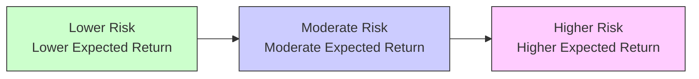

## Introduction

Have you ever felt uneasy about putting your money into something risky—like, say, a startup your cousin swears will be the next unicorn? That feeling you get, where you instinctively pull back from uncertainty, is closely tied to what economists and financial professionals call “risk aversion.” In practice, it means you naturally prefer “safer” choices over riskier ones when the reward doesn’t seem big enough to justify that risk. This preference turns out to be a huge deal in portfolio management. Understanding risk aversion isn’t just an academic exercise—it can make or break your success in designing an investment portfolio that aligns with a client’s comfort level and long-term goals.

Utility theory, on the other hand, is basically a fancy way of measuring satisfaction or happiness (utility) investors derive from different possible outcomes. When we talk about “risk-return trade-offs,” we rely on utility theory to quantify how comfortable or uncomfortable an investor might be with those trade-offs. By learning how to represent investor preferences mathematically, we can build better portfolios—ones that reflect the balance between wanting high returns and wanting to sleep well at night.

In this section, we’ll introduce the concept of risk aversion, walk through what a utility function looks like, discuss indifference curves, and round things out with real-world applications and complications. We’ll also look at how these ideas tie into portfolio selection and the actual practice of managing money. Let’s get started.

## The Nature of Risk Aversion

### Defining Risk Aversion

Risk aversion, at its core, is a tendency to prefer certain outcomes (or lower-risk outcomes) over uncertain ones if both provide the same expected payoff. If I told you there’s a coin flip game where, on heads, you get $100, and on tails, you get $0, the expected payoff mathematically is $50. But would you actually demand more than $50 to be willing to play that game? Many people would—because they dislike the uncertainty of possibly walking away with nothing. In portfolio management, risk aversion shapes how investors allocate assets among stocks, bonds, and other instruments.

A classic measure of risk aversion is the willingness to pay for insurance or to accept a lower-but-guaranteed return in exchange for avoiding risk. Institutional investors such as pension funds can also exhibit risk aversion, often striving to meet certain funding liabilities with minimal shortfall risk. Meanwhile, individuals might invest conservatively if they know they’ll soon need the money for a home purchase or other near-term expense.

### Why Risk Aversion Matters in Portfolios

By the time you start combining multiple assets into a portfolio, risk aversion has powerful implications:

• Asset Allocation: Highly risk-averse investors might keep a substantial share in government bonds or other low-volatility assets, while more risk-tolerant investors lean into equities or alternative investments.  
• Diversification Strategy: Risk-averse investors often emphasize maximum diversification, seeking to reduce exposure to specific industry or company risks.  
• Asset Class Returns: Investors with lower risk tolerance might shy away from high-yield bonds or volatile emerging market equities, even though these may offer higher expected returns.  

It’s nearly impossible to design a rational portfolio for any investor—individual or institutional—without taking risk aversion fully into account.

## Utility Theory: Linking Satisfaction to Investment Decisions

Imagine you’re picking from a menu of dinner options. Each choice is associated with some “utility” to you—how much you enjoy it, how satisfying you find it, and so forth. Utility theory applies that same notion of “enjoyment” or “satisfaction” to the realm of investments. Specifically, it says that investors maximize their “utility,” or personal satisfaction level, derived from a portfolio’s risk-return combination.

### The Basic Utility Function

A utility function mathematically captures your preference for wealth. For a risk-averse investor, utility increases with wealth, but each extra dollar offers a bit less additional satisfaction than the last. We call that phenomenon diminishing marginal utility. A simple form of a utility function (used in many finance textbooks) is:


U(W) = \mathbb{E}[W] - \frac{1}{2} A \,\sigma^2


where:  
• \\(W\\) is the random outcome (wealth) of the investment,  
• \\(\mathbb{E}[W]\\) is the expected wealth,  
• \\(\sigma^2\\) is the variance of that wealth (a stand-in for risk),  
• \\(A\\) is a coefficient representing the investor’s degree of risk aversion (the higher \\(A\\) is, the more risk-averse the investor).

In this simplified model, the investor’s utility is higher when the expected wealth is higher, but it’s penalized by half the product of risk aversion and the variance of returns. If you hate volatility, you’ll carry a big penalty for \\(\sigma^2\\). If you’re more comfortable with risk, you’ll assign it a smaller penalty.

### Marginal Utility and Diminishing Returns

The idea of “marginal utility” is central—a measure of how much additional satisfaction an extra dollar of wealth provides. Risk-averse investors see a decline in marginal utility as wealth rises. Picture a scenario where you have $100,000 in savings, and you’re deciding whether to take a bet that has a 50% chance of gaining $20,000 and a 50% chance of losing $20,000. If you’re comfortable enough with your existing wealth, the negative feeling of losing $20,000 might loom larger than the positive feeling of winning $20,000. That’s precisely risk aversion at play.

## Constructing and Interpreting a Utility Function: Step by Step

1. Identify Risk Preferences:  
   Start with an investor’s “risk-aversion coefficient” (\\(A\\)). This might be derived from a questionnaire, past behavior, or a formal conversation about risk tolerance.  

2. Determine the Investor’s Initial Wealth:  
   Let’s denote an investor’s current wealth by \\(W_0\\). Sometimes this includes net worth; in other contexts, it’s the fraction of wealth earmarked for investment.  

3. Model Potential Outcomes:  
   Suppose the investor is considering possible portfolios, each with different expected returns and variances. They might have a portfolio with expected return \\(\mu_1\\) and volatility \\(\sigma_1\\), another with \\(\mu_2\\) and \\(\sigma_2\\), and so on.  

4. Plug into the Utility Function:  
   We consider something like:  
   
   U(\text{Portfolio}) = (W_0 \times (1 + \mu)) - \frac{1}{2} A \, (W_0 \times \sigma)^2
     
   The first term is the expected final wealth, and the second term is the “penalty” due to risk.  

5. Compare and Choose:  
   The investor compares the utility from each portfolio. Whichever portfolio offers the highest utility is typically the “optimal” choice in a purely rational, risk-averse framework.  

Many advanced approaches exist, but at its root, building a utility function always aims to understand how an investor values additional returns relative to additional risk.

## Indifference Curves: Mapping Preferences for Risk and Return

An indifference curve represents all combinations of risk and return that provide the same level of utility. If you plot risk on the x-axis and expected return on the y-axis, each indifference curve slopes upward, reflecting that you need more return to compensate for higher risk. The shape of the curve (often convex) is influenced by the investor’s risk-aversion coefficient.

Below is a simple conceptual Mermaid diagram showing how an investor might move along an indifference curve, weighing more risk against the desire for higher returns.

Each labeled point (A, B, C) along the curve yields the same utility for the investor—they’re essentially indifferent between these different risk-return trade-offs, so long as those combinations live on the same curve. To achieve a strictly higher utility, you’d need to move to an indifference curve that lies “northwest” in return-risk space (more return, less risk).

### Certainty Equivalents

An important concept in utility theory is the “certainty equivalent.” It refers to the guaranteed return that an investor would find as desirable as a risky outcome. For instance, if a risky portfolio yields an expected return of 10% but with significant volatility, its certainty equivalent might be 7%. That suggests the investor would be indifferent between taking the 7% sure return or investing in the risky portfolio.

## Real-World Complications and Behavioral Nuances

### Changing Risk Aversion Over Time

Risk aversion isn’t always static. During bull markets, investors sometimes become less risk-averse—“Hey, everything’s going up, how bad can it get?” Conversely, in market downturns, investors often panic and become far more risk-averse, even if they can ride out the storm. This cyclical shift can lead to phenomena like herding, sudden sell-offs in volatile markets, or flight-to-quality strategies.

### Behavioral Biases

Real-life investors don’t always follow neat utility functions. Behavioral finance shows that individuals might overweight small probabilities of large losses, exhibit overconfidence when markets do well, or exhibit loss aversion (where the pain of losses is felt much more intensely than the joy of gains). While standard utility theory assumes rational decision-making, actual investors can deviate significantly, especially under stress.

### Institutional Constraints and Liability Matching

Institutional investors (like pension funds or insurance companies) face unique constraints. They often define risk aversion in the context of their liabilities. A pension plan with near-term payables to retirees may simply not be able to stomach large drawdowns, even if the long-term expected return is higher. Utility theory can be adapted by incorporating the probability of failing to meet a liability or target. This effectively changes the shape and slope of the utility function to reflect either “shortfall risk” or “underfunding risk.”

## Links to Portfolio Selection

When we build an investment portfolio, we often talk about the “efficient frontier,” a concept you’ll see in detail in Sections 2.3 and 2.4. In a mean-variance framework, the efficient frontier represents all fully diversified portfolios offering the highest return for each level of risk. The investor’s optimal portfolio is found at the tangential point between their highest possible indifference curve and the efficient frontier. That’s the sweet spot where the investor’s risk aversion perfectly meets the best combination of return and volatility.

## Practical Example: Choosing Between Two Portfolios

Let’s say we have two portfolios:  
• Portfolio X: Expected return = 8%, standard deviation = 12%  
• Portfolio Y: Expected return = 10%, standard deviation = 20%  

Suppose an investor’s risk-aversion coefficient (\\(A\\)) is 3, and their initial wealth is $100,000. We can do a simplified expected utility calculation. Using:


U(\text{Portfolio}) \approx \mathbb{E}[W] - \frac{1}{2}\,A\,\sigma^2 \times W_0


for final wealth:

• For Portfolio X:  
  
  U_X = (100,000 \times 1.08) - \frac{1}{2} \times 3 \times (0.12^2) \times 100,000
    
  
  ~~~~~ = 108,000 - \frac{3}{2} \times 0.0144 \times 100,000
    
  
  ~~~~~ = 108,000 - 2160 = 105,840
  

• For Portfolio Y:  
  
  U_Y = (100,000 \times 1.10) - \frac{1}{2} \times 3 \times (0.20^2) \times 100,000
    
  
  ~~~~~ = 110,000 - \frac{3}{2} \times 0.04 \times 100,000
    
  
  ~~~~~ = 110,000 - 6000 = 104,000
  

According to this simplified utility measure, Portfolio X has a higher score (105,840) than Portfolio Y (104,000). So a risk-averse investor with \\(A = 3\\) would prefer Portfolio X. While this example is basic, it illustrates how one might compare investment choices. In a more robust process, we’d refine these inputs and possibly use scenario or simulation analyses. But the principle is the same: weigh expected returns against the penalty for risk, and pick the portfolio with the highest utility.

## Best Practices and Common Pitfalls

• Know Your Risk Tolerance: Investors often incorrectly estimate their own willingness to bear losses. Overestimating your risk tolerance can lead to regret and panic selling.  
• Update Utility Inputs Periodically: Market conditions, personal circumstances, and broader economic factors can change an investor’s risk tolerance. Revisit your assumptions regularly.  
• Watch for Overconfidence Bias: Many investors are too optimistic when markets are rallying. This can hide a true underlying risk aversion that surfaces in downturns.  
• Avoid Over-Complicating: While advanced utility functions exist, be wary of “analysis paralysis.” Focus on a robust but tractable approach to reflect real preferences.  
• Communicate Clearly with Clients: If you’re an advisor, talk about risk in plain terms. Illustrate potential losses in dollar terms—and ensure clients actually understand the trade-offs.  

## A Brief Personal Story

I once worked with a young professional who insisted he was ready for an “all-equities” portfolio. After all, he reasoned, he had decades to invest. Then the market took a sharp dip. The shock of seeing a double-digit drop in just days nearly triggered panic. We dialed back to re-calibrate his true risk aversion and realized a slightly more balanced mix allowed him to sleep at night. This goes to show that, in practice, risk aversion can be far more nuanced than a questionnaire might initially reveal.

## Glossary

• Utility Function – A mathematical representation of preferences for certain outcomes over others.  
• Risk Aversion – A tendency to prefer lower risk for a given level of expected return.  
• Indifference Curve – A curve representing all combinations of risk and return that provide the same level of utility.  
• Marginal Utility – The change in an investor’s utility gained from acquiring an additional unit of wealth, typically diminishing for risk-averse individuals as wealth grows.  
• Certainty Equivalent – The guaranteed amount of return an investor would consider as attractive as a risky alternative.  
• Absolute vs. Relative Risk Aversion – Measures of how risk aversion may or may not change with one’s level of wealth.

## References

• von Neumann, J., & Morgenstern, O. (1944). Theory of Games and Economic Behavior. Princeton University Press.  
• CFA Program Curriculum on Portfolio Management – Utility Analysis (various editions).  
• Behavioral Finance Articles discussing risk-aversion shifts in bull vs. bear markets.  

## Final Thoughts

Understanding risk aversion and utility theory is not just about memorizing formulas for the exam—though, of course, that’s pretty important. More critically, it helps you see how real individuals (and institutions) weigh uncertain outcomes in the marketplace. By creating and applying utility functions, you can design portfolios that truly reflect each investor’s comfort with uncertainty and potential losses. Remember, while humans can be irrational, as we’ll see in future sections on behavioral biases, these quantitative tools serve as a great foundation for disciplined, well-structured decision-making.

Below are 10 sample exam-style questions to help you practice these concepts. Give them a try and see how comfortable you are applying risk aversion, utility theory, and indifference curves in a scenario-based context.

## Test Your Knowledge: Risk Aversion & Utility Theory Quiz



### Which of the following best describes risk aversion in the context of portfolio management?

- [ ] Preference for highest possible return regardless of volatility
- [x] Preference for more certain outcomes, requiring higher return to offset higher risk
- [ ] Tendency to invest only in government bonds regardless of return
- [ ] Willingness to take greater risk without seeking additional compensation

> **Explanation:** Risk aversion implies that investors require higher returns to justify the uncertainty of higher volatility or bigger potential losses.

### Which statement correctly describes how marginal utility behaves for a risk-averse investor?

- [ ] Marginal utility is constant regardless of wealth
- [x] Marginal utility decreases as wealth increases
- [ ] Marginal utility increases as wealth increases
- [ ] Marginal utility becomes zero at high levels of wealth

> **Explanation:** Risk-averse investors experience diminishing marginal utility of wealth: each additional unit of wealth provides slightly less incremental satisfaction than the previous one.

### In a mean-variance framework, what does a higher risk-aversion coefficient (A) generally imply about an investor’s portfolio selection?

- [ ] The investor will prefer portfolios with higher standard deviations
- [x] The investor will prefer portfolios with lower standard deviations, even if returns are somewhat lower
- [ ] The investor will be indifferent between high-return/high-risk and low-return/low-risk
- [ ] The investor’s indifference curves will become flatter

> **Explanation:** A higher coefficient A indicates stronger aversion to volatility, leading the investor to favor lower-risk portfolios.

### Suppose a client’s utility function is U(W) = E(W) – (1/2)*A*σ², and we observe that for Portfolio A, the utility is 120,000, while Portfolio B has a utility of 118,500. Which choice is optimal?

- [ ] Portfolio B, if it offers a higher expected return
- [ ] Portfolio B, if it has a lower risk
- [ ] The investor is indifferent
- [x] Portfolio A is the best option

> **Explanation:** The portfolio with the higher utility is preferred, regardless of whether it achieves that via higher returns, lower risk, or a combination.

### Which of the following best characterizes an indifference curve for a risk-averse investor?

- [ ] It slopes downward, indicating returns must decrease as risk increases
- [ ] It is flat, indicating the same return is acceptable for all levels of risk
- [x] It slopes upward, indicating that more return is required for assuming additional risk
- [ ] It intersects with other indifference curves at multiple points

> **Explanation:** For a given level of utility, an investor needs a higher expected return to compensate for higher risk, so the curve slopes upward in risk-return space.

### What is the certainty equivalent of a risky investment?

- [ ] The guaranteed return producing infinite utility
- [ ] A separate, unrelated measure for risk tolerance
- [x] The guaranteed return that yields the same utility as the expected utility of the risky investment
- [ ] The discount rate that sets net present value to zero

> **Explanation:** The certainty equivalent is the guaranteed amount that leaves the investor indifferent between that sure payoff and the risky one with a specific expected return.

### Which of the following scenarios might decrease risk aversion for a typical individual investor?

- [x] Strong market performance leading to overconfidence in stock-picking ability
- [ ] A job loss that decreases overall financial security
- [ ] A sudden loss in the portfolio that shakes trust in equities
- [ ] A major home purchase that utilizes much of the individual’s liquidity

> **Explanation:** When markets are on a tear, some investors gain overconfidence and perceive risk to be lower, effectively reducing their aversion to risk.

### Which phrase correctly describes absolute risk aversion?

- [x] A measure of risk aversion that focuses on how much uncertainty an individual tolerates in dollar terms, regardless of overall wealth levels
- [ ] A form of risk aversion where an individual invests solely in risk-free assets
- [ ] A measure that stays constant proportionally to wealth
- [ ] A measure that compares portfolio risks across different types of asset classes

> **Explanation:** Absolute risk aversion remains constant or changes in relation to total wealth in a fixed dollar sense, rather than in percentage terms.

### In portfolio construction using utility theory, what is the “optimal” portfolio for a single investor?

- [ ] The portfolio with the absolute highest expected return, ignoring risk
- [ ] The portfolio with the absolute lowest standard deviation, ignoring return
- [x] The portfolio that maximizes the investor’s expected utility given their unique risk aversion
- [ ] The market portfolio as dictated by the Capital Asset Pricing Model

> **Explanation:** The investor’s optimal portfolio is the one lying on the efficient frontier that also matches their highest possible indifference curve based on their risk aversion.

### True or False: In utility theory, two different investors with different risk-aversion coefficients will always prefer the same portfolio on the efficient frontier.

- [ ] True
- [x] False

> **Explanation:** Different investors have different risk-aversion levels; each chooses a distinct point on the efficient frontier where their indifference curve is tangent.  


