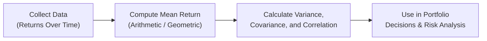

## Introduction

It’s amazing how often we look at returns and think, “Oh, that looks like a great investment”—only to realize later that we might have missed something important about their variability or direction. When I first started analyzing returns (armed with a battered spreadsheet and a bit too much enthusiasm), I remember mixing up my annual return calculations and ending up with bizarrely inflated figures. Looking back now, it’s a reminder of how easy it is to trip over the math if we rush through the basics.

In this section, we dig into some core concepts that underpin quantitative portfolio analysis: arithmetic mean returns, geometric mean returns, variance, covariance, and correlation. Each of these plays a unique role in shaping our understanding of risk and return. By exploring how to calculate and interpret these measures—complete with real-world scenarios—we’ll build a solid foundation for portfolio planning and risk management.

## Arithmetic Mean Return vs. Geometric Mean Return

### Arithmetic Mean Return

The arithmetic mean return (AMR) is the simple average of a series of returns. It’s what you get if you sum up all the periodic returns and divide by the total number of periods. Formally:


\text{Arithmetic Mean Return} = \frac{1}{n} \sum_{t=1}^{n} R_t


where:
• \\(R_t\\) = return in period \\(t\\)  
• \\(n\\) = number of periods

This measure is straightforward, but (and here’s the big “but”) it doesn’t account for the effect of compounding. If your returns fluctuate significantly from period to period, the arithmetic mean can overstate your actual long-term growth rate. It tends to be more useful for a single-period estimate of expected return in many financial models—like short-term portfolio allocations or capturing the one-period risk/return trade-off.

Let’s consider a quick example:  
• Year 1 return: +10%  
• Year 2 return: +20%  
• Year 3 return: -5%  

Arithmetic mean return = \\(\frac{10\% + 20\% + (-5\%)}{3} = \frac{25\%}{3} \approx 8.33\%\\)  

That’s perfectly fine as a “typical” annual return, but it does not directly capture the compound effect over those three years.

### Geometric Mean Return

The geometric mean return (GMR) measures the compound annual growth rate (CAGR) of an investment. With this measure, we’re effectively asking: “What constant annual return would get me from my starting investment to my ending investment, over a certain period?” The formula is:


\text{Geometric Mean Return} = \left( \prod_{t=1}^{n} (1 + R_t) \right)^{\frac{1}{n}} - 1


Using the same 3-year example:  
• (1 + 0.10) × (1 + 0.20) × (1 - 0.05) = 1.10 × 1.20 × 0.95 = 1.254  
• \\(\left(1.254\right)^{1/3} - 1 \approx 0.077\\) (or 7.7%)

So the geometric mean return is about 7.7% compared to the arithmetic mean of 8.33%. The difference might not look huge in this example, but trust me—over multiple decades or for more volatile assets, that compounding gap can become really significant.

In performance assessment, most professionals prefer the geometric mean return for describing actual long-term investment growth or historical performance of a strategy. Meanwhile, if you’re building certain asset-pricing models (like the Capital Asset Pricing Model in short one-period form), the arithmetic mean might be more appropriate.

## Variance as a Measure of Risk

When we talk about risk in finance, we often start with the idea of “spread” or volatility. Variance (\\(\sigma^2\\)) is the classic statistical measure of dispersion from the mean. In the context of returns, the sample variance is usually calculated like so:


\sigma^2 = \frac{1}{n-1} \sum_{t=1}^n (R_t - \bar{R})^2


where \\(\bar{R}\\) is the mean (often arithmetic) of the returns, and \\(n\\) is the number of observations. The bigger the variance, the more spread out the returns are around the average.  

One step further is the standard deviation (\\(\sigma\\)), which is simply the square root of variance:


\sigma = \sqrt{\sigma^2}


People typically use standard deviation as a straightforward way to see how “risky” an asset might be. A high standard deviation suggests that returns can swing significantly around the average. That can be thrilling when returns go up (and horrifying when they go down).

### Example of Variance Computation

Suppose you have four monthly returns for a stock:
• Month 1: 2%  
• Month 2: 1%  
• Month 3: -1%  
• Month 4: 4%  

First, compute the arithmetic mean return:  
\\(\bar{R} = \frac{2\% + 1\% + (-1\%) + 4\%}{4} = \frac{6\%}{4} = 1.5\%\\)

Now, let’s compute squared deviations from the mean:

• \\((2\% - 1.5\%)^2 = (0.5\%)^2 = 0.25 \text{%}^2\\)  
• \\((1\% - 1.5\%)^2 = (-0.5\%)^2 = 0.25 \text{%}^2\\)  
• \\((-1\% - 1.5\%)^2 = (-2.5\%)^2 = 6.25 \text{%}^2\\)  
• \\((4\% - 1.5\%)^2 = (2.5\%)^2 = 6.25 \text{%}^2\\)

Sum of squared deviations = 0.25% + 0.25% + 6.25% + 6.25% = 13.0% (in squared percentage terms).  

Because we have \\(n=4\\) data points, we use \\(n-1=3\\) in the denominator for the sample variance:


\sigma^2 = \frac{13.0\%}{3} \approx 4.33\%


So the standard deviation, \\(\sigma\\), is:


\sigma \approx \sqrt{4.33\%} \approx 2.08\%


Hence, the stock’s monthly returns have an approximate standard deviation of 2.08% over the sample.

## Covariance and Correlation

Once we have a handle on the variability of individual assets, it’s time to look at how pairs of assets move together (or not). This is critical for selecting a diverse portfolio. No matter how risky a single asset might look on its own, sometimes combining assets in a portfolio can reduce the overall risk if their returns aren’t heavily correlated.

### Covariance

Covariance measures how two variables (e.g., two stocks’ returns) move in relation to each other. Positive covariance means that when one asset’s return is above its average, the other asset’s return also tends to be above its own average for that same period. Formally:


\text{Cov}(R_x, R_y) = \frac{1}{n-1} \sum_{t=1}^n (R_{x,t} - \bar{R}_x)(R_{y,t} - \bar{R}_y)


• If covariance is positive, the two assets generally move in the same direction.  
• If covariance is negative, they tend to move in opposite directions.  
• If covariance is zero, no linear relationship is detected (although other nonlinear relationships could still lurk).

### Correlation

The correlation coefficient (\\(\rho_{x,y}\\)) standardizes covariance, giving us a dimensionless measure that always ranges between -1.0 and +1.0. The formula is:


\rho_{x,y} = \frac{ \text{Cov}(R_x, R_y) }{ \sigma_x \times \sigma_y }


• \\(\rho_{x,y} = +1\\) indicates perfect positive linear correlation (they move in lockstep).  
• \\(\rho_{x,y} = -1\\) indicates perfect negative linear correlation (they move exactly opposite).  
• \\(\rho_{x,y} = 0\\) indicates no linear correlation (the returns do not systematically move together in a linear sense).

Correlation is a key input when determining the diversification benefits of combining assets. If you can find two equally high-performing assets with low or negative correlation, you’re in the sweet spot for risk reduction—at least on paper.

### Intuitive Real-World Example

Imagine you track two different investments every month:  
• A technology-oriented equity fund (Asset X)  
• A commodities index fund (Asset Y)

You suspect that when the tech sector is soaring, the commodities fund might not necessarily skyrocket. In fact, maybe it moves in a different cycle. By calculating the correlation coefficient, you can quickly see if there’s a diversification advantage. A correlation near -1 would be ideal for balancing risk because gains in one might offset losses in the other.

## Two-Asset Portfolio Example

Let’s explore a straightforward calculation for a two-asset portfolio. Often, you might want to figure out a combined standard deviation for a portfolio of two assets (X and Y), weighted by \\(w_x\\) and \\(w_y\\). The variance of the two-asset portfolio (\\(\sigma_p^2\\)) is:


\sigma_p^2 = (w_x \sigma_x)^2 + (w_y \sigma_y)^2 + 2w_x w_y \, \text{Cov}(R_x, R_y)


or, in correlation form:


\sigma_p^2 = w_x^2 \sigma_x^2 + w_y^2 \sigma_y^2 + 2 w_x w_y \rho_{x,y} \sigma_x \sigma_y


### Numerical Practice Problem

Suppose you have:  
• Asset X expected return = 8% per year, standard deviation = 10%  
• Asset Y expected return = 5% per year, standard deviation = 7%  
• Correlation (\\(\rho_{x,y}\\)) between X and Y = 0.2  
• You invest 60% in X (\\(w_x=0.60\\)) and 40% in Y (\\(w_y=0.40\\)).

First, find the portfolio’s expected return:  

E(R_p) = w_x \times E(R_x) + w_y \times E(R_y) = 0.60 \times 8\% + 0.40 \times 5\% = 4.8\% + 2\% = 6.8\%


Next, calculate the portfolio variance and standard deviation:


\sigma_p^2 = (0.60^2)(0.10^2) + (0.40^2)(0.07^2) + 2(0.60)(0.40)(0.2)(0.10)(0.07)


Breaking it down:

• \\(0.60^2 \times 0.10^2 = 0.36 \times 0.01 = 0.0036\\) (i.e., 0.36%)  
• \\(0.40^2 \times 0.07^2 = 0.16 \times 0.0049 = 0.000784\\) (i.e., 0.0784%)  
• \\(2 \times 0.60 \times 0.40 \times 0.2 \times 0.10 \times 0.07 = 2 \times 0.24 \times 0.2 \times 0.007 = 0.24 \times 0.0014 = 0.000336\\)

Summing them up:  

\sigma_p^2 = 0.0036 + 0.000784 + 0.000336 = 0.00472


Hence, the portfolio standard deviation (\\(\sigma_p\\)) is \\(\sqrt{0.00472} \approx 0.06866 \text{ or } 6.87\%\\).

That is your approximate annualized portfolio standard deviation. Notice how it’s lower than each asset’s individual volatility, thanks to diversification and a correlation below +1.

## Data Frequency and Its Impact

It’s common to run into confusion about using daily, weekly, monthly, or annual data. Your choice of data frequency can have meaningful implications for your estimates:

• **Variance/Standard Deviation**: Annualizing daily standard deviation requires multiplying daily volatility by \\(\sqrt{252}\\), whereas monthly volatility is often annualized by \\(\sqrt{12}\\). If returns aren’t identically distributed or have strong auto-correlation, these multipliers can lead to underestimation or overestimation of true annual risk.  
• **Arithmetic vs. Geometric Mean**: Using daily or monthly arithmetic means might mask the true effect of compounding over long horizons. Always note how you’re converting from short-term returns to an annual figure.  
• **Covariance and Correlation**: High-frequency data often reveal more short-term noise that can differ from monthly or annual patterns. For instance, assets could show mild correlation on a daily basis but a stronger correlation over a quarter due to shared macroeconomic factors.

If you’re using these measures in a professional setting (say, building a multi-year strategy for a client), it’s crucial to pick the data frequency that aligns with your investment horizon. And if you’ve got a gut feeling that daily returns are super noisy, well, maybe monthly or quarterly data sets are more appropriate for stable estimates.

## Practical Pitfalls and Best Practices

• **Overreliance on Arithmetic Mean**: For multi-period performance evaluation, arithmetic mean can be misleading. Use geometric mean if you want to show the actual growth (or shrinkage).  
• **Forgetting Sample Adjustments**: Remember to use \\(n-1\\) in the denominator for sample variance and covariance. Forgetting that can bias your estimates.  
• **Data Gaps and Outliers**: Double-check your raw data. Missing or extreme returns can distort the entire distribution.  
• **Correlation is Not Causation**: A correlation of +1 doesn’t necessarily mean one asset’s performance directly causes the other. It’s just linear co-movement.  
• **Time-Period Mismatch**: If you’re annualizing monthly returns incorrectly or mixing daily data with monthly data, your risk estimates might be all over the place.

## Glossary

• **Arithmetic Mean Return (AMR)**: The simple average of a set of returns.  
• **Geometric Mean Return (GMR)**: The average growth rate accounting for compounding, often preferred for multi-period analysis.  
• **Variance**: The expectation of the squared deviation from the mean, showing how spread out returns are.  
• **Standard Deviation**: The square root of variance, commonly used as a risk measure.  
• **Covariance**: A measure indicating how two assets’ returns move together.  
• **Correlation Coefficient (\\(\rho\\))**: A standardized measure of the relationship between two variables, ranging from -1 to +1.

## References

• CFA Institute Curriculum on quantifying risk and return (especially coverage on descriptive statistics and portfolio mathematics).  
• Bodie, Z., Kane, A., & Marcus, A. (various editions). “Investments.” Particularly, chapters discussing statistical analysis of returns and portfolio theory.  

## Final Exam Tips

• **Know Your Formulas**: Be comfortable writing down and rearranging formulas for AMR, GMR, variance, covariance, and correlation.  
• **Practice Numerics**: Don’t let panic freeze you. On exam day, small numeric mistakes can snowball. Double-check your arithmetic.  
• **Interpretation, Not Just Calculation**: It’s easy to crunch the numbers but don’t forget the “so what?” in your answers. Explain how your calculations would influence portfolio decisions.  
• **Be Aware of Frequency**: The CFA exams often test your ability to unify daily, monthly, or annual data. Keep track of whether you should be “annualizing” or “de-annualizing” returns and standard deviations.  
• **Sample vs. Population**: Recognize when to use \\(n-1\\) in denominators (sample) vs. \\(n\\) for entire populations (less common in real finance, but it can come up in theoretical questions).  

Below are some targeted practice questions to test your knowledge and help you prepare for exam-style scenarios.

## Test Your Knowledge: Mean, Variance, Covariance & Correlation



### If an investment has returns of 5%, 10%, and -2% for three consecutive years, what is the arithmetic mean return?

- [ ] 4.3%
- [x] 4.33%
- [ ] 4.5%
- [ ] 5.3%

> **Explanation:** Add (5% + 10% + (-2%)) = 13%, then divide by 3 = 4.33%.

### For the same returns (5%, 10%, and -2%), how would you calculate the geometric mean return?

- [ ] (5% + 10% - 2%) / 3
- [x] [(1.05 × 1.10 × 0.98)^(1/3)] - 1
- [ ] [(1.05 × 1.10 × 0.98)^3] - 1
- [ ] 1.05 × 1.10 × 0.98 - 1

> **Explanation:** Multiply (1.05 × 1.10 × 0.98) then take the cube root, subtract 1 to find the compound rate.

### Which of the following statements best describes the relationship between variance and standard deviation?

- [x] Standard deviation is the square root of variance
- [ ] Variance is the square of covariance
- [ ] Standard deviation is always larger than variance
- [ ] Variance is the square root of standard deviation

> **Explanation:** By definition, variance = σ² and standard deviation = σ. Thus, standard deviation = √(variance).

### Suppose Asset X and Asset Y each have a standard deviation of 10%. If Cov(X,Y) = 0.005, what is the correlation coefficient between X and Y?

- [ ] 0.05
- [x] 0.50
- [ ] 5.00
- [ ] 0.005

> **Explanation:** Correlation = Cov(X,Y) / (σᵪ × σᵧ) = 0.005 / (0.10 × 0.10) = 0.005 / 0.01 = 0.50.

### Which combination of returns indicates perfect negative correlation (i.e., ρ = -1) between two assets?

- [x] Asset A up 2% when Asset B down 2%, A up 4% when B down 4%, and so on
- [ ] Asset A up 2% when Asset B down 1%, A up 4% when B down 5%, etc.
- [ ] Asset A and Asset B both up 2% together and both down 2% together
- [ ] Asset A and Asset B show no pattern in their movements

> **Explanation:** Perfect negative correlation means that one asset rises by exactly the same magnitude that the other falls, consistently.

### If the correlation between two assets is zero, it implies:

- [x] There is no linear relationship between their returns
- [ ] There is a perfect positive linear relationship
- [ ] There is a perfect negative linear relationship
- [ ] The assets move together in the same direction

> **Explanation:** Zero correlation indicates no linear dependence; they may still have a nonlinear relationship, but that’s another issue.

### A portfolio has 70% in Asset 1 (σ = 12%) and 30% in Asset 2 (σ = 8%), with ρ = 0.25. Which of the following might be the most accurate statement regarding the portfolio’s standard deviation?

- [x] It will be between 8% and 12%, reflecting the benefit of diversification
- [ ] It will be exactly 12%, dominated by Asset 1
- [ ] It will be more than 12%, since combining assets always increases risk
- [ ] It will be exactly 8%, dominated by Asset 2

> **Explanation:** Because the correlation is less than +1, diversification helps reduce total risk below a weighted sum of 8% and 12%.

### An analyst calculates the daily arithmetic mean return and multiplies by 365 to annualize. What is the main concern with this approach?

- [x] It doesn’t account for compounding or the distribution properties of daily returns
- [ ] Arithmetic means are not valid for returns data
- [ ] 365 is too small a multiplier for daily returns
- [ ] The geometric mean should be multiplied by 365

> **Explanation:** Daily returns rarely scale linearly. Also, ignoring compounding and volatility clustering can lead to inaccuracies.

### When collecting return data for covariance computations across multiple assets, using monthly data instead of annual data tends to:

- [x] Provide more data points but might capture more short-term noise
- [ ] Underestimate the volatility significantly
- [ ] Eliminate outliers from the dataset automatically
- [ ] Make the data set ineligible for correlation measurements

> **Explanation:** More frequent data does provide more observations but can also introduce short-term fluctuations that may skew estimates of correlation and covariance.

### Is it possible for the variance of a portfolio with two assets to be lower than the variance of each individual asset?

- [x] True
- [ ] False

> **Explanation:** Yes. If the assets exhibit low or negative correlation, the combined portfolio can have a variance lower than that of either asset on its own.


