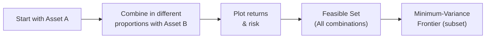

## Understanding the Opportunity Set

Let’s start with a quick thought experiment. Imagine you’ve got two different assets—say, a broad equity index fund and a corporate bond fund. If you only invest in one (that corporate bond fund, for instance), your risk and return profile will be entirely tied to that asset’s ups and downs. But if you can mix them, perhaps in different proportions, you suddenly get a whole range of possible risk-return outcomes—an entire “opportunity set” of portfolios.

These possible mixes can be visualized in a coordinate plane. On the x-axis, you have risk (often measured by standard deviation or variance), and on the y-axis, you have expected return. Each point in that plane then corresponds to a unique blend of the two assets. This region where all feasible combinations lie is often called the feasible set or opportunity set. And as we’ll see, from within that region emerges something special called the minimum-variance frontier.

## The Concept of the Minimum-Variance Frontier

For a given level of expected return, the portfolio with the lowest possible variance (i.e., the smallest risk) lies on the so-called minimum-variance frontier. Conversely, for a given level of risk, you can find a portfolio with the highest return on a related line known as the efficient frontier (a subset of the minimum-variance frontier lying above the global minimum point).

In simpler terms: 
• The minimum-variance frontier is like a boundary that encloses all the portfolios that achieve the absolute minimum risk possible for each level of return.  
• The portfolio at the lowest point on that frontier is the global minimum-variance portfolio, the absolute champion of “low variance.”

When we shift from concept to practice, we usually rely on variance, covariance, and correlation estimates—covered in detail in Section 2.3—to figure out precisely where that “frontier” exists. You might recall from your study of correlation that assets whose returns move in opposite directions (negative correlation) can help reduce overall portfolio risk. That synergy typically lowers the combined portfolio’s variance more than you’d imagine if you just glued two assets together randomly.

## Deriving the Frontier: Two-Asset Case

Ah, the two-asset world. It feels almost too easy, but it’s a perfect place to start building intuition. Suppose you have two assets, Asset A and Asset B, with expected returns Rₐ and R_b, standard deviations σₐ and σ_b, and correlation ρₐb.

If you invest a fraction w in Asset A and (1 – w) in Asset B, then your portfolio’s expected return, E[R_p], is:

E[R_p] = w \cdot R_a + (1 - w) \cdot R_b.


But the real excitement is the portfolio variance, Var(R_p):

\sigma_p^2 = w^2 \sigma_a^2 + (1 - w)^2 \sigma_b^2 + 2w(1 - w) \rho_{ab} \sigma_a \sigma_b.


Where:  
• w is the weight on Asset A,  
• ρₐb is the correlation between the asset returns, and  
• σₐ and σ_b are the standard deviations of Asset A and Asset B returns, respectively.

If you vary w from 0% to 100%, you plot a curve of risk-return combinations. Some of those portfolio combinations will form the so-called minimum-variance curve. The lowest point on that curve is where you get the global minimum-variance solution. 

### A Quick Mermaid Diagram of a Two-Asset Feasible Set

Below is a simplified diagram showing how the feasible region might look when blending Asset A and Asset B, plus the minimum-variance portion of that curve:



In that picture, you begin with Asset A, begin combining with Asset B, compute the risk and return for each blend, and gather them in a single feasible region. The portion of that region that yields the lowest risk for each return is our frontier.

## Extending to Multiple Assets

Of course, in real life, you’re hardly restricted to two assets. Most portfolios contain multiple asset classes: domestic stocks, international stocks, bonds, real estate, sometimes even alternative assets. Extending our formula to n assets can be quite math-heavy—though the logic is basically the same, just with a bigger covariance matrix. 

The formula for your portfolio’s variance will look something like:


\sigma_p^2 = \mathbf{w}^\mathsf{T} \Sigma \mathbf{w}


Where:  
• \\(\mathbf{w}\\) is the vector of portfolio weights, w = (w₁, w₂, …, wₙ),  
• \\(\Sigma\\) is the covariance matrix of asset returns.  

Minimizing \\(\mathbf{w}^\mathsf{T} \Sigma \mathbf{w}\\) subject to constraints (like \\(\sum wᵢ = 1\\)) and possibly additional constraints (e.g., no short selling) is typically done using quadratic programming in software tools like Excel Solver, Python libraries, or specialized portfolio optimizers.

## Interpreting the Frontier

Once you’ve solved the puzzle and found that curve—some might call it the “holy grail” of modern portfolio theory—you need to interpret it. The key points to remember:

• The **global minimum-variance portfolio** is the portfolio that sits at the leftmost vertex of the frontier (where standard deviation is minimal).  
• Any portfolios inside the frontier (or “southwest” of it) are not achievable because they represent returns that are too high for the given level of risk or risk that’s too low for the given level of return.  
• All the portfolios on the frontier are “efficient” in the sense that you’re not wasting any risk. 

At times, you might see the portion of the frontier above the global minimum-variance point described as the **efficient frontier**. Many investors focus on that upper section because they’re looking for higher returns, but keep in mind that if your main objective is to have the smallest possible variance, the global minimum-variance portfolio is the portfolio. 

## Real-World Constraints

In an idealized Markowitz world, you can short assets, borrow or lend unlimited amounts at the risk-free rate, and there are no frictional costs. In practice? Not so simple. We have restrictions on short selling, transaction costs, taxes, minimum liquidity thresholds, and other complexities. These real-world constraints can affect the shape of the frontier:

• **No short sales**: Investors may impose wᵢ ≥ 0 for each asset weight. This restricts the feasible region and typically shifts the frontier to the right (i.e., to higher variance levels).  
• **Transaction costs**: Trading in and out of positions might mean you can’t continuously rebalance into the “perfect” frontier portfolio.  
• **Leverage limits**: If you can’t borrow freely, you can’t easily form highly leveraged portfolios that might otherwise achieve interesting risk-return combos.  
• **Liquidity requirements**: Sometimes you need to hold a chunk of your portfolio in cash or short-term instruments, especially in a corporate or pension setting to meet near-term liabilities.

If you want to get a sense of how these constraints change your optimization, you can typically just add constraints in your software solver or optimization approach, then watch as your “perfect” frontier morphs into something more jagged or compressed. That’s real life, folks!

## Building the Frontier with Software Tools

You can do a lot of manual algebra to build the minimum-variance frontier for two assets, but once you go beyond that, it’s time to harness technology. Let’s see a quick snippet of Python code that uses a popular numeric library to do a simplified optimization (just to bring the concept to life). Suppose we have:

• A vector of expected returns.  
• A covariance matrix.  
• A constraint that all weights sum to 1 and no short sales are allowed.

Below is an illustrative snippet (not a full working script, but enough to point you in the right direction):

```python
import numpy as np
from scipy.optimize import minimize

returns = np.array([0.08, 0.10, 0.12])  # 3 assets
cov_matrix = np.array([
    [0.04, 0.01, 0.00],
    [0.01, 0.09, 0.02],
    [0.00, 0.02, 0.16]
])

def portfolio_variance(weights, cov_matrix):
    return weights.T @ cov_matrix @ weights

def constraint_sum_of_weights(weights):
    return np.sum(weights) - 1.0

bnds = tuple((0,1) for _ in range(len(returns)))

init_weights = np.array([1/3, 1/3, 1/3])

constraints = ({'type': 'eq', 'fun': constraint_sum_of_weights})

opt = minimize(portfolio_variance, init_weights, args=(cov_matrix,),
               method='SLSQP', bounds=bnds, constraints=constraints)

optimal_weights = opt.x
optimal_variance = opt.fun
optimal_sd = np.sqrt(optimal_variance)

print("Optimal Weights:", optimal_weights)
print("Optimal Std Dev:", optimal_sd)
```

If you want to replicate something similar in Excel Solver:  
1. Plug in expected returns and covariance matrix in your spreadsheet.  
2. Set up the portfolio variance formula in a target cell.  
3. Use “minimize” in Excel Solver, referencing that cell as your objective.  
4. Impose the constraints ∑ wᵢ = 1 and wᵢ ≥ 0.  
5. Let Solver do its thing.  

Voila—now you’ve identified the global minimum-variance portfolio (under no short sales). By sweeping through different return targets or expected return constraints, you can trace out the entire frontier. 

## Best Practices and Common Pitfalls

• **Data Quality**: Garbage in, garbage out. Variances and covariances are estimates; errors or old data can lead you astray.  
• **Overconcentration**: Sometimes, unconstrained optimization (especially with short sales) leads to extreme allocations. Keep an eye out for standard constraints like no weight exceeding a certain limit.  
• **Stability**: If you tweak your inputs even slightly, do you get a drastically new frontier? That might be a sign your model is too sensitive.  
• **Continuous Rebalancing**: Real-world friction—trading costs, taxes, and timing—means you can’t just re-optimize daily without incurring real losses.  
• **Revision**: Periodically revisit your estimates of returns and correlations because they change (especially in times of crisis).  

I remember a scenario in a prior role where we used a matrix that hadn’t been updated for fresh market data. An entire pension plan’s risk model was anchored to last year’s correlation patterns. Needless to say, folks were pretty surprised when markets diverged from our assumptions. So, do keep your data sets up to date.  

## Practical Exam Tips

If you’re preparing for the CFA exam (or any advanced finance exam), keep these pointers in mind:  
• **Master the Formula**: Even though you might have software at hand, you’ll likely need to show your understanding of \\(\mathbf{w}^\mathsf{T} \Sigma \mathbf{w}\\) for a multi-asset setup or the Waltz equation for a two-asset scenario.  
• **Remember the Global Minimum**: On the exam, you might be asked to identify or interpret the global minimum-variance portfolio. Emphasize how its variance can be derived.  
• **Constraints**: You’ll often see exam questions featuring constraints—like no short selling or maximum leverage. That changes the solution approach and the shape of the frontier.  
• **Time Management**: Scenario-based questions can be lengthy. Make sure you can swiftly interpret risk-return diagrams, identify feasible sets, and highlight the frontier.  
• **Conceptual vs. Calculation**: Be prepared for “explain” questions (qualitative) and “calculate” questions (quantitative). They might ask “Why does correlation matter?” or “Here’s the correlation matrix, find the weighting for minimum variance.”  

## References

• Markowitz, Harry. “Portfolio Selection.” The Journal of Finance, 1952.  
• Elton, Edwin J., Martin J. Gruber, Stephen J. Brown, and William N. Goetzmann. Modern Portfolio Theory and Investment Analysis.  
• See also Chapter 2.3 on Calculating Mean Returns, Variance, Covariance, and Correlation for deeper mathematical background.  

-----

## Test Your Knowledge: Minimum-Variance Frontier Quiz



### Which of the following best describes the minimum-variance frontier?

- [ ] The set of portfolios that maximize expected return for a given level of risk.  
- [x] The set of portfolios with the lowest possible variance at each level of expected return.  
- [ ] The set of individual assets that provide the highest expected return.  
- [ ] The single portfolio with the absolute lowest variance possible.  

> **Explanation:** The minimum-variance frontier represents all portfolios that minimize variance for each level of expected return.

### What is the global minimum-variance portfolio?

- [ ] The portfolio that provides the highest return among all efficient portfolios.  
- [ ] Any portfolio on the upper portion of the efficient frontier.  
- [ ] A portfolio on the frontier usually constructed with short-selling only.  
- [x] The portfolio that achieves the overall lowest variance on the minimum-variance frontier.  

> **Explanation:** By definition, the global minimum-variance portfolio is the one point on the frontier with the lowest risk (variance) achievable.

### In the two-asset world with correlation, how is the portfolio variance typically computed?

- [x] σₚ² = w²σₐ² + (1−w)²σ_b² + 2w(1−w)ρₐbσₐσ_b  
- [ ] σₚ² = (σₐ + σ_b) / 2  
- [ ] σₚ² = wσₐ² + ρσ_b²  
- [ ] σₚ² = (E[R_a] + E[R_b]) / 2  

> **Explanation:** The correct formula for the portfolio variance in a two-asset case incorporates the correlation term ρₐb.

### Why might the no-short-sales constraint shift the theoretical minimum-variance frontier?

- [x] It disallows negative weights, potentially pushing the frontier to higher risk levels.  
- [ ] It allows zero weights across all assets, shifting the frontier to the left.  
- [ ] It makes the global minimum-variance portfolio impossible to compute.  
- [ ] It doesn’t affect the frontier at all.  

> **Explanation:** Prohibiting short positions can force the optimizer to choose higher-variance solutions, thereby repositioning the frontier.

### When extending from two assets to many assets, a necessary mathematical element is:

- [x] The covariance matrix.  
- [ ] Earnings per share data for each equity.  
- [ ] Only standard deviations—covariance is negligible.  
- [ ] Historical pricing charts.  

> **Explanation:** The covariance matrix generalizes the pairwise correlations among multiple assets and is essential for optimization.

### Which is true regarding the distinction between the efficient frontier and the minimum-variance frontier?

- [x] The efficient frontier is the upper portion of the minimum-variance frontier above the global minimum.  
- [ ] They are identical concepts with no distinction.  
- [ ] The minimum-variance frontier only applies when short selling is allowed.  
- [ ] The efficient frontier is always to the left of the minimum-variance frontier.  

> **Explanation:** The efficient frontier is a subset of the minimum-variance frontier, typically above (higher return) the point of global minimum risk.

### How might transaction costs affect portfolio rebalancing along the frontier?

- [x] They discourage frequent rebalancing, potentially leading to a portfolio that drifts away from the “optimal” frontier.  
- [ ] They have no impact on the frontier’s shape.  
- [ ] They convert the efficient frontier into a risk-free line.  
- [ ] They usually reduce variance to near zero.  

> **Explanation:** Transaction costs add friction, making continuous or frequent rebalancing costly and complicating the real-world maintenance of a frontier portfolio.

### Which of the following best describes a practical limitation of using historical data to construct the minimum-variance frontier?

- [ ] Historical data perfectly predicts future returns.  
- [ ] Correlations remain unchanged indefinitely.  
- [x] The future may differ from the past, making the frontier unstable over time.  
- [ ] Covariance matrices are immune to sampling error.  

> **Explanation:** Relying solely on historical data can be misleading if future relationships deviate.

### In real-world applications, which aspect typically creates a jagged or “truncated” shape in the frontier?

- [ ] Perfectly correlated assets with zero standard deviation.  
- [ ] A leap in returns caused by ignoring correlation.  
- [ ] A limit on the number of assets considered.  
- [x] Multiple constraints such as no short sales, sector caps, or liquidity requirements.  

> **Explanation:** Constraints can distort the ideal smooth curve from theory into a more erratic frontier.

### True or False: The global minimum-variance portfolio always offers the highest return for a given level of risk.

- [x] False  
- [ ] True  

> **Explanation:** The global minimum-variance portfolio offers the lowest possible variance, not the highest return for that variance.  


