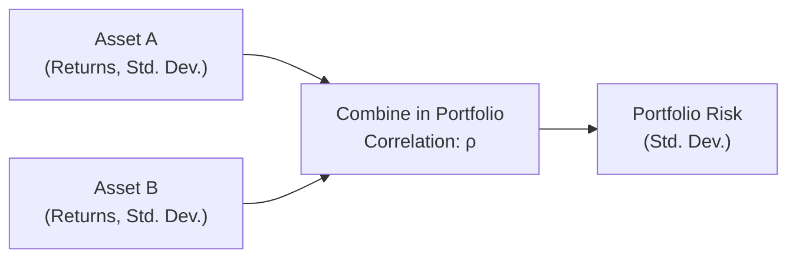

## Introduction

Correlation is a key concept for anyone building or managing a portfolio. Correlation measures how two or more assets move in relation to each other, and it can significantly influence the risk of a combined portfolio. In simple terms, if you hold two assets that have perfectly positive correlation, you won’t see much risk reduction when you mix them. But if those assets have low or even negative correlation, you might experience substantial diversification benefits. And who doesn’t love that feeling of standing on safer ground?

In this article, we’ll walk through the fundamentals of correlation, how it’s calculated, and why it matters for portfolio risk. We’ll cover a few math examples (no worries, we’ll take it slow) and explore special scenarios like correlation breakdown during market stress, which often catches investors by surprise. We’ll also discuss how practitioners forecast correlation and apply it to portfolio construction. Finally, we’ll wrap up with glossaries, references, exam tips, and a quiz. Ready?

## Understanding Correlation

Correlation, often denoted by the Greek letter ρ (rho), measures the linear relationship between two variables (in our world, asset returns). It ranges from –1.0 to +1.0:

• ρ = +1.0 means perfectly positive correlation: The asset returns move together in lockstep.  
• ρ = –1.0 means perfectly negative correlation: The assets move exactly opposite of each other.  
• ρ = 0.0 means zero correlation: The assets have no linear relationship in their movements.

You might recall times, say in your own portfolio, when you thought you were diversified because you had different asset classes—only to see them all drop at the same time. Surprise! That’s often explained by higher-than-expected correlations among these assets, especially during market turmoil.

## Mathematical Foundations and Formulas

To get a handle on how correlation affects portfolio risk, let’s review the standard deviation (σ) of a two-asset portfolio. If you have two assets, A and B, with weights w_A and w_B (where w_A + w_B = 1), the portfolio variance is:


\sigma_p^2 = (w_A \sigma_A)^2 + (w_B \sigma_B)^2 + 2 \, w_A \, w_B \, \sigma_A \, \sigma_B \, \rho_{A,B},


where

• σ_A and σ_B are the standard deviations of Assets A and B, respectively.  
• ρ_(A,B) is the correlation between Assets A and B.  

The portfolio standard deviation (σ_p) is the square root of the above variance. Notice how the correlation term can meaningfully influence the last piece of the puzzle: the 2 w_A w_B σ_A σ_B ρ_(A,B) part.

### A Quick Example

Imagine a portfolio of two assets, each with a 10% standard deviation (0.10). Suppose you invest equally in both (w_A = w_B = 0.5):

• The standard deviation of each asset, σ_A = σ_B = 0.10.  
• Correlation scenarios:
  1. ρ = +1.0  
  2. ρ = 0.0  
  3. ρ = –1.0  

Using the portfolio variance formula:

1) ρ = +1.0 (Perfectly Positive)  

\sigma_p^2 = (0.5 \times 0.10)^2 + (0.5 \times 0.10)^2 + 2 \times 0.5 \times 0.5 \times 0.10 \times 0.10 \times 1.0
  

\sigma_p^2 = 0.25 \times 0.01 + 0.25 \times 0.01 + 0.5 \times 0.01
  

\sigma_p^2 = 0.0025 + 0.0025 + 0.005 = 0.01
  

\sigma_p = \sqrt{0.01} = 0.10 \quad \text{(or 10%)}
  
No diversification benefit. The combined portfolio risk is exactly the same as each individual asset.

2) ρ = 0.0 (Zero Correlation)  

\sigma_p^2 = 0.0025 + 0.0025 + 2 \times 0.5 \times 0.5 \times 0.10 \times 0.10 \times 0 
  

\sigma_p^2 = 0.005 + 0 = 0.005
  

\sigma_p = \sqrt{0.005} \approx 0.0707 \quad \text{(or about 7.07%)}
  
Here, the risk is lower than 10%, thanks to partial diversification.

3) ρ = –1.0 (Perfectly Negative)  

\sigma_p^2 = 0.0025 + 0.0025 + 2 \times 0.5 \times 0.5 \times 0.10 \times 0.10 \times (-1)
  

\sigma_p^2 = 0.005 - 0.005 = 0
  

\sigma_p = 0
  
That’s right, a perfect hedge. You can theoretically combine these two assets in such proportions that your overall risk is zero—though in practice, perfect negative correlation is about as rare as a red diamond.

This example directly shows how correlation (or ρ) can significantly inflate or reduce your portfolio’s risk.  

## Diversification Benefit

The goal of mixing assets with low or negative correlation is to achieve a Diversification Benefit, which reduces overall portfolio volatility. By placing less weight on correlated assets, you’re effectively smoothing out the ups and downs. That’s the beauty of portfolio theory. As we see in the above formula, when ρ is smaller (or negative), the last term in the variance equation works in our favor and brings down total volatility.

Broadly, that’s why you hear folks say, “Don’t put all your eggs in one basket.” And hey, even though it’s probably the oldest cliché in finance, the science behind it remains powerful.

## Correlation Breakdown in Times of Stress

A tricky reality is that correlations can change over time, sometimes abruptly. Assets you thought were unrelated may become highly correlated in a crisis. Correlation Breakdown is the phenomenon in which previously stable correlations (often near zero) shoot up toward +1.0 in times of market stress.

You might recall the 2008 financial crisis. Diversified portfolios often seemed to “converge” in their performance: everything tanked together. For many investors, that shattered the illusion that owning a bit of everything would protect them in a meltdown.

Why does correlation breakdown happen?  
• Flight to safety: Investors around the world may panic and dump risky assets.  
• Herd behavior: Everyone follows everyone else.  
• Systemic risk: Financial institutions are interlinked, causing one meltdown to spread to others.  

It can be unsettling to learn that correlation isn’t necessarily stable. If you rely on historical data from calm periods, you might underestimate how correlated your assets could become in a market freefall.

## Estimating and Forecasting Correlation

Practitioners use various methods to estimate or forecast correlation. Some are straightforward (historical correlations), while others get pretty high-tech (e.g., exponentially weighted moving average or advanced machine-learning approaches). Common methods:

1. Historical Correlation: Calculate standard correlation from historical returns.  
2. Rolling Window Approach: Use a moving window (e.g., the last 36 months) to measure how correlations evolve.  
3. GARCH (Generalized Autoregressive Conditional Heteroskedasticity) Models: More sophisticated time-series models that capture how volatility (and therefore correlation) changes over time.  
4. Multi-Factor Models: Infer correlation structures from factor exposures. If two assets share similar factor exposures, they might exhibit higher correlation.

The essential point: correlation is not a fixed parameter. It’s dynamic. In day-to-day portfolio management, that means you may want to regularly update your correlation estimates, especially if you suspect a shift in regimes—like transitioning from a low-volatility bull market to a more turbulent environment.

### A Simple Python Example

Below is a tiny snippet in Python illustrating how a practitioner might compute a rolling correlation between two assets, given their daily returns. Let’s label them returns_A and returns_B:

```python
import pandas as pd

# Create a DataFrame
df = pd.DataFrame({
    'AssetA': returns_A,
    'AssetB': returns_B
})

rolling_corr = df['AssetA'].rolling(60).corr(df['AssetB'])

print(rolling_corr.tail(10))
```

In a real scenario, you’d store or visualize these rolling correlations to see how the relationship changes over time. If you notice a persistent upward drift in correlation, you might dial down your allocation to one of the assets, or investigate other low-correlation exposures.

## Cross-Asset Correlation and Geographic Overweights

Correlation is also crucial when you decide on sector or geographic tilts. Suppose you overweight certain regions, like Europe and Asia, under the assumption they’re relatively uncorrelated to your domestic holdings. If the real correlation is higher than you anticipated—especially in crisis periods—then your portfolio might be more concentrated than you intended.

• Equities across different regions can become more correlated in global downturns.  
• Fixed income and equity, typically uncorrelated, can converge in severe risk-off scenarios.  
• Real assets (e.g., commodities, real estate) that are usually lowly correlated might spike in correlation during liquidity crunches.

That’s not to say you should abandon geographic or sector overweights. Rather, approach them with an ongoing correlation watch. As the global market environment shifts, so might the correlations that drive your diversification strategy.

## Visualizing Correlation in Portfolio Construction

Below is a simple Mermaid.js flowchart that illustrates how correlation factors into constructing a two-asset portfolio. (Imagine the lines converge on the final portfolio risk calculation.)



Here, the correlation (ρ) acts as a connector that modifies the portfolio’s overall risk profile.  

## Practical Guidelines for Portfolio Management

1. Don’t Rely on a Single Number: Correlations can be unstable. A single ρ estimated from historical data might lull you into a false sense of security.  
2. Track Changing Correlations: Implement rolling, time-sensitive correlation analyses.  
3. Stress Test Different Scenarios: Consider correlation spike scenarios (like ρ = +0.9 or +0.95) between main asset classes in your risk simulation.  
4. Diversify Across Regions and Styles: Even if correlations converge during extreme stress, you can often reduce risk through careful allocations to alternative assets or strategies (e.g., market-neutral, or real assets with different drivers).  
5. Factor Analysis: Evaluate each asset’s factor exposures to see if they overlap. Two assets might appear uncorrelated historically but share a hidden factor that can cause them to move together in certain conditions.  

## Beta (β) and Correlation

Beta (β) measures an asset’s sensitivity to broader market movements and is a close relative of correlation. The formula for beta is usually expressed as:


\beta = \frac{\text{Cov}(R_i, R_m)}{\sigma_m^2},


where R_i is the return of the asset, R_m is the return of the market, and σ_m^2 is the variance of the market. This is closely related to correlation through:


\text{Cov}(R_i, R_m) = \rho_{i,m} \, \sigma_i \, \sigma_m.


Thus, if an asset has a high correlation with the market—and a reasonable standard deviation relative to the market—it’s likely to have a high beta, too. From a portfolio risk perspective, if you have a bunch of assets with high betas, you could end up with a portfolio that’s heavily exposed to systemic swings in the market.

## Correlation Breakdown and Stress Scenarios: Personal Reflection

I remember back in the day when I managed a small personal account with a blend of developed market equities, emerging market equities, and some commodity ETFs. I was all excited because historically, these segments had fairly low correlations with one another. Then came a sudden global sell-off, and I recall logging in to my account thinking, “Surely at least one bucket is doing fine.” But no—everything was in the red, and they all seemed to be dropping almost in unison. It was a humbling experience that reminded me correlation is just a snapshot of historical data, not an unchanging fixture in the financial universe.

## Glossary

• Correlation Breakdown: When previously low (or moderate) correlation between assets suddenly jumps toward +1.0, often during a crisis.  
• Diversification Benefit: The reduction in overall portfolio risk achieved by combining assets with less-than-perfect correlations.  
• Beta (β): A measure of an asset’s sensitivity to market movements, closely related to correlation and variance of returns.

## Exam Tips

• Candidates often overlook the dynamic nature of correlation. If you see an exam question on portfolio variance, remember the 2 w_A w_B σ_A σ_B ρ term.  
• Be ready to address scenarios of correlation breakdown. You might see a question describing how correlations soared during a crisis, prompting you to recalculate portfolio risk.  
• Practice quick calculations: you might get item sets requiring you to compute portfolio standard deviations for different correlation assumptions.  
• Always connect correlation to the concept of beta (systematic risk) and how it influences overall portfolio performance in up or down markets.  
• Don’t forget to mention the limitations of historical correlation data in your short-answer or essay responses.

## References

- Solnik, B. (1974). “Why Not Diversify Internationally Rather Than Domestically?” Financial Analysts Journal.  
- Solnik, B. (1987). “Using Financial Prices to Test Exchange Rate Models: A Note.” Journal of Finance.  
- CFA Institute, “Reading on Correlation and Regression Analysis,” 2025 Level I Curriculum.  
- Markowitz, H. (1952). “Portfolio Selection.” The Journal of Finance, 7(1): 77–91.  

---

## Assess Your Knowledge of Correlation and Portfolio Risk



### Which term best describes the situation when assets that were previously uncorrelated suddenly become highly correlated during market stress?

- [ ] Diversification benefit
- [ ] Beta effect
- [x] Correlation breakdown
- [ ] Reversion to the mean

> **Explanation:** Correlation breakdown occurs when correlation patterns change drastically, often rising sharply in a crisis.

### When combining two assets in a portfolio, which formula component directly incorporates correlation?

- [x] 2 wA wB σA σB ρ(A,B)
- [ ] wA + wB
- [ ] E(RA) + E(RB)
- [ ] (σA + σB) / 2

> **Explanation:** The term 2 wA wB σA σB ρ explicitly reflects the impact of correlation on portfolio variance.

### If two assets have a correlation of –1, how does that affect their portfolio variance in theory?

- [x] It can reduce portfolio variance to zero if weights are chosen appropriately.
- [ ] It has no effect on portfolio variance.
- [ ] It increases the expected return but not the variance.
- [ ] It suggests they move in the same direction.

> **Explanation:** Perfect negative correlation allows for a “perfect hedge,” potentially bringing total variance to zero.

### In practice, how does correlation typically behave during severe market downturns?

- [ ] It typically becomes more negative.
- [ ] It always remains constant.
- [x] It often increases toward +1.
- [ ] It becomes zero.

> **Explanation:** In downturns, traditionally uncorrelated assets often start moving together, pushing correlation closer to +1.

### Which of the following is not generally a recognized method for forecasting correlation?

- [ ] Rolling window correlations
- [x] Coin flips
- [ ] Multi-factor model approaches
- [ ] GARCH or other time-series models

> **Explanation:** Coin flips are not a forecasting method; the others are legitimate techniques for estimating correlation.

### What is the main benefit of adding assets that have low or negative correlation with existing portfolio holdings?

- [x] A reduction in overall portfolio risk.
- [ ] A guaranteed increase in market returns.
- [ ] Higher leverage for the same portfolio size.
- [ ] Regulatory approval for risk-free returns.

> **Explanation:** When correlation is low or negative, the diversification benefit helps reduce total risk.

### If an asset has a high correlation with the market and a relatively large standard deviation, what can we infer about its beta?

- [x] The beta is likely to be high.
- [ ] The beta is likely to be zero.
- [x] It might be sensitive to broad market movements.
- [ ] The beta is negatively related to correlation.

> **Explanation:** Beta correlates with how much an asset moves with the market. High correlation and relatively large volatility often imply a higher beta.

### In a 2-asset portfolio where ρ = 0 (zero correlation), how would we expect the portfolio’s standard deviation to compare to the weighted average of the assets’ individual standard deviations?

- [x] It is always lower than the weighted average but higher than zero.
- [ ] It is exactly the same as the weighted average.
- [ ] It cannot be computed.
- [ ] It is higher than the weighted average.

> **Explanation:** With zero correlation, there is some risk reduction, making the standard deviation lower than the simple weighted average.

### Why might an investor periodically update correlation estimates?

- [x] Because correlations can change over time, especially during regime shifts.
- [ ] To reduce the transaction costs in the portfolio.
- [ ] To lock in a static asset allocation.
- [ ] To comply with insider trading laws.

> **Explanation:** Correlation isn’t a permanent statistic; it can shift with market conditions, requiring updated estimates.

### In times of market crisis, correlation among different asset classes often increases. True or False?

- [x] True
- [ ] False

> **Explanation:** Historical evidence shows that in crises, correlations tend to move upward, causing assets to become more interlinked.


