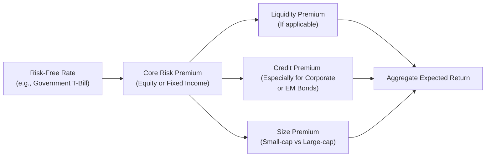

Understanding the Concept of Risk Premium  
Imagine for a second that your friend is offering you the chance to invest in a brand-new app that might revolutionize how people order groceries. That friend says, “We’ll give you 12% if you join us, no questions asked.” But you think, “Yeah, but the risk-free bank deposit is only giving me 2%.” Because this new app venture is much riskier, you’re expecting to earn something more than the 2% risk-free rate to make it worth your while. That “extra something” is precisely what we call the risk premium. Formally, a risk premium is the additional return above the risk-free rate that compensates investors for facing uncertainty or volatility in a risky asset.

There’s a decent chance you’ve encountered these concepts in earlier chapters—particularly around the idea that investors want compensation for taking on more risk than they would if they had simply locked away their money in a bank. In other parts of this text, especially sections 2.1 (Characteristics of Major Asset Classes) and 2.2 (Risk Aversion, Utility Theory, and Portfolio Selection), we’ve looked at the very basics of risk and returns. Now we’re focusing on a deeper dive into precisely what that extra fraction of return is (the risk premium), where it comes from, and how it interacts with different segments of financial markets.

Types of Risk Premium  
Equity Risk Premium.  
This is the additional return investors demand for holding equities over a risk-free asset. In real-world practice, people often look up historical averages of stock market returns (say the S&P 500 in the US) relative to Treasury bills or government bonds to figure out what the equity risk premium has been. But as you’ll see, the premium can fluctuate—and sometimes, we end up quoting a forward-looking premium that embodies expectations of future market performance.  
• Example (Numeric Illustration): If the expected annual return on a broad equity index is 8%, and the risk-free rate is 3%, then the equity risk premium is 8% – 3% = 5%.

Bond Risk Premium.  
Bonds also come with their own brand of risk premium—particularly when you move away from Treasuries or government-backed securities into corporate bonds or emerging market bonds. The premium here should, in theory, compensate you for default risk, credit downgrades, and other bond-specific hazards. You might see a corporate bond yield 5% while a Treasury bond with the same maturity yields 2%. The premium, which is 3% in this simplified example, reflects the market’s perception of how risky the corporate issuer is compared to the government.

Liquidity Premium.  
Have you ever tried to sell something that not many other people want to buy—like an obscure collectible? You might have had to accept a lower price or wait longer to find a buyer. In finance, illiquid assets sometimes have higher yields or expected returns just because investors want to be rewarded for the possibility that they might not be able to exit their positions immediately at a fair price. This is the liquidity premium. Classic examples of investments with notable liquidity premiums include small-cap stocks with low trading volumes or private equity investments that might lock your funds away for years.

Specialty Risk Premiums (Brief Mentions).  
• Size Premium: The additional return that small-cap companies might (historically) provide over large-cap companies, partly to compensate for lower liquidity and higher perceived business risk.  
• Value Premium: The notion that “value stocks” often outperform “growth stocks” over the long horizon—at least this has been something of a puzzle that resurfaces in factor investing debates.  
• Country Risk Premium: In emerging or frontier markets, investors often tack on an extra return for political risk, regulatory uncertainty, and currency considerations.

Market Segmentation and Impact on Risk Premium  
Market segmentation refers to the division of broad financial markets into smaller, relatively distinct sub-markets. Examples include:  
• Small-cap vs. large-cap stocks.  
• Corporate vs. government bonds.  
• Developed vs. emerging equity markets.

Now, how does segmentation drive varying risk premiums? Think about it this way: A large-cap stock in a well-established market might have lower volatility (relatively speaking) because there’s a wide investor base. Meanwhile, a small-cap stock might be overlooked or under-researched, so the community of willing buyers is smaller. Fewer buyers may mean more price fluctuation, so that small-cap stock’s equilibrium return generally offers a higher premium—compensating the intrepid folks who are brave enough to hold it.

Similarly, in emerging markets, there may be less transparency or more political risk, so investors require additional return over developed markets to entice them. Institutional constraints—say, mutual funds only allowed to invest in large-cap stocks or certain regulatory requirements restricting pension funds from high-yield bonds—can play a major part in how these segments remain “segmented.” If large institutions can’t or won’t touch certain markets, the smaller pool of participants there might demand bigger returns.  

Historical Performance and Empirical Findings  
We often refer to the work of Mehra and Prescott, who famously called the equity risk premium a “puzzle” because historically, the difference between equity returns and the risk-free rate has been quite large—more than what can be justified by classical economic models. Over the last century in the United States, for instance, many studies show equity risk premiums averaging around 4% to 6% or more per year. But there is a lot of variation: Periods right after major economic crises sometimes see a higher realized premium because many investors are so risk-averse they demand a lot more compensation, while times of market exuberance might see a narrower differential.  

Research in factor investing has extended these findings to smaller segments of the market. For example, small-cap equities in the US historically produced average annual returns that often beat large-cap stocks—but with higher volatility. Some might label part of that extra return the “size premium.” Meanwhile, studies in different regions show that a “value premium” might exist. Liquidity premiums, in turn, show up heavily in markets with fewer traders and higher transaction costs.

Behavioral biases also contribute to market segmentation. If everyone believes emerging markets are too scary, a certain subset of more risk-tolerant investors can buy those assets at discounted prices, leading to potential higher returns if the risk event does not materialize. Then again, sometimes the event does materialize—political upheaval or currency crises, for example—and that’s when these same investors might realize losses that justify the premium.  

In short, the interplay of supply, demand, investor psychology (including fear and optimism), and institutional regulations can keep these markets somewhat segmented. That means not everyone is willing to jump into every market, so risk premiums can vary significantly among them.

Behavioral Biases and Institutional Constraints  
There’s another layer: the idea that certain market participants might “segregate” their investments due to psychological or emotional factors. Maybe a pension fund’s board is worried about short-term losses and decides to avoid small-cap emerging stocks even if the board can stomach the risk from a long-horizon perspective. This behavioral short-sightedness or aversion spawns a higher premium for those less conventional assets.

Institutional constraints can be even more tangible. If a hedge fund can’t hold more than 20% of its capital in illiquid assets, that will limit its ability to chase higher returns in obscure private partnerships. Smaller supply of capital flows to those markets, higher illiquidity persists, and—voilà—a bigger liquidity premium.  

Diagrams and Illustrations  

Below is a conceptual diagram showing how risk premiums stack on top of a baseline risk-free rate. We also visualize how market segmentation can shift these premiums:



In this simplified flowchart, everything begins with that baseline risk-free rate. Then, depending on the asset characteristics (like small-cap status, liquidity issues, credit risk, or equity risk), we “stack” additional premiums until we arrive at the final expected return. This diagram also suggests that market segmentation can arise at points F, G, or H—basically, whenever unique factors apply to smaller subdivided markets.

Short Python Example: Estimating a Simple Equity Risk Premium  
Sometimes you just want a quick calculation using historical data to get an estimate of the equity risk premium.

```python
import numpy as np

equity_returns = np.array([0.08, 0.10, 0.05, 0.12, 0.07, 0.11, 0.03, 0.09, 0.15, 0.04])

risk_free_rate = 0.02

avg_equity_return = np.mean(equity_returns)

equity_risk_premium_est = avg_equity_return - risk_free_rate

print("Average annual equity return:", round(avg_equity_return, 4))
print("Estimated equity risk premium:", round(equity_risk_premium_est, 4))
```

The output might tell you something like:  
• Average annual equity return: 0.084  
• Estimated equity risk premium: 0.064 (or 6.4%)  

Of course, this is a straightforward approach that ignores compounding, potential outliers, and forward-looking considerations. But it’s helpful for a quick gauge.

Mathematically, you may also see the risk premium in formula form, such as:


\text{Risk Premium} = E(R_i) - R_f


where \\( E(R_i) \\) is the expected return on asset \\( i \\), and \\( R_f \\) is the risk-free rate. If you want to break out all the components (equity premium, size premium, liquidity premium, etc.), you might see:


E(R_i) = R_f + \text{Equity Premium} + \text{Liquidity Premium} + \text{Size Premium} + \ldots


Exam Relevance and Key Takeaways  
CFA Level I candidates, as well as advanced learners, should internalize the idea that risk premium is central to asset pricing and portfolio costruction. Remember a few key points:  
• Risk premiums arise from uncertainty.  
• Different asset classes and market segments command different premiums due to factors like liquidity, credit, size, or other unique risk factors.  
• Market segmentation can magnify or alter these premiums.  
• Historical analysis is useful but not always predictive of the future; it can be influenced by extraordinary events, as highlighted in the Mehra and Prescott research on the equity risk premium puzzle.  
• Behavioral biases and institutional constraints can keep markets from fully converging, preserving the distinct risk premiums across various segments.

Final Thoughts  
So there we have it: the reason folks are willing to invest in riskier markets is that they want (and usually demand) extra return to compensate for those sleepless nights. And ironically, many investors remain content with “safer” segments, leading riskier pockets of the market to stay somewhat segmented. Stick around in the upcoming sections—like 2.7 (Incorporating Leverage in Basic Return Analysis) and beyond—to see how these premiums fit into broader modern portfolio theory.

References  
• Mehra, R., & Prescott, E. (1985). “The Equity Risk Premium: A Puzzle.” Journal of Monetary Economics.  
• Data and research on factor premiums are widely covered in academic journals and the CFA curriculum. Notably, Eugene Fama and Kenneth French’s work on size and value effects, as well as more recent expansions into liquidity and profitability factors, is also quite relevant.

## Test Your Knowledge of Risk Premiums and Market Segmentation



### Which of the following statements best describes the risk premium?

- [ ] It is the difference between nominal and real returns.  
- [ ] It is the discount rate used only for high-growth stocks.  
- [x] It is the compensation above the risk-free rate for assuming additional uncertainty.  
- [ ] It is determined entirely by government policy.  

> **Explanation:** The risk premium is the amount of return above the risk-free rate that compensates investors for volatility or uncertainty in future returns.

### What primarily drives the equity risk premium in practice?

- [ ] The difference between a company’s earnings per share and its dividend payout.  
- [ ] Era-specific government interest rate mandates.  
- [ ] Random fluctuations in CEO compensation.  
- [x] Compensating investors for higher volatility and uncertainty in corporate earnings.  

> **Explanation:** The equity risk premium compensates shareholders for taking on more volatility and uncertainty compared to risk-free government securities.

### How do behavioral biases contribute to market segmentation?

- [ ] They have no impact; risk premiums are solely determined by supply and demand curves.  
- [x] They can keep some investors away from certain markets, sustaining distinct risk premiums.  
- [ ] They cause government treasury yields to rise drastically.  
- [ ] They create no meaningful effects in highly liquid markets.  

> **Explanation:** Behavioral biases, like excessive fear or loss aversion, can reduce the pool of willing investors for certain asset classes, thereby keeping risk premiums higher in those segments.

### Which of the following is most closely related to the liquidity premium?

- [ ] Bulk discounts for large institutional trades in liquid markets.  
- [ ] Monetary policy decisions by central banks in advanced economies.  
- [x] Additional yield required for assets that cannot be quickly sold at fair value.  
- [ ] The difference between a bank’s deposit rate and loan rate.  

> **Explanation:** A liquidity premium compensates investors for the increased difficulty and cost of exiting a position in assets that are not easily traded.

### Which factor is commonly reflected in bond risk premiums?

- [x] Credit risk or default risk of the issuer.  
- [ ] Overconfidence by smaller investors.  
- [ ] Management fees in mutual funds.  
- [ ] High-frequency trading spreads.  

> **Explanation:** Bonds from non-government issuers often must compensate investors for the possibility of default, which adds to their overall yield above government bond yields.

### If a small-cap stock has historically outperformed large-cap stocks, part of that outperformance might be attributed to:

- [ ] A more diverse shareholder base.  
- [ ] Lower transaction costs for small entities.  
- [x] A size premium that rewards investors for extra risk and lower liquidity.  
- [ ] Random statistical noise rather than economic rationale.  

> **Explanation:** Small-cap stocks tend to have higher volatility, less coverage, and more liquidity risk, all of which can lead to a size premium.

### According to Mehra and Prescott, why is the equity risk premium sometimes viewed as a “puzzle”?

- [ ] Equities usually trade at lower prices than corporate bonds.  
- [x] Historical returns on equities have exceeded risk-free rates by more than economic models predict.  
- [ ] Equity risk premiums are entirely explained by short-sale constraints.  
- [ ] Only small countries have witnessed equity risk premiums exceed inflation rates.  

> **Explanation:** Their seminal work highlighted that observed equity risk premiums were unexpectedly high given standard economic models, posing a puzzle.

### Which statement best describes market segmentation?

- [ ] The process of splitting a single asset into multiple derivative products.  
- [x] The division of the market into smaller, distinct subgroups (e.g., small-cap vs. large-cap).  
- [ ] Assigning consumers into different risk categories for credit approval.  
- [ ] Government-imposed restrictions on cross-border currency flows.  

> **Explanation:** Market segmentation refers to dividing the overall market into subgroups that can have unique risk/return profiles and thus different premiums.

### Which of the following is most likely to sustain higher risk premiums in emerging equity markets?

- [ ] Minimal investor interest and the presence of capital controls.  
- [x] Increased political, currency, and regulatory risks leading to fewer investors willing to participate.  
- [ ] Lower transaction costs compared to developed markets.  
- [ ] Strict enforcement of advanced accounting standards.  

> **Explanation:** The volatility and uncertainty from political and currency risks, plus fewer investors comfortable or allowed to invest there, can drive higher risk premiums in emerging markets.

### True or False: A key reason for a liquidity premium is that markets are always efficient and instantly process price-relevant information.

- [ ] True  
- [x] False  

> **Explanation:** In less liquid markets, information may not be instantly reflected in prices, and even if the pricing is accurate, it might be challenging to find a buyer or seller immediately without slippage or markdowns.


