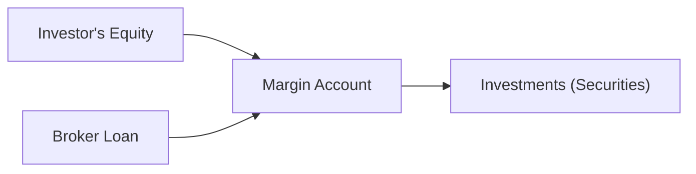

## Introduction

I remember the first time I operated a margin account. It felt like stepping into a faster car—exciting, but with a bit of nervousness about losing control. Anyway, that's kind of what leverage can do to a portfolio: it can accelerate returns on any given day, for better and for worse. In plain terms, leverage involves borrowing money to invest. If your investment goes up, the gains can be amplified. But if it goes down, well, the losses can mount quickly. In this section, we’ll walk through the essential aspects of leverage and how it affects basic return analysis. We’ll touch on margin accounts, leverage ratios, the cost of borrowing, margin calls, and the dreaded potential drawdowns that accompany leveraged positions.

## Understanding Leverage

Leverage, in its simplest sense, is the use of borrowed capital or financial instruments to enhance the potential return of an investment. While it is often touted as a quick way to boost returns, leverage also adds proportional risk to the portfolio. A highly leveraged portfolio is more prone to loss if things go south—so it’s crucial to have a solid grasp of how leverage works before diving in.

A typical example: If you invest $100 of your own money in a stock, you might earn or lose 10% on that $100, resulting in a $10 gain or loss. But if you borrow another $100, you can now invest $200 total. That means a 10% increase yields $20 in gains. Of course, the flip side is that a 10% decrease leads to a $20 loss, which is double what you might have originally lost if you had not borrowed. That’s the fundamental nature of leverage: it magnifies volatility in both directions.

## Margin Accounts and Borrowed Capital

In practice, many investors use margin accounts to access leverage. A margin account is a type of brokerage account that allows you to borrow funds from the broker, using the securities in the account as collateral. Think of it like a mortgage on a house, except your brokerage firm is the lender and your stocks or bonds are the collateral. The critical difference is that your collateral can drop in value very quickly, possibly triggering a margin call if the collateral’s value dips below a certain threshold.

If you’re curious about how all these moving parts fit together, a quick diagram can help illustrate the flow of funds in a margin transaction:



In this diagram, you (the investor) contribute your own equity (A) into a margin account (B). The broker provides a loan (D), which is added to your equity, allowing you to purchase a larger amount of securities (C). Of course, you have to pay interest on this loan, and if the value of your securities drops, you may be required to deposit more funds.

Margin requirements are regulations set forth by exchanges or regulators (you may hear about "Reg T" in the United States, for instance) that stipulate the minimum amount of equity an investor must maintain in a margin account. If your equity portion drops below this threshold, the broker issues a margin call, forcing you to increase your equity by either depositing cash or selling some securities.

## Basic Return Analysis with Leverage

When analyzing returns for a leveraged position, you must take into account both the gains or losses from the investment and any costs tied to borrowing. Formally, you could say:

Let:
• P₀ = Initial price of the asset (per share, for example)  
• P₁ = Price of the asset at the end of the period  
• L = Amount borrowed  
• E = Investor’s own equity  
• r = Annualized interest rate on borrowed funds  
• t = Time period in years (or fraction of a year)  

The leveraged return on your equity position, R_E, could be approximated by:


R_E = \frac{(P_1 - P_0)\times \text{(number of shares)} - (L \times r \times t)}{E}.


Because you’ve borrowed capital to buy more shares, your gains or losses are multiplied relative to the equity. However, don’t forget that you’re paying interest on the borrowed funds.

## Real-World Example (2:1 Leverage)

Suppose you have \$10,000 in cash and your broker allows a 2:1 initial leverage ratio on certain equities. This means you can borrow another \$10,000 to invest, giving you a total of \$20,000 of exposure. If your chosen stock climbs by 10% in one year, your \$20,000 of stock is now worth \$22,000—so you gain \$2,000. But you must pay interest on the borrowed \$10,000. Assuming a 5% interest rate, you’ll pay \$500 for the year. Thus, your net profit is \$2,000 - \$500 = \$1,500. On your original \$10,000 of equity, that’s a 15% return, which is an amplified return compared to the simple 10% the stock gained.

But if the stock drops 10% instead, you lose \$2,000 on the investment, pay \$500 in interest, and end up losing \$2,500 on your \$10,000 equity, or a -25% return. You see how leverage can play out—double the upside, double the downside, plus interest costs. And if the value happens to fall so far that your margin equity is below regulatory or broker limits, you’d receive a margin call. That’s not a pleasant surprise, believe me.

## Analyzing Portfolio Performance with Leverage

Now that we see how a simple leveraged trade works for a single asset, let’s think about this on a portfolio-wide level. The basic idea is similar: you examine the net returns of your entire portfolio while considering borrowed capital and interest costs. It’s common to track performance metrics like alpha, beta, or the Sharpe ratio on a levered portfolio. However, keep in mind:

• The cost of leverage (interest or financing charges) reduces net returns.  
• Higher leverage increases the portfolio's exposure to market swings.  
• Risk metrics, such as volatility and Value at Risk (VaR), must be re-evaluated for levered positions since potential losses are magnified.  

In a multi-asset portfolio, leveraging can be more nuanced. Some assets might be financed using margin loans, while others might use derivatives—like futures or options—to gain leveraged exposure without an outright loan. Cross-reference the content on risk analysis (e.g., see 2.3 on calculating variance and correlation) to appreciate how combining leveraged and unleveraged positions can impact the overall portfolio’s risk profile.

### A Quick Python Example

For those who enjoy a bit of coding to get a sense of leveraged performance, here's a simplified snippet that calculates annualized returns under various leverage assumptions:

```python
import numpy as np

def leveraged_return(initial_equity, leverage_ratio, annual_return, interest_rate):
    # total capital = equity + borrow
    total_capital = initial_equity * leverage_ratio
    # absolute gain or loss
    gain_loss = total_capital * annual_return
    # interest cost on borrowed portion
    borrowed_amount = total_capital - initial_equity
    interest_cost = borrowed_amount * interest_rate
    # net profit
    net_profit = gain_loss - interest_cost
    # return on equity
    return_on_equity = net_profit / initial_equity
    return return_on_equity

equity = 10000
annual_ret = 0.10
interest = 0.05

for lev_ratio in [1, 1.5, 2]:
    r = leveraged_return(equity, lev_ratio, annual_ret, interest)
    print(f"Leverage = {lev_ratio}: Return on Equity = {r:.2%}")
```

In this simple example, you’ll see how the return on equity scales as the leverage ratio goes from 1x (no leverage) to 2x. Indeed, that jump in returns looks nice on the upside, but be mindful the same multiplication effect applies on the downside.

## Regulatory and Practical Constraints

Leverage is powerful and, by extension, heavily regulated. Brokers typically set margin requirements that meet or exceed regulations imposed by entities such as the Federal Reserve Board in the United States or equivalent bodies in other countries. These requirements define how much margin (equity) you must maintain for given asset classes.

Additionally, some investment mandates (for instance, pension funds or mutual funds) have strict limitations on the use of leverage. Hedge funds, private equity firms, and proprietary trading desks may have more flexibility, but they are also subject to oversight (not limited to but often involving the SEC in the U.S. or other global bodies). Tighter rules may come into play post-crisis reforms. If you look back at major financial crises, you’ll notice that over-leveraging created systemic risks when large institutions had limited equity backing massive positions.

## Leverage in Hedge Funds, Private Equity, and Others

You’ll often hear about hedge funds deploying leverage to benefit from arbitrage or event-driven strategies. In private equity, leveraged buyouts (LBOs) similarly rely on substantial borrowed capital. While the principles are the same, the structures tend to be more complex—ranging from bank loans to high-yield bonds and beyond. Fund managers aim to maximize returns on their equity by carefully selecting how much leverage to use and controlling the financing costs.

Of course, regulatory constraints are more fluid for these entities, but private fund managers also face operational and investor-imposed guidelines. They must maintain certain loan covenants and risk metrics to avoid defaults or forced asset sales. In times of stress, that can become a real challenge.

## Drawdown Risks and Margin Calls

Drawdown refers to the decline from a peak portfolio value to a subsequent trough. With leverage, drawdowns can be especially severe because a loss of a given percentage slices deeper into the equity portion. If you have a 2:1 margin ratio, a 25% decline in the asset’s price can translate into a 50% decline in your equity. That’s a dramatic change, and it can be psychologically tough for even seasoned professionals.

Margin calls happen when your equity dips below the maintenance margin requirement. Brokers may notify you (or in many modern setups, you’ll just get an automated message) that you need to deposit more capital or liquidate positions. Failure to take action usually triggers an auto-liquidation of your holdings. Obviously, that can happen at an inopportune moment, possibly locking in large losses.

## Best Practices and Common Pitfalls

• Plan for Worst Cases: It’s easy to get excited by “juiced-up” returns, but always run sensitivity analyses for negative scenarios.  
• Monitor Interest Rates: If borrowing rates rise, your costs may offset gains quickly.  
• Keep an Eye on Correlation: If you’re using leverage across multiple asset classes, watch correlation (see 2.5). A spike in correlation during a market downturn can sabotage even the best diversification plan.  
• Understand Maintenance Requirements: For margin accounts, be crystal clear on how much cushion you need to avoid forced liquidations.  
• Avoid Overconfidence: Don’t get lulled into complacency when markets are calm. Large moves, either single-day or multi-day accumulations, can set off margin calls.  
• Use Stop-Loss Orders: Some traders set stop-losses to protect against abrupt declines. This is not foolproof, but it can help manage risk.

## Glossary

• **Leverage**: The practice of using borrowed funds to enhance potential returns (and amplify potential losses).  
• **Margin Account**: A brokerage account allowing investors to borrow to purchase securities, with the purchased assets acting as collateral.  
• **Margin Call**: A demand by a broker to deposit more money or securities so that the margin account is brought up to the minimum required level.  
• **Drawdown**: The decrease from a peak value to a trough value in portfolio performance, often expressed as a percentage.

## Final Exam Tips

• Understand the Math: Familiarize yourself with formulas and quick calculations for leverage, paying special attention to the cost of borrowing.  
• Practice Scenario Analysis: CFA exams often present hypothetical shocks—what happens if the market moves sharply up or down? Be ready to demonstrate how margin calls occur.  
• Be Thorough with Risk Measures: Show your capacity to incorporate leverage into standard performance metrics (Sharpe ratio, alpha, etc.).  
• Link to Other Topics: Keep in mind how correlation and diversification can interact with leverage. A well-diversified portfolio might endure a drawdown better than a single concentrated position—even (or especially) with leverage.  
• Crisp, Clear Explanations: The exam might ask you to articulate how leverage magnifies returns. Use concise examples.  

## References

- CFA Program Materials on Margin and Leveraged Portfolios.  
- Brealey, R. A., Myers, S. C., & Allen, F. (latest edition). “Leverage and Financing Strategies” in Principles of Corporate Finance.  
- Various Regulatory Guidelines (e.g., Federal Reserve Margin Requirements in the U.S.)  

## Test Your Knowledge: Leveraged Portfolios and Margin Accounts



### In a margin account, what is the primary purpose of the broker’s loan? 
- [ ] To guarantee the investor’s gains in a leveraged position.
- [ ] To reduce the interest rate the investor must pay for borrowed funds.
- [x] To provide additional capital (beyond the investor’s equity) for purchasing securities.
- [ ] To prevent the investor from incurring any losses on leveraged trades.

> **Explanation:** The broker’s loan provides extra purchasing power. This allows an investor to hold a more significant position than their equity alone would allow, but it also introduces interest costs and potential margin calls.

### What is a key risk associated with 2:1 leverage if the investment decline is 10%?
- [ ] The investor only loses 5% of their capital because leverage “caps” the loss.
- [x] The investor faces around a 20% equity loss before interest expenses.
- [ ] The investor’s position automatically reverts to an unleveraged status.
- [ ] The investor’s portfolio gains remain unaffected by the drop.

> **Explanation:** At 2:1 leverage, a 10% loss on the total invested amount doubles the percentage loss on the investor’s initial equity, translating into roughly a 20% loss (plus interest costs).

### Which of the following best defines a drawdown in a leveraged portfolio?
- [ ] The maximum equity used in a margin account.
- [x] The decline from a peak portfolio value to a trough portfolio value.
- [ ] A sudden margin call triggered automatically by the broker.
- [ ] The upward deviation in a portfolio’s return over a specified period.

> **Explanation:** A drawdown tracks how far the portfolio has fallen from a high point, which is especially critical to monitor in leveraged portfolios.

### Why might an investor use stop-loss orders in a margin account when employing leverage?
- [x] To limit potential losses if the market moves unfavorably.
- [ ] To guarantee a higher margin requirement during volatility.
- [ ] To eliminate interest expenses on borrowed funds.
- [ ] To secure a higher correlation among leveraged positions.

> **Explanation:** Stop-loss orders can reduce the risk of large losses by automatically closing positions if prices drop below a set threshold.

### Which statement is most accurate about margin calls?
- [ ] They only occur when the interest rate on borrowed funds increases.
- [x] They demand that an investor deposit more equity or liquidate positions to meet margin requirements.
- [ ] They are optional notifications to the investor, who can choose not to respond.
- [ ] They affect only bond positions and not equity positions.

> **Explanation:** A margin call forces the investor to bring the margin account back to the required level by depositing additional capital or selling holdings.

### Which of the following is a best practice when applying leverage?
- [x] Conduct thorough scenario analyses, including worst-case outcomes.
- [ ] Assume margins will always remain static, regardless of market moves.
- [ ] Maintain zero cash reserves to maximize potential returns.
- [ ] Rely solely on correlation assumptions from historical data.

> **Explanation:** Smart leverage usage includes stress testing and preparing for adverse scenarios. Historical correlations can shift rapidly, so it’s prudent to consider “what-if” scenarios.

### How does paying interest on borrowed funds affect leveraged returns?
- [x] It reduces the net profit from leveraged positions.
- [ ] It only increases risk if interest rates exceed 20% per annum.
- [x] It must be deducted from gains to arrive at the investor’s actual ROI.
- [ ] It does not affect equity returns in any scenario.

> **Explanation:** Borrowing costs eat into profits, so investor returns must be calculated net of interest payments.

### In a 3:1 leveraged scenario, if an asset’s value increases by 5%, approximately what is the gain on the investor’s equity, ignoring interest expenses?
- [x] 15%
- [ ] 5%
- [ ] 10%
- [ ] 30%

> **Explanation:** With 3:1 leverage, a 5% gain on the total amount translates to a 15% gain on the original equity, excluding interest costs.

### In a multi-asset leveraged portfolio, which risk factor often increases the most when markets become volatile?
- [x] Correlation risk, because typically uncorrelated assets may start moving in tandem during crises.
- [ ] Inflation risk, because borrowed money erodes capital in real terms.
- [ ] Only the interest rate risk, as brokers will reset margin rates daily.
- [ ] Execution risk, due to increased availability of buy-side liquidity.

> **Explanation:** During turbulent times, correlations can spike, undermining diversification benefits in leveraged portfolios.

### Using leverage amplifies the magnitude of both gains and losses in a portfolio.
- [x] True
- [ ] False

> **Explanation:** Leverage magnifies a portfolio’s exposure to market changes, so it increases both upside and downside returns.


