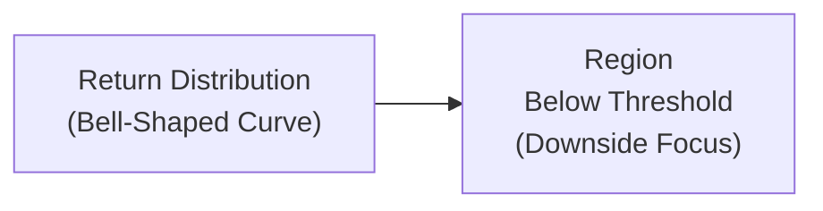

## Introduction

Many investors get a bit nervous when they see a single measure—like standard deviation—used to describe the risk of an entire portfolio. After all, isn’t it kind of strange to treat upside movements just as “risky” as downside movements? If you’re like me, there’s something uncomfortable about that. I remember looking at my own retirement portfolio and thinking, “Sure, I enjoy the times it shoots up by 10%, so why count those gains as if they’re equally distressing?” This is where concepts like downside deviation and expected shortfall come into play. They help us focus more on those returns we dread—namely, the negative returns that can wreak havoc on our portfolios.

Below, we’ll delve into how downside deviation reframes volatility in terms of losses, and how expected shortfall (also often called Conditional VaR) looks at the average loss once your losses breach a certain threshold. Our goal here is to help you gain a deeper appreciation for these measures—why they matter, how they’re calculated, and how you might use them in practice.

## Understanding Downside Deviation

### Why Downside Risk?

At its core, “downside risk” measures that portion of volatility that occurs below a certain acceptable return level or threshold. Sometimes we pick zero—meaning we only care about negative returns—but in a more formal sense, we might pick a “minimum acceptable return” (MAR) or a target such as the risk-free rate. Think of the MAR as the line in the sand you draw for your portfolio. If the return dips below that line, you’re worried. If performance is above that line, you’re generally fine.

The usual standard deviation calculation can sometimes feel too blunt because it lumps in everything on both sides of the mean. Here, though, we’re specifically punishing only the negative outcomes that fall short of a required target. You might hear folks say “semideviation,” “downside deviation,” or “downside risk”—terms that all revolve around negative or sub-threshold side variability.

### The Downside Deviation Formula

Formally, the downside deviation can be expressed as:


\sigma_{\text{downside}} = \sqrt{\frac{1}{n}\sum_{t=1}^{n}\left[\max(0,\theta-R_t)\right]^2}


Where:
• \\(R_t\\) is the return at time \\(t\\).  
• \\(\theta\\) is the threshold or MAR (Minimum Acceptable Return).  
• \\(\max(0, \theta - R_t)\\) focuses only on shortfalls below \\(\theta\\). If \\(R_t\\) exceeds \\(\theta\\), the term is zero.  

In plainer language: take each return that’s below your threshold, measure how far below it is, square that shortfall, sum them up, and take the square root (after dividing by the number of observations).

If you’re used to standard deviation, you’ll notice a key difference: the standard deviation formula uses \\((R_t - \bar{R})^2\\) for all returns, while downside deviation uses \\(\max(0, \theta - R_t)\\) to zero-out anything above the threshold. So upside returns above your target? They’re not penalized at all.

### A Quick Visualization

Sometimes it helps to visualize it. Here’s a simple diagram illustrating the portion of returns below a certain threshold \\(\theta\\). You’ll see that we highlight the “bad part” of the distribution only:



In this simplified depiction, the threshold \\(\theta\\) might be the zero line or a risk-free rate. We’re only worried about that red zone to the left—our shortfall region.

### A Brief Example

Let’s say you track monthly returns of a portfolio over six months:

• Month 1: +2%  
• Month 2: –1%  
• Month 3: +3%  
• Month 4: +6%  
• Month 5: –2%  
• Month 6: –1%  

Let’s pick \\(\theta = 0%\\) as our threshold. We only penalize negative returns. The shortfalls are:

• Month 1: max(0, 0% – 2%) = 0%  
• Month 2: max(0, 0% – (–1%)) = 1%  
• Month 3: max(0, 0% – 3%) = 0%  
• Month 4: max(0, 0% – 6%) = 0%  
• Month 5: max(0, 0% – (–2%)) = 2%  
• Month 6: max(0, 0% – (–1%)) = 1%  

We square these shortfalls, sum them up, divide by 6, and then take the square root:


\sigma_{\text{downside}} = \sqrt{\frac{1^2 + 2^2 + 1^2}{6}} 
= \sqrt{\frac{1 + 4 + 1}{6}} 
= \sqrt{\frac{6}{6}} 
= \sqrt{1} 
= 1\%


So in decimal terms (if these percentages are raw), the downside deviation is 0.01 or 1%. Some might multiply by 100 to keep it in the same percent scale as returns.

### Python Snippet for Downside Deviation

Here’s a tiny snippet if you’re playing around with real data. Suppose you have monthly returns in a Python list:

```python
import numpy as np

returns = np.array([0.02, -0.01, 0.03, 0.06, -0.02, -0.01])
threshold = 0.0

shortfalls = np.maximum(0, threshold - returns)
downside_deviation = np.sqrt(np.mean(shortfalls**2))

print(f"Downside Deviation: {downside_deviation*100:.2f}%")
```

When I run something like this, I get a result around 1%, consistent with the manual calculation.

## Expected Shortfall (Conditional VaR)

### Understanding the Concept

Expected Shortfall (ES), also referred to as Conditional Value at Risk (CVaR), is a measure that tries to capture how bad things can get once you’re already in trouble. Picture Value at Risk (VaR) as a line that says, “There’s a 5% chance you could lose more than X%.” Once you cross that X% line, you’re in the zone of severe losses. Expected Shortfall then says, “Well, given that we’ve crossed that threshold, on average, how big are our losses going to be?”  

I find this measure super practical, especially if you’re in the kind of situation where tail risk is not just a worry—it’s a real possibility (like in a highly levered hedge fund strategy, for instance). If you care about the magnitude of catastrophic losses, expected shortfall can be more informative than standard deviation or plain VaR because it is, well, conditional. It looks only at the worst-case subset of outcomes and averages them.

### The Formal Definition

You’ll often see expected shortfall at a confidence level \\(\alpha\\). Suppose we define VaR at \\(\alpha\\) as the threshold loss that’s exceeded with probability \\((1 - \alpha)\\). In everyday language, if your \\(\alpha\\) is 95%, there’s a 5% chance you’ll lose more than the VaR. Then the expected shortfall is the average of all losses that go beyond VaR\\(_\alpha\\). Mathematically, one common discrete approximation is:


\text{ES}_\alpha = \frac{1}{k}\sum_{i=1}^{k} L_i \quad \text{ where each } L_i \text{ is a loss that exceeds VaR}_\alpha


In more continuous form, you might see something like:


\text{ES}_\alpha = -\frac{1}{\alpha} \int_{0}^{\alpha} \text{VaR}_\gamma \, d\gamma


But for practical day-to-day portfolio calculations, most people use a discrete series of returns, rank them, find the worst \\((1 - \alpha)\\) portion, and then average them.

### Having a Quick Example

Imagine a portfolio with daily returns, and you want a 5% VaR. Let’s keep it simple. Suppose we have 100 trading days of data, sorted from smallest (worst) to largest return:  
• A 5% VaR means we look at the worst 5 days (since 5% of 100 = 5). Let’s say those worst 5 daily returns in ascending order are: –8%, –8.5%, –9%, –10%, –12%.  
• The 5% VaR might be at –8% (the “best” among the worst 5). However, that threshold alone doesn’t tell you how big the losses generally are once you’re in that tail.  
• The expected shortfall is the average of those 5 worst-day returns: \\((–8.0 –8.5 –9 –10 –12)/5 = –9.1%\\). 

Hence, your expected shortfall at 5% is –9.1%. So if a loss event in the worst 5% zone does occur, you can, on average, expect to lose about 9.1%. That’s arguably more informative than just saying “there’s a 5% chance you might lose over 8%.”

## Why These Measures Matter in Real-World Portfolios

### Tail Events and Crisis Periods

Sometimes, focusing on average volatility can lull you into a false sense of security—particularly in markets that are prone to “fat-tail” events or crises. I recall the 2008 financial crisis: Many analysts describing a crisis as a “7-sigma event.” The gist? Our “normal” standard deviation-based measure might’ve misled us about the frequency of truly devastating losses. Tools like downside deviation and expected shortfall can help you keep an eye on the negative tail, which is where real damage occurs.

### Hedge Funds, Alternatives, and Structured Products

We often see more frequent usage of these measures in hedge funds and sophisticated alternative strategies. These strategies might have asymmetric payoff structures (like an option writing program) or illiquid assets that have bunched returns. Focusing on the distribution’s left tail is crucial. If you’re managing a convertible bond arbitrage fund, for instance, you might have mild daily volatility most of the time but occasionally face big negative hits in short time spans.

### Behavioral Considerations

On a personal note, I feel that understanding downside risk helps me sleep better at night. Behavioral finance studies show we’re generally more sensitive to losses than gains. The “loss aversion” phenomenon is real: losing 1% can hurt more than the joy of gaining 1%. Measures like downside deviation align more with how many investors subjectively experience risk. So it’s not just about advanced math—it’s about being psychologically in tune with your clients or with your own behavior too.

## Pros and Cons

### Downside Deviation

• Pros:  
  – Focuses on the portion of volatility investors truly fear (i.e., negative outcomes).  
  – Can be more consistent with investor psychology (loss aversion).  
  – Helpful in managing real wealth targets, such as ensuring a portfolio doesn’t fall below a certain level.  

• Cons:  
  – Downside deviation can ignore valuable information about the shape of the entire distribution.  
  – Not as widely implemented in standard Markowitz portfolio optimization tools, so it’s less “traditional.”  
  – Requires specifying a threshold (like zero or a target return). That threshold can be somewhat arbitrary.

### Expected Shortfall

• Pros:  
  – Specifically measures risk in the tail, so it’s excellent for capturing extreme losses.  
  – Provides an “average severity” of losses beyond VaR, giving more detail than a single VaR cutoff.  
  – Favored by many regulators and risk managers as more robust than basic VaR.  

• Cons:  
  – Requires decent sample sizes in the tail region for accurate estimates, which can be challenging if data is limited.  
  – May still be difficult to estimate in conditions lacking stable distributions or when the future is drastically different from the past.  
  – Not always easy to communicate to clients compared to the simpler concept of “You have a 5% chance of losing X%.”

## Complementing Standard Deviation

Realistically, these measures are complements rather than replacements for standard deviation. Standard deviation remains widely recognized, easy to compute, and conceptually straightforward. In practice, a portfolio manager might track both standard deviation (for a broad sense of variability) and downside-oriented measures (for more nuanced tail-risk insights). 

Standard deviation alone can sometimes understate risk in distributions that deviate significantly from normality, leading to “unexpected” extreme losses. For a more comprehensive risk evaluation, you might employ a multi-layer approach: standard deviation or variance for basic calculations, downside deviation for sub-threshold focus, VaR to define a “loss boundary,” and expected shortfall to quantify your deeper tail exposures.

## Practical Tips for Implementation

• Data Quality: If your dataset is small, measuring tails can get tricky because you don’t have many “extreme” observations. Be sure to get as much historical data as you can, or consider stress testing and scenario analysis.  
• Time Horizon: Are you evaluating daily or monthly returns? The length of your measurement window can drastically change your downside deviation or your expected shortfall.  
• Non-Normal Distributions: Alternatives and structured products may not abide by normal distribution assumptions. Using downside deviation and ES can be more robust.  
• Communication: If you’re explaining this to non-specialist clients, highlight the basic idea of “we’re specifically measuring how bad it could get, not counting good outcomes as risk.”

## Best Practices and Exam Tips

• Make sure you understand what threshold to use for downside deviation. A common mistake is to assume that the threshold is always 0%. While you can do that, sometimes it’s better to set your “risk-free rate” or your “target return.”  
• In exam scenarios, you might be asked to compare and contrast standard deviation and downside deviation. Emphasize that standard deviation penalizes all volatility equally, whereas downside deviation only penalizes volatility below a threshold.  
• Expected Shortfall questions might involve simple data sets. If you’re asked to compute ES given a set of worst outcomes, remember to average only those that exceed the VaR threshold.  
• Keep formulas handy, but also be prepared for conceptual questions. The exam may ask you to justify why a risk manager might prefer ES over VaR (one reason: ES captures the average magnitude of tail losses, whereas VaR just specifies a cutoff).

## References and Further Reading

• CFA Institute materials covering risk measures beyond variance (particularly in the curriculum’s sections on risk analysis).  
• Hull, John. “Risk Management and Financial Institutions.” Specific chapters on advanced risk measurement, focusing on VaR and ES.  
• Jorion, Philippe. “Value at Risk: The New Benchmark for Managing Financial Risk.” for deeper looks at VaR and its broader context.  

## Practice Questions: Downside Deviation and Expected Shortfall



### A portfolio manager is concerned with returns below a 2% target. Which measurement is best suited to isolate just those sub-target outcomes?

- [ ] Standard deviation
- [x] Downside deviation
- [ ] Beta
- [ ] Tracking error

> **Explanation:** Downside deviation focuses on the shortfall below a specified threshold such as 2%. Standard deviation would consider both upward and downward deviations around a mean, while beta and tracking error are relative measures that don’t specifically target loss outcomes below a threshold.

### Which of the following statements is most accurate regarding downside deviation?

- [ ] It considers both positive and negative deviations from a mean return.
- [x] It zeroes out returns above a chosen threshold when computing risk.
- [ ] It typically includes a correlation term for security interactions.
- [ ] It is indifferent to differences in return distribution skews.

> **Explanation:** Downside deviation only incorporates returns that fall below the chosen threshold (e.g., 0% or a target return), effectively ignoring all returns above it.

### How do Value at Risk (VaR) and Expected Shortfall (ES) differ?

- [x] VaR indicates the loss threshold; ES measures the average loss beyond that threshold.
- [ ] VaR averages all losses in the tail; ES calculates the threshold.
- [ ] VaR fully accounts for tail losses; ES focuses only on standard deviation.
- [ ] VaR and ES are calculated identically; they differ only in interpretive labels.

> **Explanation:** VaR tells you a cutoff value (e.g., the worst 5% of losses start at X%), whereas ES (or Conditional VaR) provides the average magnitude of those losses once you’re in that worst 5%.

### A portfolio has a 1% daily VaR of –3%. Which of the following defines Expected Shortfall (ES)?

- [ ] The difference between –3% and the total daily return range.
- [ ] The standard deviation of returns exceeding –3%.
- [x] The average of all daily losses that are worse than –3%.
- [ ] The gain experienced in 99% of scenarios.

> **Explanation:** ES is calculated by averaging all losses beyond the VaR threshold—in this case, beyond –3%.

### Which of the following is a primary advantage of using Expected Shortfall over VaR?

- [x] ES accounts for the magnitude of losses once VaR is breached.
- [ ] ES consolidates all daily prices into a single figure.
- [x] ES is more relevant for stable markets that lack tail risk.
- [ ] ES does not require setting a specific confidence level.

> **Explanation:** Expected Shortfall integrates the scale (average) of losses beyond the VaR threshold, providing a richer picture of tail risk. It’s particularly useful in volatile or unstable markets.

### When computing a portfolio’s downside deviation with a threshold set at 0%, which returns are squared in the calculation?

- [x] Only negative returns below 0%.
- [ ] All returns above the average.
- [ ] All returns regardless of sign.
- [ ] Returns below the portfolio’s mean return.

> **Explanation:** Downside deviation isolates and penalizes only those returns which are below the specified threshold, here set to 0%.

### In a historical simulation approach to Expected Shortfall, which step is performed after determining the VaR cutoff for a given confidence level?

- [ ] Create a regression model for returns.
- [ ] Add back all positive returns to the dataset.
- [x] Average the returns that exceed the VaR threshold.
- [ ] Eliminate the best 10% of returns from the analysis.

> **Explanation:** After you identify the VaR level (the worst losses at the chosen confidence), you take all the returns beyond that threshold and average them to get ES.

### A risk manager states: “We have a 5% chance of losing more than 12% on the portfolio, and if we do, the average loss is 15%.” Which risk measure is the 15% figure referring to?

- [ ] VaR
- [x] Expected Shortfall
- [ ] Alpha
- [ ] Semi-variance

> **Explanation:** 15% is the average portfolio loss given that the 12% VaR threshold has been breached, which is precisely the definition of Expected Shortfall.

### Which of the following best describes a limitation of downside deviation?

- [x] It ignores positive portions of the return distribution that might still affect volatility.
- [ ] It increases as returns move above the threshold.
- [ ] It uses advanced correlation structures that are difficult to estimate.
- [ ] It produces the same result as standard deviation.

> **Explanation:** Since downside deviation focuses solely on returns below a threshold, it doesn’t account for the entire shape of the distribution, potentially leaving out relevant information about overall variance.

### True or False: A portfolio with high standard deviation necessarily has a high downside deviation.

- [x] True
- [ ] False

> **Explanation:** While often correlated, it’s entirely possible that a portfolio’s higher standard deviation is driven by upside outliers. However, in general exam contexts (and for a large enough sample size), you’d expect that a portfolio with a consistently large total volatility might also exhibit a larger downside volatility. That said, be cautious; “necessarily” is a strong word in real-world practice. For strictly exam-driven contexts, if standard deviation is extremely high, it tends to reflect large dispersion that often manifests at least partially in negative territory.  


