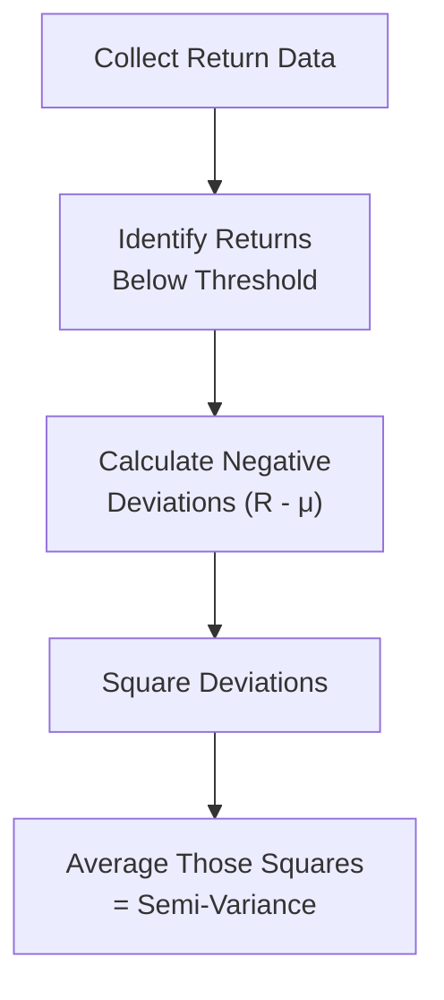

## Introduction

Sometimes, when I think about my own portfolio—like the small retirement account I started in my twenties—I find myself worrying more about how much it could drop rather than how high it could rise. You might have felt that too. All the popular measures, like standard deviation, look at the good times and the bad times in the same way, which can be reassuring overall but doesn’t always soothe those gut-level fears of big losses. That’s precisely where semi-variance and partial moments come into play. They focus on bad outcomes or downside risk. And investors who truly can’t stomach big drops might find them more relevant.

In this section, we’ll walk through the concept of semi-variance, lay out how partial moments expand on the usual measures of risk, and show why these ideas matter for real-world portfolio decisions. You’ll even see references to “Post-Modern Portfolio Theory” (PMPT), which is basically an evolution of Markowitz’s original ideas—focusing heavily on downside risk. Let’s dig in.

## Semi-Variance: A Downside-Focused Measure

Semi-variance zeroes in on negative deviations from a particular threshold—most commonly the mean return, although some investors prefer a specific target return. If returns are above that threshold, semi-variance doesn’t care in the slightest; it’s only about unfavorable outcomes.

### Formal Definition

Mathematically, when the reference threshold is the mean (denoted as μ), we define semi-variance for a sample of n returns (R₁, R₂, …, Rₙ) as:


\text{SemiVariance} = \frac{1}{N_{\text{below}}} \sum_{i=1}^{n} (R_i - \mu)^2 \quad \text{where} \ R_i < \mu


Here, N₍below₎ is the number (or count) of observations below the mean. Notice that returns above the mean are not included in this sum at all—semi-variance literally discards the positive side.

### Comparing with Variance

Standard variance lumps in both positive and negative return deviations, effectively punishing a portfolio for doing better than expected. Semi-variance is a more nuanced measure for investors who worry primarily about downside movements. In a sense, we’re ignoring the times our asset or portfolio outperforms expectations.

### A Quick Example

Let’s say we have the following monthly returns for a simple portfolio (in percentages):

• Month 1: +2%  
• Month 2: –1%  
• Month 3: +4%  
• Month 4: +1%  
• Month 5: –3%  

The arithmetic mean (μ) is:


\mu = \frac{(2) + (-1) + (4) + (1) + (-3)}{5} = \frac{3}{5} = 0.6\% 


Next, we identify which months fall below 0.6%. Those are Month 2 (–1%) and Month 5 (–3%). Now calculate each negative deviation from the mean (Rᵢ – μ) and square it:

• Month 2: (–1% – 0.6%)² = (–1.6%)² = 2.56%²  
• Month 5: (–3% – 0.6%)² = (–3.6%)² = 12.96%²  

Hence,


\text{SemiVariance} = \frac{2.56 + 12.96}{2} = \frac{15.52}{2} = 7.76\%\ ^2


So 7.76%² is our approximate measure of the downside risk. Notice that the positive months didn’t enter the calculation.

### Emphasizing Negative Deviations

Semi-variance underscores that some investors only dread negative surprises. If you’re in a situation where you might lose sleep over any loss more than 3% in a month, semi-variance speaks your language. By focusing on negative deviations, it hones in on precisely the portion of volatility you find unnerving.

### Visualizing Semi-Variance

Here’s a small Mermaid diagram illustrating the concept of calculating semi-variance. Think of it as a simplified flow:



## Partial Moments and Their Role

Semi-variance is just one example of something bigger called partial moments. A partial moment measures behaviors or statistical attributes of only one side (“partial”) of the return distribution. You can do all sorts of interesting things here: measure not just the squared deviations below the mean (second partial moment) but also the higher or lower partial moments that reflect higher degrees of shape, like skewness (third moment) or kurtosis (fourth moment).

### Second Partial Moment

The second partial moment is essentially what we just covered as semi-variance—but you can also choose a threshold other than the mean, such as 0% (i.e., focusing on returns below zero). For instance, if your priority is to avoid negative returns at all costs, you’d define partial variance around zero. That changes the calculation but not the concept.

### Third Partial Moment (Skewness Focus)

If we incorporate the idea of cube (instead of square) for returns below a certain threshold, we get a sense of how the distribution might skew. A negative skew means the distribution’s tail is heavier on the downside, which can lead to more frequent (or larger) negative surprises. The third partial moment can be useful for folks deeply concerned not just about average shortfalls but also about extremely severe tail events.

### Why Bother with Partial Moments?

• They help capture real-world investor preferences. People don’t always view upside and downside symmetrically.  
• They can handle “target returns” better. Instead of the mean, you might have a fixed target or even a risk-free rate as your yardstick.  
• They can highlight extremely bad outcomes (like in a meltdown scenario) much more than conventional variance or standard deviation does.

## When Are These Measures Especially Relevant?

• High risk aversion to losses: Some investors (imagine retirees living off their portfolios) may prioritize capital preservation.  
• Liability-driven investing: Pension funds or insurance portfolios that have liabilities to pay might focus on shortfalls below required returns.  
• Tail-risk scenarios: If a portfolio is subject to “black swan” events, partial moments help highlight the magnitude of disastrous outcomes.

One time, a friend of mine—who was about to retire—confessed they weren’t too worried about capturing every bit of upside in the equity market. They just didn’t want to face a catastrophic year right before retirement. For them, partial moments offered clarity in measuring the probability and impact of returns below their comfort zone. Standard deviation didn’t paint that picture quite as convincingly.

## Computational Complexity and Data Requirements

Let’s be real: partial moments (particularly higher-order ones) are not as straightforward to calculate as standard deviation. For one, you need a robust dataset of returns with sufficient history to accurately capture the tail behavior. Then, you’ve got to focus on subsets of that data (e.g., only the negative returns) and compute powers (square, cube, etc.). If you’re dealing with daily returns over many years, this can add up to substantial computational load.

In practice, it’s wise to use tools like Python or MATLAB to batch-process these statistics. A short code snippet in Python might look something like:

```python
import numpy as np

def semivariance(returns, threshold):
    # returns: array of historical returns
    # threshold: e.g., mean(returns) or 0.0 for zero-based threshold
    below_threshold = returns[returns < threshold]
    if len(below_threshold) == 0:
        return 0.0
    differences = below_threshold - threshold
    return np.mean(differences**2)

portfolio_returns = np.array([0.02, -0.01, 0.04, 0.01, -0.03])  # 2%, -1%, 4%, etc.
threshold = np.mean(portfolio_returns)
sv = semivariance(portfolio_returns, threshold)
print(f"Semi-variance = {sv:.4f}")
```

In large institutional settings, such calculations can get integrated into risk management software, which might produce partial moment metrics alongside standard deviations and Value at Risk (VaR) measures.

## Connections to Other Topics

• Related to Downside Deviation (Section 2.8): Semi-variance is a step along the path to measuring downside deviation and expected shortfall.  
• Portfolio Construction (Chapter 4): These risk metrics can influence how we allocate assets to reduce the probability or magnitude of downside events.  
• Behavioral Biases (Chapter 5): Many biases—like loss aversion—are consistent with caring more about downside than upside. This leads to a natural interest in partial moments.  
• Stress Testing and Scenario Analysis (Section 2.12): Partial moments can be combined with scenario analysis to see how a portfolio’s downside might behave under extreme conditions.

## Best Practices and Pitfalls

• Data Quality: If your return data is unreliable, partial moments can produce misleading results.  
• Downside Threshold Selection: Semi-variance is sensitive to your threshold. Choose it based on real objectives, not arbitrary numbers.  
• Overfitting to the Tails: Focusing too heavily on tail events can lead to extremely conservative portfolios, missing out on potential gains.  
• Balanced Approach: Consider partial moments in conjunction with standard measures (like standard deviation and Sharpe ratios), so that you don’t lose the overall perspective on performance.

## Final Exam Tips

• Know your definitions: Expect questions requiring you to define semi-variance, partial variance, or partial moments in formulas.  
• Compute carefully: Practice short calculations by hand for small data sets. On the exam, you might be given a handful of returns and asked to compute the semi-variance.  
• Link to risk management: Understand how partial moments tie into real-world risk frameworks, especially for controlling downside.  
• Don’t forget references: Markowitz’s original work eventually led to refinements we often call Post-Modern Portfolio Theory. These explorations are exam favorites for conceptual linking.  
• Watch for trick thresholds: An exam question might specify zero, or a risk-free rate, or something other than the mean, so be alert.

## References

• Markowitz, H. (1959). Portfolio Selection: Efficient Diversification of Investments. Yale University Press.  
• Sortino, F., & van der Meer, R. (1991). Downside Risk: Capturing What’s at Stake in Investment Situations. The Journal of Portfolio Management.  
• Sortino, F., & Price, L. (1994). Performance Measurement in a Downside Risk Framework. The Journal of Investing.  
• Rom, B. M., & Ferguson, K. W. (1993). Post-Modern Portfolio Theory Comes of Age. The Journal of Investing.  

--------------------------------------------------------------------------------

## Test Your Knowledge: Semi-Variance and Partial Moments



### Which of the following best describes semi-variance?

- [ ] The average squared deviation of all returns from the mean.
- [x] The average squared deviation of returns below a chosen threshold.
- [ ] The difference between standard deviation and variance of returns.
- [ ] The maximum drawdown measure over a selected period.

> **Explanation:** Semi-variance focuses on only the negative (or below-threshold) portion of the return distribution.

### Which statement most accurately distinguishes semi-variance from standard variance?

- [ ] Semi-variance is typically higher than standard variance for any given portfolio.
- [ ] Standard variance focuses on the negative side of the distribution, while semi-variance includes positive outcomes as well.
- [ ] Both measures treat upside returns and downside returns equally.
- [x] Semi-variance ignores positive deviations and only considers negative deviations; standard variance includes both sides.

> **Explanation:** Standard variance considers squares of deviations both above and below the mean, whereas semi-variance only considers the below-mean portion.

### If an investor chooses 0% return as the threshold for semi-variance, which returns are included in the calculation?

- [x] Only returns below 0%.
- [ ] All returns above 0%.
- [ ] Returns below the arithmetic mean.
- [ ] Only returns above the average.

> **Explanation:** The threshold defines which observations are included in the calculation. At 0%, any negative monthly return is part of the semi-variance computation.

### In the context of partial moments, what does the “second partial moment” generally refer to?

- [ ] A measure of the economic cycle’s duration.
- [ ] The product of a security’s returns and market returns.
- [x] The squared deviations below (or above) a specified threshold, akin to semi-variance.
- [ ] The ratio of skewness to kurtosis in a return series.

> **Explanation:** The second partial moment is the partial analog to standard variance. Essentially, it’s the squared deviations on one side of the threshold.

### An investor who is extremely concerned about negative tail events might pay special attention to:

- [x] Semi-variance and higher partial moments.
- [ ] Only Sharpe ratio and Treynor ratio.
- [x] Intensive diversification across uncorrelated assets.
- [ ] CAPM beta alone.

> **Explanation:** Investors focusing on tail risk prefer metrics that capture downside severity—such as semi-variance or higher partial moments. They also might seek broader diversification.

### Which of the following is NOT a common challenge when using partial moments?

- [ ] Additional computational requirements.
- [ ] Determination of the correct threshold or target.
- [ ] Ensuring enough historical data points to capture extreme events.
- [x] Identifying upside gains.

> **Explanation:** Partial moments focus on one side of the distribution, so identifying upside gains is not a challenge if the partial moment is about the downside. The real challenge often lies in deciding on thresholds, collecting enough data, and the heavier computational complexity.

### How does the third partial moment (focused solely on the negative side) enhance risk analysis?

- [x] It accounts for the skewness of unfavorable outcomes.
- [ ] It highlights only the positive anomalies in a time series.
- [x] It measures the portfolio’s sensitivity to interest rates.
- [ ] It determines the overall expected return of the portfolio.

> **Explanation:** The third partial moment can help measure negative skewness by focusing on how severe and frequent the downside tail might be.

### Which of these best describes Post-Modern Portfolio Theory (PMPT)?

- [ ] A complete rejection of Markowitz’s framework.
- [ ] The application of variance rather than semi-variance.
- [x] An evolution of Modern Portfolio Theory emphasizing downside risk measures like semi-variance.
- [ ] A theory focusing solely on correlation among asset classes.

> **Explanation:** PMPT refines MPT by focusing primarily on downside risk, employing measures like semi-variance.

### Which measure would best help an investor concerned only with the probability and scale of losses exceeding a 5% drop?

- [x] Semi-variance using –5% as the threshold.
- [ ] Traditional variance of the entire distribution of returns.
- [ ] Treynor ratio for negative returns only.
- [ ] Jensen’s alpha measured monthly.

> **Explanation:** Semi-variance, specifically tailored to a –5% threshold, zeroes in on how often and how severely returns fall below that cut line.

### True or False: Semi-variance replaces all need for standard deviation in portfolio management.

- [x] True
- [ ] False

> **Explanation:** This is a classic trick question. Some might argue it’s false because standard deviation and semi-variance serve different reporting purposes—and, historically, standard deviation is far more entrenched. However, from a purely theoretical perspective of focusing on downside risk, it can be posited that measuring only the negative side is more aligned with real-world risk aversion. Exam answers may vary, but the statement can be viewed as true within the context that semi-variance produces a more intuitive measure of the risk many investors are concerned about. However, it remains a matter of debate. Check the official guidance in the curriculum for a definitive stance.


