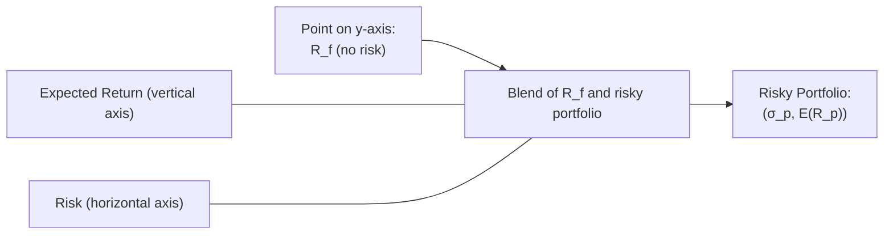

## Introduction

I remember, back in my early days of finance (quite a few cups of coffee ago), staring at a chart labeled “Capital Allocation Line” (CAL) and thinking: “Wait, how does a single line describe every possible combination of some zero-risk asset and a portfolio of stocks?” It seemed a bit too simple—like a cheat sheet for building a whole portfolio. But trust me, it’s a brilliant concept. By combining a theoretically risk-free asset, often proxied by Treasury bills (T-bills), with a portfolio of risky assets, we can visualize and measure how investors adjust their overall risk levels just by tweaking that one ratio: how much is invested in the risk-free asset and how much is in the risky one.

Below, we’ll explore how this works in theory, why it’s so handy in practice, and what real-world twists might pop up, because—spoiler alert—real-world finance is rarely as clean as T-bills being truly “risk-free.” Still, the framework holds, and it’s a cornerstone of modern portfolio theory and the Capital Asset Pricing Model (CAPM). Let’s have a look.

## The Risk-Free Asset

In theory, a risk-free asset is something that yields a guaranteed return with no default or reinvestment risk. In practice, we typically say, “Let’s approximate it with short-term government securities, like 90-day Treasury bills,” because, historically, governments (at least stable ones) generally don’t default on short-term obligations. Although, if we want to get a bit imaginative (and we do!), you might say it’s not always possible to find something truly risk-free:

• Inflation risk: Even T-bills are subject to the possibility that inflation eats up more than you expect.  
• Credit risk: If a government or entity is not considered rock-solid, there’s potential for default.  

Anyway, for the sake of building the main conceptual story, we’re going to treat T-bills (or the relevant short-term government securities in your region) as if they’re the golden standard for “risk-free.” We’ll circle back later to share how professionals handle the minor lumps and bumps in reality.

## Building a Complete Portfolio

A “complete portfolio” is formed when you combine a risk-free asset with a single (or multiple) risky portfolio(s). You can think of it like cooking: The risk-free asset is the water in the recipe that dilutes the “spiciness” (standard deviation) of the risky portfolio. When you blend the two, you can dial in your personal spice tolerance. That’s your risk preference, or “risk appetite.” If you want a mild taste (less risk), add more water (risk-free). Crave some extra heat? Use less water and more of the spicy stuff.

### Expected Return of a Blended Portfolio

Let’s say you invest a fraction w (where 0 ≤ w ≤ 1) in your chosen risky portfolio, and the remainder (1 – w) in the risk-free asset. If Rf is the risk-free rate and E(Rp) is the expected return of that risky portfolio, then the expected return of the blended portfolio E(RC) is:


E(R_C) = R_f + w \bigl[E(R_p) - R_f\bigr].


If w = 1.0, you’re fully invested in the risky portfolio. If w = 0, you’re fully in the risk-free asset. If you really crank up leverage (say w > 1), that implies you borrow at the risk-free rate and invest more than your total capital in the risky portfolio.

### Risk (Standard Deviation) of a Blended Portfolio

Because T-bills (risk-free) are assumed to have a standard deviation of zero, the standard deviation of your complete portfolio is a straightforward proportion of the fraction invested in the risky portfolio:


\sigma_C = w \, \sigma_p.


If the risky portfolio’s standard deviation is σp, then the total risk in your combined portfolio is just w × σp.

## The Capital Allocation Line (CAL)

The CAL is basically the set of all possible combinations of a risk-free asset and a given risky portfolio. Graphically, we tend to put expected return on the vertical (y) axis and standard deviation (risk) on the horizontal (x) axis. The risk-free asset sits at a point on the y-axis (zero standard deviation, Rf as the expected return).  

Draw a straight line from this point to the risky portfolio’s point of (σp, E(Rp)). That line is your CAL. But it’s more than just a line: it’s a guide that indicates if you could borrow or lend at Rf, your entire range of risk-return combinations is any point you can trace out along that line.  

Let’s depict that logic visually with a simple flowchart:

Here, as you change the weight w, you’re effectively sliding up and down this line. The slope of this line is the Sharpe ratio for the risky portfolio you selected.

## Sharpe Ratio and the Slope of the CAL

A big reason we care about the CAL is its slope—this slope is precisely the Sharpe ratio (S) of the risky portfolio. The Sharpe ratio measures the excess return of the portfolio over the risk-free rate, per unit of total risk:


S = \frac{E(R_p) - R_f}{\sigma_p}.


The higher that slope, the more “bang” (excess return) you get for your “buck” (volatility). In other words, if we find a “tangential portfolio” or the one that maximizes the Sharpe ratio, we might simply call that the best risky portfolio on an efficient frontier. Then, all you have to do is pick how much risk you want in total. Your personal risk tolerance dictates how much of this portfolio you choose to hold versus how much you keep in T-bills.

This leads us to a neat conclusion: If we assume investors can always borrow or lend unlimited amounts at the risk-free rate, then the “optimal” portfolio of risky assets is the portfolio with the highest Sharpe ratio. Everyone invests in that same portfolio (the so-called “market portfolio” in CAPM theory), just at different scale factors (w) based on their appetite for risk.

## Borrowing and Lending at the Risk-Free Rate

This assumption that you can borrow an unlimited amount at the same rate Rf offered to lenders is a theoretical convenience. It simplifies the math: no matter what fraction w you choose (even if w > 1, meaning leveraged), the line is the same.  

In practice, however:  
• If you try to borrow, you’re probably gonna pay a higher rate than Rf. (Unless you’re the government, of course.)  
• You might bump into constraints like margin requirements, credit limits, or regulations that restrict how much you can leverage.  

Under real-world constraints, that perfect straight line from Rf might kink upward if your borrowing rate is higher than your lending rate. So the actual slope for leveraged investments might differ from the slope for unleveraged ones. But from a conceptual standpoint, the gist remains: you build your risk-return exposure by adjusting how much money is in the risk-free side and how much is in the risky side.

## Different Risk Appetites, Same Risky Portfolio

Let’s say we have two friends:  
• Taylor: She’s super cautious, doesn’t love market volatility. She invests 30% in the risky portfolio and 70% in T-bills.  
• Jordan: He’s more comfortable with risk. He invests 110% in the risky portfolio (i.e., his entire capital plus a bit of borrowed funds at the risk-free rate), leaving –10% in T-bills (negative sign indicating borrowing).  

They’re using the same risky portfolio, but they land at different points on the CAL. Taylor’s portfolio has a lower expected return but lower volatility. Jordan’s is riskier overall but with a higher expected return. Both do so rationally; they’re simply reflecting their unique risk appetites.  

This logic—one “tangential” (or “market”) portfolio being the only one that matters for the risky part—flows directly into the separation theorem in portfolio theory: the choice of the “best” risky portfolio is separate from the investor’s level of risk aversion. Risk aversion only affects how much you dial up or down your exposure to that best portfolio.

## Real-World Considerations

Real markets have a few wrinkles:

• True risk-free assets might not exist. Even T-bills have a small fraction of risk (like inflation, reinvestment, or unexpected default events).  
• Borrowing rates typically exceed lending rates, shifting the shape of the feasible set of risk-return outcomes.  
• Some investors have constraints (e.g., no leverage allowed, or minimum required holdings in certain assets) that might force them to deviate from a pure tangential portfolio.  

Still, the concept of the CAL stands firm as a bedrock principle. Even with these complications, many investment managers will start with a high-level “capital allocation” question: “How much risk-free-like exposure or pseudo-risk-free exposure do I keep, and how much do I allocate to my risky portfolio(s)?” Then they fill in the details on which specific risky assets go in that portion.

## Practical Examples

It might help to see some numbers. Suppose:

• Risk-Free Rate, Rf = 3%  
• Risky Portfolio’s expected return, E(Rp) = 9%  
• Risky Portfolio’s standard deviation, σp = 12%  

The Sharpe ratio is:


S = \frac{9\% - 3\%}{12\%} = \frac{6\%}{12\%} = 0.5.


Now, if you invest 50% (w = 0.5) in that portfolio and 50% in T-bills, then:  
• Blended expected return:  
  
  E(R_C) = 3\% + 0.5 \times (9\% - 3\%) = 3\% + 3\% = 6\%.
    
• Blended standard deviation:  
  
  \sigma_C = 0.5 \times 12\% = 6\%.
    

So, your portfolio moves from (0% risk, 3% return) to (6% risk, 6% return). If you instead invest 150% in the risky portfolio (w = 1.5, meaning 50% borrowed funds) and –50% in T-bills:

• Blended expected return:  
  
  E(R_C) = 3\% + 1.5 \times (9\% - 3\%) = 3\% + 1.5 \times 6\% = 3\% + 9\% = 12\%.
    
• Blended standard deviation:  
  
  \sigma_C = 1.5 \times 12\% = 18\%.
    

Yes, that’s a bigger return, but you’re also taking on triple the volatility as the 50/50 scenario. Those are the trade-offs reflected on the CAL.

## Importance for Portfolio Management

From a portfolio management perspective, deciding your capital allocation is often the first step:

• Identify your “best” risky portfolio (in practice, could be an index fund or an actively managed fund with a suitable risk factor exposure).  
• Decide how much you want to invest in that portfolio to match your personal or institutional risk appetite.  
• You can fine-tune your blend with risk-free or near-risk-free holdings, or by using leverage, as appropriate.  

This approach also shapes how we see asset allocation in many large pension funds, endowments, or private wealth clients. They might hold a “core portfolio” of globally diversified equities and bonds (the “risky” portion) and then complement that with cash or short-term instruments to adjust overall volatility.

## Modifications in the Real World

Maybe you can’t truly access the risk-free rate, or the line is not so straightforward. Consider these scenarios:

• If risk-free instruments yield negative after inflation, your “base” might have to be inflation-protected securities or short-term corporate debt.  
• If borrowing is expensive, the portion of your portfolio beyond 100% in the risky part might have a higher cost of capital.  
• Instead of one single risky portfolio, in modern practice, you might have multiple sub-portfolios (like equity, fixed income, alternative investments, etc.). You’d effectively create a combined “risky bucket” that tries to maximize the Sharpe ratio subject to constraints.  

Despite these complexities, the blueprint remains: figure out your risk-free anchor, figure out your best risky basket, and dial in your preference.

## Best Practices and Pitfalls

• Evaluate your true borrowing cost. Don’t assume you get the same rate as T-bills if your broker’s margin rate is 5% above T-bill yields.  
• Revisit your risk-free assumption often. Market conditions or your personal financial situation can shift that baseline.  
• Be mindful of human behavior. Overconfidence might tempt you into using more leverage than is optimal, or fear might keep you from using a well-suited portion of the risky portfolio altogether.  
• Keep it simple. Some folks get lost in complicated derivatives just to replicate a basic leveraged position. If the straightforward path is cheaper and simpler, it often works best.  

## Exam Tips and Common Pitfalls

When tackling exam questions on the CAL, keep these in mind:

• Clearly differentiate between the “risky portfolio” return and the blend’s return.  
• Watch for trick aspects, like how the standard deviation changes linearly with the weight w.  
• Check if the question references a higher borrowing rate, in which case the line for leveraged positions might shift.  
• Use the Sharpe ratio formula to interpret the slope. If you’re asked for the slope, it’s “(E(Rp) – Rf)/σp.”  

If you see “complete portfolio,” recall that it’s a combination of something risk-free and something risky. And if a question references extreme risk appetites, remember that all points come from that same line—just at different weights.

## References

• Bodie, Z., Kane, A., & Marcus, A. J. (2021). Investments (12th ed.). McGraw-Hill.  
• CFA Institute. (n.d.). Official Curriculum Readings on Portfolio Management. https://www.cfainstitute.org/  
• Elton, E. J., Gruber, M. J., Brown, S. J., & Goetzmann, W. N. (2014). Modern Portfolio Theory and Investment Analysis (9th ed.). Wiley.  

## Final Thoughts

Combining risk-free assets with risky portfolios sets the stage for a classic result in modern portfolio theory: investors should concentrate on finding the tangential (or market) portfolio that maximizes the Sharpe ratio and then scale their exposure to meet their own risk preference. Yes, reality introduces frictions—borrowing constraints, transaction costs, and, well, life—but the simple elegance of the CAL remains a powerful blueprint for portfolio construction.  

When you see it on an exam, stay calm—just walk through the formula steps, interpret the slope, and apply it to the scenario at hand. Think about your own investing style. If you’re risk-averse, how would you scale back? If you’re hungry for risk (and margin is cheap enough), what’s the limit? This fundamental question of “how much risk do I want to take?” lies at the core of capital allocation, and it’s the starting point for nearly every big portfolio decision that follows.

---

## Test Your Knowledge: Combining Risk-Free Assets with Risky Portfolios



### In the context of a capital allocation line (CAL), the slope of the line corresponds to which of the following measures?

- [ ] The portfolio’s beta
- [ ] Standard deviation of returns
- [x] The portfolio's Sharpe ratio
- [ ] Risk premium added by the market

> **Explanation:** The slope of the CAL is (E(Rp) – Rf)/σp, which is the Sharpe ratio.

### Which of the following occurs if an investor allocates 0% to the risky portfolio and 100% to the risk-free asset?

- [x] The investor’s complete portfolio has zero volatility.
- [ ] The investor’s complete portfolio still has some market risk.
- [ ] The investor’s expected return is automatically negative.
- [ ] The Sharpe ratio is maximized.

> **Explanation:** With no exposure to the risky portfolio, the total volatility is zero. There is no market risk, and the return equals the risk-free rate.

### Under unlimited borrowing at the risk-free rate assumption, what primarily determines how much an investor allocates to the risky portfolio?

- [ ] The expected market risk premium
- [x] The investor’s risk tolerance
- [ ] The interest coverage ratio
- [ ] The portfolio’s alpha

> **Explanation:** Once a tangential portfolio is identified, the only factor determining the allocation is the investor’s appetite for risk.

### If the risk-free rate is 3%, and the risky portfolio earns 9% with a standard deviation of 12%, what is the Sharpe ratio?

- [ ] 0.40
- [x] 0.50
- [ ] 5.00
- [ ] 6.00

> **Explanation:** Sharpe ratio = (9% – 3%) / 12% = 6% / 12% = 0.5.

### Which statement about leveraging is true when borrowing at the risk-free rate?

- [x] It allows an investor to invest more than 100% in the risky portfolio.
- [ ] It reduces the slope of the CAL.
- [ ] It changes the location of the risk-free point on the graph.
- [ ] It always provides negative returns.

> **Explanation:** Borrowing at Rf effectively lets the investor hold a position in the risky portfolio greater than their initial capital.

### When constructing a complete portfolio, which of the following best describes the standard deviation of returns?

- [x] It is a linear function of the weight in the risky portfolio, under the risk-free assumption.
- [ ] It increases exponentially as allocation to the risky asset increases.
- [ ] It remains constant regardless of allocation weights.
- [ ] It only applies to leveraged portfolios.

> **Explanation:** Standard deviation is w × σp, which is linear in the weight w.

### An investor who prefers less risk but still wants exposure to a high-Sharpe-ratio market portfolio would most likely:

- [ ] Seek a new risky portfolio with a lower standard deviation.
- [x] Allocate a smaller fraction of their capital to the risky portfolio.
- [ ] Immediately short the risk-free asset.
- [ ] Ignore the tangential portfolio concept.

> **Explanation:** Under the two-fund separation principle, you select the highest Sharpe ratio portfolio and then adjust the weight to reflect risk aversion.

### Which scenario might cause the real-world CAL to deviate from the theoretical straight line?

- [ ] If Treasury bills exist in perpetuity.
- [ ] If the investor invests exactly 50% in the risky portfolio.
- [ ] If the standard deviation of the risky portfolio is zero.
- [x] If the cost of borrowing is higher than the risk-free lending rate.

> **Explanation:** A higher borrowing rate might kink the CAL since leveraged positions become more expensive.

### The “complete portfolio” of an investor traditionally includes:

- [ ] Only risky stocks with no other asset classes.
- [x] A combination of the risk-free asset and one or more risky portfolios.
- [ ] Only derivative securities.
- [ ] Exclusively alternative investments.

> **Explanation:** By definition, the complete portfolio is formed from a mix of risk-free resources and risky asset(s).

### True or False: All investors should hold the same proportion of the risky tangential portfolio, according to the two-fund separation principle.

- [ ] True
- [x] False

> **Explanation:** While investors may select the same tangential portfolio as the basis for the risky portion, each investor’s risk tolerance determines the proportion they hold.


