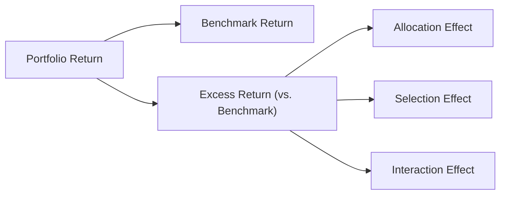
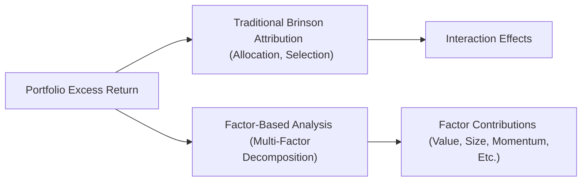

## Introduction
Performance attribution is all about answering a question we’ve all asked at some point: “Where exactly did my investment returns come from?” It’s fun to talk about how your portfolio “beat the market,” but it’s just as important—maybe even more so—to isolate the underlying drivers of that performance. In other words, you want to break down your portfolio’s returns into pieces like asset allocation, security selection, and the interaction between them. Then you can see which parts truly added (or eroded) value. 

I once had a friend who managed a small equity fund and told everyone that she was crushing the benchmark. But when we looked more closely, we realized that about 80% of her outperformance came not from brilliant stock picks but from simply holding more tech stocks than the benchmark. It was just a big sector bet. She actually didn’t have so much skill in picking the best tech names. Performance attribution helped her see that she needed to refine her security selection approach (and maybe reduce the giant sector bet). That’s how powerful attribution as a lens can be.

## Why Performance Attribution Matters
Portfolio managers, analysts, and clients all benefit from understanding how much of a portfolio’s performance is due to intentional asset allocation decisions, skillful security selection, or just plain luck. Without a structured approach, it’s easy to end up with a swirl of returns data that doesn’t offer meaningful insights: “We’re up 10%. Great. But…why?”

• For managers: Attribution provides a roadmap for tweaking strategies—maybe focusing on selection skill in some sectors or reducing systematic bets in others.  
• For clients: A well-built attribution report clarifies the manager’s capabilities and shows if the manager is delivering the promised style or factor exposure.  
• For stakeholders and compliance: Regulators and internal risk committees increasingly want to see that risk exposures and returns are being monitored and explained thoroughly.  

Let’s start by looking at what’s arguably the foundational approach to performance attribution: the Brinson Model.

## The Brinson Model
The Brinson Model—sometimes called the Brinson-Hood-Beebower model—splits a portfolio’s active return into two main pieces: allocation effect and selection effect. There’s also an often-cited “interaction effect,” which can be interpreted in slightly different ways depending on the exact formula, but in general it captures the combined impact of weighting and selection decisions.

### Allocation Effect
The allocation effect measures how much of your portfolio’s excess return (vs. a benchmark) is attributable strictly to having different weights in certain sectors (or asset classes, or regions) than your benchmark does. Even if your holdings within those sectors exactly matched the benchmark’s returns, you could still experience different performance if you overweighted or underweighted those sectors.  

Let’s do a quick example—very simplified:  
• Suppose your benchmark invests 50% in Sector A and 50% in Sector B. Sector A returns 6% and Sector B returns 4%.  
• Your portfolio invests 60% in Sector A and 40% in Sector B. You earn exactly the sector returns of 6% and 4% in each sector—so your stock selection is basically identical to the benchmark.  

But you did choose a heavier weighting in Sector A (6% return) vs. B (4% return). That shift alone would give you an advantage. In the Brinson formula:  

Allocation effect in Sector A = (Portfolio Weight of A – Benchmark Weight of A) × (Benchmark Return of A – Benchmark Overall Return)

Similarly for Sector B. Summing these effects across all sectors or asset classes gives the total allocation effect.

### Selection Effect
The selection effect captures how well you picked securities (or sub-asset classes) within each sector. Even if your weights matched the benchmark exactly, you could still end up with a different performance if your chosen securities performed better or worse than the overall sector.  

In the typical Brinson approach, selection is calculated as:

Selection effect in Sector A = Benchmark Weight of A × (Sector Return in Portfolio – Sector Return in Benchmark)

This formula attempts to hold the weighting constant (the benchmark’s weighting) to isolate just the difference in returns for what you actually held compared to the benchmark’s sector return.

### Interaction Effect
The interaction effect can feel a bit intangible, because it marries your weighting decisions with your security selection decisions. The argument is that if you overweight a sector and do well in that sector relative to the benchmark, you get an additional kicker. Alternatively, if you overweight a sector that ends up underperforming, you take a double hit.

One approach to computing the interaction effect for a single sector is:

Interaction effect in Sector A =
(Portfolio Weight of A – Benchmark Weight of A) × (Portfolio Return in A – Benchmark Return in A)

Summing the interaction effect across all sectors yields the total interaction effect. In practice, some managers prefer to merge interaction with selection or even treat it as a separate line item. Regardless, the main takeaway is that the Brinson model helps us see how margin-by-margin changes in allocation and selection drive the overall excess return.

Below is a quick visual flow of these effects:

You can see that the portfolio’s excess return flows from distinct sources. This is the essence of the Brinson framework.

## Returns-Based vs. Holdings-Based Attribution
When you think about how to implement performance attribution, you’ve basically got two major approaches:

### Returns-Based Attribution
Returns-based attribution uses only the portfolio’s overall return data and the benchmark’s return data over the same period. You typically run a regression or other statistical method on historical returns to infer exposures to different asset classes or factors. It’s simpler because you don’t need daily or monthly holdings data; you just need returns. But it’s also less precise. You’re basically guessing how your performance broke down across asset classes or sectors, rather than directly measuring it from actual holdings.

This approach can be useful if you manage big multi-asset funds, or if historical holdings data are too expensive or impossible to track. It’s also sometimes the only feasible approach for analyzing older performance track records or competitor funds where you don’t have full transparency.

### Holdings-Based Attribution
Holdings-based attribution uses actual holdings data (plus related transaction data if you want more precision) at each measurement interval (e.g., monthly or daily). Then it calculates the exact contribution of each holding (or sector or asset class) to performance, comparing it to what the benchmark earned during the same time.  

If reliability and detail matter—and they usually do—holdings-based is the gold standard. But, it’s also more data-intensive. You need accurate records of positions, changes, monthly weights, and so on. Large institutional managers typically invest in specialized software to handle all of this.  

## Advanced Attribution Techniques
Beyond the basic Brinson approach, you’ll sometimes see advanced methods that try to break value creation down into more granular dimensions. Here are a few that frequently show up:

### Factor-Based Attribution
Factor-based attribution typically uses factor models (like the Fama-French three-factor model or more advanced five-factor or multi-factor models) to pinpoint whether a fund’s returns came from exposures to systematic factors (e.g., value, size, momentum, quality) or from idiosyncratic selection skill.  

You might see factor-based attribution combined with the traditional Brinson approach so that you can separate out:  
• Industry or sector weighting (allocation)  
• Security-specific selection  
• Factor tilt or exposure (value, momentum, volatility, etc.)  

It’s helpful if you want to see if your style (say, a tilt toward small-cap value) truly produced the outperformance. Or maybe you realized alpha that can’t be explained by known factors. In that case, you might actually have some unique insight.

### Risk-Based Attribution
Risk-based attribution flips the script by looking at how much risk contribution each segment or factor is bringing to the portfolio (and the associated returns). Instead of just focusing on returns, you measure how each portion of your portfolio influences total volatility or downside risk. Then you try to link it back to returns to see if you were adequately compensated for that risk.  

It’s particularly valuable in portfolio risk management or if you’re employing a risk-parity or minimum-variance style. You want to confirm that your largest risk allocations are paying off in proportion to the risk you’re taking.

### Multi-Factor Decomposition
Multi-factor decomposition is basically an extension of factor-based attribution. You break the portfolio’s exposures down into numerous factors—market, size, value, momentum, quality, country, sector, or even macro factors like interest rates, inflation, or commodity prices. Then you see how each factor contributed to returns.  

Granted, it can get complicated. The data demands can be significant: factor returns must be estimated accurately, factor loadings must be updated frequently, and parameter instability in factor models is not uncommon. But if done well, multi-factor decomposition offers a powerful lens on exactly why your portfolio performed as it did—and makes it easier to replicate or adjust your exposures.

## Practical Examples and Case Studies
Let’s do a quick hypothetical to see how all this fits together. Suppose we have a balanced portfolio with 50% equities, 40% fixed income, and 10% cash. The benchmark is 45% equities, 50% fixed income, and 5% cash. Over the quarter, the portfolio returned 5.2%, while the benchmark returned 4.5%. 

• Let’s say your overweight in equities (which returned 7% vs. 6.5% for the equity portion of the benchmark) contributed +0.2% to total performance. This is your allocation effect.  
• Within equities, your actual stock picks outperformed the equity benchmark by 1%. Given the weight of equities, that selection effect maybe contributed +0.5%.  
• You also underweighted fixed income, and the portion you did hold performed in line with the fixed income benchmark, so that near-zero difference might result in a slight negative effect or no effect.  
• The leftover difference of, say, +0.0% or –0.1% could be the interaction effect.  

In real-world scenarios, the actual math is a bit more involved, especially if you have multiple asset classes, frequent rebalancing, or significant factor tilts. But the principle is the same: break down the final outperformance or underperformance into each relevant effect.

### A Quick Look at Returns-Based vs. Holdings-Based in Practice
One scenario where returns-based attribution is often used is with hedge funds that don’t disclose holdings. If you only know that Hedge Fund X returned 3% last month, S&P 500 returned 2%, and you can glean some correlation patterns from public data, you might do a returns-based regression to guess that 60% of the fund is allocated to equity, 20% to fixed income, 10% to commodity, etc. That’s obviously not as precise as seeing the actual positions, but hey, sometimes you work with what you’ve got.

On the other hand, a large asset manager that invests in, say, 1,000 global equities will rely on holdings-based attribution to see exactly which stocks helped or hurt. They might find that the Chinese tech names delivered 1.2% of active return, while the small-cap industrials in the U.S. cost them 0.8%. That level of granularity can only come from a direct look at holdings.

## Common Pitfalls and Best Practices
• Mismatch of Frequency: If your benchmark updates weekly and your portfolio data are monthly, you’ll introduce errors. Make sure returns and weights are measured consistently.  
• Benchmark Selection: A poorly chosen benchmark (maybe an index that doesn’t reflect your style or constraints) will produce misleading attribution results.  
• Interaction Conundrum: Deciding how to treat interaction can cause confusion. Some managers lump it in with selection effect, while others carve it out as a separate line. The important part is consistency and transparency.  
• Data Quality: Holdings-based attribution is only as accurate as your position records. Missing or stale data can break your analysis.  
• Overemphasis on a Single Period: A strong selection effect one quarter might vanish the next. Performance attribution is more telling when observed through multiple periods under varying market conditions.

Anyway, best practice is to communicate attribution results in a way that ties back to investment policy. If your Investment Policy Statement states you intend to overweight certain sectors, it’s helpful to see if that’s reflected in the allocation effect. If your approach is supposed to be “stock picking,” your selection effect should be the star.  

## Exam Tips
• Be prepared to do simple calculations with the Brinson model. You’ll likely see item-set style questions where you have a small portfolio of maybe three or four sectors and partial data about weights and returns. Make sure you’ve memorized the formulas for allocation, selection, and interaction.  
• Practice identifying which effect goes where. For instance, if you see “(Portfolio Weight – Benchmark Weight) × (Benchmark Return – Benchmark Overall Return),” that’s an allocation effect formula.  
• Watch out for time-weighting vs. money-weighting issues if a question hints at large cash flows.  
• Keep your benchmarks consistent with the approach you’re using. If the question states the manager is benchmarked to a global equity index, don’t incorrectly apply a local or sector benchmark in your calculation.  
• In multi-factor or risk-based attribution questions, remember that factor loadings or risk contributions might be tested conceptually. You might get a question about which factor provided the largest positive impact, or how to mitigate a negative factor tilt.  
• Look out for “sneaky” disclaimers in the question stem, such as changes to benchmark composition or weighting mid-period. These can drastically change the correct approach to calculating attribution.

## References and Further Reading
- Brinson, G. P., Hood, L. R., & Beebower, G. L. (1986). Determinants of Portfolio Performance. Financial Analysts Journal.  
- Maginn, J. T., Tuttle, D. L., Pinto, J. E., & McLeavey, D. W. (2007). Managing Investment Portfolios: A Dynamic Process (3rd ed.). CFA Institute.

---  

## Test Your Understanding: Portfolio Performance Attribution Techniques Quiz



### Which of the following is a primary benefit of using holdings-based attribution rather than returns-based attribution?

- [ ] It requires less data and therefore reduces cost.
- [ ] It automatically identifies all factor exposures without modeling.
- [x] It provides a more detailed breakdown of individual security contributions.
- [ ] It circumvents the need for an appropriate benchmark.

> **Explanation:** Holdings-based attribution lets you see exactly which securities contributed to performance, but it demands more precise data on positions over time.

### In the Brinson model, the allocation effect for a specific sector in the portfolio is best described by:

- [ ] Benchmark weight × (Portfolio return – Benchmark return)
- [ ] Portfolio weight × (Sector return – Benchmark return)
- [x] (Portfolio weight – Benchmark weight) × (Sector return – Benchmark overall return)
- [ ] (Portfolio return – Benchmark return) / Benchmark weight

> **Explanation:** The allocation effect isolates the return difference caused specifically by weighting decisions. The formula typically multiplies the difference in weights by the difference between the sector’s return and the overall benchmark return.

### If a portfolio manager wishes to estimate factor exposures using historical return data only (without knowledge of underlying holdings), the manager would most likely use:

- [x] Returns-based attribution.
- [ ] Holdings-based attribution.
- [ ] A hybrid approach with derivatives.
- [ ] Risk-based decomposition.

> **Explanation:** Returns-based attribution relies solely on portfolio and benchmark return data (often through regressions) to infer exposures.

### Which of the following best describes the selection effect in the Brinson approach?

- [x] Benchmark weight × (Portfolio sector return – Benchmark sector return)
- [ ] (Portfolio sector weight – Benchmark weight) × (Benchmark sector return – Benchmark overall return)
- [ ] (Portfolio sector weight – Benchmark weight) + (Portfolio sector return – Benchmark sector return)
- [ ] Portfolio sector weight × Portfolio sector return

> **Explanation:** The selection effect reflects how the portfolio manager’s security selection compares to the sector’s benchmark return, holding weights constant at the benchmark level.

### A portfolio outperforms its benchmark primarily due to overweighting a sector that yielded higher returns than the benchmark’s average. This outcome is an example of:

- [x] Allocation effect
- [ ] Selection effect
- [x] Allocation effect and interaction effect combined
- [ ] Total factor effect only

> **Explanation:** Overweighting a sector with a higher return than the benchmark average leads to a positive allocation effect. If the manager also selected securities in that sector that outperformed the sector benchmark, there would be an interaction effect. 

### Which approach would most likely be suitable for a multi-asset manager with limited transparency into underlying holdings of sub-advisors?

- [x] Returns-based attribution
- [ ] Holdings-based attribution
- [ ] Risk-based decomposition
- [ ] Multi-factor decomposition

> **Explanation:** Returns-based attribution can be used when the manager only has access to overall returns rather than specific holdings.

### Risk-based attribution differs from traditional attribution in that it focuses primarily on:

- [x] Measuring how much risk each portion of the portfolio contributes and comparing it to return.
- [ ] Estimating performance using factor loadings.
- [x] Ranking the performance of each investment on a relative basis.
- [ ] Decomposing sector, style, and currency exposures.

> **Explanation:** Risk-based attribution quantifies how much each component or factor contributes to total portfolio risk and aims to see if returns justify that risk.

### One downside of multi-factor attribution models is:

- [x] They often require extensive factor return data and can be complex to implement.
- [ ] They can only be used for large-cap equity portfolios.
- [ ] They ignore systematic exposures like value or momentum.
- [ ] They only account for allocation decisions and neglect security selection.

> **Explanation:** Multi-factor approaches typically need large amounts of data to estimate factor returns accurately, and implementing them can be quite involved.

### In the Brinson approach, the interaction effect arises from:

- [x] Simultaneous differences in portfolio weights and portfolio returns (vs. the benchmark).
- [ ] Transient market fluctuations between measurement periods.
- [ ] Misalignment of transaction data and benchmark weights.
- [ ] Overlapping allocations between two or more sectors.

> **Explanation:** Interaction is generally attributed to having both a different weight and a different return in a particular sector compared to the benchmark.

### True or False: Returns-based attribution is more data intensive than holdings-based attribution because it requires detailed position-level information.

- [ ] True
- [x] False

> **Explanation:** It’s actually the opposite. Returns-based attribution only needs time series of returns, while holdings-based attribution requires detailed information about each security, its weight changes over time, etc.


