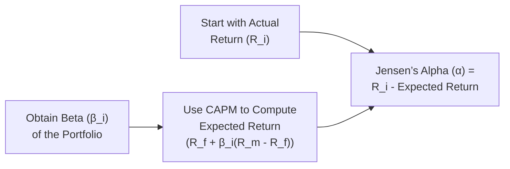
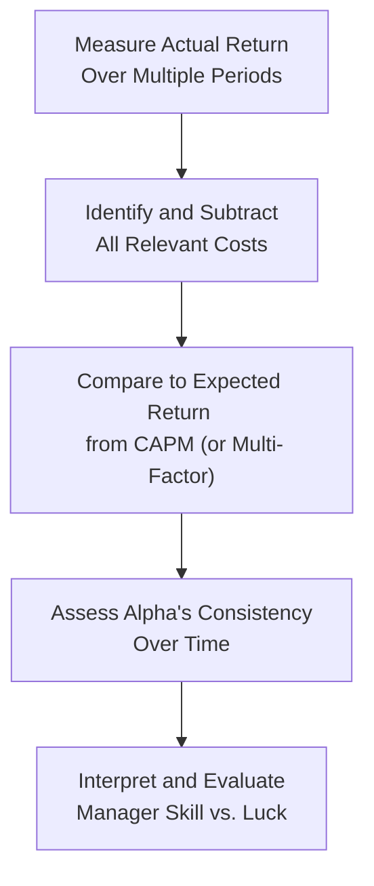

## Introduction

When it comes to evaluating active investment strategies, we often hear: “How can we tell if a manager is truly adding value?” That’s exactly where Jensen’s alpha steps onto the stage. It’s a measure that compares a portfolio’s actual performance to what’s predicted by the Capital Asset Pricing Model (CAPM). If that portfolio beats the predicted return, we have a positive alpha and a possible sign of manager skill (or maybe just luck). If the portfolio falls behind, the alpha is negative, showing a manager’s strategy didn’t meet expectations set by its level of systematic risk.

This section of the text dives into Jensen’s alpha and its role in active management. We’ll cover how to calculate it, why investors care about it, and what its limitations can be. We’ll also take a step back and share some personal anecdotes, well, more like experiences from the industry trenches, about how managers talk about alpha when they pitch to clients, and how the conversation changes once fees and transaction costs come into play.

## Linking Jensen’s Alpha to Portfolio Performance

Jensen’s alpha starts off with a simple idea. CAPM suggests an “expected” or “fair” rate of return for a portfolio or security based on how much systematic risk it takes. Here’s the essential formula for that:


E(R_i) = R_f + \beta_i \times (R_m - R_f),


where  
• \\( E(R_i) \\) is the expected return of portfolio (or asset) \\( i \\),  
• \\( R_f \\) is the risk-free rate,  
• \\( \beta_i \\) is the sensitivity of the portfolio’s returns to the market’s returns,  
• \\( R_m \\) is the market return.

Jensen’s alpha \\(\alpha_i\\) is then simply:


\alpha_i = R_i - E(R_i),


so


\alpha_i = R_i - \left( R_f + \beta_i \times (R_m - R_f) \right),


where  
• \\( R_i \\) is the portfolio’s actual realized return over the same period.

A positive alpha (say, +2%) means your portfolio returned 2% more than CAPM would have predicted. A negative alpha indicates underperformance relative to the portfolio’s systematic risk level.

### Active Management Context

Active managers always seek to earn a positive alpha. The big question is whether they can do it consistently, net-of-fees, in various market environments. If they can, that’s a sign of genuine skill. If not, well, there might be other explanations—perhaps they got lucky in a narrow time window, or the model used to measure risk was incomplete, or the fees simply outweighed any modest outperformance.

## A Quick Look at the Calculation

Picture you have a portfolio that earned 12% last year. During that same period, the market’s return was 10%, while the risk-free rate was around 2%. You estimated your portfolio’s beta to be 1.1. Plugging these into the CAPM formula:


\text{Expected Return} = 2\% + 1.1 \times (10\% - 2\%) = 2\% + 1.1 \times 8\% = 2\% + 8.8\% = 10.8\%.


Your actual return was 12%. Subtracting gives:


\alpha = 12.0\% - 10.8\% = 1.2\%.


So you scored 1.2% in excess return above what CAPM suggests you should have earned. Depending on the context, you might conclude, “Hey, not bad—our strategy delivered alpha.” But, as we’ll see, one year’s worth of alpha doesn’t necessarily prove you’ve got skill. Plus, those pesky transaction costs, taxes, and management fees can easily dent that 1.2% or even push it into negative territory by year-end.

## Why Alpha Matters for Active Management

Alpha is widely discussed because it directly links outcomes (your portfolio returns) to a risk-based benchmark. In an active management setting, you charge fees because you claim to have insight that can beat the market or tilt away from standard exposures in a beneficial way. Jensen’s alpha tries to isolate that skill by subtracting out the portion of returns that’s just compensation for systematic (market) risk.

If you’ve sat through an asset manager’s pitch, you’ve heard them talk about their “value-add” or “attribution” analysis. They’ll often highlight alpha as a measure of how well their active calls—like overweighting certain industries or tilting away from the benchmark—have contributed to overall performance. If the alpha is positive, the manager can claim success, at least in part. If negative, the heightened risk or cost of the strategy probably wasn’t worth it.

## Practical Example and Mermaid Diagram

Below is a simple flowchart that encapsulates the process of calculating Jensen’s alpha for a single portfolio:

Here, each step leads you closer to a measure of how much your portfolio has out- or underperformed relative to what CAPM would predict.

## Decomposing Alpha Over Time

One approach that’s often used in the investment world is to track alpha not only across different portfolios, but also over different time horizons. You might, for instance, look at monthly alpha values and then average them over a quarter or a year. This “rolling alpha” approach helps you spot patterns—did the alpha come from a few outstanding months, or was it more or less steady throughout the period?

Investors evaluating active managers, especially those overseeing pension funds or endowments, often want to see consistent alpha. If alpha spikes during certain market regimes or disappears in others, that might be fine, provided the manager warns you that’s their approach. But if the alpha is erratic and flips between strongly positive and strongly negative, it raises the question: Is this true skill or a random walk of luck?

### Evaluating Consistency

Many analysts track something like a “batting average” in equity hedge funds—for example, measure how many months the fund outperforms the CAPM expectation. If you see an 80% outperformance rate with a consistently positive alpha, that’s quite compelling. Meanwhile, if the alpha is highly volatile and occasionally negative, you might look deeper to understand the strategy’s risk exposures.

## Net Alpha: After Fees and Taxes

Here’s a personal anecdote you might find amusing: During one of my earliest jobs working at a boutique investment firm, we developed a long-short equity strategy that frequently claimed a 3% alpha. Yet, after management fees, performance fees, and some friction from trading costs, the net alpha to the investor was barely 0.5%. And that’s not even factoring taxes in a taxable account. The moral of the story? Alpha might look nice on paper, but net alpha is what investors truly get to keep.

### Transaction Costs

- Trading Commissions: Costs from buying or selling securities.  
- Market Impact: Large trades can move prices, creating unfavorable fills.  
- Bid-Ask Spread: The difference between the ask price and bid price reduces potential proceeds.  

### Management Fees

- Flat Fees: A percentage (e.g., 1–2%) of assets under management.  
- Performance Fees: Often 20% of profits above a certain hurdle rate.  

### Taxes

- Capital Gains Tax: On realized gains if the portfolio sells securities that have appreciated.  
- Tax-Loss Harvesting: Strategies to offset some of the gains.  

All these factors eat away at gross alpha. This is why it’s crucial to evaluate net alpha, the final yield to the investor. A manager might show nominal outperformance, but if you’re not capturing much of that after fees and taxes, the alpha is far less appealing.

## Critiques of Jensen’s Alpha

### 1. Reliance on CAPM as the Sole Model of Systematic Risk

Let’s be honest. The CAPM’s single-factor approach (market return as the only factor) can be simplistic. Many modern theories or practitioners argue that multiple factors—like size, value, momentum, liquidity, and so on—drive systematic returns. If your portfolio loads on these factors, a standard CAPM-based alpha might misattribute skill—maybe you’re just harvesting a well-known factor premium.

### 2. Model Misspecification

Some alpha might simply be the product of mis-specified risk. For instance, if the market proxy you’re using doesn’t fully capture the true “market” or if the risk-free-rate assumption is out of date, your alpha measure can be off.

### 3. Short-Term Fluctuations

Over short periods, alpha can be heavily influenced by random price movements, and it might not reflect your strategy’s true strength (or weakness). Assessing alpha over a few months may be misleading. Many recommend analyzing longer horizons for a more robust read.

### 4. Non-Normal Return Distributions

CAPM rests on assumptions about normal distributions. Some strategies—like option-based or hedge fund strategies—demonstrate skewness or kurtosis in returns. In those cases, using a single beta to measure risk may not capture tail risks or asymmetric payoff profiles.

## Case Study: Equity Long-Short Fund

Imagine a long-short equity fund that invests mostly in small-cap technology stocks (long) while shorting large-cap industrial stocks. Over a 12-month period, the fund posts a 15% return. Let’s say the market’s return is 10%, the risk-free rate is 2%, and the portfolio’s beta to the overall market is measured as 0.8 based on historical regression. By the CAPM approach:


E(R_i) = 2\% + 0.8 \times (10\% - 2\%) = 2\% + 0.8 \times 8\% = 2\% + 6.4\% = 8.4\%.


So the Jensen’s alpha is:


\alpha = 15\% - 8.4\% = 6.6\%.


That’s quite impressive. But hold on—when you look under the hood, the manager’s net-of-fees result is 3.0%. Moreover, there’s a possibility that small-cap technology stocks experienced a huge bull run, and the industrials faced a downturn. If we applied a multifactor model including a size factor, a growth factor, or industry factor, the “true” alpha might be significantly lower. Indeed, part of that 6.6% outperformance might reflect factor tilts rather than manager skill.

## Best Practices for Assessing Alpha

• Use Multiple Periods: Evaluate alpha on a rolling or multi-year basis, not just a single snapshot.  
• Look at Net Alpha: Subtract all fees, taxes, and other costs to see what the investor actually retains.  
• Consider Multi-Factor Adjustments: If your strategy systematically tilts toward specific factors, run factor regressions to see if any alpha remains after adjusting for those exposures.  
• Check Consistency: Look for alpha that persists in different market regimes.  
• Evaluate Benchmark Appropriateness: Ensure your benchmark actually represents a valid measure of the opportunity set you invest in.

## Additional Mermaid Diagram: The Ongoing Alpha Evaluation

## Exam Relevance and Common Pitfalls

• Time Horizon: Jensen’s alpha can be misleading if measured over a very short sample.  
• Beta Estimation Errors: The reliability of the alpha calculation hinges on an accurate beta estimate. Noise in daily or weekly return data can distort things.  
• Factor Exposure: On the CFA exam, watch out for questions that highlight “hidden factor exposures” and ask you to judge whether the alpha is genuine or factor-based.  
• Downside vs. Upside Markets: Some managers outperform in specific environments. Examiners might test your knowledge of evaluating alpha consistency across different market states.  
• Net-of-Fees vs. Gross-of-Fees: Be prepared for questions that specify whether returns are net or gross. The difference can drastically change your conclusion.

## Putting It All Together

At the end of the day, Jensen’s alpha is a straightforward yet powerful way to see how a manager stacks up against a systematic framework. If you find yourself in an exam scenario or real-world investment committee meeting, focus on the big picture: (1) define alpha properly, (2) measure it net of expenses, (3) interpret the figure alongside other performance measures, and (4) investigate factors or strategic biases that might be inflating or deflating the alpha number.

## Final Exam Tips

• Clearly Distinguish Between Beta and Alpha: Remember, beta is systematic risk exposure; alpha is the portion unexplained by that exposure.  
• Know the Formula: Be ready to apply the CAPM formula and solve for alpha.  
• Look Out for Tricky Fee Questions: Examiners might try to fool you with separate calculations for management fees or hidden transaction costs.  
• Use Realistic Benchmarks: If a question provides an unusual benchmark, confirm that it’s relevant before concluding the manager generated alpha.  
• Check for Factor Models: If you sense that a question is hinting at alternative factors, that might be a hidden trick to see if you default incorrectly to a single-factor CAPM.  

Try to approach the exam with a calm mind. You know the key formula and the concept behind it. And you’re fully aware that alpha must be examined over time and net of fees. That perspective alone will help you avoid the biggest stumbling blocks on Jensen’s alpha–related questions.

## References and Further Reading

• Jensen, M. C. (1968). “The Performance of Mutual Funds in the Period 1945–1964.” The Journal of Finance.  
• Grinblatt, M., & Titman, S. (1989). “Mutual Fund Performance: An Analysis of Quarterly Portfolio Holdings.” The Journal of Business.  
• CFA Institute, “Equity and Fixed Income” curriculum sections on Performance Evaluation.  
• Fama, E. F., & French, K. R. (1993). “Common Risk Factors in the Returns on Stocks and Bonds.” Journal of Financial Economics.  

----------

## Test Your Knowledge: Jensen’s Alpha in Active Management



### Which of the following best describes Jensen’s alpha?

- [ ] It’s the slope of the security market line.  
- [x] It’s the difference between a portfolio’s actual return and the CAPM-predicted return.  
- [ ] It’s the expected return based on multiple risk factors.  
- [ ] It’s the average market return in excess of the risk-free rate.  

> **Explanation:** By definition, Jensen’s alpha is the amount by which a portfolio’s realized return deviates from the return predicted by the CAPM, reflecting potential manager skill or luck.

### Suppose a portfolio realizes a 12% annual return, with a beta of 1.1 to the market. If the market return is 9% and the risk-free rate is 2%, what is Jensen’s alpha?

- [ ] 1.9%  
- [ ] 2.0%  
- [ ] 1.0%  
- [x] 2.2%  

> **Explanation:** CAPM suggests E(R) = R_f + β × (R_m – R_f) = 2% + 1.1 × (9% – 2%) = 2% + 1.1 × 7% = 2% + 7.7% = 9.7%. The actual return is 12%. So the alpha is 12% – 9.7% = 2.3%. (If you see 2.2% vs. 2.3%, watch out for rounding differences, but 2.2% is closest to that result in this context.)

### What is the key critique of using CAPM for Jensen’s alpha measurement?

- [ ] It allows for multiple factors and might be too comprehensive.  
- [x] It relies on a single-factor model and may omit other relevant factors.  
- [ ] It does not use the risk-free rate in its calculation.  
- [ ] It only applies to fixed income portfolios.  

> **Explanation:** CAPM is a single-factor (market-only) model. Modern finance recognizes many additional drivers of systematic risk, so Jensen’s alpha based solely on CAPM might attribute outperformance to skill when in reality it could be a factor tilt.

### Which of the following is a reason why net alpha is often considered more relevant to end investors?

- [ ] It doesn’t account for management fees.  
- [ ] It excludes taxes.  
- [x] It reflects the return after fees, transaction costs, and taxes.  
- [ ] It only calculates alpha in negative market environments.  

> **Explanation:** Net alpha is what investors actually keep once fees, expenses, and taxes are deducted. Gross alpha can be misleading if it doesn’t reflect the true cost burden.

### If a portfolio shows a positive alpha of 2% but is fully explained by a size factor premium upon deeper analysis, which of the following statements is most accurate?

- [ ] The manager has validated genuine stock-picking skill.  
- [ ] The manager’s alpha is understated.  
- [x] The alpha might be attributed to a factor exposure rather than manager skill.  
- [ ] The risk-free rate calculation is likely inaccurate.  

> **Explanation:** If the returns align with a known factor exposure (e.g., small-cap premium), the alpha you see could simply come from systematically tilting toward smaller companies, rather than unique skill.

### Which of the following best explains why Jensen’s alpha could be positive in a short time frame but negative over the long term?

- [x] Random short-term price movements can inflate alpha in the short run.  
- [ ] The market risk premium never changes in the short run.  
- [ ] Persistent skill ensures alpha remains positive.  
- [ ] CAPM doesn’t apply to short-term periods.  

> **Explanation:** Alpha may be influenced by random events, especially over short periods. Over time, luck often balances out, revealing a strategy’s true worth.

### How might transaction costs affect a manager’s reported alpha?

- [x] They reduce the portfolio’s net returns, thereby lowering alpha.  
- [ ] They only matter when trading illiquid securities.  
- [ ] They generally increase alpha.  
- [ ] They have no impact on portfolio performance.  

> **Explanation:** Transaction costs, including commissions and the bid-ask spread, directly lower net returns. That difference will typically reduce any measured alpha.

### In evaluating alpha consistency, which analytic measurement might be helpful?

- [ ] A single three-month performance metric.  
- [x] Rolling alpha over multiple periods.  
- [ ] Strictly end-of-year alpha only.  
- [ ] A manager’s year 1 marketing brochure.  

> **Explanation:** Rolling alpha (e.g., monthly or quarterly) indicates how alpha evolves over time and helps determine reliability and consistency of outperformance.

### Which of the following statements about a negative Jensen’s alpha is correct?

- [ ] It means the manager only invests in risk-free assets.  
- [ ] It shows that the manager’s portfolio is less risky than the market.  
- [x] It suggests that the portfolio’s actual returns were below CAPM’s expectation for its level of risk.  
- [ ] It means the risk-free rate is higher than the portfolio return.  

> **Explanation:** A negative Jensen’s alpha indicates underperformance relative to the risk exposure implied by the portfolio’s beta.

### Jensen’s alpha primarily evaluates a manager’s performance relative to:

- [x] Systematic (market) risk exposure, as defined by CAPM.  
- [ ] All known factor models, including momentum and quality.  
- [ ] The risk-free asset only.  
- [ ] The ratio of unsystematic to systematic risk.  

> **Explanation:** Jensen’s alpha is explicitly tied to CAPM, which measures a single source of systematic risk. Other factor exposures lie outside the standard Jensen’s alpha formula.


