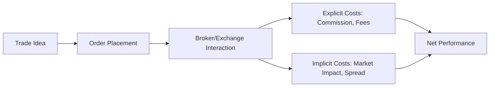

## Introduction and Motivation

I remember debating with a friend (she’s also a portfolio manager) about why my once-shiny trading strategy suddenly seemed, well, lackluster. I was proud of my tactical timing and nifty stock picks—they looked great on paper, right? But when I checked my net returns, it all fell flat. It turned out those stealthy transaction costs—brokerage fees, bid-ask spreads, and even market impact—were nibbling away at my potential alpha. Probably not the funniest conversation topic at a dinner party, but important enough to affect your bottom line and credibility as a portfolio manager.

So, if you’ve ever wondered why a perfectly good trade might still produce meager net results, or if you’ve tried to explain to a client why your otherwise skillful strategy doesn’t show up in the final tally, consider transaction costs as the prime suspect. Let’s talk through how these costs factor into performance analytics, from explicit fees to the more hidden (yet potentially hefty) implicit expenses, and how to measure and manage them.

## Fundamentals of Transaction Costs

Transaction costs are the costs associated with buying or selling securities. They typically fall into two categories:

• Explicit costs: These are relatively straightforward, often spelled out in your trade confirmations or brokerage agreements (commissions, taxes, exchange fees, etc.).  
• Implicit costs: More subtle, these include market impact and slippage from moving the stock price as you buy or sell.

### Explicit Costs

When you purchase 1,000 shares of a stock and pay a $0.01 commission per share, your total explicit trading fee is $10. That might not sound like a big deal in isolation. But if your strategy involves frequent trading and large share volumes, you see how quickly these add up. Add in exchange fees, regulatory fees, or short-term redemption fees for certain mutual funds, and the drag on performance can be surprisingly large.

### Implicit Costs

Here’s where it gets interesting. Implicit costs can be sneaky. They include:
• Bid-Ask Spread: Especially relevant in less liquid markets, the difference between the bid and ask price is the immediate cost you pay to trade.  
• Market Impact: If you place a large order, you might push the price higher (when buying) or lower (when selling), driving up your own cost in the process.  
• Slippage: The difference between the planned price for a trade and the actual execution price, often measured against benchmarks like the Volume-Weighted Average Price (VWAP).

Let’s illustrate the potential flow of transaction costs in a simple diagram:

As the diagram suggests, every time you move from “idea” to “order” to “final performance,” you’ll find yourself facing explicit and implicit transaction costs that directly reduce your net returns.

## Transaction Costs and Their Impact on Performance Analytics

### Gross vs. Net Performance

When evaluating a manager’s skill, folks often look at gross returns—sort of a “before costs” measure. But from a client’s perspective, net returns are what matters. You might have a gorgeous alpha if we ignore transaction costs, but if you can’t control the fees and slippage, your alpha might shrink to something less appealing.

Let’s define net alpha. It’s the alpha you generate after deducting all forms of transaction costs. If:

α(gross) = (Gross Portfolio Return – Benchmark Return),

then your net alpha is:

α(net) = α(gross) – Transaction Costs.

It’s easy to forget how quickly these costs can whittle away your hard-won alpha. Especially in fast-paced trading strategies, transaction costs can even turn a theoretically positive strategy into a net-loser.

### Performance Attribution and Transaction Costs

Performance attribution means figuring out where the returns come from: was it asset allocation, security selection, or timing? A robust performance attribution methodology also asks: how much return did you sacrifice to implement your trades?

By incorporating transaction costs in performance attribution frameworks, you might see that your stock-picking skill added 1% of alpha, but the trading frenzy to achieve that selection cost 0.85% in commissions and market impact. So your net alpha from security selection is just 0.15%. That might be an acceptable price or maybe it’s too high. Either way, you need the data to decide.

## Models and Methods for Measuring Transaction Costs

Because implicit costs can be hard to measure, managers often benchmark trades to something like a notional “paper portfolio” or to standardized measures like VWAP or Implementation Shortfall. Let’s take a look at a few major approaches:

### VWAP (Volume-Weighted Average Price) Benchmark

VWAP calculates the average price of a stock’s trades throughout a day, weighted by volume of trades each period. By comparing your execution price to the VWAP, you see if you did better or worse than the “typical” daily execution. If you consistently trade below the VWAP (on buys) or above the VWAP (on sells), you look pretty good. If you keep missing VWAP, well, maybe your trading desk or broker is executing poorly—or your orders are so large that they significantly shift market prices.

Mathematically, VWAP is:


\displaystyle \text{VWAP} = \frac{\sum (P_t \times Q_t)}{\sum Q_t}


where \\(P_t\\) is the transaction price at time \\(t\\) and \\(Q_t\\) is the number of shares traded at time \\(t\\).

### Implementation Shortfall

Implementation shortfall compares the value of a portfolio that would exist if you executed trades immediately at a “paper” price (often the decision price—when you decided to make the trade) versus what actually happens in the real market. The difference is the “shortfall” due to delays, price moves, spreads, and commissions.  

If the paper world suggests you could buy a stock at \$50.00, but by the time your order fills the average purchase price is \$51.00 (including commission), your implementation shortfall is the \$1.00 difference.

Implementation shortfall helps highlight the hidden or implicit costs of execution beyond just commissions. It accounts for adverse price moves and the opportunity cost of waiting to fill large orders.

### Market Impact Models

Some investors use specialized models that incorporate historical liquidity patterns, stock volatility, order size relative to average daily volume, and typical bid-ask spreads. These more complex models can be integrated into an algorithmic trading platform that automates order slicing, timing, and trading venues—an approach aimed at reducing market impact.

## Frequent Trading Strategies and Net Alpha

Frequent trading might give you a higher gross alpha if you catch short-term price movements or exploit fleeting market inefficiencies. However, each trade introduces a cost—even for purely programmatic trades. Imagine that you manage a high-frequency strategy with a daily turnover of 100% (selling and re-buying your entire portfolio each day). If each round trip costs you 0.05% in commissions and slippage, then your 100% turnover equates to a 0.05% daily drag. Extended over 250 trading days, you can see how the cumulative effect might overshadow what looked like a sweet alpha in theory.

## Mitigating Transaction Costs: Best Practices

Control your transaction costs, and you’ll preserve more alpha. You can’t eliminate them altogether, but there are a few ways to keep them in check:

• Limit Orders: Instead of using a market order, you can set a price limit to reduce the risk of executing at unfavorable prices. Of course, the trade might not fill if the market never reaches your limit.  
• Algorithmic Trading: Use advanced algorithms (VWAP, TWAP, POV, etc.) that slice orders into smaller chunks over time, potentially mitigating market impact and getting more favorable fill prices.  
• Order Timing: Trading at times of higher liquidity (e.g., near market open or close for certain markets) can reduce spreads.  
• Trade Netting: If there are offsetting trades within the same portfolio, net them out internally before going to the market—thus lowering overall volume.  
• Scaling In or Out: Instead of dumping a large block at once, scale in or out of positions to spread the cost and minimize market impact.  

## Example: Evaluating a Trading Decision with Transaction Costs

Let’s quickly walk through a (fictitious) scenario to see how transaction costs can affect performance:

• You notice a stock (XYZ) trading at \$50.00 that, based on your analysis, should climb to \$52.00.  
• You decide to buy 10,000 shares at \$50.00. Your broker charges \$0.01 per share commission.  
• You place a market order, but the average fill price ends up at \$50.05 due to small slippage and the bid-ask spread.  
• Your total explicit commission: 10,000 shares × \$0.01 = \$100.  
• Your implicit cost from slippage: 10,000 shares × (\$50.05 – \$50.00) = \$500.  

In total, you have \$600 in extra cost, which is 1.2% of your original \$50,000 notional ($600 / $50,000 × 100). That’s not an extreme example, but if your predicted gain is only about \$2,000 (if the stock goes to \$52.00, you’d gain \$2.00 × 10,000 shares = \$20,000 in a perfect scenario), that \$600 might still feel manageable. But if this scenario is repeated many times a day or with larger shares, or if the stock’s final move is smaller, you quickly feel the squeeze.

## Incorporating Transaction Costs into Performance Attribution

When constructing your performance attribution reports—or reviewing your manager’s reports—ensure transaction costs are separated from other sources of performance. An example might be broken down into:

• Security Selection Alpha (Gross)  
• Timing Alpha (Gross)  
• Asset Allocation Alpha (Gross)  
• Transaction Costs (Explicit + Implicit)  
• Net Alpha  

This structure helps you identify how much alpha a manager really contributes after factoring in all the friction.

## Practical Guidelines and Industry Practices

• Keep track of your average trading cost per share or per trade. If you see that your cost is creeping up, investigate whether something changed in liquidity or if you’re using suboptimal order types.  
• Evaluate your orders relative to benchmarks like VWAP or Implementation Shortfall. This helps you pinpoint underperforming periods or asset classes.  
• For frequent trading strategies, run scenario analysis to estimate how transaction costs might accumulate.  
• Be mindful of transaction cost budgeting. In large institutions, the portfolio manager and the trader usually coordinate to stay within a “trading cost budget” per quarter or year.

## Conclusion and Exam Tips

Transaction costs may not be the most glamorous line item, but ignoring them is like ignoring the hole in the bottom of your boat. Even the best alpha generation strategies can quickly lose their luster if you’re bleeding performance through poorly managed execution.

For the CFA exam, expect scenario-based questions testing your understanding of how to calculate net returns, evaluate transaction cost considerations, and identify best practices to mitigate these costs. A few other tips:

• Familiarize yourself with the definitions: market impact, VWAP, implementation shortfall, etc.  
• Understand the difference between gross and net performance and be prepared to perform quick calculations on them.  
• Practice applying transaction-cost models in performance attribution examples.  
• Don’t forget the bigger picture of risk and return—transaction costs can shift the shape of your risk-return profile.  

Being well-prepared to handle transaction costs, from both a theoretical and practical standpoint, can make you a more effective portfolio manager and impress clients with your thoroughness.

## References & Further Reading

- Kissell, R. (2014). The Science of Algorithmic Trading and Portfolio Management. Academic Press.  
- Perold, A. F. (1988). The Implementation Shortfall: Paper vs. Reality. The Journal of Portfolio Management.  
- CFA Institute. (2025). CFA® 2025 Level I Curriculum, Volume 9: Portfolio Management. CFA Institute.  
- Hasbrouck, J. (2007). Empirical Market Microstructure: The Institutions, Economics, and Econometrics of Securities Trading. Oxford University Press.

## Test Your Knowledge: Transaction Costs in Performance Analytics



### A portfolio manager wants to know how much her large trades affect security prices. Which type of cost primarily refers to this impact?

- [ ] Explicit cost
- [x] Market impact
- [ ] Commission
- [ ] Spread cost

> **Explanation:** Market impact measures how much the price changes because of placing the order itself. This is typically considered an implicit cost.

### What happens if you continually ignore implicit transaction costs in performance measurement?

- [ ] Performance will be overstated.
- [x] Performance will be artificially inflated in gross terms.
- [x] It could lead to incorrect evaluation of a strategy’s true profitability.
- [ ] It results in higher turnover.

> **Explanation:** Implicit transaction costs (like slippage and spread) can significantly reduce actual returns. Ignoring them inflates the perceived performance.

### The difference between the price at which a trader decides to buy and the actual executed price is generally referred to as:

- [ ] Commission
- [ ] Effective spread
- [x] Slippage
- [ ] Maintenance margin

> **Explanation:** Slippage is the difference between the decision price and the real execution price, capturing any adverse fill or shortfall from the ideal transaction.

### An equity portfolio manager wants to benchmark her transactions to a standard that reflects how she performed relative to the average market price over a full day. What is the most commonly used benchmark?

- [ ] Implementation shortfall
- [x] VWAP
- [ ] Policy portfolio
- [ ] Exchange daily close

> **Explanation:** VWAP (Volume-Weighted Average Price) is the typical intraday benchmark many managers use to assess whether they executed better or worse than the day’s average trading price.

### A portfolio manager is considering adopting a high-turnover momentum strategy. Which statements about transaction costs are correct?

- [x] They can quickly erode any excess return if trades are frequent.
- [ ] They are negligible if the market is liquid.
- [x] Both explicit and implicit costs should be considered.
- [ ] Only commissions matter, not spread.

> **Explanation:** High turnover strategies generate multiple trades, thus incurring more commissions, spreads, and market impact. Even in liquid markets, large or frequent orders can increase costs.

### How is net alpha best described?

- [x] Alpha after all transaction costs.
- [ ] Alpha before commissions but after fees.
- [ ] Alphas from only the security selection effect.
- [ ] None of the above.

> **Explanation:** Net alpha is the manager’s alpha after transaction costs, reflecting the actual value added once frictional costs are deducted.

### When using an implementation shortfall approach, what specific aspect is measured?

- [x] The difference between theoretical “paper” return and actual realized return.
- [ ] The difference between monthly rebalancing cost and actual cost.
- [x] The total cost of delay, slippage, and commissions compared to the decision price.
- [ ] The difference between top-down and bottom-up target weights.

> **Explanation:** Implementation shortfall tracks the hidden and explicit costs between the moment you decide to trade (decision price) and the actual price you get, including delay and market impact.

### Which of the following is an effective way to reduce market impact when trading a large block of shares?

- [x] Splitting the order into smaller pieces over time.
- [ ] Using only market orders.
- [ ] Trading exclusively in thinly traded markets.
- [ ] Executing the entire block at once without regard for liquidity.

> **Explanation:** Splitting orders (often via algorithmic methods) can prevent large, one-time orders from strongly moving the price against you.

### A manager’s performance attribution model shows a high positive contribution from security selection but also a high negative contribution from transaction costs. What does this suggest?

- [ ] The manager consistently trades inside information.
- [x] The manager's good picks are overshadowed by heavy trading frictions.
- [ ] The manager can ignore transaction costs for performance reviews.
- [ ] The manager’s customers earn higher net returns on every trade.

> **Explanation:** Even if security selection is strong, high transaction costs can quickly reduce or negate that benefit, lowering net performance.

### True or False: If a fund trades frequently, the best benchmark for evaluating overall transaction costs is the ratio of commissions to total trade volume only.

- [x] True
- [ ] False

> **Explanation:** Commissions to total trade volume is one of the simpler ways to quantify explicit costs. However, it does not capture implicit costs like market impact or slippage, so caution is advised in solely relying on this ratio.


