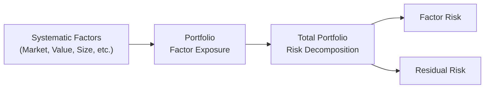

## Introduction
Residual risk—sometimes called idiosyncratic or active specific risk—can feel a bit slippery, right? It’s that portion of a portfolio’s risk that we can’t quite pin on common factors like broad market swings, sector effects, or style influences. And factor tilts? Those are the times we say, “You know what, I believe ‘value’ (or ‘momentum,’ or ‘small cap’) is going to outperform, so I’ll overweight that factor and hope it pays off.”

In this section, we’ll dissect where residual risk comes from, why it matters, and how factor tilts can be a powerful but double-edged sword in active portfolio management. I once spent hours—trust me, too many hours—puzzling over how a portfolio’s quirky stock picks led to random bursts of volatility. Spoiler alert: that was mostly residual risk at play.

## Understanding Residual Risk
Residual risk is the piece of the risk puzzle that’s not explained by systematic factors or broad market movements. If we think back to multi-factor models (like in Section 3.8: Extensions of the CAPM and Multi-Factor Models), each factor, such as market beta, size, value, momentum, or quality, explains part of an asset’s returns. Whatever’s left—whatever can’t be explained by these known factors—contributes to residual risk.

Mathematically, a simplified factor model for an asset’s return Rᵢ might look like:


R_i = \alpha_i + \beta_{i,1}F_1 + \beta_{i,2}F_2 + \cdots + \beta_{i,k}F_k + \epsilon_i,


where:

• F₁, F₂, …, Fₖ are factors (e.g., the market factor, size factor, value factor, and so on),  
• βᵢ,₁, βᵢ,₂, …, βᵢ,ₖ are the factor loadings,  
• αᵢ represents alpha (sometimes viewed as excess return not captured by the factors),  
• εᵢ is the residual term capturing idiosyncratic risk.

In a well-diversified portfolio, many of these residual components can cancel each other out statistically, thereby reducing residual risk overall. Still, if your portfolio holds large positions in individual securities with big, unique exposures (like a highly innovative biotech stock or a brand-new digital asset), you’ll likely face more of this risk that’s not explained by broad factors.

## Factor Tilts
A “factor tilt” is when we intentionally over- or underweight a specific factor relative to a broad market benchmark. Maybe you’ve read evidence that “value” stocks are underpriced or that “momentum” might keep riding a hot streak. If you choose to overweight value stocks or overweight strong recent performers, that’s a factor tilt.

• Overweight a factor: If the factor does well, you enjoy extra returns. But you also face extra factor-specific risk if that factor drops off.

• Underweight a factor: If you believe a factor is overvalued or is about to crater, you choose to minimize that exposure. This can preserve capital if you’re right, but creates the possibility of underperforming if that factor flourishes.

### A Personal Perspective
I recall an early conversation I had with a portfolio manager who loaded up on small-cap growth stocks. He was convinced the next few quarters would favor small, innovative businesses. It was a factor tilt in every sense of the word. For a while, it worked spectacularly. Then, the market shifted, and small caps got hammered. The manager’s portfolio underperformed, all because of a strong tilt that was no longer in favor. This underscores the inherent risk of deviating from broad diversification: you can’t predict with certainty which factor will “pop” next.

## Tools for Decomposing Portfolio Risk
Often, we want to know exactly how much of our total portfolio risk is due to systematic exposures (i.e., factor exposures) versus how much is purely idiosyncratic. Various analytical techniques, from specialized software packages to simpler regression-based models, let us estimate each chunk of risk.

Below is a conceptual diagram (using Mermaid.js) for how a multi-factor model dissects total portfolio risk into factor risk and residual risk:

When you run a factor-based risk decomposition (often using tools from major risk service providers or your own Python scripts), the model calculates factor loadings and estimates how each factor contributes to your portfolio’s variance. The portion that’s unaccounted for is residual risk, typically shown as “idiosyncratic” or “stock-specific” in risk reports.

### Simple Example of Factor Risk Decomposition
Suppose you have a three-factor model: Market (M), Value (V), and Momentum (Mo). You run the factor exposure analysis on your portfolio and discover:

• Market factor contributes 50% of your total variance,  
• Value factor contributes 20%,  
• Momentum factor contributes 10%,  
• Residual risk accounts for 20%.

In this case, 20% of your portfolio’s variance is explained by neither market, value, nor momentum. That chunk is your residual risk. And guess what—that 20% can swing up or down unpredictably.

## Factor Tilts in Active Management
Active managers often aim to capture alpha by identifying factors they believe are mispriced. Common factor tilts include:

• Overweight “Value” stocks during periods the manager perceives as overpriced for growth or momentum.  
• Overweight “Momentum” when the manager predicts a continuation of recent trends.  
• Overweight “Quality” if economic uncertainty is high, expecting stable companies to perform better in volatile markets.

When these tilts align with actual market outcomes, the portfolio outperforms. If the market’s mood shifts, these same tilts can cause underperformance. 

### Overweighting Value vs. Underweighting Momentum
An interesting scenario arises when managers implement one tilt (say, overweighting value), which implicitly becomes another tilt in the opposite direction (underweighting growth or momentum). It’s crucial to be aware that making one bet nearly always means you’re simultaneously making the opposite bet on something else. Now, that might sound obvious, but it’s often overlooked when we focus only on the factor we’re favoring.

## Monitoring Unintended Factor Tilts
Unintended factor tilts can creep in if your stock selection or sector rotation inadvertently leads to factor concentration. Let’s say you pick a set of stocks that look great individually. You run your standard fundamental analysis and cash-flow modeling. Everything seems perfect. However, you notice (maybe after the fact) that all these companies are small-cap tech firms. You’ve now created a tilt toward small-cap growth, and you might be exposing your entire portfolio to correlated downward (or upward) moves if small-cap growth stumbles (or surges).

### Practical Steps to Monitor Tilts
1. Regular Factor Exposures Reports: Use a factor model on your portfolio at least monthly or quarterly.  
2. Sector/Industry Breakdown: Cross-check that your sector breakdown doesn’t deviate unintentionally from your benchmark (unless that’s your stated goal).  
3. Compare Historical Beta vs. Holdings Beta: Ensure your actual holdings match your intended risk profile.  

Remember, factor tilts can be beneficial, but “surprise” tilts might rattle your portfolio’s performance in ways you never intended.

## Balancing Targeted Factor Bets and Diversification
When actively tilting your portfolio, it’s essential to keep an eye on diversification. If, for instance, you’re heavily overweight the value factor, you might want to maintain balanced exposures in other factors, like momentum or quality, or hold certain hedges that neutralize unintended risk. 

### Striking the Right Balance
• Validate Your Investment Thesis: Are you tilting based on credible research and consistent logic? Or is it a hunch?  
• Track Risk Budgets: Some managers allot “risk budgets” to each factor tilt. If you exceed that budget, consider scaling back.  
• Continue Stress Testing: Check how your tilt performs under different macroeconomic scenarios, like rising interest rates or a recession scenario.

## Implementation Considerations and Best Practices
1. Clarify Objectives: Are you seeking higher returns through factor bets, or do you just want to maintain a neutral stance?  
2. Use Efficient Trading Methods: Minimize transaction costs when adjusting factor exposures, factoring in turnover and liquidity.  
3. Rebalance Periodically: Factor exposures can drift over time, so rebalancing helps maintain your target tilts (or even close them if the environment changes).  
4. Communicate to Stakeholders: If you’re a portfolio manager for a client or an investment committee, be clear about the factor tilts and the potential risks.

## Practical Example: Factor Tilts Leading to Extra Returns (and Risk)
Imagine a $100 million equity portfolio. You spot valuation metrics indicating that small-cap value stocks are trading at extremely low price-to-book ratios. You decide to overweight small-cap value stocks by 10 percentage points more than your benchmark. Over the next year, those undervalued companies catch the market’s attention, and your overweight position doubles. Your portfolio’s overall return is noticeably higher. Fantastic, right?

But let’s say in the following quarter, economic news spooks investors away from small caps, and these stocks lose ground. Your 10-percentage-point tilt that once was a gift now drags performance below the benchmark. The lesson? Factor tilts can be a high-reward, high-risk approach. You’ll need strong conviction, sound risk controls, and possibly a willingness to ride out drawdowns.

## Conclusion and Key Takeaways
Residual risk is that sneaky part of your overall risk that can’t be pinned on the usual market factors—kind of like the quirky personality each stock brings to your portfolio. Factor tilts let an investor intentionally deviate from broad market exposures, often aiming for outperformance based on perceived mispricing. Yet with these strategies come some challenges:

• Ensure you’re aware of exactly which factor bets you’re making—intentionally or not.  
• Keep an eye on how much residual risk is lurking; diversification still matters.  
• Remember that factor bets cut both ways: if the factor moves in your favor, you win; if not, you lag the benchmark.

In practice, factor-based testing tools, rebalancing guidelines, and rigorous macroeconomic outlooks (Section 1.6) can help you manage these exposures responsibly. The next time you’re considering a tilt—maybe small-cap, momentum, or ESG factors—just ensure you’re in control of any unintended consequences that might tag along.

## Glossary
• Residual Risk (Idiosyncratic Risk): The portion of a portfolio’s total risk that cannot be explained by its exposures to systematic factors (market, style, etc.).  
• Factor Tilt: An intentional overweight or underweight to a specific factor (like value or momentum) in an effort to outperform a benchmark.  
• Idiosyncratic Component: Unique company- or security-specific elements of risk that typically can be diversified away in a large, balanced portfolio.

## References & Further Reading
• Clarke, R., de Silva, H., & Thorley, S. (2006). “Minimum-Variance Portfolios in the U.S. Equity Market.” The Journal of Portfolio Management.  
• Chan, L., Karceski, J., & Lakonishok, J. (1999). “On Portfolio Optimization: Forecasting Covariances and Choosing the Risk Model.” The Review of Financial Studies.

## Final Exam Tips
• Practice Decomposition: Be ready to run through partial or complete risk decompositions in exam scenarios. Understand how to interpret factor exposures and identify residual risk quickly.  
• Watch the Beta and Factor Loadings: On the exam, you might need to assess whether a portfolio is heavily tilted or matched to the benchmark. Make sure you know how to read factor loadings and betas.  
• Articulate the Rationale: When you pick a factor to tilt toward, you might have to justify it in writing. Outline your logic, referencing the macro environment, valuation metrics, or historical performance data.  
• Mind the Trade-Offs: Factor tilts can boost returns but might blow up if timing is off. The exam could ask you to propose risk controls or hedging steps.  
• Time Costs and Liquidity Constraints: Spreads, liquidity, and transaction costs can eat into factor tilt gains. Be prepared to discuss or calculate these.  

Below are ten sample questions to help you practice what we’ve covered.

## Practice Questions: Residual Risk and Factor Tilts



### Which of the following best describes residual risk in a portfolio?

- [x] The portion of total risk not explained by systematic or factor exposures.
- [ ] The portion of total risk driven exclusively by market movements.
- [ ] The portion of total risk modeled by a single-factor CAPM.
- [ ] The portion of total risk that is positively correlated with changes in interest rates.

> **Explanation:** Residual risk, also called idiosyncratic risk, is the slice of a portfolio’s risk unexplained by known factors such as market, size, value, etc.

### A deliberate overweight in one factor typically implies:

- [x] An underweight in another factor or the market portfolio.
- [ ] No effect on other factors in the portfolio.
- [ ] A decline in overall market risk.
- [ ] A fixed realignment of risk-return objectives.

> **Explanation:** Tilting toward one factor frequently means implicitly underweighting something else—creating a two-sided bet.

### When factor tilts are most beneficial, which of the following is likely true?

- [x] The tilted factor experiences favorable market conditions.
- [ ] All factors in the portfolio converge in performance.
- [ ] Systematic risk is reduced to near zero.
- [ ] Unintended exposures have little impact on portfolio alpha.

> **Explanation:** If a factor tilt aligns with market trends and indeed outperforms, the portfolio can enjoy boosted returns.

### Unintended factor tilts might arise when:

- [x] Stock selection unknowingly concentrates holdings in a particular industry or style.
- [ ] The portfolio invests only in broad market index ETFs.
- [ ] Only market risk factors are included in the risk model.
- [ ] A portfolio invests in a large range of asset classes to ensure diversification.

> **Explanation:** Sometimes, security selection that favors a certain sector or style inadvertently creates a tilt, even if that wasn’t the original intention.

### In a three-factor model (Market, Value, Momentum), if 20% of the portfolio's risk is unexplained by these factors, that portion is:

- [x] Residual risk.
- [ ] Market risk.
- [ ] Value risk.
- [ ] Momentum risk.

> **Explanation:** The 20% unaccounted for is by definition residual (idiosyncratic) risk.

### Which mechanism below best reduces residual risk?

- [x] Diversification across a broad set of securities.
- [ ] Eliminating exposure to all factors.
- [ ] Betting only on a single factor with the highest expected return.
- [ ] Leveraging the portfolio to amplify returns.

> **Explanation:** Holding a range of uncorrelated assets helps offset the idiosyncratic risk of individual holdings.

### A manager believes that value stocks are underpriced and increases her exposure to them. This is an example of:

- [x] A factor tilt.
- [ ] A systematic offset to alpha.
- [x] A deviation from benchmark weights.
- [ ] A market efficiency bet with guaranteed returns.

> **Explanation:** Overweighting value relative to a benchmark is a textbook example of a factor tilt, deviating from the “neutral” or passive position.

### A manager who wants to examine how much of their portfolio’s variance is due to factor exposure would most likely:

- [x] Use a multi-factor risk decomposition tool.
- [ ] Rebalance to an equal-weighted portfolio weekly.
- [ ] Diversify exclusively in corporate bonds.
- [ ] Eliminate all small-cap stocks.

> **Explanation:** Multi-factor models help parse out the fraction of variance explained by each factor.

### When are factor tilts generally aligned with active management?

- [x] When they reflect an intentional view the manager holds about factor mispricing.
- [ ] When they are introduced by random security selection.
- [ ] When the portfolio invests passively in an index fund.
- [ ] When the factor moves in the opposite direction of the manager’s stated strategy.

> **Explanation:** Factor tilts are by nature an active choice to depart from strict market exposures based on a manager’s hypothesis.

### True or False: Residual risk can be negative.

- [x] True
- [ ] False

> **Explanation:** Residual risk, typically defined as a variance, can be considered a positive quantity. However, the direction of the residual impact (the unexpected portion of returns) can be negative or positive for the portfolio’s performance, effectively creating negative alpha if the idiosyncratic component works against you. Conceptually, “risk” is non-negative, but the impact of that risk on returns can be negative—hence there's room for losses that deviate from factor expectations.


