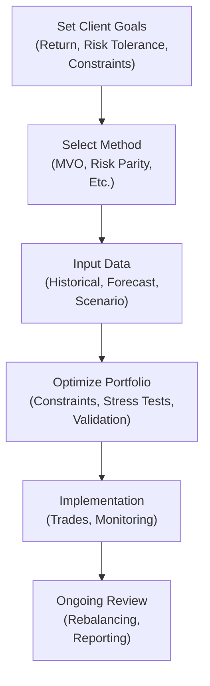

## Introduction and Context

So, you’re sitting there, looking at a set of potential assets, each with different expected returns and risks. You might be thinking: “Okay, which combination maximizes return without giving me sleepless nights?” That's precisely where risk-adjusted portfolio selection swoops in. It’s about building a portfolio that isn’t just about scooping up the highest expected returns but also about understanding—and managing—the risks you’re taking. After all, who wants to be glued to their screen every minute, worrying about wild market swings?

Risk-adjusted portfolio selection has its roots in the earliest days of Modern Portfolio Theory, famously introduced by Harry Markowitz in the 1950s. It was Markowitz who said: “Don’t just think about an asset in isolation—think about how it interacts with the other assets in your portfolio.” This principle underpins the classic mean–variance optimization (MVO) approach. But, you know, times change, and financial markets can get complicated (like, unbelievably complicated, if you let them). So, we now have a bunch of spinoffs—risk parity, maximum diversification, robust optimization, and more. They all aim to incorporate risk measures more effectively, so your portfolio is well-armed to withstand all sorts of market storms.

In this discussion, we’ll walk through the nuts and bolts of popular risk-adjusted portfolio selection approaches, highlight how constraints like Value at Risk (VaR) or drawdown limits come into play, and address the complexities of turning client objectives into systematic decisions. Let’s dive in; hopefully, you’ll come away feeling excited to apply them in your own portfolio (or test them out on some exam questions, wink).

## The Mean–Variance Optimization Foundation

Mean–Variance Optimization (MVO) is our trusty old friend in portfolio management. It’s the tried-and-true method that frames portfolio selection as a problem of balancing expected returns and variance (i.e., risk). We want the best possible expected return for a given level of risk or (depending how we view it) the lowest risk for a given level of return.

### Key Equations in MVO

Let’s sprinkle in a bit of mathematics to anchor the concept. Suppose you have:

• A vector of expected returns for \\( n \\) assets: \\(\mu = (\mu_1, \mu_2, \dots, \mu_n)\\).  
• A covariance matrix \\(\Sigma\\), which measures how assets move relative to each other.  
• A vector of portfolio weights \\( w = (w_1, w_2, \dots, w_n)\\), where each \\(w_i\\) indicates the fraction of capital invested in asset \\(i\\).

The expected return of the portfolio \\( E(R_p) \\) is:

E(R_p) = w^T \mu.


The variance (a measure of overall risk) is:

\sigma_p^2 = w^T \Sigma \, w.


Mean–variance optimization is about picking \\( w \\) to find an “efficient” portfolio—meaning, no other portfolio exists that can give you higher return for the same or lower risk.

### Interpreting MVO in Practice

Sure, MVO can feel a bit abstract. But think of it like standing in front of a big buffet table (the entire universe of assets). Each selection has a certain “taste” (expected return) and potential for heartbreak (risk). You want to stack your plate to get the best synergy of taste without overshooting your spice tolerance. That synergy is captured by the covariance matrix, which can either reduce total risk or amplify it, depending on how correlated the assets are.

MVO is also known for producing corner solutions (like pouring all capital into the single asset with the best risk-return ratio) if constraints or weight limits aren’t imposed. That’s why real practitioners layer on real-world constraints and tailor the approach with advanced or alternative methods.

## Incorporating Risk Constraints

Straight MVO might say: “Invest big in Tech Stock A and Government Bond B, ignore everything else.” But real portfolio managers often impose constraints to align with their or their clients’ risk appetites. These constraints can be:

• Volatility Caps: “Don’t let total portfolio volatility exceed, say, 12%.”  
• VaR (Value at Risk) Limits: “I can’t lose more than \$5 million with 95% confidence in any given week.”  
• CVaR or Expected Shortfall: “Focus on the tail losses, ensuring that if I do lose money beyond the VaR threshold, it’s not catastrophic.”  
• Drawdown Thresholds: “I’m okay if the portfolio dips by 10% at worst, but not beyond that.”

### Example: VaR in Action

Imagine a pension fund manager who says: “We can’t stomach daily losses above \$2 million with a 99% level of confidence.” That’s effectively a VaR constraint. In MVO terms, we might incorporate that as an extra rule:  

\text{VaR}_{0.99}(w) \leq \$2 \text{ million.}
  
In practice, you estimate VaR using historical data or by making some assumptions about the distribution of returns. Then you unify that measure with your optimization problem, turning it into a formidable set of mathematical expressions that shape your feasible investing region.

### Diagram: The Optimization Process with Constraints

Below is a simple flowchart illustrating how you might incorporate risk constraints into a broader optimization framework:

It looks pretty neat in theory, right? In reality, you’d have a more elaborate pipeline with numerous cross-checks, but the essence is captured here.

## Alternative Approaches to Portfolio Selection

### Risk Parity

Risk parity has become quite popular, particularly among institutional investors. Instead of allocating capital in proportion to expected returns, you aim to allocate risk evenly across all assets or asset classes. The result is that no single asset dominates the portfolio’s overall risk.

• Rationale: If you hold a bunch of different assets, you want each to contribute roughly the same “risk slice.” This tends to produce more stable results during market fluctuations.  
• Mechanism: You measure the marginal contribution to risk of each asset—loosely speaking, how much each asset’s movements add to the total risk. Then you size your positions so each asset’s contribution is the same.

You might say: “Well, that means I’m going to lever up the safer assets until their risk matches that of, say, stocks.” Precisely! That can be part of the strategy. Traders often use derivatives or borrowed funds to scale up these positions so that each portion contributes equally to the total volatility.

### Maximum Diversification

Another spin is the maximum diversification approach, where you seek to maximize the ratio of portfolio return to portfolio volatility in a manner that especially penalizes correlated assets. You might start by focusing on assets that behave differently in certain environments—maybe pairing cyclical equities with long-duration government bonds, mixing in commodities or real estate, depending on correlation patterns. The idea is you want the broadest distribution of exposures so that if one corner of the market stumbles, the rest of the portfolio remains on its feet.

### Robust Optimization

I remember a chat with a risk manager friend—he was building a super-sophisticated portfolio model that looked breathtaking on whatever data sample he used, then performed dismally out-of-sample. This is where robust optimization steps in. It aims to reduce sensitivity to errors in estimates (because, let’s face it, we never really know “true” expected returns or covariance). By systematically incorporating uncertainty around expected returns and correlation estimates, robust optimization yields more stable, if somewhat less spectacular, solutions. The payoff is consistency—if the future looks even slightly different from your estimates (and it usually does), you’re less likely to get hammered.

## Translating Client Objectives into Portfolio Selection

As a portfolio manager or investment advisor, your real job is to take a client’s objectives and constraints and turn them into an optimization problem:

• **Absolute Return Target**: Maybe a client wants at least 6% annual return. That becomes a constraint.  
• **Target Volatility**: Another client might say: “I don’t want volatility above 10%.” That’s either a direct constraint or something you incorporate in your objective function.  
• **Liquidity**: Some clients need daily or weekly liquidity (like open-ended mutual funds). You might exclude illiquid assets or limit them in the portfolio.  
• **Regulatory Constraints**: Banking or insurance clients have regulatory capital requirements that effectively cap how much risk can reside in certain asset classes.

### The Process

It typically goes like this:  
1. **Identify the objective**: “We want 7%+ return with a maximum drawdown of 15%.”  
2. **Gather data**: Historical returns, correlation structures, possible stress scenarios.  
3. **Choose method**: MVO with a drawdown constraint? Risk parity with a specialized VaR constraint?  
4. **Optimize**: Solve the problem, see which solutions are feasible.  
5. **Stress test**: Evaluate the solution under adverse scenarios (crises, yield curve inversions, etc.).  
6. **Adjust if needed**: Re-construct or tweak the constraints.

And yes, they almost always get tweaked. It’s rarely a “set it and forget it.”

## Accounting for Non-Normal Distributions

I bet you’ve all heard that returns can sometimes look more like a “leptokurtic” distribution (fat tails, higher peak) than the neat, symmetrical Gaussian. If so, purely mean–variance-based approaches could mislead you because they rely heavily on the assumption that risk is encapsulated entirely by variance. Market crises remind us volatility can spike, correlations can jump, and losses can cluster. So we do:

• **Scenario Analysis**: “If the oil price collapses, how do my assets respond?”  
• **Stress Testing**: “If all equities drop 25% in a month, what happens to the portfolio?”  
• **Alternative Risk Measures**: Using VaR, CVaR, or marginal shortfall to track tail risks.  
• **Correlations Under Stress**: Realizing that correlations often go to 1 in a crisis.

For instance, in 2008, many believed that mortgage-backed securities were safer because they were “diversifying.” Then correlations shot up, and the entire structured credit market sank together. That’s why robust optimization frameworks often incorporate these scenario-based correlations or non-parametric stress tests to reflect the possibility of big shocks.

## Complexity Versus Transparency

One big question that arises in risk-adjusted approaches is: “How complicated should my model be?” On the one hand, it’s kinda fun to build a super-sophisticated model that tries to capture every nuance. On the other hand, you might struggle to communicate and justify it to a board of directors or your client. Overfitting is also a real threat—where you calibrate so precisely to the past that you’re doomed to fail on new data.

### Balancing Act

• **Simplicity**: Easy to explain, faster to compute, and less prone to estimation error. But might skip out on capturing some complexities of the market.  
• **Complexity**: Potentially more accurate but covers so many moving parts that you might even question your own results if they deviate from your or your client’s intuition. Also, a big risk that you’re overfitting.  

Some professionals keep it fairly simple: light constraints, a standard MVO approach, some scenario analyses, plus a drumbeat of robust optimization techniques to keep the overfitting monster at bay. Others deep-dive into advanced modeling with factor-based risk models, dynamic regime-switching, and the works—but they often have to do a fair bit of explaining to stakeholders.

## Practical Examples and Case Studies

### Case: Risk Parity in a Balanced Fund

Imagine you manage a “balanced” fund with 60% equities and 40% bonds. Over the past decade, you notice that equity risk dwarfs bond risk, meaning that even though capital is allocated 60–40, the “risk contribution” might be something like 90% from equities and 10% from bonds. A risk parity approach would say: “Bring those risk contributions in line, maybe by leveraging the bond portion so it has a similar volatility as equities.” If you do that carefully, you might end up with more consistent performance across different market cycles.

### Case: Maximum Diversification to Tackle Concentration

Another scenario might involve a portfolio heavily weighted in high-tech stocks. The manager sees they’re correlated (shock, right?), so that if the tech industry gets hammered, the portfolio will be in trouble. By shifting toward a maximum diversification strategy—adding uncorrelated assets such as real estate investment trusts (REITs) or certain commodities—they reduce the total risk from that single factor (technology). The results? Possibly a smoother ride, albeit with some potential drag on super-charged returns during tech booms.

## A Visual Snapshot of Risk–Adjusted Selection

Here’s a simplified look at how a risk-adjusted portfolio selection might flow from start to finish:

## Takeaway Tips (including Exam Thoughts)

1. **Know the Core:** Understand how mean–variance optimization works at a fundamental level. It’s not going anywhere, no matter how fancy new models get.  
2. **Constraints Matter:** On the exam, watch for references to VaR, liquidity, or regulatory constraints that shape the feasible set of solutions.  
3. **Don’t Underestimate Tail Risks:** Examiners might ask about stress tests or scenario analysis that go beyond standard deviation.  
4. **Risk Parity & Alternatives:** Be ready to discuss how risk parity, maximum diversification, or robust optimization differ from MVO.  
5. **Communication Counts:** In real life (and sometimes in case-study-based exam questions), you need to articulate your approach clearly. Overly complex solutions can raise eyebrows if you cannot explain them.  
6. **Practice Calculations and Reasoning:** You might see item set questions asking you to select the portfolio that meets certain constraints (like max 10% volatility). Be comfortable doing quick variance calculations or interpreting risk measures.

That’s the heart of it: risk-adjusted portfolio selection is about using the best blend of theory, analytics, client objectives, and a huge dose of realism about market behavior. 

## Glossary

• **Mean–Variance Optimization (MVO)**: A quantitative method that selects an “efficient” portfolio by maximizing expected return for a given level of variance, or equivalently minimizing variance for a given level of expected return.  
• **Risk Parity**: A technique aiming to assign equal risk contributions to each portfolio component rather than relying on capital allocation.  
• **VaR (Value at Risk)**: A statistical measure estimating the potential loss in value of a portfolio over a given period for a specified confidence level.  
• **Robust Optimization**: An approach that accounts for potential errors in estimation of returns and covariance by incorporating uncertainty, often yielding more stable portfolio solutions.

## References and Further Reading

- Markowitz, H. (1952). “Portfolio Selection.” The Journal of Finance.  
- Meucci, A. (2005). “Beyond Black-Litterman: Views on Non-Normal Markets.” Risk.  

---

## Master Risk-Adjusted Portfolio Selection Quiz



### Which approach focuses on assigning the same fraction of overall portfolio risk to each asset?
- [ ] Mean–Variance Optimization
- [x] Risk Parity
- [ ] VaR Constraint
- [ ] Momentum Strategy

> **Explanation:** Risk parity distributes a portfolio’s total volatility equally among its constituents, rather than optimizing solely for the highest return per unit of risk.

### Which statement best describes a robust optimization approach in portfolio selection?
- [x] An approach that accounts for estimation errors in return and covariance inputs
- [ ] An approach that relies on historical means and covariances without adjustments
- [ ] An approach that targets maximum possible diversification
- [ ] An approach that locks in a guaranteed minimum return

> **Explanation:** Robust optimization explicitly includes uncertainties in the input estimates (expected return, correlations), aiming to produce more resilient portfolios when markets deviate from expected conditions.

### In mean–variance optimization, the variance of the portfolio is typically calculated as:
- [ ] \\( w^T \mu \\)
- [x] \\( w^T \Sigma \, w \\)
- [ ] \\( \sqrt{w^T \Sigma} \\)
- [ ] \\( \Sigma^T \, w^2 \\)

> **Explanation:** The correct expression for portfolio variance is \\(w^T \Sigma w\\), where \\(\Sigma\\) is the covariance matrix of asset returns.

### A drawdown constraint typically limits:
- [ ] The probability of gains above a certain threshold
- [ ] The correlation between any two assets
- [x] The maximum percentage decline from a portfolio’s peak
- [ ] The shift in portfolio weights over a set period

> **Explanation:** A drawdown constraint sets a cap on the acceptable peak-to-trough loss, ensuring the portfolio does not fall below a certain threshold from its highest value.

### What is the primary reason investors test their portfolios under extreme scenarios (stress testing)?
- [ ] To lock in guaranteed future returns
- [ ] To eliminate normal market volatility
- [x] To check how portfolios perform under adverse market environments
- [ ] To ensure that no assets in the portfolio are correlated

> **Explanation:** Stress testing helps reveal vulnerabilities in extreme market conditions—like sudden market crashes or dramatic shifts in interest rates—beyond normal volatility estimates.

### Which of the following is a key difference between risk parity and mean–variance optimization?
- [ ] Risk parity seeks to maximize expected return
- [ ] Mean–variance always allocates 50% to stocks and 50% to bonds
- [x] Risk parity aims to equalize risk contributions, while mean–variance aims to maximize return per unit of risk
- [ ] Mean–variance does not consider diversification benefits

> **Explanation:** Risk parity balances out the contribution of each asset to the overall portfolio volatility, whereas mean–variance optimization tries to maximize the Sharpe ratio (or some variant of return to risk).

### When using VaR (Value at Risk) as a risk constraint, an investor typically sets:
- [x] A maximum allowable loss threshold at a specific confidence level
- [ ] A sure way to guarantee zero losses
- [ ] A standard limit on correlation
- [ ] A maximum allowable fraction of any single asset

> **Explanation:** VaR is generally used to specify a confidence-limit-based maximum potential loss (e.g., a 95% or 99% chance the loss won’t exceed a certain amount).

### Which of the following describes a downside of extremely complex optimization models?
- [ ] They minimize overfitting risk
- [ ] They are easier to communicate to non-technical clients
- [x] They can be hard to justify and validate, especially if the model is overfit
- [ ] They require no input data since they are fully automated

> **Explanation:** More intricate models can be tough to explain and might be based on highly specific assumptions that don’t hold in real-life conditions, leading to a risk of overfitting.

### Under robust optimization, the portfolio is constructed to:
- [ ] Maximize the single highest-returning asset
- [ ] Avoid all forms of correlation among assets
- [x] Perform well under a range of possible input misestimations
- [ ] Allocate capital only based on historical means

> **Explanation:** Robust optimization builds portfolios that can tolerate mistakes in the statistical estimates used in the optimization, aiming for stability across unforeseen shifts.

### VaR (Value at Risk) is best described as:
- [x] True
- [ ] False

> **Explanation:** VaR is the maximum expected loss at a certain confidence interval over a certain period of time. While it has critics, it remains a widely used metric for risk assessment.


