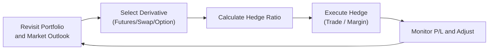
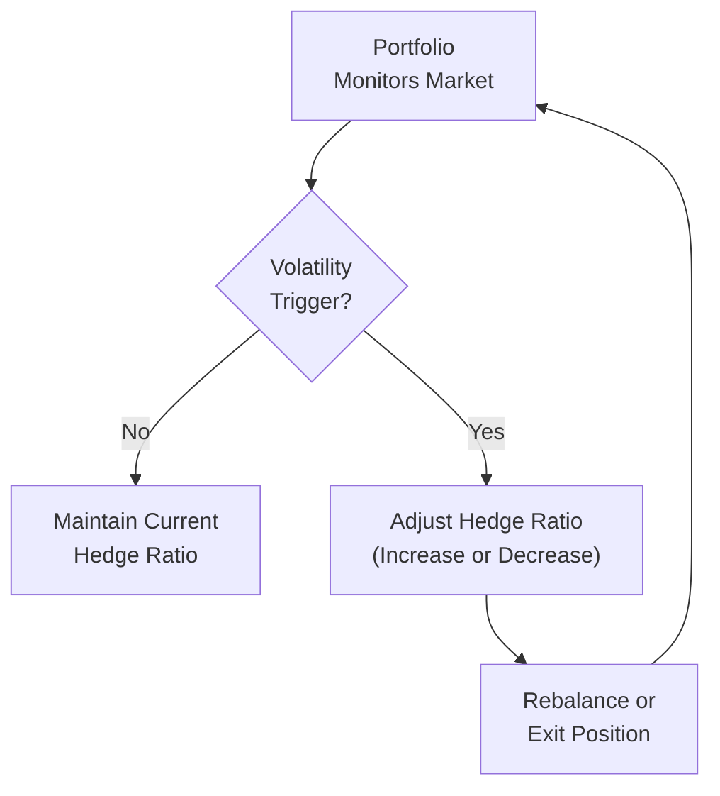

## Overview and Motivation

Sometimes, you want to protect your portfolio from an overall market downturn without selling every single holding you’ve carefully selected. It’s kind of like wearing a raincoat if you see clouds building up but you’re still hoping it might not pour. In finance terms, we call this protective maneuver “hedging systematic risk,” because we’re specifically targeting those broad market risks (systematic risks) that can affect pretty much everything in the market, rather than just one or two stocks.

Derivatives—like index futures, equity swaps, and index options—are powerful tools to manage systematic risk exposure. And if you’re someone like me, you might recall the first time you watched the market sink but avoided the heartache because you’d put on a timely hedge. There’s a certain peace of mind that comes with knowing you’re insulated from broad-stroke market moves. So let’s dive deeper into how these instruments can quickly shift or neutralize your portfolio exposure without forcing you to liquidate positions you’d rather keep.

## Basic Concepts of Systematic Risk

When we talk about systematic risk, we’re referring to the overall market risk that can’t be easily diversified away by holding multiple uncorrelated assets. If the entire equity market falls, nearly every portfolio with substantial equity holdings suffers. Similarly, if interest rates spike significantly, most fixed income securities can see value erosion. In such events, it often doesn’t matter how carefully you chose individual securities—systematic risk can supersede idiosyncratic (company-specific) performance. 

The standard measure of equity market exposure is beta (β). For instance, if a portfolio has a beta of 1.2 relative to a broad stock market index, we’re saying it’s expected to move 1.2% for every 1% move in that benchmark index—at least in a theoretical sense. Hedging systematic risk is basically about using derivatives to modify that beta exposure toward something you prefer—possibly less than 1, or even zero, for a fully hedged stance.

## Derivative Tools for Systematic Hedging

There are three major types of derivative contracts we deploy for hedging: index futures, total return swaps, and options. Each has its unique characteristics, but they serve the common goal of mitigating broad market risk.

### Index Futures

Index futures let investors lock in a price for buying or selling the underlying index at a future date. Suppose you hold a big chunk of large-cap U.S. equities. You might short (sell) S&P 500 index futures to offset some or all of your market exposure. If the market falls, your short futures position ideally profits to offset losses in your equity holdings.

Key features:  
• Standardized contracts.  
• Traded on organized exchanges with daily marking-to-market.  
• Typically require initial margin and can have varying degrees of liquidity depending on the index.

### Swaps

Equity swaps (often total return swaps) allow two parties to exchange cash flows. One side might pay a fixed (or floating) rate, while the other pays or receives the return of a specified equity index. For instance, if you receive the S&P 500 total return and pay a fixed rate, you effectively replicate exposure to that index. Conversely, if you pay the index return and receive a fixed (or LIBOR-based) rate, you’re offloading your equity market risk in exchange for a more bond-like payoff.

Key features:  
• Customizable in notional amount and payoff structure.  
• Typically traded over-the-counter (OTC), which can introduce counterparty credit risk.  
• Less standardized compared to futures but sometimes more flexible in terms of structure.

### Options

Options grant the right (but not the obligation) to buy or sell an index (or an ETF that tracks it) at a certain price. For hedging systematic risk, you’d often purchase put options on an index for downside protection or sell call options to offset small losses. 

Key features:  
• Premium-based: you pay a premium upfront if you’re buying options.  
• Flexible strike prices and maturities.  
• Limited downside risk if you’re long options, but cost of the premium can eat into returns if the market doesn’t move against you.

## Practical Steps for Implementing a Hedge

You might be thinking: “Well, this all sounds great in theory, but what do I actually do in practice?” Let’s break it down.

### 1. Identify Your Hedge Ratio

A hedge ratio is the proportion of the position you want to offset (or protect). If you want a full hedge, your hedge ratio might be close to 1. However, some managers prefer partial hedges if they still believe the market has upside potential.

Let’s say your portfolio is valued at \$100 million, with a beta of 1.2 relative to a certain index. That means a 1% market move could lead to a 1.2% move in your portfolio’s value, or \$1.2 million. If you want to cut your effective beta to 0.5, you’re effectively offsetting 0.7 of beta (i.e., from 1.2 down to 0.5). The notional hedge, in that case, depends on the index’s current price, the contract multiplier, and the number of contracts needed to offset the desired exposure.  

Mathematically:
  
(1)  Hedge\_Notional = Portfolio\_Value × (Beta\_Reduction)  

(2)  Number\_of\_Futures = Hedge\_Notional / (Futures\_Price × Contract\_Multiplier)  

For a fully hedged exposure to zero beta, you’d set Beta_Reduction = 1.2. For a partial hedge, you’d scale accordingly.

### 2. Choose the Appropriate Derivative Contract

• If your target index is the S&P 500, you might choose E-mini S&P 500 futures.  
• If you’re hedging a Euro Stoxx 50–centric portfolio, you’d look at that index’s futures or an OTC swap referencing Euro Stoxx 50.  
• For fixed income, you might use Treasury futures, interest rate swaps, or bond options.  

Selecting the right contract also involves checking liquidity, transaction costs (including bid-ask spreads and brokerage fees), and the precise correlation between the contract and your portfolio. If there’s a mismatch, that mismatch is called basis risk—an important concept we’ll revisit soon.

### 3. Monitor Daily Settlement Variations

When using futures, your account is marked to market daily. Changes in the futures price lead to daily gains or losses in your margin account. This can create some inertia or operational overhead. If your margin falls below the required maintenance level, you’ll receive a margin call.

Swaps, on the other hand, typically settle on agreed-upon intervals (e.g., monthly or quarterly), though valuation changes can be computed daily for risk management. Options have no daily settlement (beyond potential margin or collateral requirements for sellers). However, it’s crucial to track market changes and adjust hedges if your portfolio’s composition or risk profile changes significantly.

### 4. Reassess the Hedge Over Time

Hedging is not a “set it and forget it” endeavor. Suppose the market has soared, and you added new holdings. Your portfolio’s beta might shift, or you might actually want to remove some of the hedge if your outlook changes. Adjusting the hedge ratio, rolling over expiring futures or option contracts, or re-writing swaps with different maturities becomes part of an ongoing process.  

Below is a mermaid diagram illustrating a simplified workflow:

## Reducing Portfolio Beta During Volatile Markets

One big advantage of using derivatives—especially futures and swaps—is the ability to adjust portfolio beta quickly. Let’s say you’re an equity manager who sees a significant event on the horizon—a central bank policy decision or a major economic release. You can hedge systematic exposure rapidly by initiating a short futures position that matches (as closely as possible) your portfolio’s net equity exposure.

### Example: Rapid Beta Neutralization

Imagine you run a U.S. equity portfolio of \$50 million, with an average beta of 1.0. You foresee severe volatility, maybe akin to that magical meltdown moment we all dread. Rather than sell every stock, you could short approximately \$50 million notional in S&P 500 futures—achieving a near-beta-neutral stance. If the S&P 500 drops 5%, your short futures would theoretically gain around \$2.5 million if they match well with your portfolio’s performance. That can offset the hypothetical \$2.5 million drop in your underlying holdings, rendering your net position close to zero change.

## Risks and Costs of Hedging

Let’s not sugarcoat it: hedging isn’t free. There’s always a trade-off. Let’s look at the common pitfalls and costs:

### Basis Risk

Basis risk is the risk that the hedge instrument does not move perfectly in line with your underlying exposure. If your portfolio differs in composition from the chosen index, there might be performance discrepancies. For instance, if your portfolio is heavily overweight technology stocks, it might not move in exact lockstep with the broad S&P 500. Even a bond portfolio with AAA vs. corporate credit differences can face basis risk if you use the wrong Treasury futures.

### rolling futures contracts

Futures contracts expire periodically (e.g., quarterly). If you want a continuous hedge, you’ll need to roll from the expiring contract into the next one. That can incur transaction costs and sometimes cause slippage if the new contract price is at a premium or discount due to supply/demand imbalances.

### Liquidity Constraints

Large trades in less liquid contracts can face meaningful slippage. For instance, some ex-U.S. markets have significantly thinner futures volumes. If you need to establish a big position quickly, you could move the market or be forced to accept unfavorable prices.

### Cost of Options

Options (particularly “out of the money” puts for downside protection) can be expensive during periods of heightened volatility. The premium outlay can be substantial, and if the market does not move downward enough, that premium can expire worthless.

## Partial Hedges

It’s not always an all-or-nothing proposition. Sometimes, managers want to reduce market risk but still keep some skin in the game—especially if they see modest upside potential but are worried about severe downside. They might hedge just half the portfolio’s notional exposure. Alternatively, they could buy in-the-money put options that only fully protect them beyond a certain threshold. Another partial hedge approach is to sell call options on part of the portfolio to collect premiums and offset mild losses if the market declines, but this strategy also caps some potential upside gain.

## Dynamic Hedging Strategies

A dynamic hedge automatically adjusts the hedge ratio based on market conditions or volatility triggers. It’s like having a thermostat in your house that automatically turns on the heat if it’s cold, or switches off if it’s warm. In the capital markets, a dynamic hedging program might reduce the hedge ratio if volatility falls or the portfolio gains, and tighten the hedge if volatility spikes or the portfolio declines. 

Implementing dynamic strategies can get a bit complicated— sometimes requiring automated trading algorithms or frequent portfolio rebalancing. However, they can help conserve capital each time the market hits certain thresholds or ensure you have “just enough” protection instead of a blanket approach.

Here’s another mermaid diagram showing a simplified dynamic hedge concept:

## Commentary on Position Sizing and Estimation

In real-world contexts, calculating the exact hedge ratio is tricky because standard deviation, beta, or correlation estimates might be based on historical data. You might hear folks grumble: “It’s never perfect; we’re always approximating.” And that’s true. The dynamic interplay of interest rates, correlation breakdowns during crises, and changes in corporate fundamentals can all mean that your hedge “looked great on paper last month” but might not be as precise when conditions change.

## Regulatory and Risk Considerations

It’s always wise to consider the broader regulatory landscape. In many jurisdictions:

• Using derivatives to hedge might be subject to particular margin requirements.  
• Some institutions (e.g., pension funds) have guidelines on how derivatives can be used.  
• Regulatory frameworks may also impose position limits in certain futures or require specific documentation for swaps.

Moreover, from a risk governance standpoint, hedges can significantly change your capital requirements. Under many risk-based capital regimes, a well-structured hedge might reduce the risk weighting of a portfolio, thus freeing up capital for other uses or meeting certain compliance thresholds.

## Best Practices in Hedge Management

• Document your rationale for any hedge in an investment policy statement (IPS) or a hedging policy.  
• Monitor the ongoing effectiveness of the hedge.  
• Reassess correlation and basis risk regularly.  
• Evaluate the changes in your portfolio’s makeup—style drift, new exposures, or currency risk.  
• Always be prepared to roll your derivatives or exit the hedge gracefully if the environment changes.

## A Brief Case Study

Picture a global equity manager named Linda, who just saw an unfolding crisis in emerging markets. She believes her developed-market positions will face contagion, at least in the short-term. Instead of selling all her global equities, Linda decides to short a broad global index futures contract (e.g., MSCI World futures) to reduce her net exposure by 50%. She calculates the number of contracts needed:

1. Her portfolio is \$200 million with a beta of 1.1 to the MSCI World.  
2. She wants to reduce net beta to 0.3, effectively offsetting 0.8 of her current beta.  
3. Notional hedge required: \$200 million × 0.8 = \$160 million.  
4. Futures contract notional: \$200,000 per contract (example).  
5. Number of contracts: \$160 million / \$200,000 = 800 contracts.  

She sells exactly 800 futures contracts, placing margin in the clearinghouse. Over the next few weeks, if the market tumbles, her short futures position should realize gains, partially offsetting the losses in her holdings. This partial hedge helps her remain invested if the market recovers quickly—but it also spares her from large drawdowns if the slump continues.

Linda monitors daily settlement, modifies her hedge ratio as her outlook evolves, and rolls the futures if they’re near expiration. Ultimately, she might let the hedge expire if the risk abates—happy to have paid the cost of the hedge for peace of mind. 

## Exam Relevance and Practical Tips

For CFA Level III exam candidates, hedging systematic risk with derivatives is a common topic in both item-set and constructed-response questions. You’ll likely see scenario-based questions requiring you to:

• Calculate the number of derivative contracts to modify portfolio beta.  
• Analyze the potential basis risk in a mismatch between portfolio and index.  
• Debate whether to use futures, swaps, or options in a particular scenario.  
• Evaluate the costs of rolling futures positions.  
• Combine partial hedges with certain views about the market.  

Keep these tips in mind:  
• Precisely note given betas, portfolio values, and contract sizes.  
• Always highlight “basis risk” if the portfolio differs from the index.  
• Performance measurement can involve realized vs. unrealized gains on derivatives.  
• Summarize your reasoning clearly and succinctly in constructed-response answers. CFA exam graders value clarity: show formulas, label variables, and interpret your results.  
• Watch out for potential trick questions about how changes in interest rates or volatility can alter the attractiveness of different derivative hedges.

## Final Thoughts

Hedging systematic risk using derivatives is a powerful skill for any portfolio manager or investor who wants to navigate volatile markets with confidence. By leveraging index futures, swaps, and options, you can quickly dial up or dial down your overall exposure to equity or fixed income markets. Yes, you pay a cost, be it through option premiums, margin requirements, or liquidity constraints, but the flexibility to preserve gains or limit painful drawdowns can be well worth it.

It’s a balancing act—too big a hedge can lock you out of market rebounds, but too little might leave you vulnerable. That’s where partial or dynamic strategies come in, letting you fine-tune the level of protection. As always, the biggest challenge lies in understanding how your chosen derivatives track your portfolio and keeping a close eye on correlations, basis, and daily settlement changes.

If you’re a budding CFA candidate getting your arms around all this, remember: practice with real or hypothetical examples, triple-check your beta calculations, and be prepared to handle questions about rolling futures or analyzing swap payoffs. Hedging might seem complicated, but once you get the hang of the steps—and maybe experience that sweet moment when your hedge saves the day—it can become more intuitive, almost second nature.

## References & Further Reading

• Hull, J. (2021). Options, Futures, and Other Derivatives (11th ed.). Pearson.  
• Chance, D. M. (2020). Analysis of Derivatives for the CFA Program. CFA Institute.  

## Glossary

• Index Futures: Contracts to buy or sell a basket of securities at a predetermined future date and price.  
• Swap: A derivative contract in which two parties exchange cash flows, often used to manage interest rate or equity exposures.  
• Hedge Ratio: The proportion of a position hedged by a derivative to offset potential losses from adverse price movements.  
• Basis Risk: The risk that the hedge instrument does not move perfectly in line with the underlying asset to be hedged.  

---

## Test Your Knowledge: Hedging Systematic Risk with Derivatives



### 1. Which of the following best describes systematic risk?

- [ ] Risks specific to individual securities.  
- [ ] Risks that can be diversified away with many holdings.  
- [x] Risks that affect the entire market and cannot be diversified away.  
- [ ] Risks occurring when an investor is overexposed to a particular sector.  

> **Explanation:** Systematic risk refers to the unpredictable, broad-based market risk that cannot be diversified away.  

### 2. What is typically the first step in constructing a hedge using derivatives?

- [ ] Selecting the appropriate expiration date for the futures.  
- [x] Determining the desired hedge ratio.  
- [ ] Examining the available liquidity in swap markets.  
- [ ] Consulting the current implied volatility in put options.  

> **Explanation:** Before choosing the specific derivative contract or parameters, you need to identify exactly how much of your exposure you want to hedge (the hedge ratio).  

### 3. Suppose you manage a portfolio with a market value of $200 million and a beta of 1.3 relative to an index. You want to reduce your portfolio beta to 0.8 by shorting futures. Which of the following is the correct notional amount of futures to short?

- [ ] $100 million  
- [ ] $120 million  
- [x] $100 million (i.e., $200 million × (1.3 − 0.8) = $200 million × 0.5)  
- [ ] $40 million  

> **Explanation:** The desired reduction in beta is 0.5 of the portfolio’s value: 1.3 – 0.8 = 0.5. Thus, $200 million × 0.5 = $100 million.  

### 4. Which of the following statements about basis risk is true?

- [ ] It occurs only when derivative prices move more than the underlying securities.  
- [x] It arises when the hedge instrument doesn’t perfectly track the underlying asset.  
- [ ] It’s eliminated by rolling futures contracts before expiration.  
- [ ] It only applies when using swaps rather than futures.  

> **Explanation:** Basis risk is the potential mismatch in price movements between the hedge instrument (like an index future) and the actual underlying portfolio.  

### 5. An equity manager is concerned about a market sell-off. She decides to buy at-the-money index put options on half her equity exposure. This best illustrates:

- [x] A partial hedge to reduce—but not eliminate—downside risk.  
- [ ] A strategy to go market-neutral on her portfolio.  
- [x] The use of derivatives to reduce portfolio beta partially.  
- [ ] A guaranteed profit strategy if the market declines.  

> **Explanation:** By buying at-the-money puts on only half her exposure, she is implementing a partial hedge rather than fully hedging the entire portfolio.  

### 6. How does rolling futures contracts potentially impact the cost of hedging?

- [x] It can create additional transaction costs and slippage over time.  
- [ ] It systematically reduces hedging costs because of contango.  
- [ ] Rolling is only required if you use leveraged ETFs.  
- [ ] Futures positions never need to be rolled.  

> **Explanation:** Futures expire periodically, so rolling them into new contracts can incur extra transaction costs or price slippage.  

### 7. In a dynamic hedging strategy, adjustments to the hedge ratio most likely occur:

- [ ] Only at the start and end of the trading period.  
- [x] Whenever certain market or volatility triggers are met.  
- [ ] Exclusively when the portfolio gains positive alpha.  
- [ ] Each time a margin call is triggered.  

> **Explanation:** Dynamic hedging involves changing the hedge ratio in response to market conditions, such as volatility thresholds or price movements.  

### 8. A portfolio manager uses index futures to hedge a bond portfolio. The main type of risk that may affect the efficacy of this hedge is:

- [x] Basis risk if the bond portfolio differs from the bond index used in futures.  
- [ ] The bond portfolio may be illiquid.  
- [ ] Margin calls on the futures will exceed the principal.  
- [ ] Counterparty risk from the futures exchange.  

> **Explanation:** Basis risk arises if the bond portfolio doesn’t match the duration or constituents of the underlying index future.  

### 9. Which of the following is a key advantage of using index futures to eliminate systematic equity risk?

- [ ] They eliminate all risk, including idiosyncratic risk, from the portfolio.  
- [x] They allow the portfolio manager to maintain holdings while reducing market exposure.  
- [ ] They require no margin or upkeep.  
- [ ] They are free from basis risk.  

> **Explanation:** Index futures can reduce overall market exposure without requiring the liquidation of the underlying individual securities, though margin and basis risk still apply.  

### 10. Dynamic hedging typically offers complete downside protection without any costs.

- [ ] True  
- [x] False  

> **Explanation:** Dynamic hedging can reduce downside, but it’s not cost-free. Transaction costs, slippage, and basis risk can still arise.  


