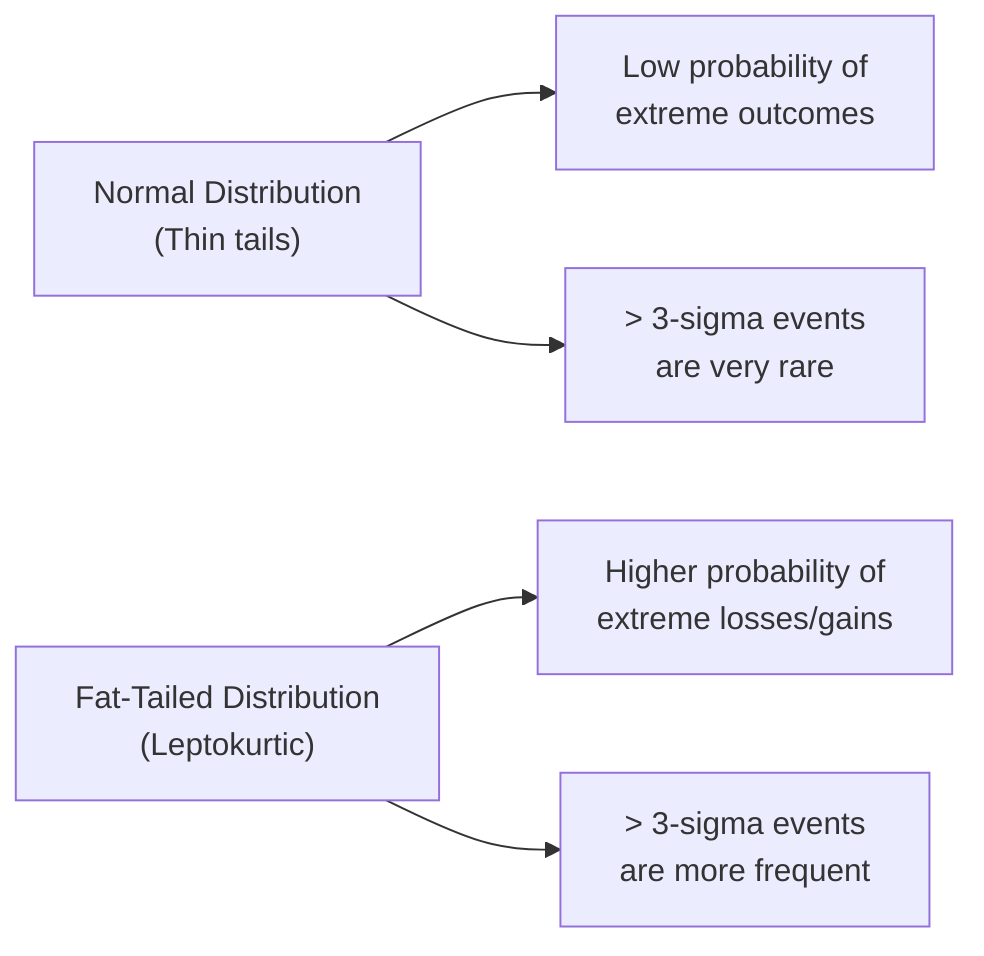

## Introduction
Some years ago, I remember chatting with a portfolio manager who was extremely proud of his fund’s Sharpe ratio. He’d say, “Our strategy has an absolutely stellar risk–return profile.” Turns out, that statement overlooked the possibility that tail events could wipe out months or even years of steady profits in just weeks or days. Now, this is not to pick on any particular person—this is precisely the trap many professionals (and well-meaning amateurs) fall into when they rely too heavily on conventional performance metrics. 

In normal or near-normal market conditions, performance measures like the Sharpe ratio, Treynor ratio, Jensen’s alpha, and M² offer plenty of insight. But during episodes of extreme stress—like a global financial crisis or a sudden liquidity crunch—these measures may completely miss the mark. Why? Because they’re typically built on assumptions (e.g., normally distributed returns) that fail to capture the higher likelihood of catastrophic losses or unexpected behavior in tail events. 

Even if you’ve never traded during a crisis, you likely know from history what happens: large drawdowns, a surge in volatility, increased asset correlations, and a heart-stopping sense that all the rules we relied on have changed overnight. With that in mind, let’s walk through the main limitations of performance measures during these wild market episodes.

## The Normal Distribution Trap
Traditional performance measures often assume returns are independently and identically distributed and follow a normal (Gaussian) distribution. Under those assumptions:

• The Sharpe Ratio (mean excess return over the risk-free rate divided by standard deviation) is a straightforward metric for comparing risk-adjusted performance across strategies.  
• The Treynor Ratio (mean excess return divided by beta) and Jensen’s Alpha (difference between actual returns and those predicted by the Capital Asset Pricing Model) are other ways to gauge how much extra return you’re squeezing out per unit of systematic risk.  

But, well, real life can be more complicated. When markets go haywire, the return distributions often have “fat tails”—meaning the probability of large negative (or positive) returns is higher than the normal distribution would predict. If you rely purely on a Sharpe ratio, you might think the risk is well-understood if the standard deviation is stable and the mean return is consistent. In reality, tail events can cause far greater losses than a simple standard deviation would anticipate, undermining the entire premise of these risk–return metrics.

### Fat Tails
Fat tails refer to distributions that have a higher probability of extreme outcomes. This phenomenon shatters the idea that a 6-sigma move is nearly impossible. Instead, a once-in-a-lifetime downturn might show up a few times in a decade. If you solely trust performance measures that rely on normality, you risk missing the possibility for catastrophic downside events.

## Extreme Market Conditions and Performance Metrics
In extreme markets, a few hallmark situations occur repeatedly, often simultaneously:

### Market Crises and Liquidity Crunches
During a market crisis, investors tend to flock away from riskier assets in droves. Liquidity can dry up, meaning it’s nearly impossible to exit positions without suffering unattractive prices. In these conditions, historical performance metrics become less predictive. If your data set is primarily from relatively stable times, that data may not reflect how your investments will perform when there’s no liquidity to match your trades.

### Large Drawdowns and Volatility Spikes
A drawdown is the peak-to-trough decline over a certain period. For instance, if a portfolio is at $1,000,000 and drops to $700,000 at its worst point, it has a 30% drawdown. Standard measures that rely on average volatility or average returns might not fully capture the psychological and financial impact of that 30% decline. In calmer periods, a portfolio could appear safe and stable. But when extreme volatility hits, the abrupt drawdown can severely tarnish a strategy’s track record.

### Correlation Drifting Toward 1
And then there’s the infamous correlation breakdown phenomenon. In normal markets, correlations across assets may appear modest—say 0.2 or 0.3, which helps diversification. But when crisis hits, everything seems to drop together, as if every asset decided to move in lockstep toward negative territory. That artificially magnifies losses in a portfolio that looked diversified in tranquil times. Traditional performance measures, which assume stable correlations, simply can’t keep up with reality once correlation spikes.

## The Shortcomings of Historical Data
Let’s say you’re analyzing a fund with a 5-year performance track record. You notice the Sharpe ratio is consistently above 2.0, the drawdowns are minimal, and volatility is low. Impressive, right? Well, what if there were no real crisis events in that 5-year window? The historical data might paint a rosy picture, but it can’t guarantee the same results if we suddenly face a 2008-style crash.

### Underestimating Tail Risk
Using historical data often leads to underestimation of tail risks because extreme events may be absent or occur too infrequently in the sample. A manager might systematically sell deep out-of-the-money options to collect premium. This can elevate returns during normal times, artificially bumping up the Sharpe ratio. However, if a market meltdown occurs and those deep out-of-the-money puts suddenly become in-the-money, the fund’s capital can vanish almost overnight.  

### Inadequacy of Traditional Risk Measures
Standard deviation or variance-based metrics do not sufficiently capture downside risk in these cases. By design, they weigh positive and negative deviations equally—missing that large losses are typically far more damaging to a portfolio’s stability (and your peace of mind).

## Manipulation Through Hidden Tail Risk
Another limitation is that performance measures can be gamed. If a single statistic, such as Sharpe ratio, is used to judge manager performance, managers might load up on options strategies that perform beautifully most of the time—until a rare market surge or plunge triggers extreme losses. Because these blow-ups don’t frequent everyday data, the manager might look excellent by conventional measures for years.

I once knew an emerging hedge fund manager who proudly touted a Sharpe ratio above 3.5 over a couple of years. Looking deeper, one discovered that a significant portion of his P/L came from selling short volatility strategies, specifically short puts on equity indices. This approach was basically “picking up nickels in front of a steamroller.” Over a short window, it can look very profitable, but if a major downturn hits, that steamroller flattens the entire portfolio.  

## Complementing Traditional Measures with Robust Techniques
Given these potential pitfalls, many practitioners understand that we can’t rely on a single ratio. Instead, we should look at the portfolio from multiple vantage points, especially focusing on the downside or tail risk. Below are a few approaches that can help:

### Value at Risk (VaR)
Value at Risk attempts to estimate the loss that will not be exceeded with a certain confidence level (e.g., 95% or 99%) over a specific horizon. For instance, a 99% one-day VaR of $1 million means there’s only a 1% chance of losing more than $1 million in 24 hours. However, VaR is still subject to potential misuse or oversimplification. It doesn’t tell you how bad losses could get if you breach that threshold. Thus, many practitioners pair VaR with additional metrics.

### Conditional VaR (CVaR)
Conditional VaR, also called Expected Shortfall, is the expected loss given that the VaR threshold has been breached. CVaR typically gives a clearer picture of tail risk because it highlights the average of the worst-case outcomes. This is where an investor can see (and hopefully limit) the meltdown scenario that’s not captured in a single Sharpe ratio or a mere standard deviation figure.

### Scenario Analysis and Stress Testing
Another practical technique is scenario analysis—often the best method to see how a portfolio would fare under different “what if” market conditions. For example, you might construct scenarios of extreme events such as a quick 20% drop in equity markets, an interest rate spike, or a massive currency devaluation. Stress testing is a more extreme form of scenario analysis. It simulates how a combination of toxic factors (e.g., a credit crisis plus a commodity crash) would affect the portfolio. This sort of stress test can reveal vulnerabilities that remain invisible in standard metrics.  

### Downside Deviation
Downside deviation focuses specifically on negative returns below a chosen threshold (often zero or the risk-free rate). It’s a variation on the standard deviation but only measures the spread of downside outcomes. It is particularly helpful when the distribution is skewed or has an asymmetrical shape, common in extreme markets when negative returns can cluster.

## Best Practices for Risk Oversight in Extreme Markets
To ensure that hidden risks are not lurking in a portfolio, consider these points:

• Periodic Stress Tests: Run stress tests and scenario analyses on a regular schedule, not just once a year.  
• Liquidity Review: Evaluate the liquidity of your holdings, especially if you manage strategies that rely on rapid unwinding of positions.  
• Robust Reporting and Transparency: Encourage or require managers to disclose not just the performance metrics but also their biggest open positions, their exposure to derivatives, and their concentration of risk.  
• Independent Risk Committee: Some fund managers appoint a separate risk oversight committee or division tasked with investigating potential illiquidity, correlation risk, or concentration problems, especially in extreme times.  
• Adjust for Regime Changes: If you expect interest rates to rise or a macroeconomic shock to occur, factor that into your assumptions about returns and correlations.

## Real-World Example
The 1998 Long-Term Capital Management (LTCM) crisis is often cited as a classic example. LTCM utilized sophisticated arbitrage strategies that, on paper, had historically high Sharpe ratios. They employed substantial leverage as well. For years, LTCM’s performance metrics were the envy of Wall Street. Then Russia defaulted on its sovereign debt, liquidity dried up, and correlations between normally uncorrelated assets converged toward 1. LTCM’s positions, which depended on stable relationships between government bonds, blew up, resulting in enormous losses.

## Glossary
Fat Tails: Probability distributions with a higher likelihood of extreme events than the normal (Gaussian) distribution.  
Drawdown: The peak-to-trough decline over a specified period of an investment, portfolio, or fund.  
Correlation Breakdown: A phenomenon where correlations among assets increase dramatically during market turmoil.  
Conditional VaR (CVaR): Also known as Expected Shortfall, it measures the average loss beyond the VaR threshold in the tail of the distribution.

## Conclusion and Exam Tips
Performance measurement is trickier in practice than it appears in your standard ratio calculations. To excel in exam questions—and in real-life scenarios—learn to spot the hidden pitfalls of normal distribution assumptions. Remember:

• Check how well performance metrics capture tail risk.  
• Investigate whether stable historical correlations hold in a crisis.  
• Reflect on how liquidity (or lack thereof) might change the reliability of your performance data.  
• Use advanced tools such as VaR and CVaR, but don’t stop there—stress-test for the truly unexpected.

For the exam, expect scenario-based item sets that ask you to interpret a portfolio’s risk profile under extreme markets. They might provide a Sharpe ratio alongside a set of stress test results, then ask you to identify which aspect the Sharpe ratio failed to capture. Also be prepared for an essay question that requires you to design a plan for evaluating tail risk, highlighting best practices for oversight.

Remember: Trying to judge a portfolio by a single performance number is a bit like judging a restaurant purely by how many stars it got in one review. Sure, it’s information, but it won’t tell you if the place can handle an unexpected dinner rush (let alone a citywide crackdown that affects food supply). So keep your toolkit diversified, complement classic performance measures with a robust set of risk management tools, and stay vigilant for the tail events that can rewrite your portfolio’s story in a matter of days.

## Diagram: Normal vs. Fat-Tail Distributions

This diagram highlights that while a normal distribution (left branch) suggests extreme outcomes are very unlikely, a fat-tailed distribution (right branch) accommodates more frequent and severe tail events.

## References
• Taleb, N. N. (2007). The Black Swan: The Impact of the Highly Improbable. Random House.  
• Jorion, P. (2007). Value at Risk: The New Benchmark for Managing Financial Risk (3rd ed.). McGraw-Hill.  

---

## Test Your Knowledge: Limitations of Performance Measures in Extreme Markets



### 1. Which phenomenon often causes diversified portfolios to exhibit higher correlations during extreme market stress?  
- [ ] Mean reversion.  
- [x] Correlation breakdown.  
- [ ] Sector rotation.  
- [ ] Low volatility anomaly.  

> **Explanation:** Correlation breakdown leads assets that are usually uncorrelated to move together in extreme market conditions.

### 2. Why might a high Sharpe ratio be misleading if it’s based on stable historical data only?  
- [x] It can overlook fat-tail events that produce large losses.  
- [ ] It consistently overstates the risk-free rate.  
- [ ] It typically accounts for exchange rate fluctuations incorrectly.  
- [ ] It is never used by asset managers.  

> **Explanation:** The Sharpe ratio does not fully account for tail risk, so large losses during significant market stress may not be reflected in the historical data.

### 3. A portfolio manager sells deep out-of-the-money equity index puts. What is the main hidden risk with this strategy from a performance-measure standpoint?  
- [ ] The strategy is always unprofitable over time.  
- [x] The strategy can generate steady gains until a major market downturn triggers large losses.  
- [ ] The strategy typically inflates standard deviation, hurting Sharpe ratio calculations.  
- [ ] There is no hidden risk because it diversifies equity risk.  

> **Explanation:** Selling deep out-of-the-money puts can boost performance metrics in normal conditions but exposes the portfolio to sudden, large losses when markets plunge.

### 4. Which measure helps gauge the “average loss” beyond a specified probability threshold when VaR is exceeded?  
- [ ] Sharpe Ratio.  
- [ ] Probability of Ruin.  
- [x] Conditional VaR (Expected Shortfall).  
- [ ] Active Share.  

> **Explanation:** CVaR, or Expected Shortfall, estimates the expected loss in the worst-case scenarios beyond the VaR limit.

### 5. If a manager claims that “historical correlations are stable,” why might this be misleading in a crisis scenario?  
- [x] Correlations tend to converge to 1 in severe downturns.  
- [ ] Most correlations remain unchanged in crises.  
- [ ] Correlations become negative in downturns.  
- [ ] It’s not misleading; correlations have no effect on risk.  

> **Explanation:** During market turmoil, many assets that appeared uncorrelated can suddenly move in the same direction, defeating the premise of diversification.

### 6. Which method is most effective in detecting potential losses in extreme market events?  
- [ ] Sharpe Ratio analysis alone.  
- [x] Scenario analyses and stress testing.  
- [ ] Linear regression on historical returns.  
- [ ] High-frequency trading models.  

> **Explanation:** Scenario analyses and stress testing explore possible extreme outcomes that traditional measures or linear regressions might fail to capture.

### 7. A high ratio of option premium income to total returns could indicate what hidden risk?  
- [x] The portfolio may be exposed to large tail risks if the options move in the money.  
- [ ] The portfolio is heavily invested in risk-free bonds.  
- [ ] The portfolio will have very low correlation with equities.  
- [ ] The portfolio can never suffer a margin call.  

> **Explanation:** Earning high income from selling options raises the threat of significant losses when the market moves unfavorably and those options suddenly become valuable to the buyers.

### 8. Why might standard deviation be an insufficient measure of risk during highly skewed or leptokurtic (fat-tailed) return distributions?  
- [x] It weighs upside deviation and downside deviation equally, ignoring the severity of tail losses.  
- [ ] It fully accounts for correlation breakdown.  
- [ ] It cannot be calculated from daily data.  
- [ ] It is actually a better measure of risk in these distributions.  

> **Explanation:** Standard deviation does not differentiate between upside and downside moves and may underestimate the possibility or severity of extreme negative events.

### 9. Which of the following should be part of a robust risk oversight process during extreme markets?  
- [x] Conducting regular liquidity reviews.  
- [x] Applying stress tests to potential market collapses.  
- [ ] Avoiding the use of scenario analysis.  
- [ ] Minimizing transparency in reporting.  

> **Explanation:** Regular reviews, stress tests, and transparent reporting help identify and mitigate vulnerabilities; limiting scenario analysis or transparency harms risk control.

### 10. True or False: In a crisis, historical betas typically remain stable for CAPM-based measurements.  
- [ ] True  
- [x] False  

> **Explanation:** Betas can change drastically when volatility spikes and correlations increase. Relying on stable historical betas can be misleading in a crisis.


