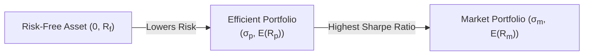
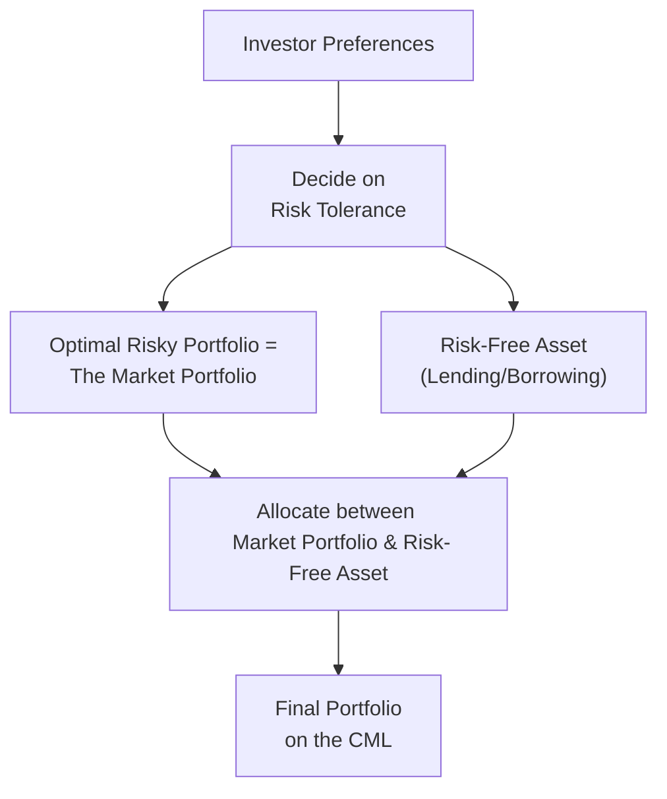

## Introduction and Key Concepts

Have you ever walked into a coffee shop and spent way too long deciding exactly how much cream or sugar to add? Some folks just pick a standard latte (i.e., the market standard) while others want to customize every detail. In investing, it can sometimes feel that complicated, but Modern Portfolio Theory (MPT) suggests there’s actually a straightforward “recipe” to get the best risk-return mix using a risk-free asset and a portfolio of risky assets. This “best mix” is known as the Capital Market Line (CML) when the risky portion is the market portfolio. Meanwhile, the Separation Principle says that everyone can keep using the same “standard latte,” but the difference is simply how much of it you decide to drink—some prefer a double shot (more risk), while others only sip a small amount (less risk). Let’s break that all down.

## The Capital Market Line at a Glance

The CML is a special kind of Capital Allocation Line (CAL) that arises when the optimal risky portfolio is the market portfolio of all investable assets (in theory, every stock, bond, and other asset out there). It shows the relationship between a portfolio’s expected return and its total risk (standard deviation) whenever you combine the market portfolio with the risk-free asset.

### Formula for the CML

One of the key formulas you often see (especially in exam contexts) is:


E(R_p) = R_f + \left(\frac{ E(R_m) - R_f }{\sigma_m}\right) \times \sigma_p


where:
• \\(E(R_p)\\) is the expected return of the portfolio p.  
• \\(R_f\\) is the risk-free rate.  
• \\(E(R_m)\\) is the expected return of the market portfolio.  
• \\(\sigma_m\\) is the standard deviation of the market portfolio.  
• \\(\sigma_p\\) is the standard deviation of the combined portfolio.  

The slope of this line, \\(\frac{ E(R_m) - R_f }{\sigma_m}\\), is the market’s Sharpe ratio, measuring how many “extra” units of return (beyond the risk-free rate) you get per unit of risk. Point for point, the CML supposedly offers the highest possible Sharpe ratio for investors across the entire risk spectrum—assuming we’re all abiding by the standard MPT assumptions.

### Visualizing the CML

A handy way to visualize the CML is via a risk-return graph where the x-axis is portfolio standard deviation (σ) and the y-axis is expected return. The risk-free asset is a point on the y-axis at \\(R_f\\) (with zero standard deviation). The market portfolio is somewhere else on the graph, with a standard deviation \\(\sigma_m\\) and an expected return \\(E(R_m)\\). Connecting these two points with a straight line gives you the CML.

Below is a simple Mermaid diagram illustrating the concept:

In words, points on the CML represent all possible mixes between the risk-free asset and the market portfolio.

## The Separation Principle (Tobin’s Separation Theorem)

Now, maybe you’re thinking, “Why do we single out the market portfolio as the holy grail for our risky holdings?” This is where Tobin’s Separation Theorem (or the Separation Principle) comes in. It states that the investment decision can be broken down into two choices that are effectively independent:

1. Pick the optimal risky portfolio.  
2. Decide how much of your capital to put into that portfolio vs. how much to invest in the risk-free asset.

According to MPT, the market portfolio itself is that optimal risky portfolio—i.e., it’s mean–variance efficient. Then, your personal preference for risk guides your allocation between that portfolio and the risk-free asset. If you’re more risk-hungry, you lever up (borrow at the risk-free rate and invest more in the market portfolio). If you’re conservative, you keep some portion in T-bills and the rest in the market. The actual composition of the risky holdings, however, does not change. Everyone invests in the same “ideal risky basket,” just in different proportions relative to the risk-free asset.

### Personal Anecdote: 
When I first studied finance in college, I thought each person would have a totally different set of stocks and bonds, like a fingerprint. But then I bumped into the separation principle and realized: if the market is truly efficient and frictionless, well, we’d all want the same exact bundle of risky stuff—just in different amounts!

## Underlying Assumptions

The CML and the associated separation principle are elegant, but they hinge on some strong assumptions that might not always hold in real life. These include:

- No transaction costs or taxes.  
- All assets are marketable (can be traded freely).  
- Investors have homogenous expectations about asset returns, volatilities, and correlations.  
- Investors can lend and borrow at the same risk-free rate.  
- Markets are frictionless and perfectly competitive.  

In the real world, my friends who trade might say, “Well, that’s not entirely how it plays out,” and they’d be correct. Transaction costs, taxes, short-selling constraints, and differences in investor viewpoints all create deviations from the simple CML world. Nonetheless, the theory remains a powerful mental model and a foundation for understanding how risk and return interrelate.

## Where the CML Fits into the Bigger Picture

The CML concept is closely linked to the Capital Asset Pricing Model (CAPM), covered in Section 3.4 of this Volume. The CAPM uses the idea that the market portfolio is mean–variance efficient to derive expected returns on individual assets based on their sensitivity (beta) to market risk. The CML, in contrast, focuses on the entire portfolio and how it’s mixed with the risk-free asset. Meanwhile, in a broader portfolio risk and return context, it’s helpful to recall how the CML compares to the Security Market Line (SML). They look similar, but the CML measures risk using standard deviation (total risk), while the SML uses beta (market or systematic risk).

For cross-reference:  
- Chapter 2 (Portfolio Risk and Return – Part I) introduced the foundational metrics like variance, covariance, correlation, and the notion of the efficient frontier.  
- In Chapter 3 (Portfolio Risk and Return – Part II), we systematically build toward the CAPM, multi-factor models, and more advanced performance measures. The CML is a crucial piece of that puzzle—especially for understanding the separation principle.

## Practical Example

Let’s do a quick numeric illustration (albeit simplified). Suppose you have:

- Risk-free rate, \\(R_f = 2\%\\).  
- Expected return on the market, \\(E(R_m) = 8\%\\).  
- Standard deviation of the market, \\(\sigma_m = 15\%\\).  

Then the market’s Sharpe ratio is:  


\frac{E(R_m) - R_f}{\sigma_m} = \frac{0.08 - 0.02}{0.15} \approx 0.40


So, if you choose a portfolio with standard deviation \\(\sigma_p = 7.5\%\\), you’d get an expected return:


E(R_p) = 0.02 + (0.40 \times 0.075) = 0.02 + 0.03 = 0.05 = 5\%


If you’re more aggressive, choosing a portfolio with \\(\sigma_p = 20\%\\) (maybe by borrowing at 2% and putting that borrowed money into the market), your expected return would be:


E(R_p) = 0.02 + (0.40 \times 0.20) = 0.02 + 0.08 = 0.10 = 10\%


Those numbers appear on the straight line that connects \\((0,2\%)\\) to \\((15\%,8\%)\\) and then extends beyond.

## Common Pitfalls and Challenges

1. Overleveraging: The theory says you can borrow freely at the risk-free rate, but in reality, your borrowing rate often exceeds \\(R_f\\). Overestimating how cheaply you can borrow can shatter the delicate equations.  
2. Ignoring taxes and transaction costs: Constant trading or rebalancing can chip away at returns. You might miss the tidy results the theory predicts.  
3. Misestimating risk: The standard deviation of returns might not fully capture downside risk, especially in markets with occasional dramatic sell-offs (fat tails).  
4. Heterogeneous expectations: Not everyone sees the same “fair value” for the market. When you try to replicate a “market portfolio,” you might pick different assets or weightings than your neighbor, who has a different viewpoint.  

## Real-World Considerations

The brilliance of the CML is that it simplified investing into one key question: “How risky do I want to be?” Then you pick your spot on the line. But in practice, capital markets are more complex:

- Some investors prefer to tilt their portfolios toward certain factors (value, momentum, etc.).  
- There are trading frictions and regulatory constraints.  
- Risk-free assets aren’t always truly risk-free (think about default risk if you’re looking at certain government bonds).  
- The “market portfolio” might be tough to define. Is it all global stocks and bonds? What about private equity, real estate, or other alternatives?

## The Case for Mean–Variance Efficiency

Despite its assumptions, the CML underlines the notion that if an investor can fully diversify, the only relevant risk to get compensated for is systematic (market) risk. Hence, any portfolio on the CML is considered efficient in terms of mean–variance optimization. This is a cornerstone for many investment frameworks.

## A Simple Mermaid Diagram of the Separation Principle

Let’s sketch how the Separation Principle visually fits into the process of portfolio construction:

The diagram highlights that the two-step decision process is straightforward once you assume a mean–variance efficient market portfolio.

## Exam Tips and Strategy

• Make sure you distinguish between the CML (which uses total risk, in the form of standard deviation) and the SML (which uses systematic risk, in the form of beta).  
• Be ready to calculate a portfolio’s expected return by “moving” along the CML. A common exam question is: given a certain risk tolerance (i.e., how much standard deviation you can accept), what is the expected return?  
• Watch for statements about borrowing rates. If the exam scenario states a higher borrowing rate than \\(R_f\\), your tangential line might pivot upward for lending but pivot downward for borrowing.  
• Tobin’s Separation Theorem is often tested in conceptual form: you might see a statement that “Investors hold the same risky portfolio despite differences in risk aversion,” and they’ll ask you to identify which principle is being described (i.e., the separation principle).  
• Don’t forget that the equality of lending and borrowing rates is an assumption that can be violated. The exam might ask you to identify that assumption.  

## Conclusion

The Capital Market Line offers a beautiful illustration of how combining a risk-free asset with the market portfolio (the presumed tangency portfolio) creates a range of efficient portfolios for any level of risk tolerance. Tobin’s Separation Theorem is the conceptual backbone, stating that we separate our choice of “which risky assets to hold” (all the same market portfolio) from “how much risk to take” (our individual choice of leverage or weighting in risk-free assets).

While the real world can be significantly messier than these theories imply, understanding the CML and the separation principle is essential for building a foundation in portfolio management. Countless advanced topics—from multi-factor models to global asset allocation—still trace their conceptual roots back to these ideas.

## References and Further Reading

• Sharpe, W. F. (1964). “Capital Asset Prices: A Theory of Market Equilibrium under Conditions of Risk.” The Journal of Finance.  
• Tobin, J. (1958). “Liquidity Preference as Behavior Towards Risk.” The Review of Economic Studies.  
• CFA Institute. Official Curriculum Readings on Capital Market Theory. <https://www.cfainstitute.org/>  

---

## Test Your Knowledge: Capital Market Line and Separation Principle



### Which best describes the Capital Market Line (CML)?

- [ ] A line representing a portfolio’s beta versus expected return.
- [x] A line depicting portfolios that optimally combine the market portfolio with the risk-free asset.
- [ ] The line that represents the correlation between risky assets within a portfolio.
- [ ] A line connecting the global minimum-variance portfolio and the market portfolio.

> **Explanation:** The CML specifically shows all combinations (often called “efficient portfolios”) formed by mixing the risk-free asset and the market portfolio.

### Which of the following is the slope of the CML?

- [ ] The portfolio’s alpha.
- [x] The Sharpe ratio of the market portfolio.
- [ ] The risk-free rate adjusted by market risk.
- [ ] Beta of the market portfolio.

> **Explanation:** The slope of the CML is (E(Rm) − Rf) / σm, which is the market Sharpe ratio.

### According to the Separation Principle, what does an investor decide first?

- [x] The optimal risky portfolio (market portfolio).
- [ ] The proportion of the portfolio invested in risk-free assets.
- [ ] The amount to allocate to each individual asset in the market portfolio.
- [ ] Which government bonds to purchase with leftover cash.

> **Explanation:** Tobin’s Separation Theorem states that first you identify the market portfolio as the optimal risky choice, then decide how much to invest in that portfolio vs. the risk-free asset.

### When constructing the CML, which assumption is typically required?

- [ ] Investors have different views on expected returns.
- [x] There are no transaction costs and no taxes.
- [ ] Only large institutional investors can borrow at the risk-free rate.
- [ ] The risk-free rate adjusts frequently to inflation.

> **Explanation:** The standard MPT approach and derivation of the CML assume frictionless markets without taxes, transaction costs, or borrowing constraints.

### Which statement best describes Tobin’s Separation Theorem?

- [x] It divides the decision into choosing the best risky portfolio and the allocation between risk-free and risky assets.
- [ ] It separates out systematic risk from unsystematic risk in an efficient portfolio.
- [x] It suggests all investors will hold the same risky portfolio.
- [ ] It states that investors must pay different rates when borrowing and lending.

> **Explanation:** Tobin’s Separation Theorem (or the Separation Principle) says that you first identify the single best risky portfolio, then decide how to allocate between that risky portfolio and the risk-free asset.

### Which of the following is NOT a realistic assumption behind the CML?

- [x] Unlimited short-selling and borrowing are permitted at a single risk-free rate.
- [ ] Markets are perfectly efficient with no transaction costs.
- [ ] All investors have homogenous expectations.
- [ ] Only systematic risk matters for pricing assets.

> **Explanation:** Typically in real markets, short-selling and borrowing are restricted (or at least not always available at the same risk-free rate).

### In the context of the CML, how do you achieve a higher expected return than the market portfolio?

- [x] Borrow at the risk-free rate and invest more than 100% in the market portfolio.
- [ ] Invest in the global minimum-variance portfolio.
- [ ] Shift funds into alternative assets not included in the market portfolio.
- [ ] Buy risk-free assets instead of stocks.

> **Explanation:** By leveraging (borrowing) at the risk-free rate and buying more of the market portfolio, an investor moves up along the CML to obtain higher expected returns (with higher risk).

### When the risk-free rate changes, how is the CML affected?

- [x] It rotates around the market portfolio point, altering its intercept and slope.
- [ ] It remains the same because the market portfolio is fixed.
- [ ] It only shifts vertically but not horizontally.
- [ ] It only shifts horizontally but not vertically.

> **Explanation:** A different risk-free rate will change the intercept at Rf on the y-axis, which also affects the slope of the line to the market portfolio.

### What happens if the borrowing rate is higher than the lending (risk-free) rate?

- [x] The CML above the market portfolio will no longer be a straight line but will bend due to a different slope after the market portfolio.
- [ ] The CML remains identical because the market has no friction.
- [ ] Investors cannot invest in risky assets at all.
- [ ] The slope doubles throughout the line.

> **Explanation:** If borrowing costs exceed the risk-free rate, the slope of the portion of the line representing leveraged positions changes. The CML is no longer a single straight line beyond the market portfolio.

### True or False: The market portfolio in CAPM theory is an actual, observable portfolio of all available assets in the real world.

- [x] True
- [ ] False

> **Explanation:** Strictly within CAPM theory, the market portfolio is conceptualized as including all available investable assets. In practice, it’s an ideal construct, and we approximate it with broad market indices.


