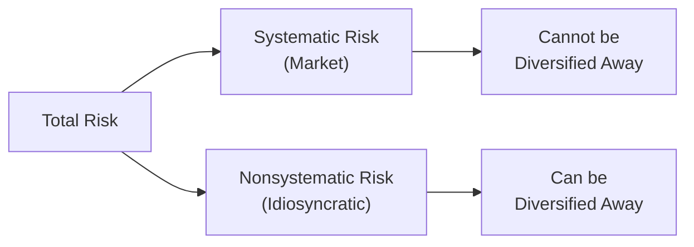

## Understanding the Risk Framework

When we talk about investments, we’re often confronted by the word “risk.” You know, that slightly uncomfortable feeling that something might not pan out as expected. In portfolio theory, “risk” gets a whole lot of attention because it helps investors figure out how uncertain future returns might be. But not all risk is created equal. Some risk is entirely bound to broad economic shifts—think interest rate changes or big moves in the global business cycle—while other risk is specific to just one company (maybe your favorite local pizza chain had a massive cheese shortage) or a single industry (like how oil prices harm or help energy firms).

From a modern portfolio perspective, we split total risk into two big categories: systematic risk and nonsystematic risk. Let’s break that down in a straightforward way.

## Total Risk: The Two Key Components

Total risk is basically the overall ride of ups and downs that a security (or a portfolio) experiences. It can be sliced into:
• Systematic risk (sometimes people call it market risk), and  
• Nonsystematic risk (also known as idiosyncratic or unique risk).

### Systematic Risk

Systematic risk embodies the idea that no matter how many stocks or bonds you hold, there are broad factors—like macroeconomic policy, interest rate changes, geopolitical tensions, or inflation—that can affect all investments in one way or another.

• It can’t be diversified away.  
• It usually arises from dominant market-wide factors (interest rates, GDP growth, policy shifts).  
• It’s measured in many practical models by “beta,” which you’ll see referenced in the Capital Asset Pricing Model (CAPM).  

If you’ve ever watched financial news channels and heard them talk about “the market tanked today,” that’s a sign that everyone’s boat floated lower (or higher) on the same tide—systematic risk in action.

### Nonsystematic Risk

Nonsystematic risk, on the other hand, is the stuff that’s unique to a particular firm or a specific industry. It’s your neighbor’s medical device startup that soared or fell after they either got or lost an important FDA approval. Such unexpected wins or setbacks affect that specific company (or maybe a small subset of companies in a sector), rather than the entire stock market.

• You can reduce (or sometimes nearly eliminate) this by owning more assets in different sectors or geographies.  
• It’s tied to things like a company’s product strategy, competitive edge, or leadership changes.  
• While it can be volatile, it’s the kind of risk we typically consider “avoidable” if you hold a well-diversified portfolio.

If you diversify effectively—say, by owning 40 or 50 different stocks across industries, or by purchasing a broad-based exchange-traded fund (ETF)—most of that unique, nonsystematic volatility is smoothed out. Granted, owning shares in 10 different crypto startups might not help if they’re all vulnerable to the same idiosyncratic factors, so the trick is to diversify across truly different industries or asset classes.

## Diversification in Practice

A long time ago, I remember building my very first portfolio on a small investment platform. I thought, “I’ll pick six or seven high-growth stocks,” and was quite proud of my stock analysis. Then, out of nowhere, half of them took a downward turn for separate reasons. I learned fast that if I’d thrown in more positions from multiple industries, my total loss might have been smaller.

### The Power of Spreading Out

Financial theory (and basic common sense) suggests that the more independent holdings you have, the more you spread out that nonsystematic risk. Imagine each individual stock is like a single wave in the ocean—some waves might be bigger, others smaller, but if your boat is riding all the waves at once, your overall experience feels more stable when viewed in total. At an extreme, you can own broad market ETFs that track entire indices (like the S&P 500), and by doing so, theoretically, you eliminate most nonsystematic risk. That’s because the poor performance of any one company can be offset by the better performance of another.

But there’s a caveat: you can’t get rid of the entire ocean’s tide. The ocean here stands for systematic risk—the part that will rise and fall no matter how many securities are in your basket. So, no matter how many stocks or bonds I include, I stay exposed to events such as global recessions, pandemics, or central bank rate decisions.

## Systematic Risk and the CAPM

Now, let’s talk about the Capital Asset Pricing Model (CAPM) for a moment, a topic covered in more depth in another section of this volume. The CAPM is built on the idea that rational investors only get compensated (in terms of higher expected returns) for bearing systematic risk because, in theory, nonsystematic risk can be diversified away.

In the CAPM world, the expected return of an asset is tied to something called “beta,” which is basically a measure of how sensitive the asset is to movements in the overall market. A stock with a beta of 1.5, for instance, is (in theory) more sensitive to broad market swings than another with a beta of 0.8. Investors who take on a higher beta asset might expect a higher return, because they’re more exposed to the market’s gyrations (systematic risk). But they won’t get a special reward for investing in some niche, highly unpredictable, single-stock risk. That part is on them to manage by diversifying.

### Beta in Detail

In CAPM parlance:

E(Rᵢ) = R_f + βᵢ [ E(Rₘ) – R_f ],

where  
• E(Rᵢ) is the expected return of portfolio i,  
• R_f is the risk-free rate,  
• E(Rₘ) is the expected market return,  
• βᵢ (beta) measures the sensitivity of security i’s returns relative to the market’s returns.

By focusing on beta, you’re effectively focusing on how the asset’s returns vary with the entire market. The nonsystematic portion gets left out of the equation—again, because from a theoretical standpoint, you’re not supposed to get compensated for that diversifiable risk.

## Diagram: Systematic vs. Nonsystematic Risk

Here’s a simple Mermaid diagram to highlight how these two categories differ and how diversification can mitigate one but not the other.

The broad portion on the left represents total risk. Notice how systematic risk flows into that category we can’t diversify away, while nonsystematic risk flows into that category we can minimize by adding assets from different industries or classes.

## Common Sources of Systematic and Nonsystematic Risk

You might be wondering what real-life events fuel these two risk categories. Let’s break it down:

• Systematic Risk  
  – Interest rate shifts (imagine central banks setting or changing policy).  
  – Economic cycles (recessions, expansions).  
  – Geopolitical changes (trade wars, big elections, global conflicts).  
  – Inflation or deflation.  
  – Natural disasters that slam the entire market sentiment.  

• Nonsystematic Risk  
  – A new competitor emerges, stealing market share from a single firm.  
  – Company executive scandals or internal mismanagement.  
  – A product recall or a failed drug trial.  
  – Labor strikes unique to certain industries.  
  – Bankruptcy or default specific to one organization.

By capturing both these types of risk, you can see how your total risk is formed. Then you can figure out what portion you can manage or reduce (nonsystematic) and what portion you just accept as part of being “in the market” (systematic).

## Imperfect Diversification and Real-World Nuances

We often say that if you hold a well-diversified portfolio, you’ll eliminate nonsystematic risk. But let’s be honest—there’s no such thing as perfect diversification. Even index funds are sometimes heavily weighted toward certain sectors or giant companies. Sure, you can hold an S&P 500 index fund, but if the top 10 companies in the index are all information technology giants, your portfolio could still be quite tech heavy.

Furthermore, “unknown correlations” can come into play. Sometimes you expect oil stocks and airline stocks to move in opposite directions (since airlines benefit from cheaper oil), but big macro events can cause them all to crash at once. So, in practice, portfolio managers keep a watchful eye on cross-correlations among asset classes, aiming for a robust spread of truly distinct exposures. The better job you do at that, the more nonsystematic risk you peel away from your portfolio. Yet, you’ll forever be stuck with whatever the broad market does, for better or worse.

## Limitations of the “Systematic vs. Nonsystematic” Breakdown

While the concept provides a great foundation, we should note some limitations:

• Distinction can be fuzzy in certain crises: Sometimes you see events that appear to affect only a few companies but later spread to an entire sector or the overall economy (like how the subprime mortgage crisis expanded into a broad financial meltdown).  
• Beta is not static: Market conditions change, and so does the sensitivity of your investment to those conditions. This can make standard CAPM calculations a bit simplified.  
• Diversification cannot always offset sector-wide moves: If your “diversified” portfolio simply invests in multiple tech companies, or invests heavily in correlated asset classes, you might not reduce nonsystematic risk as much as you think.  
• Behavioral factors: Investors can exhibit herd behavior or panic selling, causing asset prices to move together unexpectedly.

Even with its challenges, the systematic/nonsystematic concept remains central to how we approach portfolio design. It reminds us that we don’t necessarily earn extra for loading up on random single-stock risk. If you want to manage risk practically, you aim to diversify away most of the idiosyncratic issues so that your portfolio’s risk is primarily systematic.

## Implications for Portfolio Managers

Portfolio managers typically focus on building broad-based portfolios that deliver the highest possible expected return for a given level of risk. Since systematic risk can’t be eliminated, managers spend a lot of time choosing how much market exposure (beta) to take on. For instance, if a manager wants a less volatile portfolio for clients whose main priority is capital preservation, they might keep a lower beta or tilt more toward fixed income. Conversely, if a manager wants to target higher returns and can tolerate fairly big swings, they might include higher beta equities or more cyclical sectors.

### Ongoing Monitoring

Effective portfolio management doesn’t stop once you buy a well-diversified set of assets. Risks change over time. A company that was once stable might become riskier if it heads into a questionable merger. Global or regional events might cause once-unrelated assets to become closely correlated. That’s why managers continually rebalance portfolios, especially if certain holdings become overweight relative to the initial plan.

### Communication with Clients

Even if your portfolio is well-diversified, it can still take a major hit when broad sentiment sours. Helping clients understand that systematic risk is always lurking in the background builds realistic expectations and prevents overreactions during market downturns.

## Real-World Example: The 2020 Pandemic Shock

An interesting (albeit painful) recent example of systematic risk is the pandemic-driven decline that hit financial markets globally around March 2020. Virtually every sector experienced declines simultaneously—travel stocks, retail, energy, you name it. That’s a hallmark of systematic risk: no matter how many different airlines or hotel groups you owned, they were all hammered by the same overarching event.

On the flip side, the technology sector quickly recovered and soared higher as remote work boomed. But within those tech stocks, some niche subsectors fared exceptionally well, reflecting certain unique (nonsystematic) vulnerabilities or strengths. However, in those initial weeks, you couldn’t really hide from the broad market panic. That’s systematic risk at work.

## Using Factor Models to Refine Analysis

Beyond CAPM, many in the investment world have adopted multi-factor models to get an even more granular understanding of systematic and nonsystematic risk. Instead of just a single market factor, they might include factors such as size, value, momentum, or quality. Under a multi-factor lens, each factor is considered a source of systematic risk if it’s broad enough to affect a wide swath of securities.

But the core principle remains consistent: you can’t diversify away risk that applies to the entire market or to broad systematic factors, but you can reduce the risk that’s quirky or unique to a single stock or sector.

## Best Practices and Potential Pitfalls

• Best Practices  
  – Ensure adequate diversification across truly different asset classes, sectors, and geographies.  
  – Continuously monitor correlations, as they can shift unpredictably.  
  – Use stress tests and scenario analyses to see how your portfolio might respond to large macro shocks.  
  – Communicate systematically with stakeholders about expected volatility and set realistic return objectives.  

• Potential Pitfalls  
  – Overconcentration in correlated assets that appear different at first glance.  
  – Relying solely on historical beta estimates in a dynamic market environment.  
  – Ignoring liquidity risk, operational risks, or other “hidden” risk factors.  
  – Assuming that systematic risk always stays at a steady level—it can spike quickly when big news hits.  

## Final Exam Tips

• Understand the difference between systematic and nonsystematic risk inside-out. CAPM testing and portfolio theory questions almost always revolve around these distinctions.  
• Practice with example portfolios, showing how correlation affects nonsystematic risk.  
• Be prepared to explain the rationale behind why investors aren’t compensated for nonsystematic risk in the CAPM framework.  
• Recognize that real-world complexities (like liquidity constraints, transaction costs, or factor-based strategies) may alter the textbook view, but the underlying fundamental ideas remain the same.  

## References and Further Exploration

• Litterman, R. (2003). Modern Investment Management: An Equilibrium Approach. Wiley.  
• Grinold, R. C., & Kahn, R. N. (2000). Active Portfolio Management: A Quantitative Approach. McGraw-Hill.  
• CFA Institute. (Latest Edition). CFA® Program Curriculum.  
• For a deeper exploration of multi-factor investing, consider reading various research papers from major asset managers, such as MSCI’s Factor Investing series.

----------------------------------------

## Test Your Knowledge of Systematic and Nonsystematic Risk



### Which statement best defines systematic risk?

- [ ] It is the risk unique to a single firm that can be diversified away.  
- [x] It is the broad market risk affecting all assets, which cannot be diversified away.  
- [ ] It is the risk from poor financial management in a specific industry.  
- [ ] It must be hedged with specialized derivatives or options.  

> **Explanation:** Systematic risk, also known as market risk, arises from macroeconomic or broad market events and cannot be eliminated through diversification alone.

### Which of the following scenarios exemplifies nonsystematic risk?

- [x] A biotech firm's stock plummets due to a failed drug trial.  
- [ ] A global recession triggers downturns across multiple industries.  
- [ ] Central bank rate hikes cause bond prices to fall market-wide.  
- [ ] A natural disaster significantly affects overall market sentiment.  

> **Explanation:** A failed drug trial concerns a specific biotech company, representing a unique risk that may be diversified away by holding other stocks.

### According to the CAPM, why aren’t investors compensated for nonsystematic risk?

- [x] Because nonsystematic risk can be virtually eliminated through diversification.  
- [ ] Because it is captured by the market risk premium.  
- [ ] Because it does not exist beyond a single industry.  
- [ ] Because it is more expensive to hedge.  

> **Explanation:** The logic behind CAPM is that investors can diversify away idiosyncratic risk, so the market only compensates them for bearing systematic (undiversifiable) market risk.

### If you hold a portfolio of 40 different technology stocks, what possible risk remains significantly high?

- [ ] Nonsystematic risk is fully eliminated.  
- [ ] You are only exposed to exchange rate risk.  
- [x] You might still face sector-specific systematic risk affecting the technology industry.  
- [ ] All risk is transferred to the broader market.  

> **Explanation:** Though you hold multiple stocks, they may be closely correlated since they’re all from the technology sector. Market-wide or even sector-wide shocks would impact them similarly, leaving you exposed to systematic risk at the sector or market level.

### Which of the following is a valid strategy to reduce nonsystematic risk?

- [x] Holding a diversified portfolio spanning different industries and asset classes.  
- [ ] Investing only in short-term Treasury bills.  
- [ ] Strictly following the market index with a beta of 1.  
- [ ] Reducing the size of individual positions within the same industry.  

> **Explanation:** The key to reducing nonsystematic risk is broad-based diversification across truly distinct sectors and asset categories.

### In the CAPM, what does beta represent?

- [ ] A measure of idiosyncratic risk.  
- [ ] A correlation coefficient between two stocks.  
- [x] A measure of an asset’s sensitivity to broad market movements.  
- [ ] A method to evaluate the risk-free rate.  

> **Explanation:** Beta indicates how an asset’s return moves relative to the overall market. It captures systematic risk, not idiosyncratic risk.

### Why can’t systematic risk be entirely removed from a portfolio?

- [ ] Because everyone invests in the same stocks.  
- [ ] Because it’s tied to interest rates only.  
- [ ] Because it is embedded in bond-only portfolios.  
- [x] Because it stems from market-wide forces uncorrelated with a specific firm.  

> **Explanation:** Systematic risk is driven by broad economic or market factors (such as recessions, monetary policy changes, major political events) that affect all securities simultaneously.

### Which statement is true about nonsystematic risk?

- [ ] It is often referred to as market risk.  
- [x] It can be largely eliminated by increasing the number of uncorrelated holdings.  
- [ ] It is measured by the market risk premium.  
- [ ] It only affects government bond markets.  

> **Explanation:** Nonsystematic or idiosyncratic risk can be reduced by holding more assets with different fundamental drivers, thereby “spreading out” risk.

### Which of these best demonstrates the key principle behind diversification?

- [ ] Owning multiple stocks in the same sector to minimize transaction costs.  
- [x] Combining uncorrelated assets to limit the impact of any single security’s underperformance.  
- [ ] Using futures to gain synthetic exposure to a single asset class.  
- [ ] Purchasing only the largest firm in each industry.  

> **Explanation:** True diversity in holdings (uncorrelated assets) is what mitigates nonsystematic risk effectively.

### Broadly speaking, is the following statement true or false? “Within a single market index fund, nonsystematic risk is entirely eliminated.”

- [x] True  
- [ ] False  

> **Explanation:** An index fund attempts to hold every stock in the index, effectively eliminating most of the firm-specific risk. However, keep in mind that broader systematic risk remains.  


