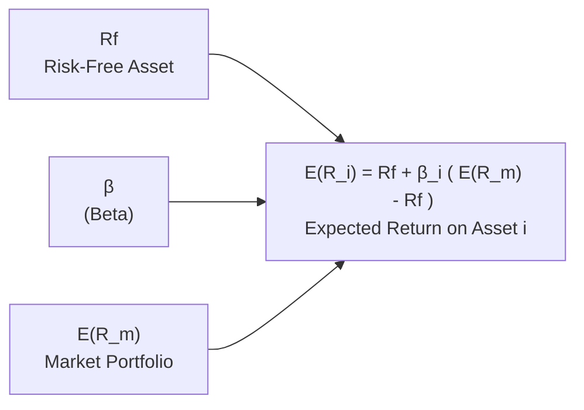

## Introduction

I recall the first time I heard about the Capital Asset Pricing Model (CAPM). It was in a late-night study session, and someone casually said, “Just plug in beta, subtract the risk-free rate, multiply by your market risk premium, done!” And I remember thinking, “Is that all it takes to figure out the ‘fair’ return for a stock?” Well, CAPM does provide a neat little formula (we’ll walk through that soon), but there’s definitely more depth to it than meets the eye.

In short, CAPM does one big job: it connects the expected return of an asset to its sensitivity to the overall market’s returns. This sensitivity is typically referred to as “beta (β).” If you’ve ever heard someone say, “That stock is more volatile than the market,” or “It has a beta of 1.2,” they’re talking CAPM language, whether they know it or not. 

Below, we dig into CAPM’s assumptions, the mechanics of beta, the model’s real-world uses, and some important critiques.

## CAPM: The Basics

The CAPM states that the expected return on an asset i (E(Rᵢ)) depends linearly on the market’s expected return in excess of the risk-free rate (i.e., the Market Risk Premium or MRP). Formally:

(1)  
E(Rᵢ) = R_f + βᵢ [ E(Rₘ) – R_f ]  

Where:  
• R_f is the risk-free rate, such as a short-term government T-bill rate.  
• E(Rₘ) is the expected return on the “market portfolio.”  
• βᵢ is the beta, measuring asset i’s sensitivity to market fluctuations.  
• [ E(Rₘ) – R_f ] is the market risk premium (MRP).  

In CAPM, the market is considered the only factor that really matters for pricing assets. This is why we often call CAPM a single-factor model. It helps that it’s easy to digest: you just multiply βᵢ by the MRP and then tack on R_f. Voilà—expected return.

### Interpreting Beta

Beta (β) for an asset i is calculated, roughly, as:

(2)  
βᵢ = Cov(Rᵢ, Rₘ) / Var(Rₘ)

In words: the covariance between the asset’s returns and the market’s returns, divided by the market’s variance. A βᵢ of 1 means your asset historically moves in sync with the market. A βᵢ of 1.5 means your asset tends to move 1.5 times as much as the market in percentage terms (on average). And if you’ve got a negative beta (like -0.5), that suggests your asset tends to move in the opposite direction of the market’s returns, which can be quite interesting for diversification.

## Key Assumptions

CAPM, like many finance models, has a few assumptions that might sound a bit simplified:

• Investors can borrow or lend unlimited amounts at a single risk-free rate.  
• All investors share the same time horizon.  
• There are no taxes or transaction costs, so markets are frictionless.  
• All assets are infinitely divisible and can be traded.  
• Investors make decisions based solely on mean-variance optimization, caring only about expected returns and variance of returns.  
• Everyone has the same expectations about asset returns, variances, and covariances.  

Frankly, in the real world, these assumptions are too ideal. But they give us a simplified environment in which the model can hold. It’s a bit like a frictionless plane in physics—purely theoretical, but it works for forming a baseline.

## Beta, Systematic Risk, and Expected Return

Beta is the “systematic risk” measure. Systematic risk is the risk that can’t be diversified away by holding a broad portfolio of different stocks and bonds. If there’s a global recession or a big shift in interest rates, that’s something that hits “the system,” and everyone gets it. Meanwhile, unsystematic (idiosyncratic) risk is specific to a company or a small group of companies (like sudden mismanagement at a single firm). The more an asset’s returns co-move with the market, the higher its beta—and the higher its expected return should be, according to CAPM.

Why higher returns? Because if your stock is very sensitive to overall market moves (think of a high-growth tech stock), in tough markets, it may plummet more than average. Investors demand a premium for holding that risk. On the other hand, if your stock moves less than the market (like a utility with stable dividends), it might have a beta under 1, and so its expected return is lower.

## Practical Applications of CAPM

### 1. Estimating Cost of Equity  
One place you’ll see CAPM used all the time is in estimating a firm’s cost of equity. Corporate finance folks use:

Cost of Equity = R_f + βᵢ [ E(Rₘ) – R_f ]  

to figure out a discount rate for future cash flows, say in a discounted cash flow (DCF) model. If a company is considered “riskier” than the market, you’d have a higher beta, and thus a higher cost of equity.

### 2. Portfolio Management  
In portfolio management, we often talk about how to combine different assets to achieve a desired level of systematic risk. CAPM is the building block for more advanced multi-factor models. People start with CAPM as a baseline, then add other risk factors (like size, style, or momentum) to better explain returns. 

### 3. Performance Evaluation  
Managers also compare realized returns to what CAPM would predict as a fair baseline. That difference (positive or negative) is known as alpha. If you earned more than CAPM predicted, your alpha is positive—which we all love to see. If your returns fell short, you’ve got negative alpha, and you might want to reevaluate your strategy.

### 4. Capital Budgeting Decisions  
When deciding whether to invest in a new project, many firms use a discount rate based on CAPM for the project’s cash flows (assuming the project’s risk is similar to the firm’s overall risk profile). It’s not always perfect, but it gives an easy, well-known benchmark that the CFO, the board of directors, and shareholders can generally understand.

## A Quick Mermaid Diagram

To visualize how CAPM weaves together risk-free rates, market returns, beta, and expected returns, consider this diagram:



In this simplified view, everything converges on the final expected return of the asset. The difference (E(Rₘ) - R_f) is the so-called “market risk premium,” multiplied by beta. Then you add R_f back in.

## A Tiny Python Example for Beta Calculation

Ever wondered how to get beta of a stock with data? Let’s say you have a list of daily returns for a stock (stock_returns) and a list of daily returns for the market (market_returns). Here’s a quick snippet (just a conceptual demonstration):

```python
import numpy as np

stock_returns = np.array([0.01, -0.02, 0.02, 0.00, 0.03])
market_returns = np.array([0.005, -0.01, 0.01, 0.002, 0.02])

cov_stock_market = np.cov(stock_returns, market_returns, ddof=1)[0, 1]

var_market = np.var(market_returns, ddof=1)

beta_stock = cov_stock_market / var_market

print("Estimated Beta for Stock A:", beta_stock)
```

If you run it, you’ll get a numerical estimate for beta. You’d then plug that into the CAPM formula, along with your chosen risk-free rate and estimated market risk premium, to get an expected return. 

## Criticisms and Limitations

Like many frameworks, CAPM isn’t perfect:

1. Single-Factor Model: CAPM sees the market return as the only risk factor. In reality, other factors (like company size, value vs. growth orientation, liquidity) appear to matter. Fama and French famously introduced additional factors for size and value to better explain returns.

2. Market Portfolio is Theoretical: CAPM theoretically requires a “market portfolio” that includes all investable assets, even real estate, art, private equity—basically everything. In practice, we just use an equity index like the S&P 500 as a proxy.

3. Empirical Anomalies: The model doesn’t always match reality. For instance, empirical studies show that low-beta stocks sometimes earn higher returns than CAPM would predict.

4. Estimation Issues: Estimating beta using historical data can be messy. If you pick a different time horizon or measurement frequency, you can get dramatically different betas.

5. Assumptions of Perfect Markets: Real trading involves taxes, bid-ask spreads, short-sale constraints, and so on, which can distort CAPM’s predictions.

Some folks might say, “CAPM is dead,” but that’s probably too strong. CAPM remains a helpful baseline. However, keep in mind that more advanced factor models build on it to get a better grasp of real-world returns.

## Examples and Case Studies

### The Tech Start-Up with a High Beta
Imagine a tech start-up that swings more wildly than the overall market. Based on historical data, suppose the company’s β is 1.8, the risk-free rate is 2%, and you believe the expected market return is about 8%. The market risk premium is then 8% - 2% = 6%. Applying CAPM:

E(Rʸᵒᵘʳ Tech) = 2% + 1.8 × 6% = 12.8%

That’s a decent chunk of expected return. But it also implies more volatility, so you’ve got to be prepared for the possibility of deeper drawdowns when the market dips.

### The “Boring” Utility with a Low Beta
Utility firms, with their stable cash flows, often have betas below 1. Suppose a utility has a β of 0.5, with the same market conditions:

E(Rᵘᵗᶦˡᶦᵗʸ) = 2% + 0.5 × 6% = 5%

It’s lower, but might be more stable. A low-beta utility is often considered a “defensive” stock—something you might hold if you want less vulnerability to major market gyrations. 

## Best Practices and Pitfalls

• **Use a Reasonable Risk-Free Rate**: If you’re analyzing a project in a developing market, employing a U.S. T-bill rate might not be fully representative of the local environment. Adjust or consider local risk-free proxies.  

• **Don’t Rely Solely on Zingy Historical Beta**: Betas can change over time. A company can evolve from stable to risky or vice versa, so keep an eye out for structural shifts in the firm’s operations.  

• **Be Realistic About the Market Risk Premium**: The MRP can vary significantly by country and period. Overestimating it can overstate your expected return.  

• **Remember Industry and Company-Specific Factors**: CAPM lumps everything not explained by the market factor into the error term. If you suspect additional sources of risk, consider multi-factor models (e.g., Fama-French).  

• **Blend with Judgment**: CAPM is a guiding star, not a definitive rule from above. Real data rarely lines up perfectly with theoretical assumptions.  

## Study and Exam Tips

• Familiarize yourself with the formula’s structure so you can quickly interpret how changes to R_f, β, or the market premium affect E(Rᵢ).  
• Practice switching between decimal and percentage forms. For instance, if R_f = 0.02, that’s 2%.  
• Use short conceptual stories like the Tech Start-Up vs. Utility example to clearly recall how beta influences expected return.  
• Look out for scenario-based exam questions that test your ability to identify whether an asset is overpriced or underpriced relative to the CAPM.  
• In item set questions, be ready to perform a quick calculation of beta or expected returns and then interpret them in context (e.g., whether to buy or sell).  

## References

• Sharpe, W. F. (1964). “Capital Asset Prices: A Theory of Market Equilibrium under Conditions of Risk.” The Journal of Finance.  
• Fama, E. F., & French, K. R. (2004). “The Capital Asset Pricing Model: Theory and Evidence.” Journal of Economic Perspectives.  

----

## Test Your Knowledge: CAPM & Beta Fundamentals



### According to CAPM, which of the following primarily determines an asset’s required rate of return?

- [ ] Its unique risks and fundamental analysis
- [ ] The alpha generated by the asset’s management team
- [x] Its sensitivity (beta) to systematic market risk
- [ ] The company’s credit rating from a rating agency

> **Explanation:** CAPM states that the expected return on an asset is mainly determined by the asset’s beta—that is, its sensitivity to the overall market.

### Suppose the risk-free rate is 3%, the market return is 9%, and an asset’s beta is 1.2. Based on CAPM, what is the asset’s expected return?

- [ ] 7.2%
- [x] 10.2%
- [ ] 9.0%
- [ ] 14.8%

> **Explanation:** Using CAPM, E(Rᵢ) = 3% + 1.2 × (9% – 3%) = 3% + 1.2 × 6% = 3% + 7.2% = 10.2%.

### A beta above 1.0 implies which of the following about a stock?

- [ ] It is likely to be overvalued by the market.
- [ ] It has less systematic risk than the market.
- [x] It will, on average, move more than the market in percentage terms.
- [ ] It has zero correlation with the market.

> **Explanation:** A beta above 1 signals the stock tends to move more aggressively than the market (on average).

### Which of these risk factors is specifically captured by CAPM?

- [x] Systematic market risk
- [ ] Credit risk
- [ ] Inflation risk
- [ ] Liquidity risk

> **Explanation:** CAPM is a single-factor model focusing on market risk. Other risk factors (credit, liquidity, etc.) are not explicitly modeled in basic CAPM.

### Which assumption is part of CAPM’s theoretical framework?

- [x] Investors can borrow or lend any amount at the risk-free rate.
- [ ] Transaction costs significantly exceed the risk-free rate.
- [x] Investors have homogeneous expectations.
- [ ] Asset returns are not mean-variance optimizers.

> **Explanation:** CAPM assumes frictionless markets, homogeneous expectations, and unlimited borrowing/lending at the risk-free rate. It also relies on mean-variance optimization.

### If a stock’s actual return is consistently higher than the CAPM-predicted return, we might say the stock:

- [x] Generates a positive alpha.
- [ ] Is priced exactly at its fair value.
- [ ] Is an excellent risk-free substitute.
- [ ] Conforms exactly to the theory.

> **Explanation:** A stock that outperforms the CAPM-expected return is said to have positive alpha, suggesting outperformance relative to its systematic risk profile.

### Which of the following is a limitation of CAPM?

- [x] It relies on a single market factor.
- [ ] It accounts for all sources of unsystematic risk.
- [x] It requires no assumptions about market frictions.
- [ ] It automatically adjusts for changes in a firm’s capital structure.

> **Explanation:** CAPM is a single-factor model with assumptions of frictionless markets, ignoring many real-world complexities like multiple risk factors and capital structure changes.

### In practice, how do investors often estimate the "market portfolio" for CAPM?

- [ ] By using the foreign exchange market as the best approximation.
- [x] By using a broad equity index (like the S&P 500) as a proxy.
- [ ] By combining various idiosyncratic assets.
- [ ] By using only their proprietary firm’s stock.

> **Explanation:** Because a true market portfolio theoretically includes all assets, investors commonly approximate it with a broad stock market index.

### One of the reasons why the CAPM formula might misprice assets is due to:

- [x] The presence of factors beyond just market risk (e.g., size or value).
- [ ] The perfect alignment of real data with theoretical assumptions.
- [ ] The unlimited supply of risk-free assets in every market.
- [ ] The difficulty of computing variance.

> **Explanation:** Empirical research (like Fama-French) highlights additional factors beyond market risk, which can cause CAPM to under- or over-price certain assets.

### CAPM can be considered valid if we assume that there are no transaction costs, unlimited borrowing/lending at a risk-free rate, and all investors have the same expectations.

- [x] True
- [ ] False

> **Explanation:** These are some of the classical assumptions behind CAPM, even though in the real world they don’t fully hold.


