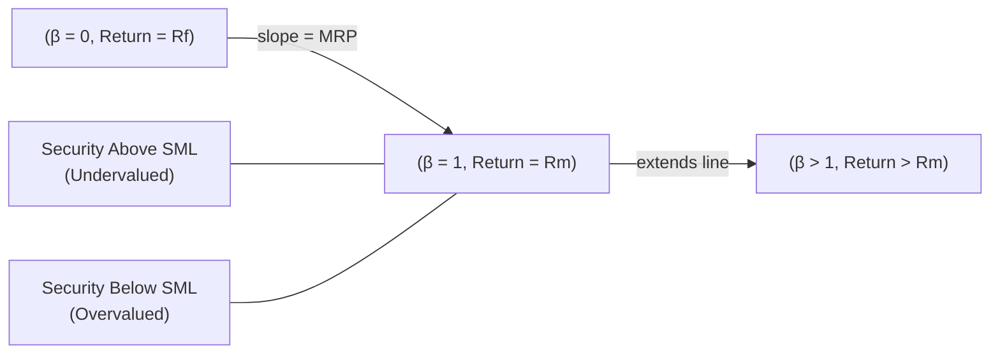

## Understanding the Security Market Line

Have you ever noticed how sometimes our expectations for returns on certain stocks just feel out of line with reality? Well, that’s essentially what the Security Market Line (SML) tries to address. It’s a graphical representation of the Capital Asset Pricing Model (CAPM). If you recall, CAPM basically says:

E(Rᵢ) = R_f + βᵢ × [E(R_m) − R_f]

Where:  
• E(Rᵢ) = Expected return of security i  
• R_f = Risk-free rate  
• βᵢ = Beta of security i (its sensitivity to the market)  
• E(R_m) = Expected return on the market  
• [E(R_m) − R_f] = Market risk premium

Plotting the expected return (E(Rᵢ)) on the vertical axis against beta (βᵢ) on the horizontal axis produces a straight line we call the SML. The intercept of this line is the risk-free rate, and the slope is the market risk premium. This line is crucial for understanding whether a security or portfolio is fairly valued—it ties systematic risk to expected return in a tidy, linear relationship.

On a personal note, I remember back when I first encountered the SML, I was frustrated that my favorite biotech stock didn’t seem to “fit” well on the line. I quickly realized that if a stock’s plot is off the line, it’s not necessarily that CAPM is broken; it might be that the stock is over- or undervalued relative to its risk level. Which is good news for investors looking for an advantage.

## Slope and Intercept: The Core of the SML

Because the Security Market Line is derived from the CAPM, it’s anchored by two key components:

• The intercept is the risk-free rate (R_f). Intuitively, this is how much return you’d get if you invested in a “zero beta” asset—one with no market risk exposure—such as certain Treasury bills in many developed markets.  
• The slope is the market risk premium, which is [E(R_m) − R_f]. This slope reflects how much extra return investors demand, on average, for each additional unit of market (systematic) risk, measured by beta.

Visually, the SML line starts at (β = 0, E(R) = R_f) and extends upward. If you see a security with a beta of 1.2, for instance, you just head to β = 1.2 on the horizontal axis and look up to find its expected return on the SML.

Here’s a super simple case:

Let’s say:  
• Risk-free rate, R_f = 3%  
• Market return, E(R_m) = 8%  
• Therefore, MRP (the slope) = 8% − 3% = 5%

Security X has a beta of 1.2. According to the SML, its expected return is:

E(R_X) = 3% + 1.2 × 5% = 3% + 6% = 9%.

So, if anyone tells you she expects Security X to yield 10% consistently, then you have a strong hint that Security X might be underpriced—or perhaps the market is not assessing the risk correctly.

## Identifying Overpriced vs. Underpriced Securities

One of the most practical uses of the SML is to spot over- and undervaluation. It's kind of like having a built-in “detector” for whether a security’s return is commensurate with its risk.

• If a security’s actual (or required) return is above the SML, it offers more than the “fair” return predicted by CAPM for its level of systematic risk. So it appears to be underpriced and potentially a good buy.  
• Conversely, if a security’s actual (or required) return is below the SML, it’s delivering less return than is fair for its level of systematic risk, indicating it may be overpriced. That’s often a sign to investigate further before plowing your precious capital into it.

By the way, I once made the mistake of ignoring a security that was far below the SML. I thought fundamentals would eventually catch up. They didn’t, and I could’ve saved myself some heartburn by trusting this framework a bit more!

Below is a simple Mermaid diagram that conceptually depicts the SML, showing points above (undervalued or outperforming) and below (overvalued or underperforming):

## Differentiating the SML from the CML

It’s easy to mix up the Security Market Line (SML) with the Capital Market Line (CML). After all, they both come from Modern Portfolio Theory. But they measure different sources of risk:

• The SML focuses on beta, the systematic risk measure in CAPM. It plots expected return for any security or portfolio against that security’s (or portfolio’s) beta relative to the market.  
• The CML focuses on total risk, measured by standard deviation (σ). It plots expected return only for efficient portfolios (combinations of the risk-free asset and the market portfolio) against total risk.  

So if your friend is analyzing the entire set of efficient portfolios, they’d probably bring up the CML. If you’re analyzing an individual stock or a portfolio in terms of systematic risk, the SML is your main tool.

## Using the SML as a Performance Benchmark

In practice, the SML is a tremendous benchmark for evaluating whether a portfolio or individual security delivers the return that justifies its systematic risk. If a portfolio manager is beating the SML (i.e., the portfolio’s actual return is above what CAPM would predict for its beta), that manager has generated positive alpha—an excess return beyond the risk-adjusted expectation.

It’s also helpful in performance attribution, which seeks to break down returns into components driven by market factors, style choices, or sector bets. The SML sets the baseline for what “fair” compensation is for systematic risk. Anything above or below that baseline can be attributed to additional skill (or luck, depending on one’s perspective!), or unique factors not explained by broad market movements.

## Real-World Applications and Examples

• Equity Valuation: Analysts often use the SML when they calculate the cost of equity from the CAPM. The SML helps you see how much return or discount rate you should assign to the equity portion of a firm’s capital structure.  
• Cost of Capital: Firms trying to figure out their Weighted Average Cost of Capital (WACC) typically derive the cost of equity from CAPM, plugging in the existing R_f and market risk premium from the SML.  
• Performance Attribution: When a stock or mutual fund yields significantly more than predicted by the SML, you might conclude that management added value. Or maybe they just took on extra risk not captured by beta.  
• Active vs. Passive Management: The SML is a reference line for systematic risk. Some active managers want to deviate from it intentionally, hoping to uncover mispricing in the marketplace.

Let’s do another numeric illustration: Suppose we have two stocks in your portfolio.

• Stock A:  
  – Beta: 1.5  
  – Expected Return per your fundamental analysis: 12%  

• Stock B:  
  – Beta: 0.8  
  – Expected Return per your fundamental analysis: 6.5%  

Meanwhile, the risk-free rate is 2.5%, and the expected market return is 8%. So the market risk premium is 8% − 2.5% = 5.5%.

According to the SML:

• Required return for A = 2.5% + (1.5 × 5.5%) = 2.5% + 8.25% = 10.75%  
• Required return for B = 2.5% + (0.8 × 5.5%) = 2.5% + 4.4% = 6.9%  

Given each stock’s “fundamental analysis” expectation, we see:  
• Stock A’s fundamental expected return (12%) is > 10.75% (SML predicted). It stands above the SML, possibly undervalued.  
• Stock B’s fundamental expected return (6.5%) is < 6.9% (SML predicted). It stands below the SML, possibly overvalued.

Now, you won’t always find such neat results in reality, but it’s a tidy example of how the SML logic might guide your decisions.

## Best Practices and Pitfalls

• Don’t rely solely on the SML. Beta is not the entire story—think of idiosyncratic factors, liquidity constraints, or fundamental changes in a business.  
• Check the underlying assumptions. CAPM has strong assumptions like frictionless markets and unlimited short-selling—real markets are messier.  
• Make sure your market risk premium is realistic. Using a static number or outdated data can push you to wrong conclusions about fair returns.  
• Remember that the SML helps identify relative mispricing, not absolute “true value.” 

It’s always a blend of theory and practice, and we can’t ignore that markets sometimes defy the neat lines we draw.

## Summary and Final Thoughts

In many ways, the Security Market Line is the backbone of traditional risk-return analysis. It’s elegantly simple but robust enough to guide portfolio allocation decisions, equity valuation models, and performance evaluation. Whether you’re an aspiring analyst, a busy portfolio manager, or a curious investor, you’ll benefit from understanding where your investments plot relative to the SML. Even if the real world deviates from CAPM (and trust me, it often does), the SML is still a great way to frame discussions around risk-based returns and glean insights into potential misvaluation.

While it’s true that—just like any financial model—the SML isn’t foolproof, it’s served as a bedrock for modern portfolio theory and remains a key tool in the CFA curriculum and active investment management everywhere.

## Glossary

• Security Market Line (SML): A line describing the relation between expected return and beta in the CAPM framework.  
• Market Risk Premium: The slope of the SML, indicating the additional return required for each unit of systematic risk.  
• Overpriced (Underperforming) Asset: An asset lying below the SML, offering insufficient return for its beta.  
• Underpriced (Outperforming) Asset: An asset lying above the SML, offering a higher return for its beta.  

## References and Further Reading

• CFA Institute. (n.d.). Equities and Portfolio Management Curriculum. Retrieved from https://www.cfainstitute.org/  
• Ross, S. A., Westerfield, R., & Jaffe, J. (2019). Corporate Finance (12th ed.). McGraw-Hill.  

## Test Your Knowledge: Security Market Line (SML) and CAPM Insights



### Which of the following best describes the slope of the Security Market Line?

- [ ] It represents the total return demanded by investors on a portfolio with zero standard deviation.  
- [x] It represents the market risk premium, reflecting the additional return expected for each unit of beta.  
- [ ] It is the difference between the expected return on a security and that of a riskless asset.  
- [ ] It merely reflects investor sentiment and does not rely on market fundamentals.  

> **Explanation:** The slope of the SML is the market risk premium. It captures the extra return investors require per unit of systematic risk (beta).

### An asset that plots above the SML is generally considered:

- [x] Undervalued, because its actual or required return is higher than what CAPM predicts for its beta.  
- [ ] Overvalued, because its return is too high for its level of systematic risk.  
- [ ] Risk-free, because if it’s above the line, it has no systematic risk.  
- [ ] Precisely fairly valued, because it lies on a different risk measure.  

> **Explanation:** If the asset is above the SML, the investor is receiving a higher return for a given level of systematic risk, suggesting potential undervaluation.

### Which statement differentiates the CML and the SML most accurately?

- [x] The CML graphs expected return against total risk, while the SML graphs expected return against systematic risk (beta).  
- [ ] The CML applies only to individual stocks, while the SML applies only to managed portfolios.  
- [ ] The SML requires the risk-free asset, whereas the CML does not.  
- [ ] Both lines are identical in practice, and they only differ in academic interpretation.  

> **Explanation:** The CML relates total risk (standard deviation) to expected returns of efficient portfolios, whereas the SML ties systematic risk (beta) to expected returns of any security or portfolio.

### Assume a risk-free rate of 4% and a market risk premium of 5%. A stock has a beta of 1.2. According to CAPM, its expected return would be:

- [ ] 5%  
- [ ] 9%  
- [x] 10%  
- [ ] 12%  

> **Explanation:** Using CAPM: E(R) = 4% + 1.2 × 5% = 4% + 6% = 10%.

### What might cause a security’s actual return to deviate from its expected return according to the SML?

- [x] Unique events such as major product launches or lawsuits that aren’t captured by beta.  
- [ ] Strict adherence to all CAPM assumptions in the market.  
- [ ] The market always perfectly pricing all securities.  
- [ ] Beta fully reflecting idiosyncratic risk.  

> **Explanation:** Beta measures systematic risk only and doesn’t capture idiosyncratic or company-specific events, which can cause deviations.

### If a portfolio’s actual return is consistently below the SML, it might indicate:

- [x] The manager is underperforming relative to the risk taken.  
- [ ] The portfolio has no systematic risk.  
- [ ] The portfolio is fully diversified and should match the SML exactly.  
- [ ] The portfolio invests only in risk-free assets.  

> **Explanation:** If the return is below the line, the portfolio is generating less return for its level of systematic risk, indicating underperformance or overvaluation.

### Regarding the Security Market Line, which is true about “beta”?

- [x] Beta measures the sensitivity of a security’s returns to the market’s returns.  
- [ ] Beta reflects the total risk of the security, including firm-specific risk.  
- [x] A beta of 1 implies the security moves in line with the market on average.  
- [ ] Beta is always zero for high-risk assets.  

> **Explanation:** Beta captures systematic risk (relative to market fluctuations). A beta of 1 means the security’s returns move similarly to the market. Security-specific events do not affect beta directly (that’s idiosyncratic risk).

### One of the main differences between a portfolio on the SML versus one on the CML is:

- [x] The SML can depict any asset or portfolio’s expected return for its systematic risk, whereas the CML focuses on portfolios that blend the risk-free asset and market portfolio.  
- [ ] The CML only applies to short-term investments, while the SML applies to long-term investments.  
- [ ] They apply the same risk measure, but the reference index is different.  
- [ ] There is no conceptual distinction between them.  

> **Explanation:** The SML accommodates all possible securities or portfolios and measures expected return for systematic risk, while the CML deals with efficient portfolios mixing the risk-free instrument and the market.

### If an investor believes the market risk premium will rise significantly next year, what would happen to the slope of the SML?

- [x] The slope (market risk premium) would increase, implying investors demand higher returns for a given beta.  
- [ ] The slope would remain unchanged; only the intercept changes.  
- [ ] The slope would become negative.  
- [ ] The slope would drop to zero.  

> **Explanation:** An increase in the expected market risk premium directly increases the slope of the SML.

### True or False: The Security Market Line can serve as a benchmark for evaluating the performance of individual stocks and portfolios, even in the presence of unsystematic risk.

- [x] True  
- [ ] False  

> **Explanation:** The SML is a benchmark for systematic risk. Although it doesn’t explicitly measure unsystematic risk, analysts still commonly use it to evaluate securities’ expected returns versus actual results.


