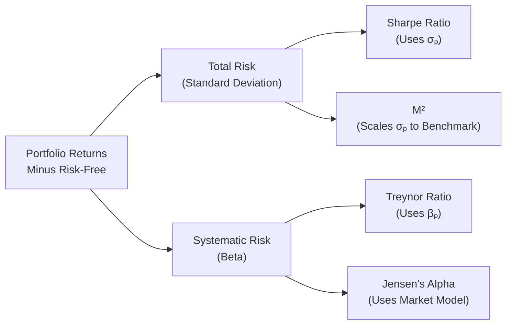

## The Fundamentals of Risk-Adjusted Performance Measures

In Chapter 3, we’ve been examining the interplay between risk and return. Let’s face it: if all portfolios had the same risk profile, comparing them would be simple—just check which one made more money. But reality is much trickier: some portfolios zig while others zag, some chase high beta stocks, and some hold onto stable government bonds. This variety demands metrics that adjust returns for the level and type of risk each portfolio takes. And that’s exactly where Sharpe, Treynor, Jensen’s Alpha, and M² (Modigliani–Modigliani) come in.

I remember (a few years back) working with a friend who was launching a small hedge fund. She’d tell me, “Hey, I made 12% last month!”—which sounded incredible. But when I found out she’d leveraged the fund to the hilt and took on enormous volatility, that 12% suddenly seemed less impressive. Risk-adjusted performance measures help us avoid getting fooled by raw return numbers. Instead, they let us compare returns relative to the risk—be it total risk or systematic risk.

In the next sections, we’ll break down these metrics step by step.

## Sharpe Ratio: Evaluating Rewards per Unit of Total Risk

The Sharpe ratio is often the very first performance measure you learn about in finance classes, and it remains a solid go-to for quickly checking risk-adjusted returns. It was introduced by William Sharpe and is calculated as:


\text{Sharpe Ratio} = \frac{R_{p} - R_{f}}{\sigma_{p}}


Where:
• \\( R_{p} \\) is the portfolio return.  
• \\( R_{f} \\) is the risk-free rate.  
• \\( \sigma_{p} \\) is the standard deviation (total risk) of the portfolio’s returns.

In plain English, the Sharpe ratio tells you how much excess return (above the risk-free rate) you achieve per unit of total volatility in your portfolio. It’s especially handy when you’re looking at a single portfolio on a standalone basis—like a balanced fund in your 401(k). 

• Strengths:  
  – It uses total risk (standard deviation), capturing both systematic and unsystematic risk.  
  – It’s straightforward to calculate if you have the portfolio’s return history and a reliable measure of standard deviation.

• Limitations:  
  – Standard deviation can be a flawed risk proxy in non-normally distributed returns (e.g., hedge funds with asymmetric payoffs).  
  – If two portfolios have negative excess returns, direct comparison of their Sharpe ratios can be less intuitive.

Let’s imagine two portfolios:  
• Portfolio A: Average monthly return of 1.2%, with monthly volatility of 1.0%.  
• Portfolio B: Average monthly return of 1.0%, but monthly volatility of 0.5%.  
• Risk-free monthly return: 0.2%.  

Then:  
• Sharpe(A) = (1.2% – 0.2%) / 1.0% = 1.0.  
• Sharpe(B) = (1.0% – 0.2%) / 0.5% = 1.6.  

Even though Portfolio A has a higher raw return, Portfolio B delivers more return per unit of risk, giving it a higher Sharpe ratio. This is big news for investors who care about not just returns, but the rollercoaster ride along the way.

## Treynor Ratio: A Beta-Focused Perspective

The Treynor ratio zeroes in on systematic risk, which is the risk driven by market-wide factors that you usually can’t diversify away. The formula is:


\text{Treynor Ratio} = \frac{R_{p} - R_{f}}{\beta_{p}}


Where:
• \\( \beta_{p} \\) is the portfolio’s beta relative to the market.  
• Other symbols are the same as in the Sharpe ratio.

Because it focuses on beta, Treynor is particularly relevant if you’re evaluating a portfolio that is part of a larger, well-diversified investment program. In that scenario, unsystematic risk can get diversified away, so we care whether the manager is still delivering enough return to justify the portfolio’s exposure to overall market movements.

• Strengths:  
  – If your portfolio is properly diversified, beta is the main source of risk.  
  – Helpful for comparing managers who focus on different levels of market exposure but might be similarly diversified otherwise.

• Limitations:  
  – If the portfolio is not well-diversified, Treynor might overlook important pockets of unsystematic risk.  
  – Calculating and interpreting beta can be tricky if the historical data sample is small or if the portfolio invests in assets with shifting or non-linear exposures (like options or convertible debt).

Suppose we want to check two portfolios with their returns and betas:  
• Portfolio C: Return = 15%, Beta = 1.2  
• Portfolio D: Return = 13%, Beta = 0.8  
• Risk-free rate = 3%  

Then:  
• Treynor(C) = (15% – 3%) / 1.2 = 10% / 1.2 = 8.33%  
• Treynor(D) = (13% – 3%) / 0.8 = 10% / 0.8 = 12.50%  

Portfolio D’s Treynor ratio is higher, indicating it generates more return for each unit of systematic risk. Even though it has a lower raw return (13% < 15%), it’s more efficient when we look at market-related risk.

## Jensen’s Alpha: CAPM-Based Outperformance

Jensen’s alpha is rooted in the Capital Asset Pricing Model (CAPM). In CAPM, the expected return for a portfolio is:


R_{p,\text{expected}} = R_{f} + \beta_{p}(R_{m} - R_{f})


Where \\( R_{m} \\) is the market return. Jensen’s alpha measures whether the portfolio did better or worse than this CAPM-predicted return:


\alpha = R_{p} - \left[ R_{f} + \beta_{p}(R_{m} - R_{f}) \right]


• If \\( \alpha \\) is positive, the portfolio is beating (on average) the return CAPM says it should earn for its beta.  
• If \\( \alpha \\) is negative, the portfolio is trailing behind.  

I’ve seen managers boast about alpha all the time: “We got a 3% alpha last quarter!” But be careful—alpha can bounce around from period to period, and it can also be sensitive to how you chose your risk-free rate, market index, or data period.

• Strengths:  
  – Ties directly to the core CAPM concept of risk and return.  
  – Represents the manager’s skill in generating returns beyond the market-driven component indicated by beta.

• Limitations:  
  – Like the Treynor ratio, it relies on consistent and reliable beta estimates.  
  – CAPM assumptions might not hold in all market environments (think about crises, liquidity shocks, or structural breaks).

For example, if your portfolio’s actual return is 14%, while:
• \\( R_{f} = 2%\\)  
• \\( R_{m} = 12%\\)  
• \\( \beta_{p} = 1.1\\)

Then the CAPM-predicted return is:  
\\( 2\% + 1.1 \times (12\% - 2\%) = 2\% + 1.1 \times 10\% = 2\% + 11\% = 13\% \\)  
Hence, Jensen’s alpha = \\(14\% - 13\% = 1\%\\). This is presumably the manager’s “value-added” beyond market expectations.

## M² (Modigliani–Modigliani) Measure: A Sharpe-Based Approach for Benchmarked Comparisons

M², or the Modigliani–Modigliani measure, is a neat concept developed by Nobel Laureate Franco Modigliani and his granddaughter, Leah. It re-expresses the Sharpe ratio in percentage points. The idea is:

1. Take the portfolio and leverage or deleverage it so its total risk matches that of the benchmark.  
2. Compare this adjusted portfolio return to the benchmark return.

Mathematically, you take the Sharpe ratio and multiply by the benchmark’s standard deviation, then add the risk-free rate:


M^{2} = R_{f} + \left(\frac{R_{p} - R_{f}}{\sigma_{p}}\right) \times \sigma_{\text{benchmark}}


In essence, M² says: If my portfolio had the same volatility as the market (or some chosen benchmark), here’s the return it would have delivered. 

• Strengths:  
  – Very intuitive for investors who want a direct, apples-to-apples comparison.  
  – Uses total risk, so you’re not forced to assume the portfolio is diversified.

• Limitations:  
  – Assumes you can freely scale up or down the portfolio risk.  
  – If the benchmark is not stable or has volatility that drastically changes, M² can be less straightforward to interpret.

For instance, let’s say your portfolio’s Sharpe ratio is 1.5, the portfolio’s standard deviation is 12%, the benchmark’s standard deviation is 10%, and the risk-free rate is 2%. Then:


M^{2} = 2\% + \left(\frac{R_{p} - 2\%}{12\%}\right) \times 10\% = 2\% + \left(\frac{\text{Excess Return}}{12\%}\right)\times 10\%


Which is numerically equivalent to rewriting the Sharpe ratio in a return sense rather than a ratio sense. If the portfolio’s Sharpe ratio were 1.5, its annualized excess return is \\(1.5 \times 12\% = 18\%\\). Scaling that to the benchmark’s volatility of 10% yields about \\(1.5 \times 10\% = 15\%\\) as an excess return, then add 2% for the risk-free return. So your M² suggests a hypothetical annual return of around 17% at the benchmark’s volatility level.

## Comparative Overview of the Four Measures

A quick way to recall the differences:

• Sharpe Ratio → (Return – Rf) / σₚ → Best for standalone portfolios, total risk perspective.  
• Treynor Ratio → (Return – Rf) / βₚ → Best for well-diversified portfolios, focusing on systematic risk.  
• Jensen’s Alpha → Outperformance relative to CAPM → Summarizes manager skill beyond market-driven returns.  
• M² → Sharpe ratio expressed in “benchmark-comparable returns” → Ideal when you want your measure in return units at the same risk level as a benchmark.

Below is a conceptual diagram highlighting how these measures differentiate between total risk and systematic risk:

## Data Quality and Practical Considerations

• Time Horizons: Monthly vs. weekly vs. daily data can change your standard deviation or beta estimates. Usually, analysts annualize these figures, but that can introduce noise (like macroeconomic shifts, seasonal factors, etc.).  
• Choice of Benchmark: Beta (for Treynor and Jensen’s alpha) depends on which index you use as the “market.” For a global portfolio, a local index might distort the measure.  
• Frequency of Rebalancing and Fees: Make sure the return data structure (gross vs. net of fees) is consistent. If your manager uses net-of-fee returns, do the same for your calculations.  
• Non-Normal Returns: Hedge funds, private equity, or any strategy with embedded optionality (like covered calls) can skew the distribution. Standard deviation might not capture tail risks.  
• Survivorship Bias: Be cautious if you’re using a database that excludes defunct funds, as that can inflate performance measures.

I used to see folks compare, say, a new emerging market hedge fund (loaded with tail risk) to a well-diversified global equity portfolio solely through the lens of the Sharpe ratio. It looked insane on paper because the emerging market fund had massive ups and downs. Data frequency (monthly vs. daily) and the different risk distributions turned the Sharpe ratio into an apples-and-oranges situation.

## Exam Tips: Common Pitfalls and Strategies

• Understand the Risk Measure: Sharpe and M² incorporate total risk, while Treynor and Jensen’s alpha rely on beta. On the exam, watch out for clues indicating the portfolio is (or isn’t) well-diversified.  
• Notice If the Return Is Gross or Net of Fees: A question might slip that in. If you’re computing alpha but forgot the fees, your final alpha might be off.  
• Rolling Periods and Annualizing: If they give you a monthly Sharpe ratio, confirm if you must annualize it by multiplying by the square root of 12 for standard deviation. Similar adjustments apply to alpha or Treynor.  
• R-squared Check: Sometimes the exam might mention if the portfolio’s returns have a low R-squared with the market. A low R-squared can cause the beta measure to be unreliable, affecting Treynor and Jensen’s.  
• Common Calculation Mistakes:  
  – Using the wrong risk-free rate (e.g., annual vs. monthly mismatch).  
  – Failing to carefully read the question about “excess returns” vs. “total returns.”

Ultimately, each measure has a different lens on performance. Knowing which tool to apply in which scenario can be the difference between a guess and a well-founded answer—both in real portfolio management and on the CFA exam.

## References and Further Reading

• Modigliani, F., & Modigliani, L. (1997). “Risk-Adjusted Performance: How to Measure It and Why.” The Journal of Portfolio Management.  
• Brown, S. J., & Goetzmann, W. N. (2003). “Performance Persistence.” The Journal of Finance.  
• CFA Institute, Official CFA Program Curriculum, 2025 Edition (relevant chapters on Performance Evaluation).

--------------------------------------------------------------------------------

## Sharpe, Treynor, and Jensen’s Alpha Mastery Quiz



### A portfolio’s Sharpe ratio is defined as:

- [ ] (Portfolio Return – Risk-Free Rate) / Beta of the Portfolio
- [x] (Portfolio Return – Risk-Free Rate) / Standard Deviation of the Portfolio
- [ ] (Portfolio Return – Benchmark Return) / Tracking Error
- [ ] (Portfolio Return – Risk-Free Rate) – Jensen’s Alpha

> **Explanation:** The Sharpe ratio uses total risk, measured by the portfolio’s standard deviation, not beta or tracking error.

### When is the Treynor ratio most appropriate for performance comparison?

- [ ] When portfolios exhibit a negative Jensen’s alpha.
- [x] When the portfolio is well-diversified, so only systematic risk is relevant.
- [ ] When the portfolio invests in only risk-free securities.
- [ ] When the standard deviation of returns is abnormally high.

> **Explanation:** The Treynor ratio is based only on systematic risk (beta). This measure is most meaningful if idiosyncratic risk is diversified away.

### Which formula expresses Jensen’s alpha?

- [ ] α = (Return – Risk-Free Rate) / β  
- [ ] α = Sharpe Ratio – Treynor Ratio  
- [x] α = Portfolio Return – [Rf + β × (Market Return – Rf)]  
- [ ] α = 1 – R-squared of the CAPM regression

> **Explanation:** Jensen’s alpha calculates how much return a portfolio produced above or below its CAPM-expected return.

### A portfolio exhibits a Sharpe ratio of 1.2. Assuming the standard deviation of the portfolio is 10% and the risk-free rate is 2%, what is the average annualized excess return?

- [ ] 8%  
- [x] 12%  
- [ ] 2%  
- [ ] 22%

> **Explanation:** Sharpe ratio = (Excess Return / σ). If Sharpe ratio = 1.2 = (Excess Return / 10%), then Excess Return = 12%.  

### Which of the following risk-adjusted performance measures is directly derived from the Sharpe ratio by “rescaling” to match the benchmark’s volatility?

- [ ] Treynor ratio
- [ ] Jensen’s alpha
- [x] M² (Modigliani–Modigliani)
- [ ] Information ratio

> **Explanation:** M² modifies the Sharpe ratio so that the portfolio’s volatility aligns with the benchmark’s volatility, converting the ratio into a “percentage performance” measure.

### If a portfolio’s Jensen’s alpha is negative, what does this generally imply?

- [ ] Its returns are risk-free.  
- [ ] It has a higher Sharpe ratio than the market.  
- [ ] It invests only in systematic risk factors.  
- [x] It underperforms the level predicted by CAPM for its level of systematic risk.

> **Explanation:** A negative alpha means the portfolio is lagging behind the return expected by the CAPM for its beta.

### M² differs from the Sharpe ratio by:

- [ ] Incorporating unsystematic risk.  
- [ ] Using standard deviation but ignoring the risk-free rate.  
- [x] Scaling the portfolio’s total risk to match the benchmark’s volatility and then measuring performance.  
- [ ] Relying on the CAPM formula for expected market returns.

> **Explanation:** M² uses the Sharpe ratio but transforms it into a credential you can compare head-to-head with a benchmark’s performance.

### What is a key consideration when using Treynor ratio for alternative investments such as hedge funds?

- [x] Hedge funds might have non-linear exposures that invalidate a simple beta approach.  
- [ ] Hedge funds have the same systematic risk as equity indexes.  
- [ ] Hedge funds do not need a risk-free rate to compute returns.  
- [ ] Beta for hedge funds is always negative.

> **Explanation:** Hedge funds often use leverage, derivatives, or short positions, leading to beta instability and non-linear exposures that the standard Treynor approach might not capture effectively.

### According to the CAPM framework, which of the following statements is true?

- [x] Investors are only compensated for systematic risk.  
- [ ] Total risk includes both inflation and short-selling constraints.  
- [ ] Unsystematic risk is rewarded with higher returns relative to the market.  
- [ ] The risk-free rate is irrelevant in determining alpha.

> **Explanation:** In CAPM, unsystematic risk can be diversified away at no cost, so investors only receive (and therefore only pay for) systematic risk exposure.

### True or False: The Sharpe ratio is most relevant for a portfolio that represents the entirety of an investor’s wealth.

- [x] True
- [ ] False

> **Explanation:** Because the Sharpe ratio uses total risk, it is particularly relevant if an investor has all or most of their wealth in one portfolio.  


