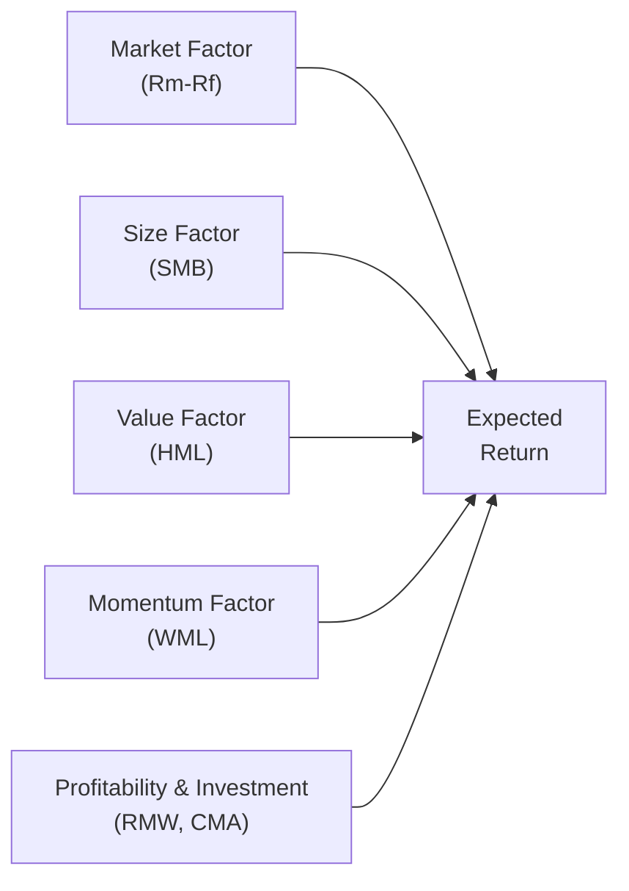

## Introduction

Let's face it: we all started out thinking the Capital Asset Pricing Model (CAPM) was the final word in explaining investment returns—like some magic formula revealing the one factor (market risk) behind everything. I still remember the first time someone hinted, “Hey, there might be additional factors out there.” I was like, “Um... wait, more factors?” But sure enough, researchers observed systematic patterns that CAPM alone couldn't fully explain. That’s how multi-factor models entered the scene—kind of like a new band member joining a one-person show.

The big idea is that CAPM gives us a start by linking expected returns to market-wide risk, but real-world data shows that other “styles” or characteristics consistently affect prices, such as a company’s size or how cheaply it’s valued by the market. Over time, academics and practitioners introduced new factors (value, size, momentum, and so forth) to get a more accurate handle on expected returns. In this reading, we’ll break down the key multi-factor frameworks—especially the Fama-French and Carhart models—and discuss how they shape the way we build portfolios and manage risk. 

## From CAPM to Multiple Factors

The traditional CAPM states:


E[R_i] = R_f + \beta_{i, \text{Market}}\bigl(E[R_{\text{Market}}] - R_f\bigr),


where:
- \\(E[R_i]\\) is the expected return on asset \\(i\\),
- \\(R_f\\) is the risk-free rate,
- \\(E[R_{\text{Market}}]\\) is the expected market return,
- \\(\beta_{i, \text{Market}}\\) is the sensitivity of asset \\(i\\)’s excess return to the market’s excess return.

The intellectual leap in multi-factor models is that there’s more than just the market factor. Here’s a general expression for a multi-factor model:


E[R_i] = R_f 
         + \beta_{i, \text{MKT}}\bigl(E[R_{\text{Market}}] - R_f\bigr)
         + \beta_{i,1} \times \text{Factor}_1
         + \beta_{i,2} \times \text{Factor}_2
         + \dots
         + \epsilon_i.


In the simplest sense, each factor (e.g., size or value) attempts to capture a different dimension of risk (or sometimes, a behavioral anomaly) that can help explain cross-sectional returns.

## The Fama-French 3-Factor Model

If CAPM was the opener, Fama-French’s 3-Factor Model is the main act that brought the house down. Eugene Fama and Kenneth French introduced two additional factors in addition to the market:

1. SMB (Small Minus Big): This factor captures the idea that small-cap stocks, on average, outperform large-cap stocks.
2. HML (High Minus Low): This factor captures the “value effect,” where companies with high book-to-market ratios (value stocks) often outperform those with low book-to-market ratios (growth stocks).

Mathematically, the Fama-French 3-Factor Model can be written as:


E[R_i] = R_f 
         + \beta_{i,\text{MKT}} \bigl(E[R_{\text{Market}}] - R_f\bigr)
         + \beta_{i,\text{SMB}}(\text{SMB})
         + \beta_{i,\text{HML}}(\text{HML}).


Where each \\(\beta\\) measures sensitivity of the asset’s return to that factor.

### Behavioral and Risk-Based Explanations

• Behavioral Explanation: Investors might systematically misprice small-cap or value stocks due to overconfidence, anchoring, or other biases, driving consistent performance patterns.  
• Risk-Based Explanation: Small-cap and value stocks might inherently be riskier (e.g., more prone to economic distress, less stable earnings), and that higher risk justifies a higher return.

## The Carhart 4-Factor Model

Momentum’s that extra spice. Mark Carhart added it to the 3-Factor Model, creating a 4-Factor framework:

1. Market Risk Factor (same as CAPM)
2. SMB (size)
3. HML (value)
4. WML (winners minus losers): The momentum factor, which tracks the tendency for stocks that have performed well recently to keep doing well, and vice versa.

So the Carhart 4-Factor Model looks like:


E[R_i] = R_f 
         + \beta_{i,\text{MKT}} \bigl(E[R_{\text{Market}}] - R_f\bigr)
         + \beta_{i,\text{SMB}}(\text{SMB})
         + \beta_{i,\text{HML}}(\text{HML})
         + \beta_{i,\text{MOM}}(\text{WML}).


You might be wondering: “Why does momentum persist if it’s so obvious?” The short answer is that some argue it’s a risk factor for short-run reversals; others say it’s a behavioral quirk (investors chase winners and dump losers). In practice, momentum-based strategies have generated historically strong returns, though they can be volatile.

## The Fama-French 5-Factor Model

As if three factors weren’t enough, Fama and French later expanded their model to five factors. In addition to market, SMB, and HML, they introduced:

1. RMW (Robust Minus Weak): A profitability factor—firms with robust (high) operating profitability tend to outperform those with weak (low) profitability.  
2. CMA (Conservative Minus Aggressive): An investment factor—firms that invest conservatively (e.g., lower capital expenditures relative to total assets) often outperform more aggressive companies.


E[R_i] = R_f 
         + \beta_{i,\text{MKT}} \bigl(E[R_{\text{Market}}] - R_f\bigr)
         + \beta_{i,\text{SMB}}(\text{SMB})
         + \beta_{i,\text{HML}}(\text{HML})
         + \beta_{i,\text{RMW}}(\text{RMW})
         + \beta_{i,\text{CMA}}(\text{CMA}).


Some practitioners also label “quality” as an umbrella for factors like profitability and low leverage. It’s a nod to the notion that strong fundamentals might generate a risk premium (or exploit some market inefficiency).

## Visualizing Multi-Factor Models

Below is a simple Mermaid flowchart showing how these factors might flow into expected return:

Each node on the left represents a different risk factor or style tilt that can influence the overall expected return of a portfolio or an individual asset. 

## Practical Use in Portfolio Construction

So, how do we actually leverage this? Well, multi-factor investing often pops up in:

• Factor-Tilted Portfolios: You might overweight cheaper (value) or smaller (size) stocks if your research suggests they’ll outperform.  
• Risk Management: Factor exposures help identify hidden risks. For example, if you have a heavy load on small-cap, you know that a certain macro downturn could hit you harder.  
• Performance Attribution: If your portfolio is outperforming, you can see whether it’s because of factor exposures (like overweighting momentum stocks).  

### Hedging Specific Risks

Let’s say you’re worried your portfolio is overly exposed to momentum. You might short a momentum-based ETF or use derivatives tied to momentum factors. This approach targets the factor directly, helping mitigate the risk without dismantling the entire portfolio.

## Factor Model Design and Validation

One subtlety is that the “size” factor isn’t just any old measurement of big vs. small. Implementation can vary: different indices, weighting methods, or monthly vs. quarterly rebalancing. So robust factor definitions are key to ensuring consistency over time.

Data cleanliness and look-ahead bias present other challenges. If your data is incomplete or inadvertently includes “future knowledge,” your factor strategies can appear far more successful than they actually are in real life. Also, factors evolve, and something that worked marvelously in the 1980s might not hold up quite so well in 2025. Ongoing validation is crucial.

## Common Pitfalls and Evolving Conditions

• Overfitting: Researchers sometimes “data mine”—testing numerous factors until something works historically. Those factors might not pass the test in future markets.  
• Crowding: Imagine if half the investment world chases the same factor. That factor’s alpha might get arbitraged away or become extremely volatile during sell-offs.  
• Regime Shifts: Macro conditions (interest rates, consumer sentiment) or technological changes can alter the relevance of certain factors. 

## Personal Perspective

In my early days as an analyst, I attempted to build a “quick” multi-factor regression in a spreadsheet. Spoiler alert: the data cleaning took me ages, plus I had to interpret a bunch of weird correlation structures among the factors. I learned that implementing factor models is kinda like baking—one misstep (like mixing up the factor definitions or ignoring data lags) can ruin the recipe. But wow, when it’s right, it can really help you see the underlying drivers of portfolio returns in a new light.

## Exam and Real-World Relevance

For CFA exam purposes, you should understand how to interpret factor exposures and how changes in factor loadings influence portfolio outcomes. Sketching out the high-level logic (e.g., “If \\(\beta_{i,\text{HML}}\\) is positive, the stock is more sensitive to the value factor”) helps a ton when tackling item sets or essay questions. In the real world, multi-factor models are central to smart beta funds, factor ETFs, and advanced portfolio optimization techniques.

## Glossary

• **Multi-Factor Model:** An asset pricing approach extending beyond the single-market factor of CAPM, incorporating multiple risk or style dimensions.  
• **Fama-French Factors:** Commonly size (SMB: small minus big) and value (HML: high minus low book-to-market), expanded to include profitability (RMW) and investment (CMA).  
• **Momentum Factor (WML):** “Winners minus losers”—the pattern that recent outperforming stocks often keep outperforming for a while.  
• **Quality Factor:** Frequently related to profitability, strong balance sheets, or stable earnings—sometimes called a “defensive” factor.

## References & Further Reading

- Fama, E. F., & French, K. R. (2015). “A Five-Factor Asset Pricing Model.” Journal of Financial Economics.  
- Carhart, M. M. (1997). “On Persistence in Mutual Fund Performance.” The Journal of Finance.  
- CFA Institute. (2025). “CFA® Program Curriculum, Level I, Volume 9: Portfolio Management.”   
- For deeper dives, check out academic websites like Kenneth French’s data library (Dartmouth) or third-party research from major asset managers that publish updated factor definitions. 

## Test Your Knowledge of Multi-Factor Models



### Which of the following factors capture the value premium in the Fama-French 3-Factor Model?

- [ ] SMB (small minus big)
- [ ] RMW (robust minus weak)
- [x] HML (high minus low)
- [ ] CMA (conservative minus aggressive)

> **Explanation:** HML (high minus low book-to-market) captures the value effect in the Fama-French 3-Factor Model. SMB addresses size, while RMW and CMA come from the 5-Factor expansion.

### In the Carhart 4-Factor Model, which factor is specifically added to the Fama-French 3-Factor Model?

- [ ] Quality factor
- [ ] Liquidity factor
- [ ] Volatility factor
- [x] Momentum factor

> **Explanation:** Mark Carhart introduced momentum (often called WML: winners minus losers) as the fourth factor.

### One risk-based narrative for the size premium suggests:

- [x] Small-cap stocks are riskier and therefore command higher returns.
- [ ] Small-cap stocks are generally safer and attract a lower cost of capital.
- [ ] Large-cap stocks consistently show higher returns than small-caps.
- [ ] The size factor is primarily driven by short-term market sentiment.

> **Explanation:** A common risk-based argument is that smaller firms face higher operating risk, which justifies higher expected returns.

### How can factor models assist in portfolio risk management?

- [x] By identifying and quantifying exposures to various systematic risks.
- [ ] By guaranteeing outperformance regardless of market cycles.
- [ ] By eliminating all idiosyncratic stock-level risk.
- [ ] By removing the need for diversification entirely.

> **Explanation:** Factor models help measure and manage the portfolio’s sensitivity to specific factors like size, value, or momentum, thereby guiding better risk control practices.

### Which statement best describes the Carhart momentum factor (WML)?

- [x] It’s based on the idea that stocks with recent positive performance tend to keep outperforming in the near term.
- [ ] It explains only long-term (10+-year) performance patterns.
- [x] It’s partially attributed to investors chasing winners and selling losers.
- [ ] It solely measures a stock's liquidity premium.

> **Explanation:** Momentum factors focus on short- to medium-term trends (6–12 months). Behavioral biases frequently drive this effect, though some argue there’s a risk-based rationale.

### What is a potential drawback of adding many factors to a model?

- [x] Overfitting historical data and discovering spurious relationships.
- [ ] Automatically improving the accuracy of the model in all conditions.
- [ ] Making the model simpler to interpret.
- [ ] Guaranteeing factor premiums indefinitely.

> **Explanation:** More factors can lead to complexity and the temptation to data-mine. Validation is crucial to avoid overfitted models that fail in new market conditions.

### If your portfolio shows a significant negative loading on HML, it indicates:

- [x] Overexposure to growth stocks relative to value stocks.
- [ ] A premium for small-cap stocks.
- [x] Underweight in value stocks.
- [ ] A consistent overweight in small-cap stocks.

> **Explanation:** A negative beta on HML means the portfolio moves inversely to the value factor, suggesting a tilt toward growth-oriented firms rather than value.

### How do factor tilts help tailor a portfolio?

- [x] They allow investors to systematically overweight or underweight exposures to certain characteristics, like value or momentum.
- [ ] They ensure portfolios never deviate from market exposure.
- [ ] They eliminate all idiosyncratic risk.
- [ ] They lock in guaranteed outperformance versus the market.

> **Explanation:** Factor tilts are strategic shifts away from market weights towards or away from the chosen factor exposure.

### Which of the following is typically included in the Fama-French 5-Factor Model, beyond market, SMB, and HML?

- [x] Profitability (RMW)
- [ ] Volatility factor
- [ ] WML (Momentum)
- [ ] CSR factor

> **Explanation:** The 5-Factor Model adds RMW (profitability) and CMA (investment) to the original 3-Factor Model.

### True or False: Factor investing is immune to market regime shifts and economic cycles.

- [x] False
- [ ] True

> **Explanation:** Factors can experience periods of underperformance, especially when market regimes and economic conditions change.  


