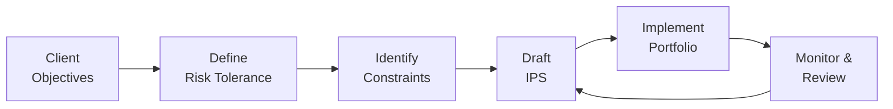

### Introduction and Context
Imagine you’re meeting a new client—maybe it’s an institution, maybe it’s a busy professional—and they lay out all their hopes, dreams, and concerns for how money should be managed. The conversation might go every which way, but at some point, you and the client (or the investment committee) need something concrete—a guiding document that captures the essence of what must be done. That’s where an Investment Policy Statement (IPS) enters the scene. It’s not just a bureaucratic requirement. Honestly, I’ve found it’s almost like the “relationship contract” that keeps everything on the rails. If markets go haywire, or if we suddenly discover a need for cash, the IPS is there in black and white, showing exactly how to respond.

An IPS helps ensure that the portfolio aligns with the investor’s long-term objectives and constraints, acting as a guardrail when emotions might tempt us to yank everything out of the market at the worst possible time. In some ways, it’s the bedrock of prudent investing.

### Why an IPS Matters
At its core, an IPS is a formal, written document that provides structure and guidance. A couple of your friends might say, “It’s for compliance,” or “It’s just stuffy paperwork,” but if you ask me, it’s so much more. Specifically, an IPS:

- Sets out clear guidelines on risk tolerance, return objectives, and constraints.  
- Serves as a benchmark for monitoring performance and compliance.  
- Establishes accountability between the client and the portfolio manager.  
- Fosters consistent decision-making by minimizing overreactions when markets shift.  

This approach is also deeply linked to ethics—some practitioners cite the CFA Institute’s standards requiring clarity, disclosure, and a structured approach. Indeed, it’s not just a best practice: it’s integral to professional conduct.

### Key Purposes of an IPS
Below are several fundamental purposes, each of which ties back to creating a more transparent and disciplined investment process.

#### 1. Clear Guidelines and Expectations
You might wonder: “How do we avoid surprises?” The IPS addresses that right away. By defining the roles and responsibilities of each party, it instantly sheds light on who does what. For example:

- The client or investment committee clarifies the end goals and constraints.  
- The portfolio manager commits to a specific investment approach and risk framework.  
- Traders and custodians adhere to the guidelines on execution, reporting, and settlement.

The IPS effectively acts as the shared reference point.

#### 2. Defining Risk Tolerance and Return Objectives
Risk tolerance refers to the amount of volatility or potential loss you’re willing (and able) to endure. Meanwhile, return objectives outline what you intend to achieve—maybe it’s beating an index, or maybe it’s achieving a certain absolute performance target like 6% annualized.

Mathematically, you might capture an expected return as:


\text{Expected Return} = \sum_{i=1}^n w_i \times E(R_i),


where \\(w_i\\) is the weight of each asset in the portfolio, and \\(E(R_i)\\) is the expected return for that asset. While the IPS might not detail every formula, understanding how target returns align with constraints is essential. For instance, if a client wants a 10% return but can’t stomach a drawdown of more than 5%, well, that’s a conflict that the IPS must highlight and reconcile.

#### 3. Establishing Constraints and Unique Requirements
Constraints vary widely. Sometimes we have legal restrictions, sometimes we have tax considerations, and sometimes there’s a philanthropic objective—like ensuring a certain fraction of the portfolio aligns with socially responsible investing (ESG). If the client invests on behalf of a pension plan, liability management might be at the forefront. In other words, the IPS enumerates each factor:

- Liquidity needs (e.g., how much cash you need on hand for near-term spending)  
- Time horizon (short time frames vs. decades of compounding)  
- Tax considerations (particularly relevant for high-net-worth individuals or certain corporations)  
- Legal restrictions (especially for foundations or pension plans)  
- ESG preferences (growing in popularity among both individual and institutional investors)

When the IPS spells these out, it keeps everyone from drifting into areas that are off-limits.

#### 4. Benchmarking and Performance Evaluation
The IPS can’t flourish without a benchmark—it’s like playing a sport without keeping score. Just as a runner might compare their sprint time against a record, a portfolio manager should compare returns (and risk) against a relevant market index or a composite measure.

- For equities, maybe the S&P 500 or a global index.  
- For fixed income, frequently the Bloomberg Barclays Aggregate Bond Index.  
- For a multi-asset portfolio, a blended benchmark might reflect the weightings in the strategic asset allocation.

The IPS enumerates which index or combination of indices will be used to judge performance. That ensures everyone, from the client to the manager, can quickly see if we’re meeting or lagging behind the goals.

#### 5. Accountability and Alignment
The explicit guidelines in an IPS make it easier to see whether a manager’s decisions remain consistent with the client’s objectives. If the client is extremely conservative and the manager invests aggressively, the IPS highlights that mismatch. Likewise, if the manager is overly timid and the client expects higher returns, the manager’s performance shortfall is evident.

#### 6. Mitigating Emotional Decisions
Markets can be, um, pretty rocky. If you recall periods like the 2008 financial crisis or extreme market volatility in recent years, you’ll know that fear and greed can push investors to wild decisions. The IPS is there like a calm friend reminding you: “Hey, we agreed to stay in this for the long haul. Are you sure you want to exit now?” By formalizing a plan, you reduce the chance of drastic moves triggered by panic.

### Core Components of an IPS
An effective IPS generally includes the following sections:

#### Investment Objectives
A concise statement of what the portfolio is supposed to do. Is it capital preservation? Growth? Generating income? Often we see something like, “Achieve long-term total returns in excess of 5% annually while maintaining a moderate level of volatility.”

#### Risk Tolerance
A clear articulation of risk preferences—both willingness (psychological comfort) and ability (financial capacity). Institutions might have different thresholds, such as “annual drawdown must not exceed 15%,” or “volatility must stay within a band around the benchmark.”

#### Asset Allocation Strategy
Broadly indicates the permitted asset classes (e.g., domestic equities, international equities, government bonds, corporate bonds, alternatives). It also addresses approximate target weightings and permissible ranges (e.g., 45–55% in equities if the neutral blend is 50%).

#### Portfolio Constraints
This part details constraints around liquidity, time horizon, taxes, legal factors, and unique circumstances. For instance, an endowment might have a perpetual horizon, but also an annual spending requirement. Or a retiree might have a very short horizon and need a stable capital base.

#### Performance Benchmarks
Specifies relevant indices or blended benchmarks for each asset class. Alternatively, it might define a custom benchmark to match the targets defined in the asset allocation plan.

#### Roles and Responsibilities
Often the IPS spells out who does what: The portfolio manager’s role, the client’s role, the investment committee’s role, and even the consultant’s role, if applicable.

#### Portfolio Rebalancing Policies
Indicates how often the portfolio is rebalanced and under what conditions. Some IPSs direct rebalancing only if assets deviate more than, say, 5% from their targets. Others prefer a calendar-based approach (quarterly, semi-annually, or annually).

#### Reporting and Communication Standards
Describes the frequency and format of reports the client will receive—maybe monthly statements, quarterly performance summaries, and an in-person annual review.

#### Review Process
Clarifies how often the IPS is revisited, who can revise it, and under what circumstances.

### IPS in Action: A Small Flowchart
To get a bird’s-eye view, here’s a simple (and hopefully helpful) diagram illustrating how the IPS process generally fits into portfolio management:

The process loops back as we reassess objectives, constraints, and real-world changes.

### Real-World Anecdote: The Risk of Avoiding an IPS
I once encountered an investor who felt an IPS was a “waste of time.” They just wanted to invest quickly in “whatever was hot.” When the market swerved, they panicked, sold at a steep loss, and re-entered at a higher level later, compounding the damage. In that conversation afterward, they admitted: “Maybe I should’ve had a stronger plan.” An IPS can’t guarantee profits, but it can reduce the odds of making haphazard decisions.

### Reviewing and Revising the IPS
Clients’ circumstances evolve—someone might get married, start a business, or experience changes in health. Market conditions evolve too—interest rates, inflation, regulatory frameworks. So, the IPS isn’t a set-it-and-forget-it deal. You revisit it periodically, typically at least annually or after any material life event or market shock. This ensures the portfolio remains aligned with the investor’s real needs.

### Communication and the IPS
At the risk of overstating the obvious, the IPS is also about dialogue. Both the advisor and the client need to understand exactly what the instructions (and their rationale) are. You might hold formal quarterly or annual meetings. Or, if the client’s preference is frequent check-ins, you might have shorter monthly calls. In all these interactions, the IPS serves as your mutual point of reference.

### Connections to Other Topics
While we’re focusing right now on “4.1 The Investment Policy Statement (IPS),” remember that an IPS forms the launchpad for many other chapters in this book:

- “4.2 Risk and Return Objectives” delves deeper into setting the precise risk and return parameters that go right into the IPS.  
- “4.3 Liquidity, Time Horizon, Taxes, Legal, and Unique Constraints” elaborates how each of these constraints shapes the final policy statement.  
- “4.5 Tactical Allocation and Rebalancing Approaches” provides the nuts and bolts for how rebalancing instructions in the IPS might be implemented in real markets.  
- “5.1 Introduction to Behavioral Finance” underscores how emotion can derail investment plans—one reason the IPS is so crucial for discipline.

The synergy between these chapters ensures that by the time you finish Volume 9, you’ll see how everything—risk, return, constraints, and governance—ties together in building robust portfolios.

### Best Practices and Common Pitfalls
Investment managers and advisors should keep in mind a few best practices and watch out for familiar stumbling points:

**Best Practices:**
- Collaborate closely with the client to clarify every nuance: risk preferences, time horizons, and constraints.  
- Keep the language in the IPS concise but unambiguous.  
- Bake in disclaimers on expected volatility and possible downside scenarios so the client’s eyes stay wide open.  
- Schedule routine check-ups—even if everything is going smoothly—to see if any part of the IPS needs tweaking.

**Common Pitfalls:**
- Overlooking the client’s psychological comfort level.  
- Writing an IPS in overly generic or boilerplate terms, ignoring real needs.  
- Letting the IPS gather dust on a shelf, never revisiting or updating it.  
- Failing to specify clear benchmarks, leaving future performance disputes unresolved.

### Practical Example: Institutional vs. Individual IPS
A university endowment typically has a long horizon (maybe even perpetuity) and a moderate risk tolerance because it needs stable returns to fund scholarships but also aims for growth. It might specify a 5% spending rate each year, so liquidity needs are relatively predictable. The IPS for such an institution might emphasize preserving capital in real terms (inflation-adjusted) over the long term.

Contrast that with an individual retiree who might need monthly withdrawals to pay living expenses, likely has a shorter time horizon than an endowment, and might be more averse to losses. Their IPS might emphasize lower-volatility instruments, a strong focus on capital preservation, and a clearly defined rebalancing strategy to ensure no single equity sector grows too large.

### Final Thoughts and Exam Tips
An IPS is the foundation on which portfolio construction rests—both in practice and in your CFA studies. For the exam, be prepared to:

- Identify each major component of the IPS and discuss its purpose.  
- Illustrate how risk tolerance, return objectives, and constraints interplay to shape policies.  
- Evaluate hypothetical client situations and propose suitable IPS guidelines.  
- Understand how an IPS reduces behavioral missteps and fosters long-term strategy alignment.

When tackling exam questions, watch for the subtle interplay between willingness and ability to take risk—if a question scenario highlights high net worth but a risk-averse temperament, the IPS must reflect that discrepancy. Also, be ready to critique an IPS that lacks clarity on benchmarks or rebalancing rules.

### References
- CFA Institute. (2020). CFA Program Curriculum, Level I.  
- Swensen, D. F. (2009). Pioneering Portfolio Management. Free Press.  
- Fabozzi, F. J. (2007). Portfolio Management: Theory and Practice. Wiley.

---

## Test Your Knowledge: The Investment Policy Statement (IPS) – Purpose and Components



### Which of the following best describes one of the key benefits of an IPS?

- [ ] It guarantees a minimum return on the portfolio.  
- [x] It acts as a guiding document to prevent impulsive investment decisions.  
- [ ] It provides a legal replacement for an investment manager.  
- [ ] It removes the need for periodic performance monitoring.  

> **Explanation:** The IPS is a reference point that guides and disciplines investment behavior. It cannot guarantee returns nor replace the need for performance reviews and professional management.

### Which of the following IPS components specifically outlines when and how assets should be realigned to target allocations?

- [x] Rebalancing policy.  
- [ ] Investment objectives.  
- [ ] Roles and responsibilities.  
- [ ] Risk tolerance statement.  

> **Explanation:** The IPS rebalancing policy clearly specifies thresholds or timelines for returning asset allocations to their target weights. Investment objectives, roles, and risk tolerance are parallel but separate components.

### An investor who demands a 10% annual return yet insists on minimal volatility most clearly demonstrates a conflict in which IPS section?

- [ ] Time horizon  
- [x] Risk tolerance vs. return objective  
- [ ] Liquidity constraints  
- [ ] Reporting requirements  

> **Explanation:** If someone desires a high return while refusing to accept higher risk, there’s a direct conflict between the stated return objective and the risk tolerance, a fundamental IPS mismatch.

### What is a primary reason for specifying benchmarks in an IPS?

- [ ] To limit the range of permissible assets.  
- [x] To measure portfolio performance against a standard.  
- [ ] To eliminate the possibility of underperformance.  
- [ ] To allow managers to deviate freely from policy allocations.  

> **Explanation:** Benchmarks serve as measuring sticks, enabling investors and managers to compare actual results with a predetermined standard or index.

### Which of the following constraints is most likely to be emphasized for a retiree dependent on portfolio withdrawals for living expenses?

- [x] Liquidity needs  
- [ ] Growth focus  
- [x] Time horizon constraints  
- [ ] Aggressive leverage usage  

> **Explanation:** A retiree’s portfolio should consider high liquidity requirements (to meet living expenses) and a possibly shorter time horizon. Aggressive growth or high leverage is typically at odds with these needs.

### Which of the following scenarios most strongly suggests the need for an immediate IPS review?

- [x] A major change in the client’s financial circumstances (e.g., inheritance, job loss).  
- [ ] Routine monthly fluctuation in equity markets.  
- [ ] Annual inflation rate ticking up by 0.1%.  
- [ ] A manager’s personal opinions regarding market direction.  

> **Explanation:** Significant changes in a client’s situation warrant a thorough IPS reassessment to ensure the objectives and constraints remain relevant.

### Within an IPS, which statement most accurately describes the role of “roles and responsibilities”?

- [x] Identifies who makes decisions, who executes trades, and how often communication occurs.  
- [ ] Specifies the exact tax rates needed for portfolio calculations.  
- [x] Ensures only the custodian can alter strategic asset allocations.  
- [ ] Defines each asset class benchmark without describing management accountability.  

> **Explanation:** Clarifying roles and responsibilities ensures clear accountability and process ownership, describing who manages, who executes, and how communication is handled.

### Which of the following statements about an IPS is most accurate?

- [x] It is a living document and should be updated as client or market circumstances change.  
- [ ] Once finalized, it remains static to preserve historical perspective.  
- [ ] It is rarely revised unless there is a regulatory requirement to do so.  
- [ ] It must be entirely rewritten after each rebalancing event.  

> **Explanation:** An IPS is dynamic, subject to revision any time significant changes occur in the client’s objectives, constraints, or market environment.

### What is a key advantage of having clear ESG preferences stated in the IPS?

- [x] Ensures alignment of portfolio investments with the client’s ethical views.  
- [ ] Completely shields the client from market volatility.  
- [ ] Guarantees outperformance relative to non-ESG portfolios.  
- [ ] Eliminates the need for rebalancing.  

> **Explanation:** By clearly stating ESG preferences, managers can screen, select, or exclude specific investments in line with the client’s ethical or environmental values. It does not reduce volatility or guarantee superior returns.

### True or False: The IPS can often help prevent emotionally driven decisions during periods of market turbulence.

- [x] True  
- [ ] False  

> **Explanation:** One of the core reasons for drafting and adhering to an IPS is to maintain discipline despite shifting market conditions, thus helping investors avoid decisions driven purely by emotion.


