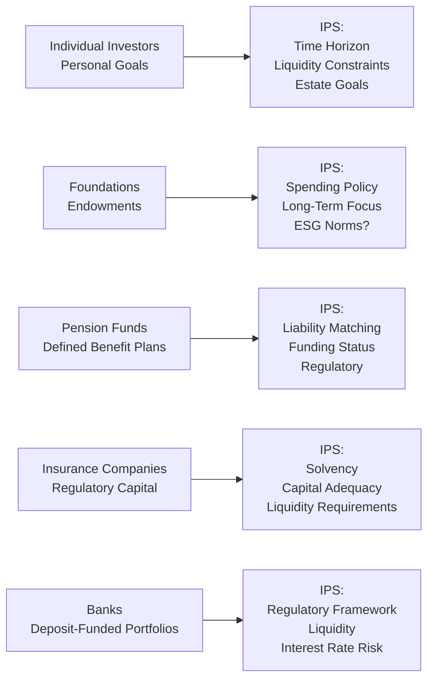
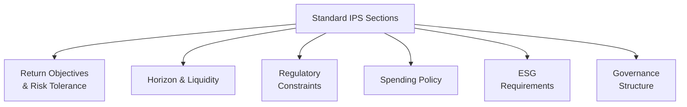

In Chapter 4.1, we explored the fundamental components of an Investment Policy Statement (IPS). But you know, in real life, no single IPS template fits every kind of investor. If you think about it, would you structure an IPS for a large insurance company the same way as for an individual who's just retired and wants to live near the beach? Probably not. Each type of investor—individuals, foundations, endowments, pension funds, insurance companies, and banks—has unique objectives, regulatory environments, spending needs, and risk tolerances, so every IPS must be custom-fitted.

Below, we’ll explore how to tailor an IPS for these different investor types, weaving in some personal stories, real-world examples, and a few rhetorical questions. You’ll also see references to earlier chapters of this book (e.g., Chapter 2 on risk and return fundamentals, or Chapter 4.2 on risk and return objectives), so flip back as needed. And by the way, if you feel certain details don’t apply to your personal scenario—maybe you’re not running a pension fund in your spare time—feel free to skim that section. But the big lesson is that the core IPS framework adapts to suit a wide variety of circumstances.

## Why Tailoring Matters

One day, I was sitting in a meeting with a philanthropic foundation. They had this strong desire to invest in a way that promoted community development, but they also needed consistent cash flows to fund annual grants for underprivileged students. The standard template they pulled from a random investing website? It just didn’t address half of their real concerns. We had to tweak the objectives, constraints, and governance language to reflect their mission. That is the essence of tailoring—accommodating each investor’s specific constraints and preferences while still covering universal IPS elements: return objectives, risk tolerance, liquidity, time horizon, tax considerations, and more.

Below is a high-level diagram showing different investor types and how each might prioritize certain IPS elements:

Notice how each node highlights distinct areas of emphasis. Let’s talk about each in more detail.

## Individual Investors

Individual investors can be some of the trickiest clients to write an IPS for, because their constraints and goals tend to be very personal—and often, well, emotional. In fact, Chapter 5 (Behavioral Biases of Individuals) underscores that personal biases, like loss aversion or overconfidence, can dramatically shape portfolio decisions.

Some key considerations:
• Time horizon: Ranges from short-term goals (e.g., saving for a house down payment in a couple of years) to very long-term (e.g., retirement or legacy goals).  
• Liquidity needs: Paying for children’s education, vacation homes, or unexpected medical bills.  
• Risk tolerance and capacity: Individual psychology matters; some fear market swings, others revel in them.  
• Estate planning: Desire to pass wealth to heirs or philanthropic causes might influence the portfolio’s structure, such as setting aside funds in a trust or adopting a tax-efficient location for assets.  
• Taxes: Depending on local tax laws, individuals might need to hold more tax-favored investments, like municipal bonds or historically tax-efficient vehicles, such as index funds or exchange-traded funds (ETFs).  

For instance, someone nearing retirement might have less ability to take risk (lower risk capacity) because market losses could jeopardize their standard of living. On the other hand, a young professional with stable income might have a high capacity to take risk but a low willingness (i.e., psychological aversion). The IPS for these individuals should carefully detail how to reconcile these two dimensions of risk—capacity and willingness.

### Practical Example for an Individual IPS

Let’s say you have an investor, age 40, expecting to retire at 65, with $1 million in investable assets. They want to grow the portfolio to about $3 million in 25 years to ensure a comfortable retirement. Their annual savings are $20,000, and they own a home with moderate mortgage debt. The IPS might specify:

• A strategic allocation of 70% equities, 25% fixed income, and 5% cash or equivalents.  
• A maximum drawdown threshold the investor can psychologically bear (e.g., 20% in any given year).  
• A requirement to rebalance once per year or if any asset class deviates more than ±5% from its target.  
• Tax-efficiency guidelines (e.g., certain investments in tax-sheltered retirement accounts, municipal bonds in taxable accounts).  

## Foundations and Endowments

Foundations and endowments are often described as perpetual investors. They typically have very long time horizons—sometimes indefinite—and aim to preserve purchasing power while sustaining annual spending (or grant-making). My personal anecdote here: I once chatted with a friend who worked at a small endowment. They were trying to keep distributions stable, but the inflation rate was eating away at their returns. Preserving purchasing power was paramount in that scenario, so they had to favor real-return-oriented assets (e.g., equities, inflation-protected securities) over nominal bonds.

Key traits:
• Spending policy: The board might set a rate of 4–5% of the endowment’s average trailing market value every year.  
• Risk tolerance: Usually moderate to high, given the perpetual horizon. However, a severe drawdown can hamper near-term spending goals.  
• ESG integration: Many endowments represent universities, faith-based organizations, or philanthropic entities that might emphasize environmental, social, and governance (ESG) factors.  
• Liquidity: Although the horizon is typically long, endowments need enough liquidity for annual grants without liquidating illiquid assets at an inopportune time.  

### Spending Policy Example

A foundation that aims to distribute 5% of its trailing three-year average asset value to support annual grants will highlight in its IPS that the expected return target must exceed 5% plus inflation plus fees to maintain real principal value. If inflation runs around 2–3% and fees are about 1%, then the foundation is effectively aiming for 8–9% nominal returns. This might lead to a higher allocation to growth-oriented assets (like equities and alternative investments) in the portfolio, balanced by prudent risk controls to avoid compromising current-year or near-future spending.

## Pension Funds

Pension funds (particularly defined benefit plans) center on one major objective: meeting liabilities. If you have 2,000 employees counting on a stable retirement income, you definitely can’t experiment with super-risky strategies that might jeopardize those promised benefits. The major difference from an endowment is that the time horizon is shaped by the plan’s demographics, mortality rates, and hopefully the replacement cycle of new participants.

Key considerations:
• Liability-driven investing (LDI): The assets should match or exceed the projected liabilities. This might involve immunizing future payouts with long-duration bonds or derivatives that track the liability structure.  
• Funding status: Underfunded plans might have to adopt more aggressive strategies (with caution) to close the funding gap, while well-funded plans have more flexibility.  
• Regulatory environment: Governments often impose strict guidelines (e.g., maximum investment in certain asset classes, or required discount rates).  
• Risk management: Market volatility is a big concern since it can directly impact the funding ratio.  

### Simple Numeric Example

Imagine a pension fund has an actuarial present value of liabilities equal to $500 million and assets worth $450 million. The plan is 90% funded. The actuarial discount rate for liabilities is 6%, and the plan’s managers feel they need at least 7% from assets over the long term to reach full funding in 10 years. The resulting IPS might:

• Incorporate 60% in equities (domestic and global), 35% in fixed income with durations matching main liabilities, and 5% in alternatives to capture additional returns.  
• Include a liability hedge portfolio, where interest rate swaps or long-term bonds help match the duration of future payouts.  
• Set a tolerance band for the funded ratio, with triggers for risk mitigation strategies (like shifting from equities to bonds if the funded ratio hits 105%).

You’ll see more about liability-driven investing techniques in other sections of Chapter 4 (especially 4.7 on Liability-Driven Investing and Pension Portfolios).

## Insurance Companies

Insurance portfolios don’t just exist to grow returns; they back specific policy liabilities that can stretch out for decades (think of long-term life insurance) or be relatively short-term (as with auto and property claims). The big theme: solvency. Insurers must meet regulator-imposed capital requirements, maintain adequate liquidity, and handle the mismatch between premium inflows and claim outflows.

Key factors:
• Regulatory capital and rating targets: Maintaining a certain credit rating can be crucial for business.  
• Asset-liability matching: Similar to pension funds, but claims can be more random, and lines of business differ greatly (life vs. property & casualty vs. health).  
• Liquidity: Enough liquid assets to cover large-scale claims—especially relevant for catastrophes (e.g., hurricanes, floods).  
• Investment constraints: Depending on the jurisdiction, there might be limits on certain asset classes.  

A typical IPS for an insurance company might specify a core bond portfolio that matches liability durations, with a smaller slice of equity or alternative investments for yield enhancement, subject to strict capital requirements. Some advanced techniques (e.g., replicating portfolios with derivatives, interest rate hedges) can reduce solvency risk. That said, insurers who want a bit more yield might incorporate structured products, though they’ll typically face higher regulatory scrutiny.

## Banks

Banks manage massive deposit-funded portfolios, so liquidity becomes the name of the game. Considering that depositors can withdraw funds at any time (overnight liquidity), the bank must hold enough highly liquid assets—like government securities or short-term instruments—to cover those obligations. Banks also need to maintain adequate capital ratios set by regulators (Basel III in many jurisdictions).

Key dimensions:
• Interest rate risk management: Banks earn a spread by lending long and borrowing short, so changes in interest rates can wreak havoc on net interest margins.  
• Liquidity coverage ratio (LCR): The bank’s IPS might emphasize stress-testing scenarios where large deposit outflows occur.  
• Capital adequacy: Banks must keep a certain proportion of high-quality liquid assets (HQLA).  
• Regulatory compliance: Strict guidelines on permissible investments, especially if the bank is systemically important.  

## Incorporating Specialized Requirements

Some investors, such as faith-based organizations or mission-driven institutions, include specialized constraints. Maybe they refuse to invest in tobacco, alcohol, or firearms. The IPS must be explicit about these guidelines, including definitions and compliance policies. For example, a faith-based pension plan might include:

• Exclusions: No companies deriving more than 5% of their revenue from tobacco product sales.  
• Positive screening: Actively seeking companies with robust sustainability metrics.  
• Proxy voting policy: Aligning corporate governance votes with the institution’s moral system.  

And yes, these constraints can reduce the investable universe, affect diversification, and possibly shift risk–return trade-offs. It’s essential to address how to handle that: do you accept a potentially lower return, or do you invest in specialized ESG managers who promise to maintain performance while respecting the constraints?

## A Quick Word on Risk Tolerance in Different Types

In Chapter 4.2, we define risk capacity and willingness to take risk. Each investor type has a different interplay of these dimensions:

• Individual: Often, willingness shapes the capacity. They might have plenty of capital but panic after a 10% market dip.  
• Endowment: High capacity due to perpetual horizon but moderate willingness if annual distributions can’t be interrupted.  
• Pension fund: Driven by funded status and strict liability deadlines.  
• Insurance company: Typically moderate capacity but regulated willingness—if you will—and strongly shaped by solvency mandates.  
• Bank: Must stay within regulatory constraints, with a big focus on short-term liquidity risk.  

## Real-World Case Study: Foundation Shifts Asset Allocation

Let’s illustrate how an IPS might actually get revised in real life:

A mid-sized healthcare-related foundation had a portfolio of $100 million. It historically maintained a 60/40 equity-bond split. Over five years, inflation ticked up, the grants expanded (to 5.5% annually from 4.5%), and the foundation began focusing heavily on ESG. The result: the foundation updated its IPS to specify a target of 65% in ESG-screened global equities, 25% in a bond portfolio with a shorter duration, and 10% in direct real estate that aligns with local community revitalization objectives. Additionally, the IPS spelled out that if the portfolio experiences a large drawdown of more than 15%, the spending policy might be temporarily adjusted—reducing grants for a year or two to protect principal. The new IPS balanced the need for higher returns, the introduction of ESG constraints, and the newly increased spending rate.

## Common Pitfalls

• Misalignment between goals and constraints: An IPS that states an 8% annual return target but invests heavily in ultra-conservative assets is unrealistic.  
• Infrequent updates: If the investor’s life circumstances change or if regulators impose new capital requirements, waiting too long to amend the IPS can cause big compliance or financial hits.  
• Overly generic language: Some folks just take a template off the internet. That might be fine for background reading, but it rarely reflects real constraints, especially for specialized or institutional investors.  
• Not addressing liquidity: This is huge for banks, insurance companies, and individuals with near-term cash needs.  
• Ignoring external factors: For example, ignoring ESG or regulatory changes can lead to strategic drift.

## Best Practices

• Periodic review: Many investment committees revisit their IPS annually or after a significant market or regulatory event.  
• Clear governance structure: Create well-defined roles and responsibilities for policy oversight, possibly with a board, investment committee, or external advisors.  
• Stress testing: This is crucial. Pension funds test for low-rate environments, banks test for massive deposit withdrawals, foundations test for equity bear markets—and so on.  
• Integration with chapters from this book: For instance, see Chapter 6 (Introduction to Risk Management) on measuring risk (Value at Risk, scenario analysis) to incorporate advanced risk oversight into your IPS.  
• Transparent reporting: The IPS should specify how performance is measured, reported, and compared to relevant benchmarks.  

## Additional Mermaid Visualization: Key IPS Sections Across Investor Types

Each IPS typically covers these standard areas, but the weight of each will differ by investor category:
• Individual investors might emphasize time horizon and estate planning.  
• Foundations and endowments heavily focus on spending policy.  
• Pension funds and insurance companies hammer on regulatory constraints and liability matching.  
• ESG can appear in any IPS, but it’s especially popular with foundations, endowments, and certain individual investors.

## Closing Thoughts

Tailoring an IPS is all about bringing together the universal components—like risk tolerance, return objectives, and governance—and applying them to each investor’s reality. Sometimes that reality includes heavy regulatory oversight (banks, insurers), while sometimes it’s driven by a philanthropic or personal mission (foundations, individuals). If we ignore the details, we risk building a plan that either fails to achieve long-term goals or violates crucial constraints.

Anyway, it can feel a bit overwhelming at first, but trust me, once you walk through the process a few times, it becomes a systematic approach: gather data, identify constraints, reflect those constraints in the portfolio design, and monitor everything on an ongoing basis. That’s the beauty—and the complexity—of portfolio management.

---

### References

• Brinson, G. P., Hood, L. R., & Beebower, G. L. (1986). Determinants of Portfolio Performance. Financial Analysts Journal.  
• Tepper, I. (1981). Taxation and Corporate Pension Policy. Journal of Finance.  
• “Asset Allocation for Different Institution Types,” CFA Institute published materials.  

---

## Test Your Knowledge: Tailoring IPS for Different Investor Types



### When creating an IPS for an individual investor, which of the following is typically the most significant consideration?

- [ ] Regulatory capital requirements
- [x] Personal liquidity needs and life objectives
- [ ] Minimizing annual spending requirements
- [ ] Achieving the same allocation strategies as a bank

> **Explanation:** Individuals often have very distinct, personal needs such as funding education, retirement, or health care, which greatly influence how their IPS is constructed.

### Which best describes a key priority for endowments and foundations when constructing an IPS?

- [x] Preserving purchasing power while maintaining stable annual spending
- [ ] Maximizing short-term liquidity to handle daily deposit withdrawals
- [ ] Exactly matching liabilities to future beneficiaries
- [ ] Maintaining solvency to meet sudden large claims

> **Explanation:** Endowments and foundations generally have long-term horizons and focus on stable spending, so preserving purchasing power is crucial.

### A major difference between pension funds and endowments in their IPS is most commonly found in:

- [ ] Liquidity needs
- [x] Liability matching requirements
- [ ] Incorporation of ESG factors
- [ ] Inclusion of philanthropic goals

> **Explanation:** Pension funds must consider future liabilities owed to retirees, whereas endowments aim to meet spending needs without strict liability matching.

### Which of the following constraints is generally most central to an insurance company’s IPS?

- [ ] Minimizing personal tax liabilities
- [ ] Achieving perpetual growth over time
- [x] Maintaining regulatory capital and adequate liquidity
- [ ] Ignoring short-term variations in claim payouts

> **Explanation:** Insurance companies are heavily regulated and must hold sufficient capital, ensuring they can meet claims and reserve requirements at all times.

### In what scenario might a bank revise its IPS to favor more floating-rate assets?

- [ ] When inflation is low and stable
- [ ] When depositors have high trust in the bank’s liquidity
- [x] When interest rates are expected to rise significantly
- [ ] When uncertain portfolio returns are required to match future liabilities

> **Explanation:** Banks facing a rising rate environment often prefer floating-rate assets that reset and maintain margins under higher interest rate conditions.

### For a foundation with a 5% spending policy, 2% inflation, and 1% in ongoing fees, what nominal return target is generally required to preserve the real value of principal?

- [ ] 3%
- [ ] 5%
- [x] 8%
- [ ] 10%

> **Explanation:** The foundation needs 5% (spending) + 2% (inflation) + 1% (fees) = 8% nominal to maintain real value.

### An individual who strongly dislikes losses even though they have sufficient net worth and a stable job is exhibiting:

- [x] Low willingness to take risk but high capacity
- [ ] High willingness to take risk and high capacity
- [ ] Low capacity to take risk but high willingness
- [ ] High willingness to take risk but low capacity

> **Explanation:** Despite having the capacity, the individual’s behavioral inclination toward loss aversion leads to a low willingness to accept risk.

### A faith-based organization insisting on no investments in tobacco or firearms is introducing what element into its IPS?

- [ ] Immunization strategies
- [x] Socially responsible (ESG) constraints
- [ ] Duration targeting
- [ ] Liability-driven investing

> **Explanation:** Exclusionary screening forms part of socially responsible or ESG investing guidelines.

### For a pension plan that is 80% funded, which IPS element is most likely to be emphasized?

- [ ] Maintaining extremely low volatility overall
- [ ] Minimizing short-term deposit outflows
- [x] Closing the funding gap through potentially higher-return (but moderate-risk) strategies
- [ ] Achieving perpetual growth and indefinite longevity

> **Explanation:** An underfunded plan typically seeks investments that can help improve the funding ratio to meet future benefit obligations.

### True or False: For banks, the IPS generally places a major focus on achieving long-term capital appreciation regardless of liquidity constraints.

- [ ] True
- [x] False

> **Explanation:** Banks emphasize liquidity and risk management in their IPS to meet withdrawal demands and regulatory capital requirements, rather than solely focusing on long-term growth.


