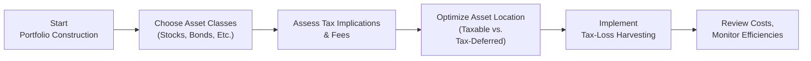

## Introduction

When we talk about portfolio planning, we often focus on big-ticket items like asset allocation, risk tolerance, or market forecasts. Yet, it’s amazing how costs and taxes—tiny percentages here, some incremental fees there—can sneak in and carve away your returns. This section explores the myriad ways in which cost and tax efficiency can bolster a portfolio’s long-term performance.

I’ll never forget the moment a friend asked me, “Hey, does a 1% fee really matter that much?” My immediate thought was: “Um, well, absolutely!” Because that 1% compounds over time, possibly making a huge difference in outcomes. And taxes? That’s another story altogether. When I first started investing, I was shocked to discover how realizing a small capital gain at the wrong time could slash my after-tax returns more dramatically than I expected. A tweak here or there in account structure or asset location might have saved me from that rude awakening.

Below, we’ll examine the major cost drivers in portfolio management, how taxes can shape investment decisions, and ways to plan an allocation that remains both cost-efficient and tax-smart.

## Why Cost Efficiency Matters

Let’s begin by clarifying the types of costs that weigh on your portfolio. Over the long haul, a seemingly modest difference in fees can create surprisingly large disparities in final wealth. This phenomenon is often referred to as the “tyranny of compounding costs,” where fees, fund expense ratios, and trading costs shrink your invested capital incrementally—compounding the impact over time.

To illustrate, suppose an investor places $100,000 in a fund with a 0.25% annual expense ratio, while a second investor chooses a similar fund but at a 1.00% annual expense ratio. Even if both funds produce the same gross returns before fees, the second investor may end up with tens of thousands less in capital over a multi-decade time horizon. So, yeah, that’s definitely not chump change.

### Common Portfolio Costs

• Management Fees or Expense Ratios.  
• Trading Commissions, Bid-Ask Spreads.  
• Administrative Fees (sometimes hidden in certain fund structures).  
• Distributions or other transaction fees (such as short-term redemption fees).

A big question is: Are these costs worth it? If active management consistently beats the benchmark by more than enough to offset higher fees, it may be justifiable. But let’s be honest, that’s a tough hurdle. Passive approaches using low-fee index or ETF structures often provide a solid baseline for minimizing cost drag, especially when active alpha isn’t readily available or consistently achieved.

## Understanding the Tax Landscape

Just when you think you’ve optimized everything, taxes enter the scene. Taxes can significantly diminish your after-tax return through capital gains on sales, taxes on dividends and interest, and potential estate or inheritance taxes. The total picture varies by jurisdiction and investor type, but the main principle remains: reduce unnecessary tax triggers and structure your investments to maximize after-tax returns.

### Key Tax Considerations

• Capital Gains: Long-term vs. short-term holding periods can lead to markedly different tax rates.  
• Dividend and Interest Income: Some investors may prefer qualified dividends or tax-exempt (municipal) bond income, depending on tax brackets.  
• Estate Taxes: High-net-worth individuals often need specialized structures (trusts, for instance) that shape their overall allocation decisions.  
• Tax Drag: The cumulative effect of frequent taxable events can hamper compounding potential.

## Asset Location: Putting Securities Where They Belong

One of the best ways, in my opinion, to enhance tax efficiency is to mindfully place specific investments in the right type of account. This technique, known as “asset location,” involves deciding whether a holding is best placed in a tax-deferred account, tax-free account, or taxable account.

• Tax-Deferred Accounts (e.g., 401(k), Traditional IRA):  
  – Contributions may be tax-deductible, and returns grow tax-free until you take distributions, which are then taxed at ordinary income rates.  
  – Generally an excellent “parking spot” for assets that generate high taxable distributions, such as high-turnover strategies or high-coupon bonds.

• Tax-Free Accounts (e.g., Roth IRA in the U.S. or tax-free savings accounts in some countries):  
  – Contributions are made with after-tax dollars, but qualified withdrawals are tax-free.  
  – Good for growth-oriented, high-expected-return assets since the eventual gains remain untaxed (assuming no early withdrawal triggers).

• Taxable Accounts:  
  – Gains and income are taxable in the year they are realized or received.  
  – Often best for more tax-efficient investments: index funds or ETFs that distribute limited capital gains, long-term buy-and-hold equity strategies, or municipal bonds (for high-bracket investors).

### Example of Asset Location Strategy

Let’s say an investor has both a taxable brokerage account and a tax-deferred retirement account:

• Place high-yield corporate bonds or actively managed funds (with frequent turnover) in the tax-deferred account. This defers tax on the bond interest and capital gains until withdrawals.  
• Hold broad-based equity index ETFs in the taxable account, taking advantage of minimal distributions and potential long-term capital gains rates.  
• Occasionally, if you have a huge stake in municipal bonds, a taxable account might even yield more after-tax benefits than placing them in a tax-deferred account, since munis are often tax-exempt to begin with.

## The Importance of Low Turnover

Frequent trading can generate a whirlwind of realized capital gains, often short-term. Short-term gains, in many jurisdictions, are taxed like ordinary income rather than at the lower long-term capital gains rate. Even if you’re operating within a tax-deferred account, frequent trading can ratchet up transaction costs. For taxable accounts, the difference in after-tax returns can be stark.

Low-turnover strategies—like passive index investing or quantitative buy-and-hold approaches—often suit investors in higher tax brackets. Because, you know, every time you sell, you potentially owe something to the tax authorities. The more trades, the more often you trigger taxes before reinvestment can compound.

## Tax-Loss Harvesting

Tax-loss harvesting simply means selling securities at a loss to offset capital gains elsewhere in the portfolio. The idea is to reduce current tax liabilities, thereby freeing up more capital to compound over time. For instance, say your equity index fund soared, generating large capital gains. In parallel, your bond position or a particular stock tanked. Harvesting that losing position can offset some or all of your realized gains, effectively trimming your taxes.

But there’s a nuance: the “wash-sale rule” in certain jurisdictions restricts repurchasing the same or a “substantially identical” security within a specified time window after selling at a loss. You have to be mindful of this to avoid losing the tax benefit. Often, you can replace the sold security with a correlated but not “identical” investment during the wash-sale window.

### Harvesting Gains?

Interestingly, some investors might also harvest gains in low tax years. This is typically relevant if they’re in a temporarily low bracket or expect to move to a higher bracket in the future. By realizing gains when the tax rate is favorable, they proactively manage their taxable income.

## ETF Structures and In-Kind Redemptions

Exchange-Traded Funds (ETFs) often enjoy a structural advantage over mutual funds: in-kind redemptions. When large institutions create or redeem ETF shares, the ETF can offload low-cost-basis shares in a tax-free “in-kind” transaction. Mutual funds that face redemptions typically sell shares for cash, potentially generating taxable capital gains distributions to shareholders—bad news if the timing is off for your tax bracket.

This “in-kind redemption” feature is one reason so many investors in high tax brackets prefer broad-based index ETFs to actively managed mutual funds. Of course, not all ETFs are equally tax-efficient, but many do attempt to minimize distributions.

## Balancing Cost and Benefit: When Active Management Pays Off

The next big question you might ask is: “Should I pay up for an active manager if they can deliver alpha that covers the added fees and taxes?” The answer is: maybe, but it takes some math. Let’s do a simple equation:

Let:
• α = Manager’s average annual alpha net of fees,  
• t = Effective annual tax rate on realized gains,  
• c = Additional cost or expense ratio vs. passive strategies.

Your net benefit from active management might be approximated by α − c − (something for tax drag). If that net benefit is consistently positive, it could be worthwhile. But if that alpha is either inconsistent or overshadowed by the higher costs and taxes triggered by more frequent trading, you may lose out in the long run.

Anyway, there’s no universal answer. You just have to evaluate the manager’s track record (if reliable), the overall portfolio’s turnover, and your personal tax situation.

## Practical Diagram of Cost and Tax Efficiency

Below is a simple flowchart illustrating how cost and tax efficiency strategies fit into the overall portfolio construction process:

At each stage, you’re looking to identify potential friction points—costs, fees, or tax triggers—and smooth them out where possible.

## Case Study: Jenna’s Multi-Account Strategy

Let’s consider Jenna, a hypothetical high-net-worth investor subject to a relatively high marginal tax rate. She has these accounts:

• A taxable brokerage account with a large equity position acquired years ago (most gains are long term),  
• A Traditional IRA, and  
• A Roth IRA.

Jenna’s equity position in the taxable account has ballooned in value, so it’s generating a growing dividend each year. She decides to move some high-dividend stocks from the taxable account into her Traditional IRA. This reduces her current taxable income, but now she must be mindful that upon retirement, withdrawals from the IRA will be taxed as ordinary income. Meanwhile, she moves a lower-turnover index ETF into her taxable account, which yields fewer taxable distributions. To further reduce her tax liability, she implements tax-loss harvesting each December, offsetting gains realized through rebalancing in her Traditional IRA.

Over a ten-year period, Jenna finds that her after-tax returns get a big boost just from these small adjustments. She estimates that the changes have effectively lowered her overall tax drag by two percentage points annually—no small feat.

## Common Pitfalls and Best Practices

• Ignoring Transaction Costs: High-frequency rebalancing might keep exposures neat, but it can ignite both trading fees and short-term capital gains.  
• Failing to Monitor Turnover: Even a reputable mutual fund can ramp up turnover unexpectedly, leading to surprise distributions.  
• Neglecting to Revisit Asset Location: Over time, your tax profile or account sizes may shift. Regular re-examination is crucial.  
• Overlooking Wash-Sale Rules: Accidentally repurchasing an identical security can nullify your tax-loss harvest.  
• Defaulting to “Cheapest is Always Best”: Yes, cost efficiency is top priority, but a slightly higher-fee solution might still be optimal if net returns are consistently higher.

## Exam Relevance and Tips

On the CFA exam (particularly in the context of portfolio management at the advanced levels), you might be given scenario-based items that require you to:

• Calculate after-tax returns given specified turnover rates or distribution patterns.  
• Optimize account location for different asset classes.  
• Evaluate the net benefit of active management after factoring in fees and taxes.  
• Identify the best approach to rebalancing to minimize tax liability (e.g., using tax-deferred accounts first).  
• Propose strategies for tax-loss harvesting within constraints, such as wash-sale rules.

A typical exam question might read: “Given a client’s current holdings in multiple accounts, propose an asset location strategy to minimize total tax liability,” followed by supporting data on each account’s tax status, turnover, or potential capital gains. You’d be expected to handle that data quickly but accurately, demonstrating familiarity with these concepts and their interplay.

### A Word on Time Management in Exams

• Read carefully: Understand the constraints—like the investor’s willingness to hold illiquid positions or preference for preserving unrealized gains.  
• Show your calculations in an orderly manner (especially for constructed-response questions).  
• Summarize your rationale about whether shifting an asset from a taxable to a tax-deferred account is beneficial, referencing “excess returns needed to offset costs” if appropriate.

## Glossary

• **Tax-Deferral**: Delaying the payment of taxes on gains or income until withdrawal (e.g., 401(k) accounts).  
• **Asset Location**: Placing particular asset classes or securities in taxable or tax-advantaged accounts for maximum efficiency.  
• **Tax-Loss Harvesting**: Selling securities at a loss to offset capital gains and reduce tax liability.  
• **In-Kind Redemptions**: Process used by some ETFs to avoid realizing capital gains within the fund.  
• **Expense Ratio**: The annual fee charged by an investment fund, expressed as a percentage of assets.  
• **Turnover**: The rate at which securities are replaced in a portfolio over a year.  
• **Tax Drag**: The reduction in returns caused by taxes.  
• **Municipal Bonds**: Tax-advantaged bonds often suitable for high-tax-bracket investors.

## References

• Berkin, A. L., & Ye, J. (2003). “Tax Management, Loss Harvesting, and HIFO Accounting.” Financial Analysts Journal.  
• Morningstar. (n.d.). Fund and ETF Data and Research. Retrieved from https://www.morningstar.com/  
• Vanguard. (n.d.). White Papers on Index Investing and Cost Efficiency. Retrieved from https://institutional.vanguard.com  

---

## Test Your Knowledge: Cost and Tax Efficiency in Portfolio Allocation



### Which of the following best describes asset location?

- [ ] Selling at a loss to offset capital gains from other holdings.
- [ ] Using in-kind redemptions to avoid capital gains distribution.
- [x] Placing different types of investments in taxable or tax-advantaged accounts to optimize after-tax returns.
- [ ] Maintaining low turnover in a portfolio to reduce tax liabilities.

> **Explanation:** Asset location is all about determining which assets are best placed in taxable, tax-deferred, or tax-free accounts for optimal after-tax returns.

### An investor in a high tax bracket holds a high-turnover active mutual fund. Where might this fund ideally be held to minimize immediate tax consequences?

- [x] A tax-deferred account, where distributions are not taxed until withdrawal.
- [ ] A taxable brokerage account, so that short-term gains are taxed at favorable rates.
- [ ] A Roth IRA, because gains are taxed annually at light rates.
- [ ] A taxable brokerage account, to harvest tax losses throughout the year.

> **Explanation:** Owning a high-turnover fund in a tax-deferred account is often advised so that frequent gains do not generate taxable events each year.

### One advantage of in-kind redemptions in ETFs is:

- [ ] They convert short-term gains into long-term gains automatically.
- [x] They can limit the distribution of taxable capital gains to shareholders.
- [ ] They provide guaranteed returns when markets decline.
- [ ] They are only offered to individual retail investors.

> **Explanation:** In-kind redemptions help ETFs avoid forced sales that produce capital gains distributions, thereby increasing tax efficiency for the investor base.

### Which of the following statements is true regarding tax-loss harvesting?

- [x] Harvesting losses can offset realized capital gains, reducing an investor’s overall tax liability.
- [ ] Harvesting losses is never beneficial in a taxable portfolio.
- [ ] Any loss can be recognized regardless of subsequent purchases of the same security.
- [ ] Tax-loss harvesting prevents further portfolio growth if used more than once a year.

> **Explanation:** Realized losses can offset realized gains, thereby lowering taxable income. However, watch out for wash-sale rules if you repurchase the same or substantially similar security quickly.

### What is the main reason to hold municipal bonds in a taxable account for a high-income investor?

- [x] The interest is often tax-exempt at the federal level and possibly state level. 
- [ ] Municipal bonds lose their tax exemption if placed in a tax-deferred account.
- [x] They provide better after-tax yield than other bonds for high-bracket investors.
- [ ] They are only allowed to be held in taxable accounts under most regulations.

> **Explanation:** Municipal bonds pay interest that is often exempt from federal (and sometimes state) taxes, making them especially valuable to high-income investors in taxable accounts.

### A single percentage point difference in management fees:

- [x] Can significantly reduce long-term portfolio growth due to compounding effects.
- [ ] Is minimal, so it rarely merits investor attention.
- [ ] Only impacts portfolios worth more than $1 million.
- [ ] Can be offset if you hold the fund in a Roth IRA.

> **Explanation:** Even 1% in additional fees, compounded over many years, can substantially reduce an investor’s final wealth.

### If an investor anticipates moving to a higher tax bracket in two years:

- [x] Harvesting gains in the current lower bracket might reduce overall tax liability.
- [ ] Delaying any gains is always the best choice, regardless of bracket.
- [x] Holding municipal bonds is mandatory.
- [ ] Doubling their trading frequency can lead to tax savings.

> **Explanation:** Realizing some gains while in a lower bracket can be advantageous since future gains might face a higher tax rate. Municipal bonds are not mandatory, but they can be beneficial in some cases.

### Why might low-turnover investment strategies be better for investors in high tax brackets?

- [x] Fewer taxable events are triggered, reducing immediate tax liabilities.
- [ ] They maximize short-term gains for reinvestment.
- [ ] They require extremely high management fees.
- [ ] They automatically rebalance without incurring costs.

> **Explanation:** Lower turnover leads to fewer sales and thus fewer taxable events, which is especially beneficial for investors subject to high marginal tax rates.

### Which factor often drives investors to choose ETFs over traditional mutual funds for taxable accounts?

- [x] ETFs typically distribute smaller capital gains due to in-kind redemptions.
- [ ] ETFs always maintain lower expense ratios than any mutual fund.
- [ ] ETFs are universally immune to market declines.
- [ ] ETFs pay no taxes over their entire life.

> **Explanation:** ETFs can reduce taxable capital gains distributions through in-kind redemptions, making them attractive to taxable investors—though both expense ratios and performance vary widely.

### True or False: A tax-loss harvesting transaction is void if the investor repurchases the identical security within a short period, as governed by wash-sale rules.

- [x] True
- [ ] False

> **Explanation:** Wash-sale rules disallow the deduction of a capital loss if you buy back the same or a substantially similar security within the disallowed time window.


