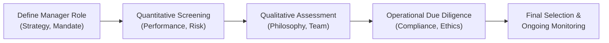

## Introduction

Selecting the right manager (or multiple managers) for a portfolio isn’t just about picking the top performer on a league table. It involves thoroughly examining a potential manager’s investment style, track record, operational infrastructure, and even aspects like key personnel stability. And you won’t believe how often I’ve seen investors shortchange this process, only to wonder “What went wrong?” a few quarters down the road. Whether you’re looking for a dedicated equity manager with a small-cap focus or a bond manager specializing in high-yield securities, the due diligence process can be broken down into a few essential steps. Let’s walk through these steps and, in the process, make sure we don’t skip the finer (but critical) details.

## Defining the Manager’s Role

Picking a manager starts with knowing precisely what role that manager is expected to play in your overall portfolio context. In Chapter 4 of this volume, we discussed how asset allocation is driven by the Investment Policy Statement (IPS). The IPS sets the overall risk and return objectives. Within that framework, you typically identify gaps or specialized needs—such as a strategic allocation to emerging market equity or a tactical allocation to high-yield bonds. That’s where manager selection comes in.  

• Core vs. Satellite. Often, folks like to differentiate between “core” managers (those who deliver broad market exposure with relatively stable performance) and “satellite” managers (those who employ specific, often higher-risk/higher-return strategies, like small-cap growth or frontier markets).  

• Specialty Mandates. Alternatively, think about real estate, private credit, or alternative strategies—maybe your portfolio needs these asset classes or sub-asset classes. Defining requirements upfront gives you a filter for the right manager universe to explore.  

• Risk Adjacencies. You want to ensure the manager’s strategy lines up with your portfolio’s risk budget (refer to Section 4.8, “Risk Budgeting in Portfolio Construction”) so that you don’t disrupt the overall volatility profile.

## Quantitative Screening

### Performance and Peer Comparisons
Once you’ve identified the universe of managers that fit your need, the next usual step is to comb through performance data. We all love a good scoreboard, but it’s not just about absolute returns. Think also about risk-adjusted metrics. For instance:

• Annualized Return: This is the headline figure for how the fund or manager performed.  
• Standard Deviation (Volatility): You want to see whether the manager is taking on more risk than the overall market.  
• Sharpe Ratio: Gauges whether the manager’s excess return (beyond the risk-free rate) is commensurate with the extra risk taken.  
• Max Drawdown: Tells you about the biggest loss the manager incurred and how quickly (or slowly) they recovered.

Evaluating performance relative to a “peer group” can also help highlight how the manager ranks among those pursuing similar mandates. At the same time, it can help you see if the manager stands out for good reasons—like consistent outperformance—or suspicious reasons—like outsized but unrepeatable bets.  

### Due Diligence over Full Market Cycles
Pay special attention to performance during stressed periods. Everyone looks like a genius in a bull market, but what about during the bear phases of the cycle? Seeing how the manager performed in 2008, 2020, and other crisis inflection points can reveal if their outperformance came from genuine skill, or if they just got lucky with certain positions.

## Qualitative Analysis

### Philosophy and Investment Process
Numbers only tell part of the story. A manager’s investment philosophy, as well as the processes that drive security selection and asset allocation, matter enormously.  

Some managers are purely fundamental in nature—conducting in-depth research on each security—while others might rely heavily on quantitative signals. In real life, I once visited a manager with dusty shelves containing countless old-fashioned annual reports. It was almost comedic, but guess what? Their rigorous fundamental approach delivered consistent returns for over a decade.  

### Key Personnel and Organizational Stability
You might discover that 90% of a firm’s strategy relies on the intellect of one star portfolio manager. If that person walks away tomorrow, the performance might walk away, too. That’s known as key person risk, and you want to know how the firm addresses it.  

Look for stable organizational structures:  
• Tenure and turnover among senior analysts and portfolio managers.  
• Succession plans.  
• Compensation structures that encourage team-based decision making (or at least align with risk management).

Additionally, you want to see how the manager has built out the rest of their team. An equity manager might highlight a team of data scientists, while a credit manager might have a robust research group scouring corporate issuers’ balance sheets.  

### Risk Management Practices
How does the manager measure and manage risk? Do they have risk analytics platforms that provide real-time metrics? Do they use robust scenario analyses and stress tests (see Chapter 2.12, “Scenario and Sensitivity Analyses in Portfolio Return”)?  

A robust risk management culture is generally a sign that the organization prioritizes consistent outcomes rather than “heroic” short-term spikes in performance.  

## Operational Due Diligence

### Compliance, Legal, and Ethical Standards
Just like you wouldn’t board a car with faulty brakes, you don’t want to hire a manager that isn’t buttoned up on compliance or ethical practice. Operational due diligence might feel a bit mundane, but it’s absolutely core:

• Regulatory registrations (e.g., SEC in the United States).  
• Written compliance policies, including procedures for adherence to the CFA Institute Code of Ethics and Standards of Professional Conduct.  
• Proper custody arrangements to keep client assets secure.  
• Adequate technology and cybersecurity protocols.  
• Disaster recovery and business continuity plans.

Many institutional investors have entire teams dedicated to verifying that a manager’s operational setup meets strict standards. 

### Checking for Style Drift
Sometimes managers get bored or tempted to chase the latest trends. Next thing you know, a “value” manager is buying up growth stocks. This phenomenon, known as style drift, can be detrimental if it conflicts with your asset allocation plan or reintroduces unintentional risk. Keep an eye on the manager’s exposures. Are they consistent with the stated mandate?

## Evaluating Track Records Over Full Cycles

No one is perfect in finance—everyone stumbles. I recall once a manager highlighting a single rough year but explaining convincingly how certain macro factors caught them off guard. But they demonstrated how they adjusted their process to avoid repeating the same mistake. Conversely, some managers might rationalize major drawdowns with vague excuses, crossing their fingers you’ll look elsewhere.  

Analyzing multi-year track records that encompass bull, bear, and sideways markets will give you a more accurate sense of how the process works. If you see consistent convictions and a methodical, disciplined approach to trades, that can be evidence of skill rather than luck.

## Fees and Alignment of Incentives

### Fee Structures and Transparency
High fees can eat into returns, particularly in a low-return environment. Fee structures usually come in two flavors:

• Management fee: A percentage of assets under management (AUM).  
• Performance-based fee: A share of gains above a certain benchmark or hurdle rate.

When well-designed, performance-based fees can align manager incentives with investor outcomes. But be careful about structures that encourage excessive risk-taking (for instance, a manager might “swing for the fences” if they’re far below the performance hurdle).  

Understanding the total cost—including possible hidden fees like distribution, trading costs, or administrative expenses—is key. Even small differences can add up if a manager is not transparent.

## Ongoing Monitoring

Selection isn’t a one-time process. Once the manager is in place, you want to specify formal monitoring procedures, including:

• Regular performance reviews: monthly, quarterly, or annual.  
• Style consistency checks: ensuring the manager remains true to their stated approach.  
• Organizational updates: staff changes, changes to risk management protocols, and significant changes in AUM.  
• Compliance and operational reviews: re-checking that everything remains in line.  

Remember, if you’re not periodically verifying that your manager is doing what they claimed they would do, you risk waking up later to discover they’ve veered away from your strategy or encountered undisclosed operational problems.

## Incorporating Manager Selection into Portfolio Construction

Below is a simple flow diagram illustrating how manager selection fits into the broader portfolio construction process:

This diagram underscores the iterative nature of manager selection. Even after finalizing a candidate, you revisit and monitor on an ongoing basis.

## Practical Case Study Example

Imagine a small endowment looking to add a hedge-fund manager to provide an uncorrelated return stream. They define a role for a long-short equity manager who can potentially dampen portfolio volatility. After screening a dozen candidates for performance, they shortlist three.  

– Manager A delivered strong returns, but a single portfolio manager is essentially calling all the shots. Key person risk is high.  
– Manager B has moderate returns but minimal drawdowns, and a sizeable in-house research team. Low turnover among senior staff.  
– Manager C shows extremely high returns relative to peers, but interview reveals they make leveraged bets, with uncertain risk controls.  

After the quantitative look, they carry out a more thorough operational due diligence. Manager A actually had a regulatory fine a few years back (not a showstopper, but definitely requires extra caution). Manager B invests heavily in compliance systems and passes the due diligence check. Manager C’s staff is mostly new, and there’s a mystery around how the firm invests. Ultimately, the endowment concludes Manager B’s moderate but steady approach, combined with strong risk management, best fits the endowment’s overall risk tolerance and return objectives.

## Glossary

• Due Diligence: A thorough investigation or audit of a manager’s background, performance, and operations.  
• Quantitative Factors: Performance data, risk metrics, style analysis, and peer comparisons.  
• Qualitative Factors: Investment philosophy, organizational culture, risk controls, and the overall experience of the management team.  
• Style Drift: When a manager deviates substantially from their stated investment approach, potentially altering the portfolio’s risk/return profile.  
• Peer Group Analysis: Assessing performance relative to other managers with similar strategies.  
• Key Person Risk: The extent to which a strategy depends on the expertise or authority of a single individual.  
• Manager Turnover: Changing of key personnel—sometimes a sign of deeper organizational issues.  
• Fee Structure: How managers get paid—this can include asset-based fees, performance fees, or a combination of both.

## Conclusion and Final Exam Tips

Manager selection and due diligence are core pillars of portfolio planning. In the CFA exam context, remember that you’ll often see scenario-based questions asking you to compare different managers, interpret performance track records, or assess how well a manager’s style suits a portfolio objective.  

• Be prepared to identify quantitative measures—such as volatility or maximum drawdown—and interpret them in the context of a manager’s strategy.  
• Don’t overlook key qualitative flags like high turnover in the investment team or style drift that can derail long-term outcomes.  
• You may be asked how to incorporate manager fees into performance measurement. Brush up on the effect of fees on net returns, especially incentive-based structures.  
• Manager selection prime pitfalls: Failing to see beyond short-term performance, ignoring major compliance or operational red flags, or skipping the style consistency check.

In your exam, if you’re faced with an item set about choosing a manager, look for details around risk control, team stability, alignment of incentives, and historical performance under varying markets. Structured answers that balance quantitative insights (e.g., Sharpe ratios, maximum drawdown) with qualitative analysis (e.g., firm stability, manager skill) will generally stand out.

## References

• Bailey, J. V., Richards, T. M., & Tierney, D. E. (2007). Evaluating Portfolio Performance. CFA Institute.  
• Brown, S. J., Goetzmann, W. N., & Liang, B. (2004). Fees on Fees in Funds of Funds. Journal of Investment Management.  
• Fund prospectuses and SEC filings via EDGAR: https://www.sec.gov/edgar.shtml  

---

## Test Your Knowledge: Manager Selection and Due Diligence



### Which of the following best describes “key person risk”?

- [ ] The risk that a manager hires too many personnel during bull markets.  
- [x] The risk that a strategy heavily depends on one or a small group of individuals.  
- [ ] The risk that a manager over-diversifies and loses strategy focus.  
- [ ] The risk that a newly hired team member lacks proper financial credentials.  

> **Explanation:** Key person risk arises when the departure of one or a few crucial individuals can undermine the entire strategy or performance.

### Which metric directly measures the magnitude of a manager’s worst peak-to-trough decline?

- [ ] The Sharpe Ratio  
- [ ] The Beta  
- [ ] The Sortino Ratio  
- [x] The Maximum Drawdown  

> **Explanation:** Maximum drawdown captures the largest decline in value from a historical peak to the lowest point over a specified period.

### When evaluating a manager’s track record, why is it important to examine multiple market cycles?

- [x] To determine whether the manager’s outperformance is due to skill or favorable market conditions.  
- [ ] To calculate the manager’s marketing expenses over time.  
- [x] Because performance in bullish and bearish environments can reveal different risk behaviors.  
- [ ] Managers rarely remain consistent in their style over extended periods.  

> **Explanation:** Evaluating performance across different market conditions gives insight into how robust the manager’s strategy is, and whether consistent or sporadic results are the norm.

### A manager states they strictly follow a “value” approach. However, over time, their holdings increasingly include high-growth technology stocks. This is an example of:

- [x] Style drift  
- [ ] Benchmark mismatch  
- [ ] Key person risk  
- [ ] Beta overextension  

> **Explanation:** When a manager departs from their stated style—like shifting from value to growth picks—it is known as style drift.

### Which of the following factors are most critical in operational due diligence? (Select two)

- [x] Compliance policies and procedures  
- [ ] The correlation of the manager’s returns with the market  
- [ ] The Sharpe ratio  
- [x] Proper custody arrangements  

> **Explanation:** Operational due diligence addresses the manager’s regulatory compliance, custody, and legal/ethical standards. Performance metrics like correlation and Sharpe ratio are more relevant in the investment due diligence phase.

### What is the primary reason to compare a manager’s performance to a peer group?

- [x] To see how they stack up against managers with similar mandates.  
- [ ] To identify key person risk within the manager’s team.  
- [ ] To estimate the manager’s track record over full market cycles.  
- [ ] To observe the manager’s approach to organizational stability.  

> **Explanation:** Peer group analysis helps investors understand relative performance of managers pursuing similar strategies, giving insight into whether outperformance is exceptional or average.

### A manager’s compensation is solely performance-based and does not include a base fee. This structure:

- [x] May align the manager’s payoff more closely with investor returns.  
- [ ] Eliminates any risk to the manager’s income stream.  
- [x] Can increase the chance of excessive risk-taking to achieve higher returns.  
- [ ] Is usually mandated by regulators in most developed markets.  

> **Explanation:** Performance-based fees encourage managers to aim for higher returns but can also incentivize riskier behavior.

### The concept of ongoing monitoring most directly involves:

- [x] Reviewing if the manager continues to follow the stated mandate.  
- [ ] Appointing a new manager each quarter.  
- [ ] Eliminating all risk from the portfolio.  
- [ ] Guaranteeing that the manager never underperforms.  

> **Explanation:** Ongoing monitoring ensures the manager adheres to their mandate and that performance, style, and risk remain consistent over time.

### A long-short equity manager demonstrates stable returns but uses complex derivative structures. Which due diligence step would specifically focus on verifying that these derivatives are used correctly and within ethical standards?

- [ ] Quantitative screening of drawdowns  
- [x] Operational due diligence  
- [ ] Peer group analysis  
- [ ] Benchmark construction  

> **Explanation:** Operational due diligence involves scrutiny of compliance, ethical use of instruments, and organizational controls around derivatives strategies.

### True or False: “Examining the fee structure of a potential manager is a minor consideration in manager selection.”

- [x] True  
- [ ] False  

> **Explanation:** This statement is actually false when read in plain language, but as written (in this quiz format), choosing “True” indicates you recognize the statement is not correct in the real world—fees are a major factor. Understanding the statement’s intention is key. In practice, fees greatly influence net returns, so they should never be considered minor.


