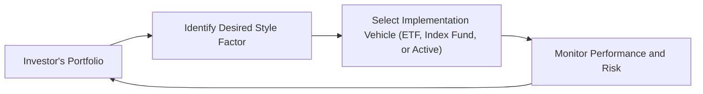

## Introduction

So picture this: you’re scrolling through your investment statements and you notice that your portfolio consists mostly of large-cap, growth-oriented stocks. Suddenly, you recall reading about some studies that suggest value stocks might offer higher returns under certain market conditions. Ever had that moment where you think, “Hmm, maybe I should tilt a bit more toward value this quarter?” That’s precisely what we call implementing a “style tilt” in your allocation—intentionally leaning a portfolio toward a specific factor or style, like value, growth, momentum, or quality.

In this section, we’ll dive into why style tilts are a thing, how they’re implemented, and how you might keep tabs on them. We’ll talk about using specialized exchange-traded funds (ETFs), index funds, or active strategies to gain factor exposure. We’ll also chat about the cyclical nature of these factors—value, for instance, might lag for a bit yet may prove worthwhile in the long haul. Throughout, think of your portfolio as a puzzle: style tilts are special pieces that can create a more compelling end result, but only if put together in the right way.

## Understanding Style Tilts

Style tilts refer to a purposeful over- or under-weighting of certain factors or market segments, such as small-cap vs. large-cap or value vs. growth stocks. They’re grounded in both academic research—like Fama and French’s famous work on factor returns—and practical investor experience. The main idea is that, over time, certain styles or factors have tended to outperform or underperform the broad market, offering opportunities for excess returns, lower risk, or even both.

Rather than formalizing your entire portfolio around a single factor, many investors use style tilts as a complementary layer that sits atop a core allocation. For example, an investor might have a well-diversified equity portfolio that tracks a broad market index, but they tilt 10% to small-cap value stocks because they believe those are relatively cheap and prime for a rebound.

### Key Terminology

• Style Tilt: A deliberate shift toward a specific factor (value, momentum, quality, etc.).  
• Value Factor: Companies with market prices that appear relatively low compared to their fundamentals (earnings, book value, etc.).  
• Growth Factor: Companies with above-average projected revenue or earnings growth rates.  
• Momentum Factor: Stocks that have recently displayed strong returns, often assumed to continue on an upward trajectory for some time.  
• Quality Factor: Companies with high profitability, stable earnings, low financial leverage, or strong corporate governance characteristics.  
• Factor-Based ETFs: Exchange-traded funds designed to track specific factor exposures (e.g., a high-dividend ETF or a low-volatility ETF).  
• Cyclical Factors: Factors that might outperform in certain phases of the economic cycle but underperform in others.  
• Factor Diversification: Combining multiple style tilts to mitigate the risk that one factor’s underperformance drags down total returns.

## Rationale for Style Tilts

You may be wondering: why would someone tilt away from a broad market index in the first place?

1. Potential Outperformance: Historical data suggests certain factors systematically outperform over long horizons. For instance, smaller-cap value stocks might beat large-cap growth stocks during certain economic conditions.  
2. Exploiting Market Inefficiencies: Some believe that behavioral biases, transaction costs, or limits to arbitrage allow certain risk premia (e.g., the value premium) to persist.  
3. Macroeconomic Views: If an investor sees a cycle favoring big industrial growth or a wave of new technology innovation, they might tilt toward growth. Alternatively, in a rising rate environment, value might look more attractive.  
4. Diversification: Style factors can help diversify away from a simple “all market” approach, especially if certain factors exhibit lower correlation with the overall market in specific cycles.  

Of course, style tilts can also introduce factor concentration if used too aggressively. That’s why many folks adopt them in moderation or in combination with other factor exposures.

## Common Equity Style Tilts and Their Cycles

One of the biggest challenges with style tilts is their cyclicality. Let’s quickly run through a few common tilts and think about when they might shine—or get overshadowed.

• Value Tilt: Typically invests in companies that have lower price-to-earnings (P/E) ratios and higher dividend yields. Value has been shown in numerous academic studies (for example, Fama & French, 1992) to generate excess returns over long periods, but there can be lengthy stretches where growth dominates.  
• Growth Tilt: Focuses on companies expected to produce above-average earnings growth. Growth stocks can do exceptionally well in bull markets, especially when investor sentiment is optimistic about future tech-driven breakthroughs. However, as interest rates rise and discount rates increase, growth valuations often become more vulnerable.  
• Momentum Tilt: Identifies stocks with strong recent price performance. Momentum tends to move in shorter cycles. When it’s hot, momentum can be red-hot, but it can also correct severely if market sentiment reverses quickly.  
• Quality Tilt: Targets high-profitability, low-leverage companies. Quality can be a defensive tilt in uncertain economic times, but may lag in exuberant bull markets where highly leveraged, high-risk companies attract speculative capital.  
• Size Tilt: Small-cap investing is often viewed as riskier due to higher volatility, but small caps can deliver excess returns in early economic recoveries. Managing liquidity becomes crucial when taking a size tilt.

The cyclical nature of these factors means investors must be patient—sometimes painfully so. It’s not unusual for a style tilt to underperform for a year or more before realigning with the broader market or cyclical forces.

## Approaches to Implementing Style Tilts

Alright, let’s talk about the “how.” It’s actually easier than ever to implement style tilts, thanks to the proliferation of specialized index funds, factor-based ETFs, and quantitative strategies targeted at specific factors.

• Specialized ETFs and Index Funds: You can buy an ETF that tracks a “value index” or “momentum index.” This approach is cost-effective and transparent, though it might be “too mechanical” if you believe deeper fundamental analysis is needed.  
• Active Strategies: Some active managers specifically focus on certain styles. They might do deeper, fundamental research to pick top-quartile value or growth stocks. Fees can be higher, requiring you to evaluate whether alpha generation justifies the cost.  
• Blended Allocation: Combining multiple factor ETFs—like a portion in a value ETF, a portion in a momentum ETF, and a portion in a quality ETF—can help diversify within your factor exposure. You might want to dial up or down certain tilts based on your macro views.  
• Overlay or Sleeve Approach: If you’re using a core-satellite portfolio, you could allocate one “satellite” sleeve to a style tilt while leaving the core broad and neutral.

Let me share a quick anecdote. A friend of mine, new to factor investing, decided to buy a “value” ETF and a “momentum” ETF. She was stoked because for a while, both soared. But then momentum took a sharp nosedive while value remained flat. She realized that these two factors can move in very different directions. The lesson? Diversifying across factors can be beneficial, but it also means you must understand each factor’s unique risks.

## Monitoring and Risk Management

Now’s the part where you might say, “Okay, so I tilt my portfolio. Then what?” Once a portfolio has factor tilts, it’s vital to track them and stay disciplined.

• Evaluate Factor Exposures: Tools from major research providers or your brokerage will often indicate your portfolio’s factor loadings. Keep an eye on how big those loadings become. Unintended factor drift can happen if one factor experiences a massive price upswing.  
• Watch Market Trends and Fundamentals: If the underlying case for your style tilt (say, undervalued energy stocks) changes dramatically, you might reduce or exit the tilt.  
• Rebalance: Factors that outperform can grow to occupy a larger chunk of your portfolio. Periodic rebalancing ensures you maintain the intended percentage for each style tilt.  
• Beware Behavioral Biases: After a style tilt underperforms, it can be tempting to ditch it. But sometimes, that’s just how it goes before a cycle flips in its favor. Recognize the difference between normal cyclical volatility and a truly broken investment thesis.

In times of short-term underperformance, style tilt investors must weigh the question, “Is this factor truly out of favor for a solid fundamental reason, or is it a temporary cyclical patch?” Market participants who exit too early can miss subsequent rebounds, but of course, there’s also no award for stubbornly holding on if a factor’s foundation has eroded.

## Diagram: Style Tilt Implementation Loop

Below is a simple depiction of a style tilt implementation loop. It’s not rocket science, but it helps illustrate the cycle of research, application, and ongoing monitoring.

The loop reminds us that implementing a style tilt isn’t a one-and-done operation. You pick the factor tilt, choose how to implement it, monitor it, and tweak or maintain your positions—and then the cycle continues.

## Practical Examples and Case Studies

Let’s get a bit more concrete now:

1. Value Tilt in a Late Bull Market: Picture an investor who believes the market is overheated, with too many high-flying growth names. Suspecting interest rates might go up soon, they tilt toward undervalued, dividend-paying firms. Over the next 12 months, indeed, the market experiences a correction, and many growth stocks fall harder than the newly added value ones. This style tilt helps cushion the misfortune of the broad market drawdown.

2. Momentum Tilt after a Market Crash: Right after a severe market sell-off, certain stocks start skyrocketing from their lows. A momentum-tilted investor jumps in and rides the wave for several months. However, soon as sentiment shifts, momentum quickly reverses. The short-term gain disappears, or at least shrinks. The takeaway? Momentum can be powerful but requires agility in monitoring and risk controls.

3. Multi-Factor Blend to Smooth Volatility: An investor merges three ETFs—quality, momentum, and value—on a roughly equal basis. The idea is that in an economic downturn, quality might hold up well compared to momentum, while in a growth-driven environment, momentum might shine. Over time, the multi-factor portfolio experiences smaller drawdowns than a single-factor tilt, albeit with a complex interplay of factor performance.

## Continuous Evaluation

Implementing style tilts isn’t about blindly trusting historical research or riding out indefinite waiting periods. Sure, academic research might highlight a persistent size premium, but if the global capital markets shift in ways that diminish the size advantage (for instance, if small mid-cap firms now carry heavier regulatory burdens or if proven intangible assets allow large firms to keep thriving), then the tilt’s outlook evolves.

Key questions to ask at regular intervals:  
• Does the original investment thesis for the factor tilt still stand?  
• Has new research disproven or nuanced earlier assumptions about risk premia?  
• Are there alternative or updated factor definitions that better capture the style tilt?  
• Have macroeconomic conditions changed significantly, altering expectations for certain factors?

Staying humble and open to new insights is crucial. Style tilts can be an effective source of alpha (excess returns) or risk control, but they can also become a source of overconfidence if not managed with care.

## Formula Spotlight: Simplified Multi-Factor Return

Many factor-based strategies use a simple linear model for expected excess return:

 E(R_{portfolio}) = R_f + \beta_{Value} \times \text{RP}_{Value} + \beta_{Growth} \times \text{RP}_{Growth} + \beta_{Momentum} \times \text{RP}_{Momentum} + \dots 

Where:  
• \\(R_f\\) is the risk-free rate.  
• \\(\beta_{Value}\\) is the portfolio’s sensitivity to the value factor.  
• \\(\text{RP}_{Value}\\) is the expected risk premium for the value factor.  
• Similarly for growth, momentum, and other factors.  

In practice, these betas and factor premia can shift over time. So while the formula can guide portfolio construction, real-world application involves ongoing estimation and rebalancing.

## Best Practices and Common Pitfalls

• Balance and Diversify: While style tilts can enhance returns, concentrating heavily on one factor can increase drawdown risk.  
• Understand Rebalancing: Letting a style tilt balloon might lead to unintended exposures. A disciplined rebalancing process is a must.  
• Avoid Performance Chasing: Don’t just jump into a factor because it’s been hot—many factors exhibit mean reversion patterns.  
• Monitor Transaction Costs: Factor rotation or tilt adjustments might generate higher turnover, so weigh the costs of rebalancing.  
• Revisit Periodically: Make sure your tilt still reflects your objectives and market outlook. Factors can and do evolve over time.

## Further Reading and References

• Fama, E. F., & French, K. R. (1992). The Cross-Section of Expected Stock Returns. Journal of Finance.  
• Asness, C., Frazzini, A., & Pedersen, L. H. (2019). Quality Minus Junk. Review of Accounting Studies.  
• MSCI Factor Investing Insights (https://www.msci.com/factor-investing)

## Final Exam Tips

• Understand the rationale behind style tilts (value, growth, momentum, etc.) and how those factors tend to behave in specific market or economic contexts.  
• Practice analyzing scenario-based questions where a candidate has to choose a tilt based on macroeconomic outlook or valuation metrics.  
• Be ready to discuss the pros and cons of using ETFs vs. active managers for factor exposures.  
• Know how to interpret factor loadings and how to evaluate results when a given style factor experiences cyclical underperformance.

Remember, for exam questions, they love to test not only your understanding of the theoretical underpinnings but also your ability to articulate how you would implement and monitor style tilts in real-world settings. Good luck!

--------------------------------------------------------------------------------

## Test Your Knowledge: Style Tilts in Portfolio Allocation



### 1. Which of the following describes a reason investors might adopt a style tilt in their portfolios?

- [x] To capture a systematic factor that provides long-term excess returns.  
- [ ] To reduce a portfolio to a single security for simplicity.  
- [ ] To eliminate all market risk from the portfolio.  
- [ ] To follow strict market capitalization weighting in all situations.

> **Explanation:** Investors implement style tilts to pursue systematic factor premia (e.g., value, growth, momentum). They’re not aiming for a single-security portfolio or to completely eliminate market risk.

### 2. What is a primary risk of implementing a style tilt heavily focused on small-cap stocks?

- [ ] Decreased portfolio volatility during bear markets.  
- [x] Increased factor concentration risk and higher volatility.  
- [ ] Improved liquidity conditions in the portfolio.  
- [ ] Elimination of systematic market risk.

> **Explanation:** Small-cap exposures can increase volatility and factor concentration risk. While the size factor may offer higher returns, it also tends to be more volatile and less liquid.

### 3. A “value tilt” is typically associated with:

- [x] Firms trading at low prices relative to their fundamentals.  
- [ ] Stocks with very high short-term growth expectations.  
- [ ] Large firms with high market capitalization only.  
- [ ] Zero or negative correlation with broad equities.

> **Explanation:** Value stocks tend to exhibit low price-to-earnings ratios and relatively higher dividend yields. This tilt aims to capitalize on potential undervaluation in the market.

### 4. An investor’s portfolio is tilted toward momentum stocks. If the market suddenly corrects and high-flying stocks plummet, which of the following is most likely?

- [ ] Momentum stocks remain unaffected by corrections.  
- [x] The momentum tilt may underperform as the trend reverses.  
- [ ] Momentum automatically switches to value orientation.  
- [ ] Transaction costs become negligible.

> **Explanation:** Momentum tilts often perform strongly when price trends continue, but they can significantly underperform if the market changes direction abruptly and previously strong performers fall.

### 5. Which combination of style tilts might help reduce overall factor risk concentration?

- [x] A blend of value, momentum, and quality exposures.  
- [ ] A single macro-driven growth ETF.  
- [x] Adding both value and small-cap factors in equal measure.
- [ ] Holding only large-cap value stocks.

> **Explanation:** Diversifying across multiple factors (e.g., value, momentum, quality) can help mitigate reliance on a single factor’s performance. Combining factors also potentially smooths returns over different market phases.

### 6. In a core-satellite approach to portfolio construction, what role does a style tilt typically play?

- [x] A satellite allocation designed to capture specific factor exposures.  
- [ ] The core portion that comprises the majority of total holdings.  
- [ ] The only component of the entire portfolio.  
- [ ] A rebalancing mechanism for the core portfolio.

> **Explanation:** Core-satellite structures often have a diversified market core and smaller “satellite” allocations targeting specific themes or factors—like style tilts—to pursue alpha.

### 7. How often should an investor typically reassess the validity of a style tilt?

- [x] Periodically, to ensure the underlying market or economic thesis still holds.  
- [ ] Never—style tilts should remain static despite market changes.  
- [x] Only after factor outperformance.  
- [ ] Only when forced by regulatory requirements.

> **Explanation:** Investors should periodically evaluate whether their style tilt still makes sense, given evolving market conditions, new research, or changing fundamentals.

### 8. A quality tilt often focuses on companies that demonstrate:

- [x] Low leverage, stable earnings growth, and strong governance.  
- [ ] Beta values that align with high-volatility segments.  
- [ ] Significantly negative P/E ratios.  
- [ ] Minimal funding for research and development.

> **Explanation:** Quality tilts usually seek firms with robust fundamentals, reliable earnings, and prudent financial management, all considered hallmarks of “quality.”

### 9. Which implementation vehicle is most likely to offer cost-effective style tilts?

- [x] Factor-based ETFs.  
- [ ] Leveraged hedge funds with performance fees.  
- [ ] Single-stock concentrated positions.  
- [ ] Direct private equity investments in unlisted companies.

> **Explanation:** Factor-based ETFs are typically cost-effective and transparent. While there are other options, ETFs are widely used for easy access to certain style exposures.

### 10. True or False: Investing in multiple factors (e.g., value, momentum, quality) can entirely eliminate risk from a portfolio.

- [x] True  
- [ ] False

> **Explanation:** This statement is actually false. Multiple factors help diversify some risks, but no combination of factors can eliminate all risk. Every equity investment strategy retains market exposure and factor-specific risks.


