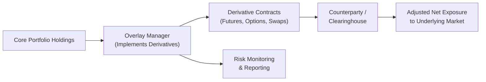

## Introduction
Overlay strategies (sometimes called overlay management) often feel like magic—at least, that’s what I used to think when I first heard about them. Imagine you’re perfectly happy with your underlying portfolio, yet you need to quickly change your currency exposure or tweak your overall duration without having to sell the securities you hold. Well, that’s exactly what overlays let you do. They function like a flexible “layer” on top of your current holdings, allowing you to adjust real-time exposures using derivatives, typically at lower transaction costs and with greater speed.

Before diving into the nitty-gritty, think of an overlay as an umbrella. You might carry it around on a sunny day without changing your outfit, but if it starts raining (or if you think it might soon), you pop it open to keep yourself dry—i.e., hedge the undesirable risk. Once the sprinkle has passed, you can close the umbrella without ever changing your core wardrobe.

Below, we’ll explore how overlay strategies work, why they’re useful, their risks and challenges, plus how they fit into a well-designed Investment Policy Statement (IPS). Along the way, we’ll reference some real-life scenarios, highlight best practices, and consider exam-relevant pointers for aspiring professionals.

## Key Concepts in Overlay Strategies
Overlay strategies revolve around the use of derivatives, such as futures, options, and swaps, to manage portfolio exposures (like equities, currency, or interest rates) without buying or selling the underlying securities. It’s like adjusting the “seasoning” in a meal after you’ve already plated the food.

### Derivative Instruments for Overlays
• Futures Contracts: Standardized agreements to buy or sell an asset at a specified future date and price.  
• Options: Contracts that let you buy (call) or sell (put) at a predetermined price, without obligation to do so.  
• Swaps: Agreements where parties exchange cash flows, such as fixed for floating interest rates, or swap currency exposures.

Because these derivatives function off the notional value of the contract—rather than requiring an upfront purchase of the asset—they can swiftly adjust or hedge exposures. However, keep in mind that while the capital outlay may be minimal compared to the notional value, the risk exposure can be substantial, especially if positions are leveraged.

### Benefits of Overlay Strategies
• Speed: You can quickly respond to market changes or tactical opportunities.  
• Cost-Efficiency: Often cheaper than transacting large volumes of physical securities, which can incur trading spreads and potential tax impacts.  
• Precision: Target specific exposures (like currency) or risk dimensions (like interest rate duration).  
• Tax Management: Minimize realized capital gains from unnecessary selling of the underlying portfolio.

### Potential Risks
• Leverage: Overlays often embed leverage, so losses can be magnified.  
• Complexity: Additional monitoring, specialized expertise, and robust risk systems are required.  
• Basis Risk: The derivative might not perfectly match the underlying portfolio’s exposure.  
• Liquidity Requirements: Although setting up an overlay might be cheaper, you still may face margin calls if markets move adversely.

## Common Overlay Examples

### Currency Overlays
Ever traveled to another country and found yourself checking the exchange rate on your phone every day? That’s basically the day-to-day version of foreign exchange (FX) risk. Currency overlays help manage (or hedge) that risk when you hold international assets. By entering into currency futures, forwards, or swaps, you can strip out a portion—or all—of the foreign currency exposure. Let’s say your U.S.-based portfolio invests in euros and yen; currency overlays can help you lock in current FX rates or mitigate potential volatility. And if the euro suddenly surges or dips, you won’t be as exposed.

### Equity Futures Overlays
Imagine you hold a broad portfolio of individual stocks. Your portfolio has grown nicely, but you expect a short-term drop in the market. You could sell everything, but that might trigger capital gains taxes and degrade your portfolio’s structure. Alternatively, you can short-sell an appropriate number of equity futures contracts to hedge. In essence, if the equity market falls, the futures short position should generate gains (in theory) that offset the decline in your long positions. Then, when conditions stabilize, you can close the futures positions.

### Interest Rate Overlays
We’ve all been there: You’re holding a core bond portfolio, and you fear the Federal Reserve will raise rates, hammering your bond values. To handle this interest rate risk, you can enter into interest rate swaps, swapping your fixed exposure for floating. This way, if rates climb, the “floating” leg of the swap receives higher payments, offsetting the loss in your bond holdings.

#### Small Python Calculation Example
Here’s a hypothetical snippet illustrating how you might compute an overlay notional amount (in a simplified scenario):

```python
target_duration = 5.0
current_duration = 6.0
portfolio_value = 100_000_000  # $100M portfolio

duration_gap = current_duration - target_duration  # 1.0

bp_price_sensitivity = 1000  

portfolio_bp_risk = portfolio_value * (duration_gap / 100)

notional_futures_needed = portfolio_bp_risk / bp_price_sensitivity
print(f"Estimated Notional for futures overlay: ${notional_futures_needed:,.0f}")
```

This simplistic example tries to show how you might start with the difference in duration between your current and desired values, then figure out a rough notional futures exposure. In reality, you’d refine each step with more precise estimates (e.g., the specific futures’ price sensitivities).

## Risk Management and Governance
Because overlays can introduce significant leverage, risk management is a must at every step:

• Margin and Collateral: Understand margin rules, ensure robust collateral management, and account for possible margin calls under stress scenarios.  
• Market Volatility: Use stress testing, scenario analysis, and dynamic monitoring of net exposures.  
• Clear Communication: Ensure all parties, including senior management and possibly your board, understand overlay objectives and potential outcomes.  
• Compliance and Reporting: Overlays often require specialized reporting. Regulators and clients want transparency regarding leverage, net exposure, and potential conflicts of interest.

If you coordinate with an external overlay manager, clarity around roles is key. I once watched a portfolio manager scratch his head when an overlay manager executed a currency hedge that ended up magnifying a different portion of the portfolio’s risk. Miscommunication can create unwanted offsets, so a thorough plan and ongoing dialogue are crucial.

## Implementation in the Investment Policy Statement
Think of the IPS as your guiding light. If you plan to use overlays, clarify the following in your IPS or supporting documents:
• Purpose of Overlays: Are they strictly for hedging? Or can you implement tactical overlays to take advantage of short-term market movements?  
• Permissible Instruments: Which derivatives are allowed, and what are the position limits?  
• Leverage Constraints: How much notional exposure can you add on top of the portfolio’s value?  
• Risk Limits: Define metrics like Value at Risk (VaR), drawdown thresholds, or stress test assumptions.  
• Reporting Frequency: Determine how often overlay performance and exposures should be reported.

It’s also advisable to provide contingency plans. For example, specify the triggers under which your overlay strategy might be closed or scaled back, such as a major shift in central bank policy.

## Practical Considerations and Case Study
If you’re implementing an equity futures overlay:

• Evaluate Liquidity: Ensure you trade liquid futures contracts; illiquid ones can widen bid-ask spreads or fail to track your underlying index effectively.  
• Recognize Basis Risk: Your underlying portfolio might deviate from the index used by the futures contract, creating a mismatch.  
• Manage Ongoing Adjustments: Rebalance your overlay strategy as exposures shift due to market moves or corporate actions in the underlying holdings.  

### Brief Case: Institutional Pension Fund
A large pension fund invests mostly in global equities and bonds but wants to hedge currency exposure for its euro-denominated equity portion. Instead of selling those equities—which have done well and align with the fund’s long-term strategy—the manager implements a currency forward overlay. Over two quarters, the euro’s volatility spikes, but the forward contracts effectively lock in exchange rates, smoothing out performance. The pension fund avoids the potential drag from currency movements, remains fully invested, and defers capital gains.  

## Mermaid Diagram: Overlay Workflow



In this simplified depiction, there’s a dedicated overlay manager working closely with the portfolio manager (or the same manager in smaller shops). The manager uses derivative instruments routed through counterparties or exchanges, continually monitoring the position and reporting any changes to overall exposures.

## Best Practices, Pitfalls, and Tips
• Be Clear on Your Objective: Overlays work best when you have a defined risk or return target rather than operating on gut feelings.  
• Manage Counterparty Credit Risk: If you rely heavily on swaps or forwards, ensure your counterparty has sufficiently strong credit or that you use central clearing.  
• Don’t Overdo Leverage: More than a few shops have run themselves aground by being unable to meet margin calls. (I’ve personally seen a manager scramble at 2 a.m. to post additional collateral—never fun!)  
• Keep an Eye on Correlation Shifts: Correlations can change dramatically during volatile markets, rendering your hedge less effective.  
• Stress Testing: Model extreme events where your hedge may fail or lead to margin calls.  
• Keep Everyone Informed: Overlay strategies can be complicated. Keep open lines of communication with your clients, compliance team, and top management.

## References
- Hull, J. C. (2018). Options, Futures, and Other Derivatives. Pearson.  
- BlackRock Investment Institute on Currency Hedging and Overlays:  
  https://www.blackrock.com/institutions/en-us  
- CME Group Educational Resources:  
  https://www.cmegroup.com/education.html  
- CFA Institute Code of Ethics and Standards of Professional Conduct: https://www.cfainstitute.org/ethics-standards  
- Internal case studies and experiences from overlay practitioners.

## Glossary (Recap)
• Overlay Strategy: Uses derivatives to adjust or hedge exposures atop an existing portfolio.  
• Currency Overlay: A hedging tactic specifically aimed at FX risk.  
• Futures Contract: Standardized agreement to buy/sell an asset at a future date/price.  
• Option: A contract giving the right (not obligation) to buy/sell the underlying.  
• Swap: A derivative where two parties exchange cash flows (e.g., fixed vs. floating).  
• Leverage: The use of borrowed capital or derivative notional to amplify return/risk.  
• Delta Exposure: An option’s price sensitivity to changes in the price of the underlying.  
• Notional Value: The total “underlying” value covered by a derivative.

---

## Test Your Knowledge: Overlay Strategies to Manage Portfolio Exposures



### Which of the following derivative instruments is commonly used for overlay strategies to manage currency exposure?

- [ ] Equity index options  
- [x] Currency forwards  
- [ ] Commodity futures  
- [ ] Convertible bonds  

> **Explanation:** Currency forwards (or futures) are specifically designed to manage currency risk. While options on equity indices and commodity futures serve other purposes, they are not typically used for currency overlays.

### In an equity futures overlay aimed at reducing market risk, a portfolio manager who fears a market drop would likely:

- [x] Sell (short) equity futures  
- [ ] Buy call options on the equity index  
- [ ] Buy equity futures  
- [ ] Enter a floating-for-fixed interest rate swap  

> **Explanation:** Short-selling equity futures generally provides protection against a declining equity market. Buying call options or going long in futures increases equity exposure, and an interest rate swap pertains to interest rate risk, not equity risk.

### One major advantage of overlay strategies compared to direct buying or selling of underlying securities is:

- [ ] Greater capital utilization  
- [x] Lower transaction costs and potentially fewer tax consequences  
- [ ] Permanent removal of all risk  
- [ ] No requirement to monitor exposures  

> **Explanation:** Overlays tend to reduce transaction costs and tax implications because you don’t need to physically overhaul the portfolio. However, they don’t remove all risk, and they still require diligent monitoring.

### A key risk when using a futures-based overlay is:

- [x] Basis risk  
- [ ] Guaranteed increase in returns  
- [ ] Elimination of underlying market risk  
- [ ] Absence of need for rebalancing  

> **Explanation:** Basis risk arises if the futures contract does not precisely match the price movements of the underlying assets. Returns are not guaranteed, and overlays need ongoing rebalancing.

### When incorporating an overlay manager into your investment process, which of the following is a best practice?

- [x] Clear communication regarding the portfolio’s overall exposures  
- [ ] Allow the overlay manager full freedom without constraints  
- [x] Ongoing monitoring and alignment with the main portfolio manager  
- [ ] Grant unlimited leverage privileges  

> **Explanation:** Open communication and alignment with the main portfolio manager are crucial. Overlays should operate within established constraints and leverage limits.

### If a portfolio manager wants to reduce duration quickly in a bond portfolio, a common overlay strategy might be:

- [x] Enter a pay-fixed interest rate swap  
- [ ] Buy call options on an equity index  
- [ ] Buy put options on a currency pair  
- [ ] Acquire more long-duration Treasuries  

> **Explanation:** By paying a fixed rate in a swap (and receiving floating), the portfolio effectively reduces its interest rate sensitivity. The other options do not directly reduce duration in a bond portfolio.

### Currency overlays are typically employed to:

- [x] Hedge against currency fluctuations in foreign investments  
- [ ] Reduce credit spread risk in corporate bonds  
- [x] Adjust nominal exposures without selling underlying stocks  
- [ ] Increase risk levels in the domestic bond market  

> **Explanation:** Currency overlays manage FX risk in foreign investments or adjust currency exposure if desired, often without altering the underlying holdings. They don’t directly manage credit spreads or purely domestic bond risk.

### Which of the following provides the best description of “leverage” in overlay strategies?

- [x] The notional value of derivatives can exceed the initial capital outlay, amplifying gains or losses  
- [ ] A guaranteed return on investment from owning derivatives  
- [ ] The process of passively matching an index performance  
- [ ] Eliminating tracking error through direct replication  

> **Explanation:** Leverage stems from derivative positions often controlling larger notional exposures than the initial margin or premium, thus magnifying potential outcomes.

### A potential operational challenge in overlay management is:

- [x] Coordinating margin requirements and cash flows  
- [ ] The inability to change exposures quickly  
- [ ] Zero basis risk  
- [ ] Permanent elimination of return variability  

> **Explanation:** Overlays require active operational management of margin and collateral. Exposures can be changed quickly (which is a benefit), but risk is not completely removed.

### True or False: One key benefit of an overlay strategy is that it can be used to lock in gains on the underlying assets while retaining physical ownership.

- [x] True  
- [ ] False  

> **Explanation:** By using derivatives to hedge downside risk or fix a price, investors can effectively lock in (or protect) gains on the underlying portfolio without having to sell it outright and realize capital gains or disrupt investment strategy.


