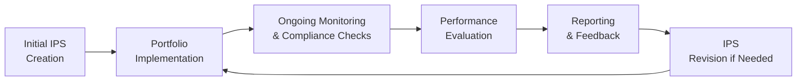

## Introduction

So, you know that feeling when you come back from vacation, check your bank statements, and realize—uh oh—you accidentally overspent beyond the limit you set for yourself? In portfolio management, that sense of “uh oh” can be much bigger. If a portfolio veers from the Investment Policy Statement (IPS) guidelines (perhaps by having too large a position in a single stock or drifting away from a target asset mix), it can create significant risks for both investors and managers. Monitoring compliance with the IPS is basically the portfolio manager’s way of making sure the investment plan stays on track and those “uh oh” moments are minimized.

Just as you would keep an eye on your own savings goals to ensure you’re not accidentally spending an extra fortune on takeout, professional portfolio managers need to regularly review holdings, risk parameters, performance, and potential regulatory requirements. This process is part art (requires judgment and adaptability) and part science (involves quantitative metrics and thresholds). Let’s explore how this works in practice and why it matters so much.

## Ongoing Monitoring and the IPS

The IPS acts as a roadmap given to the portfolio manager. It specifies the client’s objectives, acceptable levels of risk, any constraints (like liquidity or time horizon), legal requirements, and unique considerations such as ethical screening or environmental, social, and governance (ESG) preferences. Once the portfolio is constructed, it doesn’t just magically keep itself in line. Market values change, new investment opportunities pop up, and sometimes external regulations get updated. Ongoing monitoring ensures that the portfolio’s composition remains faithful to the IPS.

This involves:

• Checking that each asset class sticks to allocated percentage ranges.  
• Ensuring that no single issuer or industry exposure exceeds set limits.  
• Monitoring performance against benchmarks that are consistent with the portfolio’s style and risk tolerance.  
• Documenting any changes to the portfolio, along with the rationale for those changes, to keep a clear audit trail.  

Many organizations have a Risk Committee or compliance officer review the results of these regular checks. If something seems out of line—like the portfolio’s equity portion goes beyond the maximum allowed, or the overall tracking error starts creeping beyond the stated tolerance—then immediate action is taken to correct it.

## Why Monitoring Compliance Is Critical

You might wonder: why does it even matter if a portfolio drifts now and then? Well, an IPS is not just a piece of paper; it’s a legally binding guide in many cases, and it sets the terms under which the manager is trusted with a client’s money. Breaches of mandate, especially substantial ones, could trigger significant reputational damage, regulatory scrutiny, and in extreme cases, legal consequences. That’s why compliance is such a big deal—nobody wants to lose their credibility (and possibly their business) over an unnoticed out-of-range security or an unapproved leverage strategy.

But it’s not just about avoiding trouble. Sticking to the IPS helps keep the portfolio aligned with the client’s original goals. If an investor said “I definitely don’t want more than 50% equity exposure,” you probably don’t want to come back with 70% equity after a bull run. Sure, the returns might make them happy on a good day, but it totally violates the stated risk profile. Over time, consistent risk alignment is as essential to client satisfaction as strong performance is.

## Key Components of a Compliance Framework

Compliance frameworks vary from firm to firm, but they share common elements:

• Clear, quantifiable guidelines in the IPS: For example, a maximum of 10% in a single issuer or no more than 20% in high-yield bonds.  
• Automated or manual monitoring systems that track these constraints on a daily, weekly, or monthly basis.  
• Internal Reporting Frequency: Many institutions produce monthly or quarterly compliance reports. In some highly regulated environments, daily checks might be mandated.  
• Governance and oversight: Many firms have a dedicated Risk Committee to review potential breaches, wave caution flags, and ensure that all risk management activities are documented.  
• Remediation procedures if there is a breach: Setting deadlines to rebalance or reduce exposures, explaining the root causes, and implementing strategies to prevent a repeat in the future.

### A Quick Mermaid Diagram

Below is a simplified depiction of how monitoring compliance might fit into the broader investment process:

In this diagram, you can see how ongoing monitoring is at the heart of ensuring the portfolio remains aligned with the IPS over time. Performance evaluation feeds back into the decision to keep or modify the IPS as the market, regulations, or client objectives evolve.

## Tools for Performance and Risk Measurement

If you’re measuring performance, you’re inherently monitoring whether you’ve stayed within the scope of the IPS. Common tools include:

• Sharpe Ratio: (Portfolio Return – Risk-Free Rate) / Portfolio Standard Deviation. This helps you see if returns are commensurate with the level of risk taken. If the portfolio’s Sharpe Ratio starts diverging significantly from expectations, it might be an early warning that the risk profile is shifting.  

• Benchmark Relative Returns: Simple yet essential. Compare portfolio returns to a relevant benchmark. If the difference is consistently large, you might have deviated from the stated investment style.  

• Tracking Error: The standard deviation of the difference in returns between the portfolio and its benchmark. A large unexpected tracking error might signal that the manager is taking bigger bets than set out in the IPS.  

• Style Analysis: Tools such as return-based style analysis that reveal whether the portfolio is drifting into styles or factors outside the IPS constraints (e.g., migrating from large-cap to small-cap orientation).  

• Stress Testing and Scenario Analysis: These help see how the portfolio might behave under extreme conditions, ensuring alignment with risk tolerance. If stress tests reveal unacceptable drawdowns that surpass the IPS thresholds, immediate changes may be warranted.

## Internal Audits and External Reviews

Compliance is not just an internal matter. Third-party verifications can provide an independent stamp of approval that an investment firm is indeed following its stated policies and abiding by ethical reporting standards. One example is undergoing a GIPS (Global Investment Performance Standards) verification, which involves an external firm confirming that performance data and reporting practices follow the GIPS guidelines.

In addition, some firms engage external consultants (like Deloitte or KPMG) to review internal controls, governance structures, and compliance monitoring processes. Similar to getting a second opinion on a medical procedure, these external reviews provide comfort to stakeholders—clients, regulators, and even employees—that the system isn’t just a “company line,” but meets recognized standards.

## Addressing and Avoiding Breaches

Let’s say you identify a breach—maybe the portfolio allocated 12% to a single issuer when the IPS limit is 10%. What now?

1. Immediate Identification: The compliance or portfolio management system should flag the breach quickly.  
2. Documentation: Perhaps the breach occurred because that issuer’s stock price rose sharply, pushing the weight above the limit. The manager should record the event date, cause, and relevant details.  
3. Resolution: The manager takes corrective action—either partially liquidating the position or adjusting other holdings to bring the percentages back in line.  
4. Prevention: The manager or risk committee might introduce new checks or tolerance buffers so that if a position creeps to, say, 9.5%, they get an early heads-up and can make incremental adjustments.

From personal experience working in an investment advisory, accidental minor breaches happen more often than you’d think. For instance, when a large merger is announced, the portfolio could suddenly have an outsized position in the combined entity. The key is in how quickly you catch it, fix it, and prevent it from happening repeatedly.

## Periodic Re-evaluation of the IPS

The client’s circumstances can change, or broader market conditions can shift. Maybe new legislation imposes additional constraints, or perhaps the client decides they no longer want exposure to certain industries. All these changes can trigger a re-examination of the IPS. It’s also common practice to set a formal re-evaluation process (e.g., reviewing the IPS every year) to ensure it remains relevant.

When these changes happen, the compliance monitoring system likewise needs updating. If new constraints are introduced—say, no investments in tobacco companies—then your system’s filters or watch lists must be set to automatically flag any such holdings. This synergy between the IPS update and the compliance system is critical.

## Transparent Reporting to Stakeholders

Monitoring compliance holds even more weight when you’re transparent with the results. Stakeholders, whether they’re individual clients, institutional boards, or regulators, appreciate honest feedback:

• Regular performance and compliance reports detailing exposures, returns, and new developments.  
• Explanation of any breaches or near-breaches, alongside corrective measures.  
• If you claim GIPS compliance, you might provide composite reports that show how your various strategies are performing and whether they adhere to global standards.

In a nutshell, transparency is the secret sauce for trust. If clients see consistent, detailed updates, they’re more likely to remain confident in the process, even if certain short-term results are underwhelming.

## Practical Case Study: Multi-Asset Pension Portfolio

Imagine a pension fund portfolio that’s governed by an IPS specifying:

• 30%–50% in equities.  
• 40%–60% in fixed income.  
• Maximum 10% in a single bond issuer, except for government securities.  
• No more than 5% in alternative assets unless specifically approved by the board.  

After a strong equity rally, equities might drift to 55%—outside the allowed range. Also, a certain corporate bond could balloon to 12% of the portfolio’s total value after a credit rating upgrade and price appreciation. Here’s what compliance oversight typically does:

• Flags the equity portion at 55%.  
• Immediately warns the manager about the bond position at 12%.  
• The manager either shifts some equity to meet the upper limit of 50% or obtains board approval to temporarily exceed it (if the IPS has that provision).  
• The bond portion is trimmed promptly. The manager then documents the steps in an Audit Trail, explaining that the position grew on price appreciation rather than from direct purchases.  

A subsequent performance analysis shows that while the rally was beneficial, it introduced a higher risk profile than the IPS permitted. The Risk Committee might discuss rebalancing strategies to avoid letting strong market performance push the portfolio outside its guidelines.

## Putting It All Together: A Quick Recap

• Monitoring compliance captures daily or periodic checks to ensure portfolio alignment with the IPS.  
• Metrics like Sharpe Ratio, Tracking Error, and style analysis help confirm that risk and returns match the investor’s objectives.  
• Internal audits and external reviews (e.g., GIPS verifications) bolster confidence in reported numbers.  
• Breaches should be identified quickly, documented thoroughly, resolved promptly, and used as learning opportunities to prevent similar issues.  
• An IPS isn’t set in stone but is regularly updated as the client’s life circumstances and market realities shift.  
• Transparency in reporting fosters long-term trust and accountability.

## Exam Tips: Monitoring Compliance with IPS Guidelines

If you’re prepping for the CFA exam, especially the constructed-response portion, you’ll likely see scenario-based questions asking you to evaluate the appropriateness of portfolio allocations, identify potential compliance breaches, and determine corrective actions. Here are a few pointers:

• Familiarize yourself with risk measures: Understand exactly how to calculate and interpret tracking error or Sharpe Ratio.  
• Practice scenario analyses: The exam loves hypotheticals where a portfolio drifts outside the IPS. They might ask you to outline steps for rectification or mention what the portfolio manager should do under new regulations.  
• Remember the importance of documentation: In a constructed-response setting, you might be required to detail the “why and how” of compliance logs and audits.  
• Tie in ethics: The IPS is effectively an ethical promise to the client. Violating it can also breach CFA Institute Standards of Professional Conduct. Don’t forget those standards if the question prompts about ethical behavior or manager independence.

## Conclusion

Well, that about wraps it up: monitoring compliance with IPS guidelines is both a continuous and essential endeavor in portfolio management. It’s not just about avoiding trouble or meeting checklists—though that’s certainly part of the job. Realistically, it’s about delivering the long-term outcomes that clients expect when they entrust their money to professionals. Getting it right means everyone sleeps better: clients, regulators, and managers themselves.

With a robust compliance framework, a willingness to adapt the IPS in response to changing conditions, and thorough performance analysis, you ensure that a portfolio’s journey stays on track. And trust me—nothing builds a stronger client-manager relationship than consistently demonstrating you’re looking after both the returns and the rules.

## References

• [CFA Institute Global Investment Performance Standards](https://www.cfainstitute.org/ethics-standards/gips)  
• Spalding, B. (2020). The GIPS Handbook. CFA Institute.  
• External compliance consultant resources (e.g., ACA Group, Deloitte, KPMG)  

---

## Test Your Knowledge: Monitoring Compliance with IPS Guidelines



### Which of the following best describes the primary purpose of monitoring compliance with the IPS?

- [ ] To maximize portfolio returns at any cost
- [x] To ensure the portfolio remains aligned with stated objectives and risk parameters
- [ ] To guarantee a specific level of risk-adjusted return
- [ ] To eliminate the need for periodic IPS revisions

> **Explanation:** Monitoring compliance with the IPS aims to ensure the portfolio maintains alignment with the investment objectives, risk profile, and constraints established in the IPS.

### In a portfolio governed by an IPS, which scenario most likely indicates a breach of mandates?

- [ ] A rise in the Sharpe Ratio
- [ ] A slight shift in asset allocation within allowed ranges
- [ ] Tracking error deviation of +1% from the benchmark
- [x] A single issuer surpassing the maximum allowed percentage

> **Explanation:** If a single issuer’s weighting exceeds the specified limit in the IPS, this is a clear breach of mandate.

### When the Risk Committee identifies a compliance violation, immediate corrective actions typically include:

- [x] Documenting the cause of the breach and promptly rebalancing
- [ ] Hiding the transaction to avoid regulatory scrutiny
- [ ] Transferring all assets to a new custodian
- [ ] Continuing to hold the position without explanation

> **Explanation:** Best practice in compliance is to quickly document the breach, investigate how it occurred, and take corrective steps, such as rebalancing.

### Which of the following best characterizes the importance of external audits and GIPS verifications?

- [ ] They replace internal compliance functions entirely
- [ ] They only apply to large institutional portfolios
- [x] They offer independent confirmation that performance data and policies meet recognized standards
- [ ] They ensure zero drawdowns in the portfolio

> **Explanation:** Third-party audits and GIPS verifications act as independent checks to enhance credibility and ensure honest reporting.

### Which risk measure is commonly used to assess how closely a portfolio follows its benchmark’s returns?

- [ ] Sharpe Ratio
- [x] Tracking Error
- [ ] Beta
- [ ] Jensen’s Alpha

> **Explanation:** Tracking error quantifies how closely (or not) the portfolio’s returns reflect the benchmark’s returns.

### According to best practices, which situation would most likely trigger an immediate IPS review?

- [ ] A slight increase in daily volatility
- [ ] Normal fluctuations in interest rates
- [x] Major regulatory change or significant shift in the client’s objectives
- [ ] Enhanced technology resources for data analysis

> **Explanation:** Significant changes in regulations or in a client’s life plan (objectives, constraints) often necessitate a re-examination of the IPS.

### If a portfolio’s performance drifts from its benchmark, how should the manager integrate more thorough compliance monitoring?

- [x] By periodically examining the underlying holdings, sector allocations, and style drift
- [ ] By completely ignoring the benchmark and focusing on absolute returns
- [ ] By limiting all communications to annual reports
- [ ] By setting a single check at year-end

> **Explanation:** Ongoing monitoring of allocations and potential style drift is critical to maintain alignment with the benchmark and overall IPS.

### A portfolio manager finds the portfolio’s equity allocation exceeded its IPS limit due to a market rally. Which step should be taken first?

- [x] Document the event and notify compliance or the Risk Committee
- [ ] Implement a blanket freeze on all equity transactions
- [ ] Hide the event to preserve manager reputation
- [ ] Delay reporting until the next quarter’s statements

> **Explanation:** Prompt documentation and alerting relevant oversight bodies is essential for transparency and timely corrective action.

### Which of the following is true of GIPS compliance?

- [x] It is a set of global ethical standards for fair representation of performance
- [ ] It is mandatory worldwide for all portfolio managers
- [ ] It eliminates the need for external audits
- [ ] It ensures a portfolio can never underperform its benchmark

> **Explanation:** GIPS offers guidelines that promote ethical, consistent, and standardized performance reporting.

### The primary reason for establishing a dedicated Risk Committee is to:

- [x] Oversee adherence to risk policies and provide a governance structure for compliance
- [ ] Eliminate all volatility from the portfolio
- [ ] Take over day-to-day trading decisions from the portfolio manager
- [ ] Replace the IPS with a simpler approach

> **Explanation:** A dedicated Risk Committee focuses on monitoring, guiding, and enforcing compliance and risk management policies, ensuring accountability and governance.


