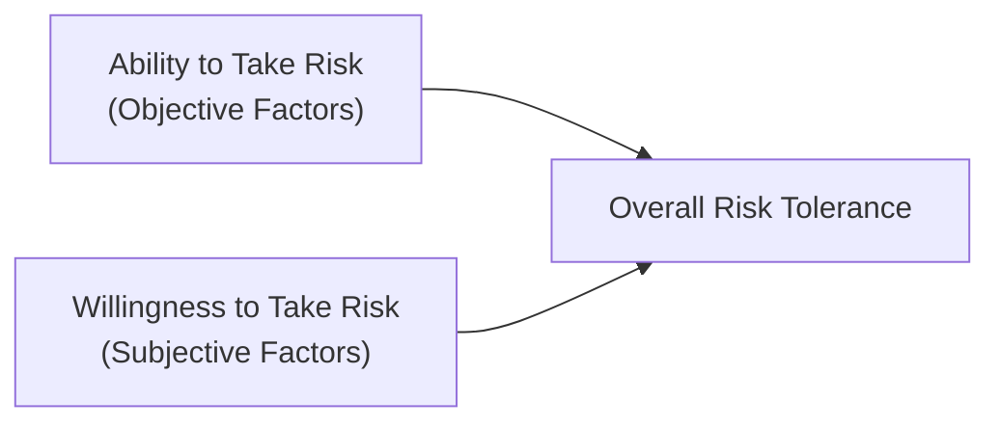

## Overview

Figuring out how much risk to take and what kind of return you’re aiming for are two of the biggest questions in portfolio management. After all, you might dream of earning double-digit returns every year, but if seeing your account balance drop by 20% in a bear market makes you lose sleep, your ideal strategy will look very different than someone who is happy to ride out volatile swings. This section focuses on balancing investors’ capacity for financial risk—influenced by wealth levels, time horizons, and economic realities—and their willingness to accept risk, which is influenced by personal comfort with uncertainty, emotional resilience, and past investment experiences.

In the CFA curriculum, risk and return objectives are essential in forming the Investment Policy Statement (IPS). Your risk objective determines how aggressively or conservatively you choose and weight asset classes, while your return objective sets the bar for what you hope to achieve over time, either in absolute or relative terms.

## Defining Risk Tolerance and Return Requirements

When it comes to building a portfolio, it’s helpful to think of risk tolerance as two separate but related considerations:

• Ability to Take Risk (Risk Capacity)  
• Willingness to Take Risk (Risk Tolerance)

And, of course, neither of these mean much without a clearly stated return objective. Let’s explore these dimensions in more detail.

## Dimension 1: Ability to Take Risk (Financial Capacity)

Your “ability” to take risk refers to the objective financial capacity to accept downside fluctuations without jeopardizing important goals. When I was helping a family friend manage her retirement account, she had more than enough wealth, a stable pension, and a 20-year runway. Simply put, she had a high capacity to absorb short-term losses because she wouldn’t need the money for quite a while. Conversely, imagine someone who’s just a few years from retirement with minimal financial reserves; that person can’t afford a steep portfolio decline.

Key factors that shape ability to take risk:

• Net Worth and Income Stability: Larger net worth and steady cash flows (like stable salaries or annuities) typically increase risk capacity.  
• Time Horizon: The longer the investment horizon, the more time there is to recover from market downturns.  
• Liquidity Requirements: If you need frequent withdrawals, you have less tolerance for large swings because you might be forced to sell assets at depressed prices.  
• Goals and Liabilities: High future obligations or short-term spending needs reduce the capacity for risk.

A good way to visualize the interplay of “Ability” and “Willingness” is with a simple diagram:

Even if you have a strong financial foundation (Node A), you may still end up with a low overall risk tolerance unless you also have the subjective comfort level for it (Node B).

## Dimension 2: Willingness to Take Risk (Psychological and Emotional Factors)

Willingness to take risk, or subjective risk tolerance, revolves around how comfortable an investor feels with the possibility of losing money. In one of my earliest roles, I worked with an entrepreneur who had recently sold a successful start-up. He had plenty of financial means (meaning high ability), but after weathering the ups and downs of building his business, he felt quite uneasy seeing a portfolio decline more than 5%. Because of that emotional reaction to market swings, we dialed down the portfolio’s equity exposure even though purely from a wealth standpoint, he could have afforded more risk.

Indicators of willingness to take risk:

• Past Investment Experience: Investors who have been through several market cycles might be more comfortable with volatility—unless prior losses were traumatic.  
• Psychological Profile: Tools like questionnaires can gauge comfort with hypothetical scenarios (e.g. “How would you react if your portfolio value dropped by 15% in a quarter?”).  
• Behavioral Biases: Overconfidence, loss aversion, regret minimization, and other common biases, discussed in Chapter 5, shape how individuals perceive and endure risk.

## Integrating Risk Tolerance Dimensions

When building an IPS, you combine both dimensions—ability and willingness—and ultimately adopt the more conservative stance between the two. If an investor has moderate capacity but a very low psychological tolerance, the final risk level should reflect that lower threshold to preserve peace of mind. Conversely, if someone has only a modest ability to endure losses but wants to chase big returns by adopting higher risk investments, it’s important to realign expectations or encourage a more realistic approach so they don’t jeopardize their financial goals.

Here’s a mental exercise: Suppose you have a large equity allocation in an attempt to “beat the market,” but your investor panics and sells at the first sign of trouble. That mismatch between high risk and low willingness to accept volatility can be disastrous for performance. Clear, upfront communication about risk tolerance helps avoid such pitfalls.

## Return Objectives and Types of Goals

Once you pin down risk tolerance, the next step is to state a desired or required return. Return objectives can be wrapped around tangible goals—like funding a child’s education or achieving a certain level of retirement income—or around intangible targets, like simply “beating the market.”

Common forms of stated return objectives:

• Absolute Return Objective: A target that doesn’t rely on comparing performance to an index. For example, “Aim for an annualized 5% real return” or “Generate an annual income of $50,000.”  
• Relative Return Objective: A performance benchmark relative to an index or peers. For instance, “Outperform the S&P 500 by 2% per year” or “Achieve returns in the top quartile of our peer group.”

### Linking Risk to Return

We all know that in finance, expected returns generally increase with risk, but not always proportionally. That means if you aim for a higher return, be prepared for bigger potential drawdowns. Mathematically, you might see the expected return concept as:

$$
E(R_p) = \sum_{i=1}^{n} w_i \, E(R_i)
$$

where \\( w_i \\) represents the portfolio investment weights, and \\( E(R_i) \\) is the expected return of each asset. The higher each \\( E(R_i) \\), the more volatility your portfolio may carry, especially if those assets correlate with each other significantly.

### Return Requirements in Institutional Contexts

For certain institutional investors, like endowments or pension plans, return objectives might be geared toward sustaining a specific spending target:

• An endowment might need a 5% real return to cover annual scholarships and operational costs—plus inflation.  
• A pension plan might aim for 7% nominal returns to stay properly funded, factoring in the discount rate used for liabilities.

Of course, how feasible these targets are depends on both the institution’s willingness to bear volatility (board and stakeholder attitudes) and, crucially, its long-term financial status or “unconditional ability” to take risk.

## Time Horizon Considerations

Your time horizon is basically how long until you need the money. Investors with long horizons (think 30-year-old saving for retirement) can often handle more short-term volatility than someone nearing retirement. Generally, the longer the time horizon, the more risk capacity you have, which can allow for a higher return objective.

That said, there can still be constraints—like near-term liquidity needs or legal obligations—limiting how long you can keep money locked up. Time horizon also influences the type of return objective you set. Certain return targets might be more realistic when spread out over 15+ years versus trying to achieve them in a 3- to 5-year timeframe.

## Common Pitfalls and Mismatches

• Overestimating Willingness: Some folks imagine they are comfortable with high volatility. Then the first 10% drawdown arrives, and they bail.  
• Underestimating Ability: This can lead to overly conservative portfolios that fail to meet long-term objectives (e.g., trailing inflation and losing purchasing power).  
• Conflicting Goals: Wanting 10% annual returns but unwilling to endure losses. This mismatch either requires adjusting the expectation or accepting higher volatility.  
• Neglecting Time Horizon Shifts: As people get closer to large expenses or retirement, their capacity for risk often drops, requiring updated allocations.

## Case Study: Retiree vs. Mid-Career Professional

Two real-life examples to illustrate these concepts:

• Retiree with Modest Savings  
  - Ability to Take Risk: Low (limited time horizon, needs steady income, has no large alternative assets).  
  - Willingness to Take Risk: Moderate (some acceptance of market swings but can’t afford large losses).  
  - Portfolio Implication: Emphasis on stable, income-generating assets, likely with a portion in high-grade bonds and conservative equities.

• Mid-Career Professional with High Salary  
  - Ability to Take Risk: High (long time horizon, stable career, large emergency fund).  
  - Willingness to Take Risk: Low (dislikes seeing monthly statements in the red).  
  - Portfolio Implication: Balanced equity-bond mix, but possibly toned down on small-cap or emerging market equities. Education might help raise willingness over time by normalizing market volatility.

## Monitoring and Reassessing

Risk and return objectives aren’t set in stone. Life events—like marriage, inheritance, job loss, or a sudden windfall—can shift your financial picture significantly. Likewise, macroeconomic changes can affect the range of feasible returns. Let’s say you set a 7% long-term target during a period of high interest rates. If interest rates plunge, you might have to accept more market risk to hit that same target. Revisiting the IPS annually or after major life/market events helps keep things aligned.

## Best Practices

• Align Risk Tolerance with Realistic Return Goals: This often avoids painful “sticker shock” if the portfolio experiences volatility.  
• Communicate Thoroughly with Stakeholders: Whether it’s a board of directors or a family, everyone should understand the potential ups and downs.  
• Use Scenario Analysis: Tools like Monte Carlo simulations (discussed later in Chapter 2.12) help show how different risk allocations might pan out under various market conditions.  
• Document Everything: Written IPS guidelines ensure clarity and help maintain discipline when markets get heated—or scary.  
• Keep Eye on Behavioral Biases: Overconfidence, herding, or panic selling can disrupt even well-planned strategies.

## Practical Example of Determining Risk and Return Objectives

Below is a simplified step-by-step structure you might see in a real investment policy process:

1. Assess the Investor’s Constraints and Goals:  
   - Income requirements, upcoming expenses, personal goals (education, retirement, philanthropy).  
   - Evaluate disposable capital, net worth, existing liabilities.

2. Evaluate Ability to Take Risk:  
   - Time horizon, wealth, job security, backup resources.  
   - Potential short-term liquidity needs and mandatory outflows.

3. Determine Willingness to Take Risk:  
   - Personal or institutional risk attitudes.  
   - Historical reactions to portfolio drawdowns and volatility.  
   - Use structured questionnaires or interviews to measure comfort levels.

4. State a Return Objective:  
   - Could be absolute (e.g., 5% net of inflation) or relative (e.g., 2% above a specific benchmark).  
   - Align with risk capacity (avoid setting high return targets if the investor is sensitive to losses).

5. Finalize the Portfolio Allocation:  
   - Asset classes selected in line with risk–return trade-offs.  
   - Incorporate diversification, ensure alignment with liquidity needs and time horizon.

6. Ongoing Review and Adjustments:  
   - Monitor performance, track changes to personal or market conditions.  
   - Rebalance or revise objectives as needed.

## A Quick Glimpse at the Risk–Return Trade-off

One of the central ideas of portfolio theory is that you get compensated for bearing systematic risk. Suppose you want a higher expected return by tilting your portfolio towards equities over bonds. This tilt implies increased volatility and potential drawdowns. If you’re chasing a super-ambitious annual return target, you might have to stomach losing 20% or more during a severe market downturn. Recognizing this interplay upfront is a pillar of prudent portfolio management.

## Conclusion and Exam Tips

Defining risk and return objectives is the heart of effective portfolio planning. You can’t simply choose securities and hope for the best. You’ve got to understand the investor’s capacity and willingness to stomach volatility, and then shape a return target that meets real needs without pushing beyond psychological or financial comfort zones.

• Ensure you can articulate how an investor’s personal or institutional goals influence both risk capacity and desired returns.  
• In scenario-based exam questions, watch for mismatches between the investor’s stated risk preference and the objective facts—like liquidity constraints or short time horizons.  
• Know the difference between absolute and relative return targets, and be able to draft an IPS statement that includes both risk and return considerations.  
• For item sets or constructed-response questions, apply a structured approach: first interpret the investor’s situation, then seamlessly connect it to a well-reasoned risk and return objective.

You’ve got this! The more carefully you consider both sides of the risk-tolerance coin, the more likely your portfolio recommendations will stand up in real-world markets—and on the CFA exam.

## References

- Maginn, J., Tuttle, L., Pinto, J., & McLeavey, D. (2007). Managing Investment Portfolios: A Dynamic Process. CFA Institute Investment Series.  
- Reilly, F. & Brown, K. (2011). Investment Analysis and Portfolio Management. Cengage Learning.  
- Bernstein, P. (1996). Against the Gods: The Remarkable Story of Risk. Wiley.  

## Risk and Return Objectives Knowledge Check



### Which statement best defines "ability to take risk" in the context of portfolio management?

- [ ] It is the degree of psychological comfort an investor has with experiencing losses.
- [x] It is the investor’s financial capacity to absorb potential losses without jeopardizing critical goals.
- [ ] It is the legal limitation on the asset types an investor can hold.
- [ ] It is an institutional requirement that focuses on beating a certain benchmark.

> **Explanation:** Ability, or “risk capacity,” represents the objective financial aspect of risk tolerance, focusing on whether the investor can weather a loss without undermining future goals.

### When an investor's willingness to take risk surpasses their ability to take risk, what is the recommended approach?

- [ ] Encourage them to invest aggressively because emotional optimism often leads to better returns.
- [ ] Let them invest more conservatively until their emotional comfort matches their ambition.
- [x] Align the portfolio with the more conservative limit, respecting financial capacity over subjective preferences.
- [ ] Split the difference evenly between the two positions.

> **Explanation:** Best practice is to adopt the lower of the two constraints. If someone’s enthusiasm for risk outstrips their actual financial cushion, the portfolio should lean more conservative.

### Which of the following typically increases an investor’s ability to take risk?

- [ ] Short time horizon.
- [x] Significant net worth and stable income.
- [ ] Aversion to portfolio drawdowns.
- [ ] Need for immediate income from investments.

> **Explanation:** High net worth and reliable income streams make investors more capable of absorbing losses; it increases their objective risk capacity.

### For an investor who wants a 5% real (inflation-adjusted) return annually, which statement is correct?

- [ ] This is considered a relative return objective.
- [x] This is considered an absolute return objective.
- [ ] This objective is only meaningful if the inflation rate is 3%.
- [ ] This can only be achieved by investing entirely in equities.

> **Explanation:** A target return that does not reference a benchmark is an absolute return objective.

### Which factor primarily influences willingness to take risk?

- [x] Behavioral and emotional comfort with short-term volatility.
- [ ] Unpaid debts or liabilities.
- [x] Past experiences that shape the investor’s attitude toward market drawdowns.
- [ ] Time horizon length.

> **Explanation:** Willingness is about psychological and emotional predispositions toward risk. While time horizon and debts matter for ability, the emotional aspect is crucial for willingness.

### When return objectives are set relative to a benchmark index, what potential pitfall should investors be aware of?

- [x] They might take on unintended levels of active risk to outperform the benchmark.
- [ ] They can ignore major drawdowns because the index return is guaranteed.
- [ ] They automatically achieve less volatility.
- [ ] They can’t be measured over short time spans and remain accurate.

> **Explanation:** Chasing benchmark outperformance can sometimes push investors into higher beta (or factor) exposures than intended, increasing volatility beyond comfort.

### If an investor has a high level of financial resources (Ability) but a very low tolerance for market volatility (Willingness), how should the portfolio be positioned?

- [x] It should align closer to the investor’s lower willingness profile, favoring more conservative assets.
- [ ] A 100% equity approach is warranted because the investor has enough money.
- [x] It should contain mostly short-term instruments like T-bills, ignoring all alternatives.
- [ ] It should match their ability to take risk to maximize returns.

> **Explanation:** Despite the ability to bear losses, if the investor’s subjective acceptance of volatility is low, the prudent approach is to take less risk. Otherwise, they’re likely to exit at the worst time.

### In setting an absolute return objective of 6% per year, what is the most significant challenge for the advisor?

- [x] Explaining that market conditions can vary, so returns may fall below or exceed 6% in certain cycles.
- [ ] Changing the investor’s net worth so that a 6% goal is always achievable.
- [ ] Guaranteeing that 6% is achievable with zero risk of principal loss.
- [ ] Minimizing taxes to turn a 6% nominal goal into a 9% after-tax goal.

> **Explanation:** Absolute targets don’t move with the market. In poor market environments, meeting that target might require excess risk or might not be feasible. Transparency about uncertainty is key.

### Time horizon primarily affects risk capacity because:

- [x] A longer time horizon allows more room to recover from portfolio drawdowns.
- [ ] It reduces the correlation of returns within the portfolio to zero over time.
- [ ] It guarantees a higher rate of return.
- [ ] Behavioral biases vanish when investors commit to a long horizon.

> **Explanation:** The longer the time frame, the more opportunity to ride out downturns and compound returns, boosting risk capacity.

### True or False: An investor’s risk tolerance is purely determined by their personal willingness to accept losses.

- [x] True
- [ ] False

> **Explanation:** The statement is actually incomplete because risk tolerance also includes the objective “ability” dimension. However, the question as phrased is guiding you to realize that willingness alone is not the full story—yet it is often what people think of first. It’s a bit of a trick question: if taken literally, the statement is false because ability to bear risk also matters. But in the context of this question, if we interpret “risk tolerance” as the overall concept, it is indeed shaped by willingness—though not “purely.” This ambiguous question highlights that many assume “tolerance” only refers to emotional factors, whereas in practice, it must also consider financial capacity.




