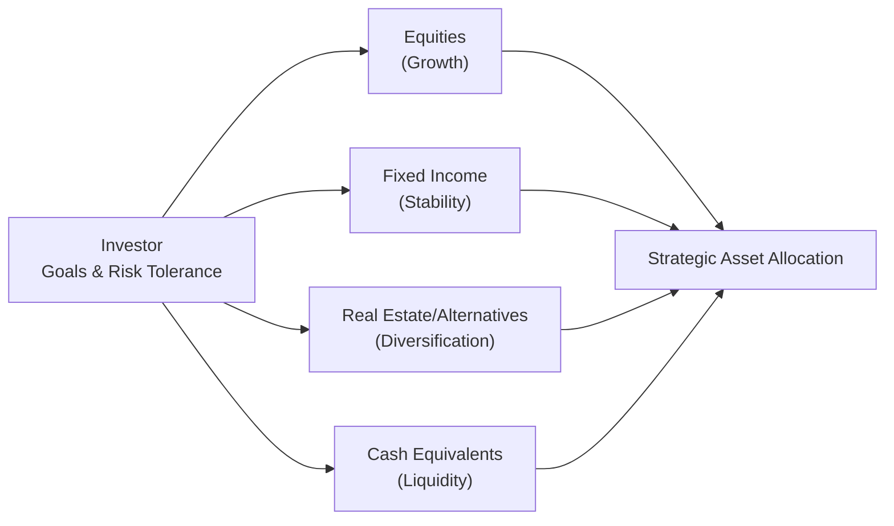

Overview of Asset Classes  
It’s funny, but I still remember when I first heard about “asset classes”—I was on a bus to my internship in downtown Chicago, reading a beginner’s finance book and thinking, “Wait, not all investments behave the same way!” That was a lightbulb moment. In the broadest sense, an asset class is a category of investments that share similar characteristics, such as how they generate returns or the kinds of risks they carry. You’ll often hear about the “Big Four” asset classes:

• Equities (stocks)  
• Fixed income (bonds)  
• Real estate (often considered part of alternatives or as its own category)  
• Cash and cash equivalents  

Some folks also consider alternative investments—like private equity, hedge funds, or commodities—as a separate umbrella. The idea is that each group exhibits distinct return patterns, correlations, and typical volatility profiles, and these differences can make or break your portfolio’s performance.  

Equities usually deliver growth (though there’s downside risk in volatile markets). Bonds typically offer income and stability (though credit risk and interest rate risk factor in). Real estate can provide steady rental income and long-term appreciation, but with unique liquidity constraints. Cash equivalents (like money market instruments, T-bills, or your savings account) keep your power dry with minimal risk, albeit at the cost of low returns.  

Role of Asset Classes in a Portfolio  
Each asset class plays a different role. Equities, for instance, drive portfolio growth over the long haul—think about your retirement account that has a big chunk in stocks if you’re far from retiring. Bonds add a dose of stability, because (generally) they don’t swing up and down as wildly as equities do. Meanwhile, real estate can sometimes provide a hedge against inflation and a stream of rental income. Cash equivalents come in handy for liquidity needs or for opportunistic rebalancing when you predict market dislocations.  

But let’s be real: the exact boundaries between asset classes can blur. A convertible bond might behave a bit like a bond and a bit like a stock. A real estate investment trust (REIT) sometimes acts more like an equity than a physical property. And some alternative investments will have equity-like risk but bond-like payoffs (or vice versa). As an investor, the key is figuring out how each piece sits in your portfolio puzzle.  

Strategic Asset Allocation in a Nutshell  
Strategic asset allocation is the big-picture, long-term blueprint that dictates what fraction of your portfolio goes into which asset classes. It’s carefully anchored to your Investment Policy Statement (IPS)—which clarifies your goals, risk tolerance, time horizon, and constraints. The idea is to settle on a mix of equities, fixed income, real estate, and possibly alternatives that aligns with your unique situation.  

Take, for instance, a hypothetical endowment that has a distant time horizon: it might lean more heavily into equities and alternatives for growth, while sprinkling in some bonds and cash to cover short-term liquidity. Meanwhile, a near-retiree might want more stability in fixed income and less equity risk.  

Setting Target Weights  
Let’s say you decide that 60% equities, 30% fixed income, and 10% real estate or alternatives suits your risk profile. Those proportions of 60%, 30%, and 10% become your “target weights.” You’re basically defining each asset class’s share of your portfolio. These target weights aren’t random guesses. You might draw on:  

• Historical performance data: Looking at how each asset has behaved over the last 10, 20, or 30 years.  
• Forward-looking capital market assumptions: Judging what’s likely to happen given economic forecasts, interest rates, and corporate earnings outlooks.  
• Statistical modeling: Considering correlation matrices, expected returns, variance-covariance analyses, scenario assessments, and so on.  

When done right, the target weights aim to maximize the portfolio’s expected return for a given level of risk.  

Correlation Benefits and Diversification  
Diversification is about not putting all your eggs in one basket. We all hear this cliché, but it gets at the heart of strategic asset allocation. You want asset classes that aren’t perfectly correlated with each other, so that when one slumps, another might pick up the slack—or at least not get dragged down in lockstep.  

In formula terms, correlation (ρ) between two assets X and Y is expressed as:


\rho_{X,Y} = \frac{\mathrm{Cov}(X,Y)}{\sigma_X \, \sigma_Y}


Where:  
• Cov(X,Y) is the covariance between assets X and Y.  
• σ_X is the standard deviation of X.  
• σ_Y is the standard deviation of Y.  

If ρ = 1, they move in perfect tandem; if ρ = –1, they move exactly opposite. Somewhere in between suggests partial correlation. Lower correlations among asset classes can reduce overall portfolio volatility and preserve returns—powerful stuff.  

Here’s a simple visual of how various asset classes can fit into a strategic allocation model:



The idea is that your personal (or institutional) goals flow into the selection of different asset classes, which, in turn, come together in a cohesive strategic asset allocation.  

Maintaining the Strategic Allocation (Rebalancing)  
Market prices fluctuate daily, so your carefully planned 60% stocks, 30% bonds, 10% real estate might become 70% stocks after a big equity rally and 20% bonds, 10% real estate if you just leave it alone. Over time, that drift can expose you to unintended risk. Enter rebalancing.  

Rebalancing is the process of selling some of the “winners” (assets that have grown beyond their target) and buying some of the “losers” (assets that have shrunk or grown less than others) to bring the portfolio back to target weights. It may feel counterintuitive—it sometimes means selling strong performers and buying weaker performers—but it’s a discipline that helps maintain your intended risk profile.  

Common rebalancing approaches include:  

• Calendar-based rebalancing: Check every quarter or year, and rebalance if your allocations exceed some threshold.  
• Tolerance-based rebalancing: Rebalance only when an asset class drifts above or below a certain band around the target (e.g., ±5%).  
• Cash-flow-based rebalancing: Use new contributions or distributions to offset any drift.  

In practice, large institutional investors might rely on a mix of these approaches. Smaller investors might prefer a simpler calendar-based method. Whichever you choose, the point is to keep your strategic allocation intact over the long run.  

Historical vs. Forward-Looking Perspectives  
Plenty of arguments abound about which data set to emphasize. Some folks rely heavily on historical returns and volatilities. Others say, “Past performance is no guarantee of future results,” which is absolutely correct. And so they form forward-looking assumptions (e.g., “We’re probably heading into a rising interest rate environment, so bond returns may be lower than their historical average.”).  

In reality, you need both. Historical data provide context and a sense of average returns, volatilities, and correlations over time. But forward-looking capital market assumptions better align with immediate realities, like evolving geopolitical scenarios or changes in monetary policy. That’s how we keep our strategic asset allocation relevant.  

Staying Long-Term Focused  
Strategic asset allocation is written in your IPS for a reason: It’s meant to outlast your daily anxieties about short-term market gyrations. So if you turn on the news and see stocks plunging or bonds spiking, your strategic allocation reminds you to stay calm and keep your eyes on the horizon. After all, the plan was designed to capture returns over your entire investment horizon, not just the next few months.  

If conditions change drastically—like, say, a sudden shift in personal liquidity needs or a major life event—sure, you revisit your strategic targets. However, you don’t just muscle your way out of an asset class out of fear for short-term events, especially if your time horizon remains the same.  

Practical Example  
Suppose you’re managing a university endowment (time horizon = indefinite). The endowment’s mission is to preserve capital and fund scholarships. After analyzing historical data (Ibbotson SBBI, for instance) and consulting with the investment committee, you might propose the following strategic allocation:

• 50% Equities (domestic and international)  
• 25% Fixed Income (core investment-grade bonds)  
• 15% Alternatives (hedge funds, private equity, or real assets)  
• 10% Real Estate (direct property holdings or REITs)  

You periodically measure how well each asset sleeve contributes to return, correlation benefits, and volatility management. You also keep an eye on forward-looking metrics—like how interest rates might evolve—and might slightly tweak that 25% fixed income portion into shorter duration bonds if you expect a rising rate environment.  

Let’s illustrate a hypothetical annual rebalancing in Python pseudo-code, just to see how it might look in practice. The code snippet below imports historical returns, checks any drift beyond a 5% threshold, and triggers orders:

```python
import numpy as np

returns_equity = 0.12
returns_bonds = 0.03
returns_alts = 0.10
returns_re = 0.08

allocation = {
    'Equities': 0.50,
    'Bonds': 0.25,
    'Alternatives': 0.15,
    'RealEstate': 0.10
}

portfolio_value = 100000000

end_values = {
    'Equities': portfolio_value * allocation['Equities'] * (1 + returns_equity),
    'Bonds': portfolio_value * allocation['Bonds'] * (1 + returns_bonds),
    'Alternatives': portfolio_value * allocation['Alternatives'] * (1 + returns_alts),
    'RealEstate': portfolio_value * allocation['RealEstate'] * (1 + returns_re)
}

total_end_value = sum(end_values.values())
new_weights = {k: v / total_end_value for k, v in end_values.items()}

for asset_class, weight in new_weights.items():
    drift = weight - allocation[asset_class]
    if abs(drift) > 0.05:
        print(f"{asset_class} drifted by {drift:.2%}, rebalancing needed.")
        # Trigger buy/sell logic here
    else:
        print(f"{asset_class} within tolerance at {weight:.2%}.")
```

You might see that equities have grown to 55% of the total (a 5% drift from the target of 50%). If that crosses your threshold, you rebalance by selling some equities and reinvesting in other asset classes.  

Common Pitfalls  
• Overreacting to short-term news: Changing your allocation drastically whenever volatility rears its head can undermine long-term goals.  
• Operating with flawed assumptions: Using stale or unrealistic data on returns and correlations can skew your entire allocation.  
• Ignoring liquidity: Some alternatives come with lock-up periods or limited exit windows. Make sure you have enough cash or liquid bonds.  
• Setting and forgetting: While you shouldn’t micromanage, you also can’t ignore major shifts in your life or the marketplace.  

Overcoming Challenges  
• Stress testing: Run scenario analyses on the strategic allocation to see how it’d perform in crisis environments (e.g., 2008 financial crisis).  
• Periodic reviews: Once or twice a year, ensure the assumptions in your allocation are still valid and that your portfolio remains aligned with your objectives.  
• Holistic approach: Blend historical data with forward-looking insights, leaning on robust models or external advisors as needed.  
• Commit to discipline: Implement an explicit rebalancing policy. That often requires emotional fortitude (“selling winners” can be psychologically tough).  

Mini Case Study: Individual Investor  
Imagine a 40-year-old professional, Sarah, aiming to retire at 65. She has moderate risk tolerance, a stable job, and no significant near-term cash needs. Her strategic allocation might be:

• 60% Equities (some portion in global equities)  
• 30% Bonds (mix of government and corporate)  
• 10% Alternatives (maybe real estate, or small allocations to hedge funds via a mutual fund)  

Sarah rebalances each year to maintain these targets (with a ±3% tolerance band). When her equity portion rises to 65% after a market surge, she sells 5% and buys more bonds or alternatives to stay in line with her strategic plan.  

Final Exam Tips (CFA® Relevance)  
• Linking to the IPS: Always reference an investor’s IPS to guide strategic allocation. If the question on an exam reveals risk and return objectives, constraints, and time horizon, interpret them to propose a plausible set of target weights.  
• Correlation in practice: Be prepared to calculate or interpret correlation coefficients. If the question references correlation among asset classes, you might have to evaluate the diversification benefits.  
• Real-world assumptions: You might need to demonstrate how forward-looking statements (like “interest rates will rise”) affect your recommended allocation.  
• Show your work: On the CFA exam, clarity in your assumptions and your step-by-step approach to deriving a strategic allocation is key.  

References for Further Exploration  
• Elton, E. J., Gruber, M. J., Brown, S. J., & Goetzmann, W. N. (2014). Modern Portfolio Theory and Investment Analysis. Wiley.  
• Ilmanen, A. (2011). Expected Returns: An Investor’s Guide to Harvesting Market Rewards. Wiley.  
• Ibbotson, R., & Kaplan, P. (2000). Does Asset Allocation Policy Explain 40, 90, or 100 Percent of Performance? Financial Analysts Journal.  

• Fabozzi, F. J. (Ed.). (2008). Handbook of Finance. Wiley.  
• Morningstar’s Asset Allocation literature and white papers.  

Test Your Knowledge of Asset Class Definitions and Strategic Asset Allocation



### Which of the following statements best describes the concept of an asset class?

- [x] A group of securities with similar characteristics and risk profiles.
- [ ] All types of securities that are listed on an exchange.
- [ ] Any private market instrument with high returns.
- [ ] A collection of government bonds only.

> **Explanation:** An asset class is typically defined as a set of securities or instruments that share common risk and return characteristics (e.g., equities, bonds, real estate, etc.).

### A primary purpose of rebalancing a portfolio to strategic target weights is to:

- [x] Maintain the intended risk profile by selling over-allocated asset classes and buying under-allocated ones.
- [ ] React to short-term market news and fluctuations.
- [ ] Eliminate all transaction costs over time.
- [ ] Increase exposure to asset classes that have performed best recently.

> **Explanation:** Rebalancing helps maintain the original strategic allocation and, by extension, the intended risk–return profile. It's not meant for market timing, but rather for portfolio discipline.

### If two asset classes have a correlation coefficient of +1.0, it means:

- [ ] They move in perfectly opposite directions.
- [ ] They have zero systematic risk.
- [x] They move in perfect tandem with each other.
- [ ] Their returns are always negative.

> **Explanation:** A correlation of +1.0 indicates a perfect linear relationship, meaning they move together one-for-one.

### Which of the following is generally an advantage of combining asset classes with lower correlation in a portfolio?

- [x] Potential reduction in overall portfolio volatility.
- [ ] Guaranteed elimination of every risk.
- [ ] Immediate higher returns in all markets.
- [ ] Absence of any potential for negative returns.

> **Explanation:** Low correlation among asset classes can dampen portfolio volatility by providing diversification benefits. This does not guarantee elimination of all risk, but it helps moderate it.

### In strategic asset allocation, target weights are primarily determined by:

- [x] Long-term objectives, risk tolerance, and time horizon.
- [ ] Daily market price changes.
- [ ] Short-term economic cycles.
- [ ] The performance of the S&P 500 alone.

> **Explanation:** Strategic asset allocation is guided by the IPS, keeping a steady focus on risk, return needs, and the investment horizon—rather than daily market fluctuations.

### Which asset class is typically associated with providing the highest long-term growth potential but also higher volatility?

- [x] Equities
- [ ] Short-term cash equivalents
- [ ] Government bonds
- [ ] Money market funds

> **Explanation:** Equities are generally known to offer strong growth potential, albeit with increased volatility relative to bonds or cash equivalents.

### A retiree with a short time horizon and a low tolerance for volatility would typically:

- [x] Allocate a higher percentage to bonds or cash equivalents.
- [ ] Allocate a higher percentage to high-growth equities.
- [x] Reduce exposure to extremely volatile alternative assets.
- [ ] Invest solely in crypto assets for diversification benefits.

> **Explanation:** A retiree prioritizing capital preservation often holds a larger share in bonds or cash equivalents and may avoid high-volatility alternatives.

### A major reason some investors include real estate in their strategic asset allocation is because:

- [x] Real estate can potentially provide diversification and a hedge against inflation.
- [ ] Real estate always moves in tandem with equities.
- [ ] Real estate has zero credit risk.
- [ ] Landlord responsibilities are minimal for property owners.

> **Explanation:** Real estate often exhibits a different pattern of returns than equities or bonds, and it can serve as an inflation hedge. However, it’s not risk-free and can have operational complexities.

### Which approach to rebalancing involves adjusting a portfolio only when asset weights deviate by a certain percentage from target allocations?

- [x] Tolerance-based (band) rebalancing
- [ ] Calendar-based rebalancing
- [ ] Market-timing rebalancing
- [ ] Momentum-based rebalancing

> **Explanation:** Tolerance-based (or band) rebalancing sets a threshold for deviation from the target, rebalancing only when that threshold is exceeded.

### True or False: Strategic asset allocation is expected to remain stable unless there is a significant change in the investor’s objectives or constraints.

- [x] True
- [ ] False

> **Explanation:** Strategic allocation is long-term and usually stays consistent until major changes (to risk tolerance, time horizon, or objectives) require a review and adjustment.


