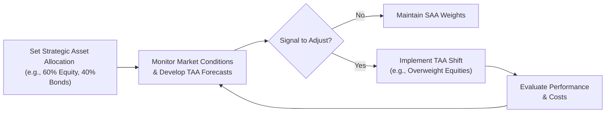
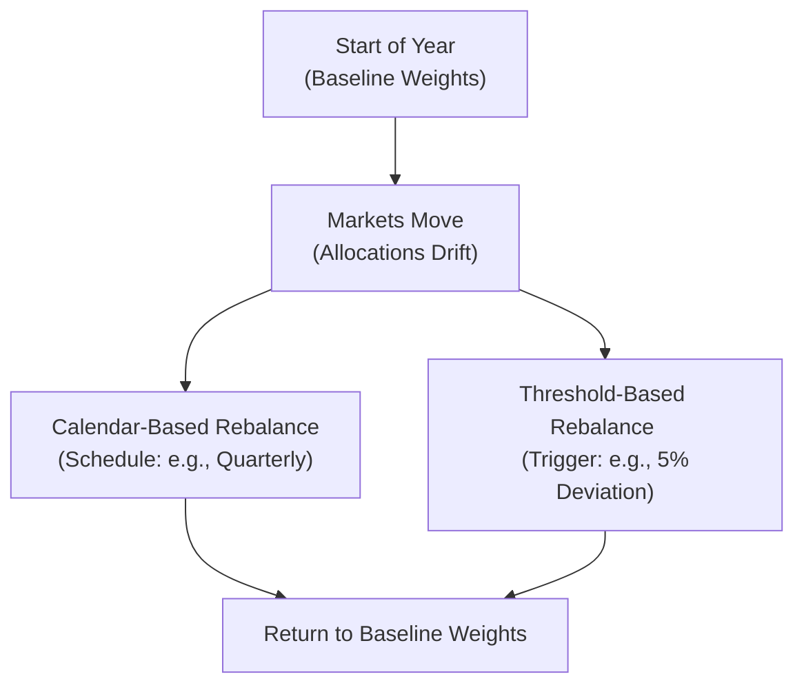

## Introduction

Picture this: you’re working with a client who has a well-defined strategic asset allocation—maybe 60% equities and 40% bonds. Then, you catch wind of a potential shift in the economic cycle. The Federal Reserve might be tightening rates sooner than expected, or global equity markets could be facing a short-term dip. Suddenly, a question arises: “Should we tilt our portfolio to capitalize on—or avoid—this imminent shock?” That’s basically the essence of tactical asset allocation (TAA) and rebalancing. TAA is about making short-term, active shifts from your baseline policy mixes, while rebalancing ensures you stay disciplined and aligned with your ultimate investment objectives.

In practice, TAA can sometimes feel like “market timing,” and let’s be honest—timing the market is notoriously tricky. But with sound quantitative and qualitative forecasts, plus disciplined processes to rebalance, TAA can play a serious role in enhancing portfolio returns or managing risk. This section explores TAA and the mechanics of rebalancing, shedding light on the benefits, pitfalls, and best practices you might want to keep on your radar.

## Tactical Asset Allocation vs. Strategic Asset Allocation

Strategic asset allocation (SAA) is usually your baseline plan—like aiming for that 60/40 split, or some blend that reflects a client’s long-term risk tolerance, goals, and needs. However, markets can sometimes hand you short-lived opportunities. Maybe valuations in certain equity sectors look too low (or sky-high!), or you believe a particular currency might strengthen in the coming quarter. That’s where TAA steps in.

Think of TAA as an active overlay designed to capture these short-term dislocations. You temporarily deviate from your SAA to overweight or underweight certain asset classes. Then, once the perceived market inefficiency plays out (or if your forecast changes), you rotate back toward your strategic weights.

### Potential Advantages of TAA

• Capture short-term opportunities.  
• Adjust for changing risk premia (e.g., if equities suddenly look very cheap).  
• Potentially reduce downside risk during market downturns.  

### Potential Disadvantages of TAA

• Requires accurate forecasting—easier said than done.  
• Elevated transaction costs, taxes, and operational complexity.  
• Possibility of introducing additional “active risk,” often measured by tracking error relative to a benchmark.  

Below is a conceptual diagram illustrating how TAA overlays your strategic policy targets:

As you can see, TAA does not replace your strategic mix; it just modifies it temporarily to reflect short-term insights.

## Skill in Forecasting Market Cycles

I’ll never forget the first time I tried TAA myself, early in my career, after reading about how some well-known portfolio managers shifted out of equities right before a tech bubble. I thought: “Alright, I can do that!” But forecasting is tough—macro trends involve analyzing economic indicators (like GDP growth, inflation), corporate earnings cycles, central bank policy, and even investor sentiment. Miss a key piece of data or interpret it incorrectly, and you can lose your edge quickly.

### Key Inputs for TAA Forecasts

• Macroeconomic indicators (e.g., interest rate trends, inflation expectations).  
• Company-level data (e.g., earnings growth, profit margins).  
• Momentum or technical analysis for identifying short-term market trends.  
• Behavioral aspects like investor sentiment or herding patterns.  

Professionals often rely on quantitative models—maybe a multifactor approach that incorporates valuation, macro, and sentiment indicators—to generate signals for TAA. Discretionary managers might also rely on a top-down approach, gleaning insights from global macroeconomic data and political news.

## The Rebalancing Process

At some point, even the best strategic allocation drifts out of alignment. Equities rally, for instance, and suddenly a 60/40 mix is 70/30. This can inadvertently raise the portfolio’s risk profile. Rebalancing is the practice of realigning the portfolio to keep it in line with either your SAA or your TAA positions. It helps ensure the portfolio continues to reflect the investor’s risk–return preferences.

### Calendar-Based vs. Threshold-Based Rebalancing

• Calendar-based approach says: “I’ll rebalance on a set schedule—maybe every quarter or once a year.”  
• Threshold-based approach says: “I’ll wait until my asset classes deviate from target weights by a certain percentage, say ±5%, before I make any trades.”  

Some managers employ a hybrid method: they check weights regularly and rebalance if they’re off by more than a certain threshold, or if a scheduled date to rebalance has arrived.

## “Buy Low, Sell High” and Other Benefits

Rebalancing sounds sophisticated, but the underlying principle is quite simple. When an asset class significantly outperforms, it grows beyond its intended weight, so you trim it back (selling high). Meanwhile, you top up the underperforming asset (buying low). In theory, it’s a systematic way to lock in some gains and maintain desired risk exposures. 

That said, rebalancing is no free lunch. It involves transaction costs (commissions, bid-ask spreads), possible tax implications (capital gains or losses), and administrative overhead. If you decide to rebalance too frequently, costs can erode the potential benefits of “buying low and selling high.” On the flip side, if you rarely rebalance, you risk letting your portfolio’s risk profile linger in an undesired territory—like letting equities balloon to 80% after a long bull run.

## Balancing Costs and Benefits

It’s often a trade-off:

• More frequent rebalancing = tighter control of risk profile, but increased costs.  
• Less frequent rebalancing = lower costs, but bigger risk divergences (and potentially bigger tax hits if you go a long time before you rebalance).  

So managers do a cost–benefit analysis. One practical approach: run simulations or historical backtests to see how different rebalancing frequencies work under various market conditions. You might find that quarterly or semiannual rebalancing is enough to manage risk without racking up excessive costs.

## Implementation Challenges

Tactical asset allocation looks attractive in theory, but to do it effectively, you need:

• A robust system for generating timely signals or forecasts.  
• A clear investment policy statement (IPS) that includes parameters for TAA activity—i.e., how far you can deviate before violating risk constraints.  
• A strong governance process, especially if you’re part of a large institution with committees that must approve major asset shifts.  
• Skilled personnel or external managers capable of interpreting economic data, technical indicators, and market sentiment swiftly.  

Occasionally, TAA might be implemented using derivatives (futures, options, swaps) rather than buying or selling actual securities. This approach can be more cost-effective, especially if the shift is expected to be short-term or if the manager wants to maintain positions in actual securities for the longer run.

## Practical Example of Rebalancing

Let’s illustrate a threshold-based rebalancing scenario. Suppose your client’s strategic target is:

- 50% large-cap equities  
- 30% fixed income  
- 20% international equities  

You set thresholds of ±5%. After a quarter of strong domestic equity performance, your large-cap portion rises to 58%, while fixed income shrinks to 25%, and international equities remain at 17%. Now your portfolio is out of balance:

• Large-cap +8% above target  
• Fixed income –5% below target  
• International equities –3% below target  

If your threshold rule is 5%, you’ll sell large-cap down to 50%, and buy fixed income and international equities to get them back to 30% and 20%, respectively. This is rebalancing in action, and it forces you to sell some of what’s hot and buy some of what’s not—potentially locking in profits.

## Case Study: The 2020 Market Volatility

During the initial wave of market disruption in early 2020, equities plunged, then rebounded quickly, while some fixed income markets seized up in liquidity. Some TAA managers decided to shift more into equities right after the big sell-off in March, capitalizing on depressed prices. Had they waited for a scheduled rebalancing date in April or June, they might’ve missed the earliest part of the rebound. Others stayed put, lacking conviction that the market would snap back so fast.

This difference in decision-making—those who quickly tactically allocated vs. those who stuck to their strategic baseline—highlights how TAA can be drastically impacted by short-term market dynamics. But keep in mind: it’s easy to wish you had gone all-in on equities only with the benefit of hindsight.

## Best Practices for TAA and Rebalancing

• Align TAA activities with your investment policy statement and risk guidelines.  
• Use disciplined, repeatable processes for identifying market opportunities—avoid making decisions purely on gut feelings.  
• Keep an eye on transaction costs and taxes—these can significantly degrade net returns.  
• Evaluate the performance of TAA decisions against a clear benchmark (e.g., the strategic allocation’s expected return or a multi-asset benchmark).  
• Perform scenario analyses or stress tests to see how TAA might behave in extreme markets.  
• Communicate these strategies clearly to clients or stakeholders, emphasizing that TAA involves a measure of active risk.  

## Diagram: Calendar vs. Threshold Rebalancing

The chart below compares calendar-based rebalancing (on a fixed schedule) with threshold-based rebalancing (triggered when allocation crosses a boundary):

With calendar-based rebalancing, you might wait for your quarterly date, even if the portfolio drifts significantly in the meantime. With threshold-based, you react as soon as a specific trigger is hit.

## Miscellaneous Considerations

• Behavioral Biases: Sometimes, you might feel reluctant to “sell winners.” That emotional hesitation can hamper rebalancing discipline.  
• Opportunity Cost: Even if your TAA call proves correct, tying up capital in short-term positions might keep you from investing in other ideas.  
• Consistency with Long-Term Goals: You don’t want TAA overshadowing the fundamental purpose of the portfolio.  
• Passive vs. Active Debate: While TAA is inherently active, some argue it’s still possible to integrate a largely passive approach with occasional, minimal tactical tilts.  

## Exam Tips

• Know the difference between SAA and TAA. TAA involves short-term deviations, SAA is your long-term anchor.  
• Understand how to evaluate performance attribution: which portion of returns came from TAA vs. just overall market movement?  
• Be cautious of the extra risk TAA introduces—especially if you’re employing leverage or derivatives.  
• For threshold-based rebalancing logic, remember to specify upper/lower bands.  
• Theoretically, rebalancing can add value by forcing “buy low, sell high,” but in exam scenarios, always consider transaction costs and taxes.  
• Practice with scenario-based questions: if equities rally 15% in a short period, how do you decide whether or not to rebalance?  
• If a question references a “core-satellite” approach, the “satellite” part often includes TAA or style-based bets.  
• Don’t forget that rebalancing guidelines should be included in the Investment Policy Statement (IPS), demonstrating how the manager adjusts the portfolio under various conditions.  

## References

• Jacobs, B. I., & Levy, K. N. (2016). Equity Management: The Art and Science of Modern Quantitative Investing. Wiley.  
• CFA Institute Research Foundation (various white papers on active vs. passive management).  
• PIMCO perspectives on TAA:  
  https://www.pimco.com/insights  

---

## Test Your Knowledge: Tactical Asset Allocation and Rebalancing Quiz



### When implementing tactical asset allocation (TAA), the primary objective is:
- [ ] Maintaining a strict buy-and-hold strategy.  
- [x] Capitalizing on short-term market dislocations.  
- [ ] Reducing annual portfolio turnover to zero.  
- [ ] Eliminating any risk of underperformance relative to benchmarks.  

> **Explanation:** TAA seeks to exploit short-term opportunities by deviating from the strategic baseline. It is not strictly buy-and-hold, and it carries the risk of under- or over-performance.

### In threshold-based rebalancing, a portfolio manager typically:
- [x] Rebalances only when asset weights drift beyond a preset deviation from target.  
- [ ] Rebalances at the end of each trading day.  
- [ ] Never rebalances unless a crash occurs.  
- [ ] Rebalances continuously based on real-time prices.  

> **Explanation:** Threshold-based rebalancing is triggered by a specific percent deviation, not on an arbitrary daily or event-driven schedule.

### A key disadvantage of more frequent rebalancing in a taxable portfolio is:
- [ ] Higher levels of market risk.  
- [x] Increased transactional and tax costs.  
- [ ] Reduced control of portfolio weights.  
- [ ] Greater reliance on passive strategies.  

> **Explanation:** Frequent trades can lead to higher transaction costs and capital gains taxes. Over-trading can erode the portfolio’s net returns, even if rebalancing helps maintain target risk levels.

### One reason TAA can be challenging to implement successfully is:
- [x] Accurate forecasting of short-term market trends is difficult.  
- [ ] It requires no changes to the investment policy statement.  
- [ ] Regulations prohibit short-term trades in most markets.  
- [ ] It does not require any skill or research.  

> **Explanation:** TAA involves anticipating short-term market shifts (or mispricings). Misjudging these trends can lead to poor performance.

### A possible benefit of threshold-based rebalancing (compared to calendar-based) is:
- [x] Reduced unnecessary trading if allocations have not drifted.  
- [ ] It never triggers trades at inopportune times.  
- [ ] It forces rebalancing at the exact same intervals each year.  
- [x] It might capture quick mean-reversion opportunities.  

> **Explanation:** Threshold-based rebalancing allows the portfolio to drift if changes are not large, thereby avoiding small trades. It can also react quickly when markets move sharply.

### A manager noticing that equities have substantially outperformed bonds and deciding to revert to the target weight exemplifies:
- [x] Rebalancing.  
- [ ] Leverage.  
- [ ] Dollar-cost averaging.  
- [ ] Arbitrage.  

> **Explanation:** Trimming the outperforming asset class back to its target is a classic illustration of rebalancing.

### Tactical asset allocation is best described as:
- [ ] Purchasing risk-free assets exclusively.  
- [x] Short-term tilts away from a strategic baseline to exploit perceived opportunities.  
- [x] Shifting allocations based on macro or market signals.  
- [ ] Eliminating active risk in the portfolio.  

> **Explanation:** TAA involves strategic short-term deviations from the long-term asset allocation to capitalize on short-term signals, thereby introducing some level of active risk.

### A potential advantage of a calendar-based rebalancing schedule is:
- [x] Simplicity and predictability in portfolio management.  
- [ ] Guaranteed avoidance of tax liabilities.  
- [ ] Maximized short-term trading gains.  
- [ ] No transaction costs.  

> **Explanation:** Calendar-based rebalancing is straightforward to execute and easy to plan. It does not guarantee tax avoidance or eliminate transaction costs.

### In periods of extreme market volatility, TAA decisions:
- [x] Can significantly impact performance, either positively or negatively, depending on accuracy of forecasts.  
- [ ] Always add value to a portfolio.  
- [ ] Have zero effect since the market is random.  
- [ ] Are prohibited by most investment policy statements.  

> **Explanation:** In highly volatile environments, TAA bets can produce outsized gains if forecasts are correct—or result in significant losses if the market goes the other way.

### Tactical asset allocation typically involves:
- [x] True  
- [ ] False  

> **Explanation:** TAA usually involves adding active risk relative to a carefully chosen baseline. By design, you’re betting that short-term deviations will produce better risk-adjusted returns than staying fully passive.


