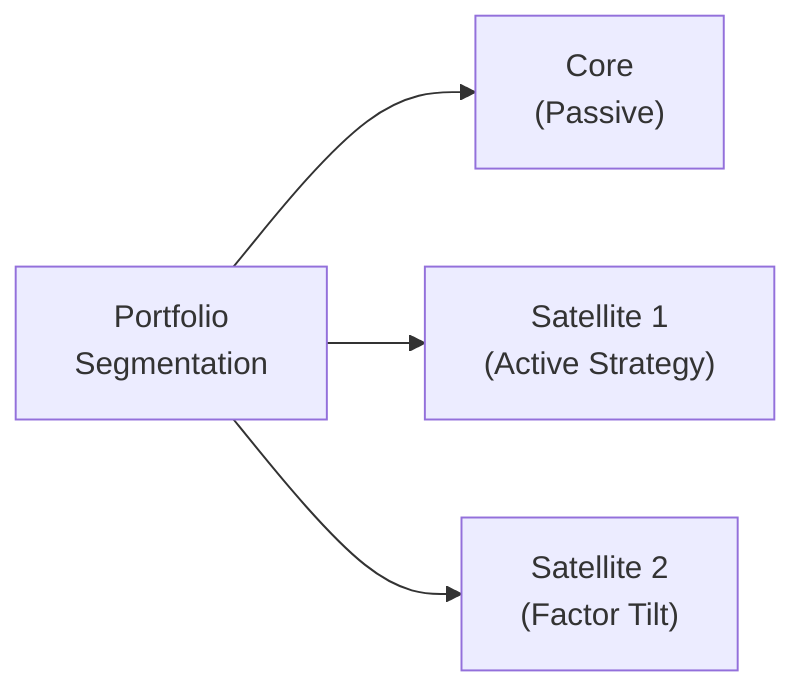

## Introduction
It’s funny—I still remember when I first discovered the idea of splitting a portfolio into a “core” and multiple “satellites.” I was interning at a small investment advisory firm. The lead portfolio manager drew a simple pie chart on the whiteboard and said, “Here’s your stable foundation, and here’s where you try to get a little ‘extra juice.’” At the time, I was new to the concept of controlling overall risk while still capturing potential alpha in specialized slices of the portfolio. That was my first taste of core-satellite investing—an approach that is now deeply embedded in many professional practices, from large institutions to personal wealth management.

Core-satellite investing is essentially a portfolio segmentation method. You segment your portfolio into different “buckets” for specific objectives. Your “core” is typically a group of stable, low-cost, broad-market assets. Then, around that core, you place smaller, more active or specialized “satellites” that aim to outperform or provide uncorrelated returns. By mixing the two, investors attempt to balance broad-market exposure and cost efficiency with opportunistic strategies that can (hopefully) add alpha.

Below, we’ll explore the core-satellite method in depth: why it’s used, how it’s implemented, and the potential pitfalls. We’ll also introduce alternative segmentation models, such as time horizon segmentation, and discuss how rebalancing rules tie the entire structure together. Finally, we’ll close with exam tips, references, and a brief quiz to sharpen your knowledge.

## The Rationale Behind Core-Satellite Investing
Core-satellite investing gained popularity as a middle ground between purely passive indexing and fully active portfolio management. Rather than completely relying on either approach, core-satellite investing recognizes that it might be more efficient to capture broad market returns (beta) with a low-cost, passive core, and then allocate a smaller portion of capital to strategies that potentially generate alpha.

• Control Costs: The bulk of your portfolio (the core) often consists of index funds or exchange-traded funds (ETFs) with minimal fees.  
• Seek Alpha: The satellites actively pursue outperformance through specialized strategies—think of themes like disruptive technology, clean energy, alternative investments, or region-specific allocations.  
• Risk Management: By sizing the satellites appropriately, you keep the overall portfolio risk in check. Even if one satellite underperforms, it’s generally a small part of the total portfolio.  
• Diversification: The core provides diversified market exposure. Each satellite can target distinct asset classes, styles (value, growth, momentum), or factors (quality, size, volatility), potentially enhancing total portfolio diversification.  

## Constructing the Core
The core portion frequently dominates the portfolio, sometimes representing anywhere from 50% to 90% of the invested capital. It aims to replicate or closely match the returns of a broad market benchmark (e.g., the S&P 500, a global equity index, or a broad bond index), providing the foundation upon which satellite strategies rest.

### Key Considerations for the Core
• Asset Class Selection: Typically, the core focuses on major equity and bond markets. Larger institutional investors might also include certain liquid alternatives or broad real estate indices if those are standard for their baseline exposures.  
• Cost Efficiency: Many investors prefer low-cost index funds (e.g., from Vanguard, iShares, or State Street) to minimize drag from fees.  
• Stability of Returns: The idea is not to hit home runs with the core but rather to capture market returns while controlling volatility at the broader portfolio level.  

Below is a simple diagram that illustrates the core-satellite framework:

In this schematic, you can see the main portion (Core) is designed to track a broad market, while the satellites can differ in both style and structure.

## Building the Satellites
Unlike the core, satellites are smaller “slices” of the portfolio intended to achieve specific objectives, often seeking alpha or diversifying risks. They can be carved out by sector (e.g., technology, consumer staples), by factor (e.g., value, momentum), or by opportunity (e.g., absolute return hedge funds or private equity). 

### Potential Satellite Strategies
• Sector or Theme Exposure: Suppose you have a strong conviction that healthcare will outperform for the next five years; you can allocate a small satellite to a healthcare-focused ETF or equity selection.  
• Factor Tilts: Interested in small-cap or high-quality stocks? Use a factor tilt strategy.  
• Alternative Investments: Hedge funds, private equity, real estate, or commodity-related products can complement your core.  
• Thematic Satellites: Emerging trends such as clean energy, artificial intelligence, or demographic shifts can serve as niche exposures.  
• Absolute Return: An absolute return satellite aims for positive performance regardless of market direction, often relying on hedging or specialized tactics (like global macro or event-driven strategies).  

### Sizing Satellites
Investors must decide how large each satellite position should be. This often depends on:  
• Risk Tolerance: If you’re more conservative, you may allocate only 10% to satellites; if you’re more aggressive, maybe 20% or more.  
• Conviction Level: The stronger your view on a strategy’s potential alpha, the larger you might size that satellite.  
• Liquidity Needs: Some strategies, especially alternative investments, have lock-up periods or lower liquidity. If you need frequent access to funds, you might think twice before going too big there.  

## Managing Risk Across Core and Satellites
At a broader portfolio level, risk management involves monitoring correlations among satellites and controlling overall drawdowns. Even though each satellite is relatively small, if you choose correlated satellites (e.g., all are high-beta technology funds), then you might lose the diversification advantage.

### Practical Example
Imagine you have a USD 1,000,000 portfolio. Let’s say you invest USD 800,000 (80%) in a broad equity+bond core index (like a 60/40 equity-bond blend). Then you allocate USD 100,000 (10%) to a small-cap growth fund, USD 50,000 (5%) to a developing markets absolute return fund, and USD 50,000 (5%) to a commodity ETF focusing on precious metals. This structure allows broad market exposure while leaving room for specialized, alpha-seeking, or diversifying bets.

## Other Segmentation Methods
While core-satellite is often the headline approach, there are other ways to slice your portfolio for different goals or time horizons. One of the common methods is dividing your portfolio based on when you might need the funds. 

### Time Horizon Segmentation
• Short-Term Bucket: A liquidity bucket holding cash or very low-volatility instruments to meet near-term expenses or liabilities.  
• Intermediate-Term Bucket: Moderately volatile assets, maybe intermediate-term bonds or balanced strategies—something to meet medium-term goals in three to five years.  
• Long-Term Bucket: Growth-oriented assets, such as stocks or alternative investments, designed to maximize returns over a 10-year horizon or more.  

For instance, some retirees adopt a “bucket” approach, where the first bucket covers 1–2 years of living expenses. This helps dampen the stress of market fluctuations if the equity market dips; they know they can draw from their short-term bucket. Meanwhile, the longer-term buckets can be invested more aggressively.

## Rebalancing the Segments
Regardless of the segmentation strategy—core-satellite, time horizon “buckets,” or a combination—rebalancing is crucial. Balancing tends to mean selling a bit of what has grown large and buying some of what has underperformed relative to your strategic target. 

### Rebalancing Considerations
• Frequency: Some investors rebalance on a set schedule (e.g., quarterly, annually). Others rely on threshold triggers (e.g., when an asset class deviates by more than ±5% from target).  
• Tax Implications: Selling winners can lead to capital gains. If applicable, you might incorporate tax-loss harvesting to offset gains or rebalance within tax-sheltered accounts first.  
• Transaction Costs: An overly frequent rebalancing schedule can escalate costs, which can undermine long-term returns.  

## Potential Pitfalls and Best Practices
Even though segmentation simplifies portfolio management, it’s not entirely foolproof. Below are a few common issues:

1. Overconcentration: It’s easy to load up satellites with overly similar strategies: multiple growth funds, multiple high-yield bond funds, etc. That might reduce the benefits of diversification.  
2. Improper Rebalancing: Neglecting rebalancing might make the portfolio drift—a satellite that performs well may become outsized, inadvertently increasing portfolio risk.  
3. Extra Complexity: Some satellite strategies are complex and require in-depth expertise—for instance, certain alternative investments, derivatives-based overlays, or illiquid private equity deals.  
4. Cost Creep: While the core is typically cheap, the satellite portion can become expensive if you use multiple active managers or specialized instruments. Keep an eye on expense ratios, performance fees, and trading commissions.  
5. Behavioral Biases: Sometimes, we allocate to “flavor-of-the-month” thematic satellites without thorough due diligence, making it akin to speculation rather than genuine portfolio construction.

## Real-World Scenario: Pension Fund Example
Let’s say a defined-benefit pension plan has a large pool of assets that must meet future liabilities over decades. They might place 70–80% in a diversified global equity and bond blend (their “core”). Then, they might invest 10% in private equity (seeking illiquidity premiums), 5% in real estate, and 5% in a few absolute return hedge funds. Such a combination aims to meet long-term return targets while reducing reliance on a single asset class.

## Exam Tips and Common Pitfalls for CFA Candidates
• Know the Components: Be sure you can delineate the “core” from the “satellites” and articulate their respective roles.  
• Link with Mean-Variance Concepts: Expect Level III exam questions connecting core-satellite to risk control, correlations, and diversification.  
• Focus on Implementation Details: You may see scenario-based questions on how to choose satellites, frequency of rebalancing, or constraints like liquidity, taxes, and regulatory guidelines.  
• Be Prepared for Behavioral Aspects: Core-satellite strategies help mitigate impulsive decisions—part of managing client expectations.  
• The “Why” Matters: Examiners often probe your justification for using the core-satellite approach or alternative segmentation methods, so emphasize controlling costs, seeking alpha, and managing risk.  

## Additional References
• William F. Sharpe, “The Arithmetic of Active Management,” Financial Analysts Journal, 1991.  
• Stephen Horan, “Strategic vs. Tactical Asset Allocation,” CFA Institute Magazine, 2009.  
• iShares by BlackRock (model portfolios research): https://www.ishares.com  

Below is a short glossary for quick reference:

• Core-Satellite Strategy: A portfolio structure with a “core” passive or broad-market allocation and “satellites” of active or specialized investments.  
• Alpha: Excess return over a benchmark or risk-adjusted expectation.  
• Beta: The portfolio’s sensitivity to market movements.  
• Passive Investing: Tracking a market index with minimal trading or active discretion.  
• Active Investing: Attempting to outperform benchmarks through security selection, market timing, or factor tilts.  
• Low-Cost Index Funds: Funds designed to replicate a market index at minimal expense.  
• Absolute Return Satellite: A strategy aiming for positive returns in different market environments.  
• Thematic Satellites: Investments focusing on specific trends (e.g., technology, clean energy).  

Now that you have a handle on how portfolios can be segmented—especially using the core-satellite approach—you’re well on your way to constructing efficient, risk-managed investment solutions. Below, you’ll find ten practice questions. They’re designed to test your knowledge and get you comfortable with the nuances of portfolio segmentation approaches. Good luck, and remember to keep that big-picture perspective in mind!

## Practice Questions: Core-Satellite and Segmentation Strategies



### A portfolio manager wants to keep fees low while still having opportunities for alpha. Which approach is typically used to achieve this balance?
- [ ] Entirely active management
- [ ] Entirely passive management
- [x] Core-satellite investing
- [ ] Tactical-only asset allocation

> **Explanation:** Core-satellite investing leverages a low-cost passive core plus active satellites for alpha opportunities.

### Which of the following is most likely a satellite allocation strategy in a core-satellite framework?
- [ ] A broad equity market ETF matching the S&P 500
- [ ] A balanced fund with 60% equities and 40% bonds
- [x] A small-cap value fund aiming to outperform a benchmark
- [ ] A Treasury bond fund mirroring a government bond index

> **Explanation:** A small-cap value fund is an active strategy that can be used to seek excess returns as a satellite.

### In a core-satellite portfolio, the core portion is primarily intended to:
- [x] Provide stable, broad-market exposure at lower cost
- [ ] Concentrate on niche investment themes
- [ ] Generate high active risk
- [ ] Minimize the portfolio's overall allocation to bonds

> **Explanation:** By design, the core is usually made of broad-market index funds or ETFs at minimal cost.

### How do time horizon buckets differ from core-satellite segmentation?
- [x] They segment assets by short-, intermediate-, and long-term needs
- [ ] They focus exclusively on alpha generation
- [ ] They are used only for equity portfolios
- [ ] They eliminate the need for rebalancing

> **Explanation:** Time horizon buckets separate assets based on when you’ll need cash flows, whereas core-satellite separates by passive core and active satellites.

### Which of the following issues can arise if a portfolio manager only invests in high-growth technology satellites?
- [ ] Risk levels may decrease significantly
- [ ] The core portion becomes overly exposed to alpha
- [x] Overconcentration risk due to similar market factors
- [ ] Difficulty in matching the performance of a broad passive index

> **Explanation:** Concentrating multiple satellites in one sector (like high-growth tech) can reduce diversification and increase vulnerability to downturns in that specific sector.

### Rebalancing within a core-satellite structure is critical because:
- [x] It ensures the portfolio remains aligned with targeted risk and return profiles
- [ ] It eliminates all portfolio costs and taxes
- [ ] It guarantees each satellite will outperform
- [ ] It consolidates all assets into a single “core” fund

> **Explanation:** Rebalancing helps manage drift. While it doesn’t eliminate costs, it keeps the portfolio aligned with strategic targets.

### When deciding on the size of each satellite, an investor should consider:
- [x] Risk tolerance, liquidity needs, and specific investment convictions
- [ ] Only the expense ratio of the underlying funds
- [ ] Short-selling restrictions
- [ ] The correlation with the core portfolio only

> **Explanation:** Sizing a satellite must account for the investor’s overall risk profile, level of conviction, potential liquidity constraints, and correlation to the broader portfolio, among other factors.

### A high-net-worth individual wants stable income but also aims to invest in a cutting-edge AI fund in a separate slice. This arrangement is indicative of:
- [ ] A short-term liquidity approach
- [x] A core-satellite strategy with a thematic satellite
- [ ] A purely tactical asset allocation
- [ ] A mismatch between objectives and risk tolerance

> **Explanation:** The stable income can be part of the core, while the specialized AI investment serves as an active or thematic satellite.

### Which of the following best describes the primary benefit of using a passive core?
- [x] Minimizing fees and tracking the broader market reliably
- [ ] Guaranteeing alpha
- [ ] Avoiding rebalancing altogether
- [ ] Taking on higher risk for higher returns

> **Explanation:** A passive core keeps fees low and provides broad-market exposure, but it does not guarantee alpha.

### True or False?: Thematic satellites, such as those focused on clean energy or robotics, can reduce correlation with the broader market while aligning with specific investor beliefs.
- [x] True
- [ ] False

> **Explanation:** Thematic satellites often have unique risk-return drivers that may reduce correlation and reflect certain investor convictions, though this isn’t guaranteed.


