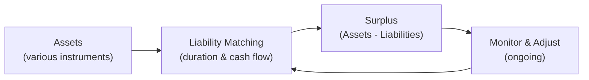

## Overview and Motivation

It’s funny—well, maybe not “ha-ha” funny—how often folks forget that big institutional funds, like pension plans, typically have one major goal: pay out their promised benefits on time. Imagine you’re running a huge pension plan for a company with thousands of employees. You’ve got to ensure when these employees retire, there’s actually enough money set aside—regardless of whether interest rates shoot up or crash, stock markets go haywire, or inflation creeps higher than expected.

That’s exactly why Liability-Driven Investing (LDI) has become such a critical framework in portfolio management. Unlike a typical approach that focuses primarily on total return or beating a benchmark, LDI strategies emphasize aligning the behavior of the portfolio with the future obligations (liabilities). This can be a lifesaver if you’ve ever been stuck with a massive shortfall because your assets weren’t keeping pace with rising liabilities.

## Defining Liability-Driven Investing

LDI is a system of designing and managing a portfolio so that it specifically matches, hedges, or otherwise meets the future cash outflows that an institution has promised. Although any entity with a large schedule of obligations can use LDI, pension funds and insurance companies are classic examples—both have relatively predictable sets of payments that must be made over time.

One might think: “Why not just invest in super-safe securities or store cash somewhere?” The challenge is that these institutions still need to seek growth to manage inflation, potential longevity risk (people living longer than expected), and the possibility that interest rates or discount rates change in uncomfortable ways. That’s where the magic of LDI—especially duration matching and surplus management—comes into play.

## Core Concepts

### Duration Matching

Duration is a measure of the sensitivity of a bond’s (or bond portfolio’s) price to changes in interest rates. For many pension plans, interest rates heavily influence the value of their liabilities (i.e., the present value of future payments). A drop in interest rates, for instance, can significantly inflate the present value of liabilities—often leading to an underfunded plan (if assets are not properly aligned).

Duration matching aims to immunize a portfolio by aligning the average duration of existing assets with the duration of the liabilities. In other words, if liabilities have a duration of ten years, the portfolio’s aggregate duration should also be around ten years, so that a move in interest rates affects both sides similarly. This strategy is often referred to as immunization.

### Cash Flow Matching

Cash flow matching goes one step further. Instead of merely matching duration, the pension plan acquires specific assets that generate cash flows from interest and principal payments exactly when liabilities come due. While this offers near-perfect hedges, it can be difficult (and sometimes expensive) to find fixed income instruments that align precisely with your liability schedule. Large pension funds often find a hybrid approach (some cash flow matching combined with broader duration matching) to be more flexible.

### Surplus Management

Surplus is simply the difference between a plan’s assets and its liabilities. If a pension plan is fully funded, the plan’s surplus is zero (assets = liabilities). If it’s “overfunded,” the surplus is positive, and if it’s “underfunded,” the surplus is negative—no pension sponsor wants that for too long.

LDI focuses on maintaining or enhancing this surplus. Essentially, you structure your portfolio to move in tandem with your liabilities. If rates fall and your liabilities balloon, for instance, you’d like your assets to balloon as well, so you stay funded. All of this becomes critical when considering regulatory requirements or working to reduce the company sponsor’s contributions to the plan.

### Interest Rate Swaps and Hedging

Sometimes, building a physical bond portfolio to match a specific duration or cash flow schedule can be expensive or cumbersome. That’s where derivatives like interest rate swaps come into the picture. A pension plan can enter a swap to exchange floating-rate payments for fixed-rate payments (or vice versa), effectively altering the duration or interest rate sensitivity of its portfolio.

For example:
• If your liabilities are more sensitive to falling rates, you might receive floating rates and pay fixed to effectively “gain” from falling rates (since floating rates might drop less than your liabilities’ discount rate).
• If you need more or less duration, you can adjust your swap positions to fine-tune how your portfolio behaves when interest rates change.

Yes, you need to be mindful of the counterparty risk and other complexities, but swaps often provide flexibility and cost-effectiveness in shaping your portfolio’s risk profile.

## Designing an LDI Framework

### Step 1: Liability Assessment

First, you’d collect data about your liabilities. Let’s say you have a defined benefit pension with 10,000 employees, each at various stages of their careers. You need an actuarial analysis: how long are employees likely to live, what retirement age is typical, how do salary and service years factor in? This analysis yields an expected liability stream.

### Step 2: Risk and Return Objectives

Next, as covered in prior sections (e.g., “4.2 Risk and Return Objectives”), the plan sponsor and trustees articulate how much risk is acceptable. You want stability for your funding ratio, yet you also may desire growth to lower contributions or enhance the surplus. So you decide on a target funding ratio—maybe 105% for safety—and a tolerance range for how low that ratio can go before you ring alarm bells.

### Step 3: Asset Allocation and Hedging

With an LDI approach, you allocate enough assets (or derivatives overlays) to hedge the interest rate sensitivity of your liabilities. Typically, a large portion might be in long-duration bonds, TIPS, or interest rate swaps to reduce unmatched exposure if rates shift. The rest of the portfolio can then be allocated to growth assets—like equities or alternative investments—to (hopefully) strengthen the plan’s surplus over time, but you keep an eye on that risk so you don’t blow up your funding ratio.

### Step 4: Implementation and Monitoring

Even the best-laid plans need adjusting. As interest rates shift or your liabilities’ profile changes (because employees retire earlier or live longer than expected), you’ll tweak your hedges or re-balance. If you’re implementing derivatives, you’ll also manage collateral and watch out for changes in the yield curve. Monitoring is essential to ensure you remain on track. Some folks do a monthly or quarterly check; others do it more often, especially in volatile markets.

### A Quick Example

Let’s say your pension liabilities amount to USD 1 billion, with an effective duration of 15 years. You determine that you want at least 80% of that obligation matched with duration-sensitive assets—this might mean you invest in a combination of long-term government bonds and corporate bonds with a combined duration of 15 years. You might even go out and use interest rate swaps to manage the difference if you can’t get exactly 15 years in the physical portfolio. The other 20% of your asset base might go into a diversified equity portfolio or alternative strategies seeking higher returns. This portion is primarily aimed at surplus growth.

## Surplus Optimization: Visualizing the Portfolio-Liability Relationship

Below is a simple diagram illustrating how LDI attempts to align assets with liabilities to maintain or grow the surplus.

In this cycle:
• Assets are structured to match liabilities.  
• The surplus (C) can be maintained or enhanced.  
• Ongoing monitoring (D) ensures the alignment remains robust.

## Regulatory Context

From a regulatory standpoint, a lot of jurisdictions have minimum funding ratios. If you dip below 100% funded, you may face higher contributions or other constraints. Plus, some regions require that any deficits be remedied within a certain timeline. LDI frameworks can help mitigate the risk of large deficits forming, offering a more predictable path to meeting regulatory requirements. Insurance companies often face a similar requirement to match assets against future claims, guided by relevant solvency regulations.

## Best Practices in LDI

• Understand Your Liabilities Thoroughly: Seriously, not just the big number, but the distribution of outflows over time.  
• Use Derivatives Wisely: Don’t just slap on an interest rate swap without understanding collaterals, credit risk, and margining.  
• Combine Strategies: Sometimes pure duration matching is enough; other times, incorporate partial cash-flow matching for near-term obligations and keep a growth portfolio in long horizon segments.  
• Monitor and Revisit: The real world changes quickly—actuarial assumptions, interest rates, markets, everything. Periodic updates are essential.  
• Stress Testing and Scenario Analysis: Model what might happen if interest rates skyrocket or if longevity increases beyond expectations. Use downward or upward shocks to see how your assets and liabilities respond.

## Potential Pitfalls

• Overly Simplistic Views on Duration: There’s more to liabilities than just interest rate risk (e.g., changes in credit spreads, inflation, mortality experience).  
• Ignoring Plan Demographics: One plan might have older participants primarily receiving benefits now, while another is younger with a long horizon—these require different approaches.  
• Neglecting “Basis Risk”: If you use certain instruments that are not perfectly correlated with your liabilities, you might not be as hedged as you think.  
• Implementing Late: Some sponsors only shift to LDI after a big market downturn or a near-crisis event. Doing so at that point might be more expensive.  
• Underestimating Behavioral and Governance Constraints: Plan sponsors, trustees, or committees might have differing risk appetites. Aligning all stakeholders is often as critical as the actual investing.

## Practical Observations

A friend of mine who managed a mid-size corporate pension plan was once boasting about their impressive returns in a growth-oriented strategy. Then a sudden rate drop more than doubled their liability estimates, largely because the discount rate used for liabilities fell sharply. Their assets grew decently, but not enough to offset the surge in liabilities. That’s when they realized an LDI approach might have saved them from painful sponsor contributions. In hindsight, they said they “traded a bit of short-term return for a ton of long-term stability.”  

## Connections to Other Chapters

• “4.1 The Investment Policy Statement (IPS) – Purpose and Components”: An LDI program’s objectives and constraints should be laid out clearly in the IPS.  
• “4.2 Risk and Return Objectives (Ability and Willingness to Take Risk)”: LDI directly ties your risk budget to the liability structure.  
• “6.5 Measuring Risk (VaR, Stress Testing, Scenario Analysis)”: LDI uses scenario analysis to see how interest rate or mortality changes impact the funding ratio.  
• “11.2 Duration Targeting and Yield Curve Positioning”: Tactics in fixed income management become crucial in designing the “hedge portfolio” side of an LDI strategy.  
• “10.1 Use of Derivatives for Risk Control”: Tools like interest rate swaps, futures, and options are integral to robust LDI solutions.

## Exam Tips and Strategies

• Be clear about the distinction between duration matching, cash flow matching, and surplus optimization.  
• Know how a change in interest rates affects asset values vs. liability values in a pension context.  
• Practice writing short, bullet-style answers on how derivatives (especially interest rate swaps) can hedge interest rate risk.  
• If presented with a scenario about a pension plan’s funding ratio, quickly identify if an LDI framework is appropriate and how it would alter the risk profile.  
• Remember that in a constructed-response question, you might need to articulate both the conceptual rationale and the specific numerical or theoretical outcome.  

## References and Further Reading

- Fabozzi, F. J. (ed.). (1997). Advances in Fixed Income Valuation Modeling and Risk Management. Wiley.  
- “Liability-Driven Investing,” various publications by Pensions & Investments (https://www.pionline.com/).  
- Waring, M. B., & Siegel, L. B. (2007). The Dimensions of Pension Investing. CFA Institute.  

They have fantastic articles and deeper analyses on everything from implementing duration-matched portfolios to discussing how insurance and pension liabilities differ regarding discount rates.

----------------------------------------------------------------------------------

## Sample Exam Questions: Liability-Driven Investing and Pension Portfolios



### An LDI approach primarily aims to:
- [ ] Maximize total return in equity markets.
- [x] Align the asset portfolio with future liabilities.
- [ ] Minimize the impact of currency fluctuations.
- [ ] Focus only on short-term yield enhancement.

> **Explanation:** Liability-Driven Investing is specifically oriented toward matching and hedging future liabilities, not just maximizing return or mitigating currency risks.

### In a traditional duration matching strategy for a pension fund with a 12-year average liability duration, the manager would most likely:
- [ ] Hold short-term bonds to capture yield curve benefits.
- [ ] Use equities to hedge interest rate risk.
- [ ] Avoid using any derivatives to reduce complexity.
- [x] Construct a bond portfolio with an average duration close to 12 years.

> **Explanation:** Duration matching involves aligning the portfolio’s duration with the liabilities’ duration (e.g., 12 years) so that changes in interest rates have a similar effect on both sides.

### Which of the following most accurately describes a key purpose of surplus management in LDI?
- [ ] To reduce the pension sponsor’s tax liability.
- [ ] To eliminate all risk exposures by fully investing in cash.
- [x] To maintain or grow the difference between assets and liabilities.
- [ ] To avoid the use of derivatives at any cost.

> **Explanation:** Surplus management is about optimizing the difference between assets and liabilities, ideally ensuring that assets grow in tandem with—or faster than—liabilities over time.

### In a defined benefit pension plan, a significant decrease in interest rates often results in:
- [ ] A decrease in the present value of liabilities.
- [ ] No impact on liabilities or asset valuation.
- [x] An increase in the present value of liabilities.
- [ ] A simultaneous decrease in liabilities and assets.

> **Explanation:** Lower interest rates raise the present value of future pension payments, increasing the plan’s liabilities. Without an appropriate hedge, the funding status can suffer.

### A pension plan manager decides to offset the fund’s interest rate sensitivity using swaps. This is an example of:
- [ ] Diversification by asset class.
- [x] A derivative-based hedging approach.
- [ ] Tactical asset allocation to generate alpha.
- [ ] Cash flow matching through physical bonds only.

> **Explanation:** Entering interest rate swap agreements is a standard method of hedging or altering duration exposure in an LDI framework.

### How does cash flow matching differ from duration matching in an LDI context?
- [x] Cash flow matching aligns actual asset cash inflows to liability outflows precisely.
- [ ] Cash flow matching focuses solely on equity exposure.
- [ ] Duration matching cannot be achieved with long-term bonds.
- [ ] Duration matching requires using only T-bills.

> **Explanation:** Cash flow matching matches each liability payment to a corresponding asset cash flow, whereas duration matching focuses on interest rate sensitivity rather than exact cash flow alignment.

### If a pension plan’s present value of liabilities increases while assets remain constant, the plan:
- [x] Experiences a decrease in surplus.
- [ ] Sees no change in its surplus.
- [ ] Becomes overfunded automatically.
- [ ] Gains additional liquidity for near-term obligations.

> **Explanation:** When liabilities rise faster than assets, the surplus shrinks or goes negative, reflecting potentially underfunded status.

### In practice, many LDI strategies mix:
- [ ] Only money market instruments.
- [x] A liability-matching segment and a return-seeking segment.
- [ ] Equity-only investments for aggressive growth.
- [ ] Commodities and real estate exclusively.

> **Explanation:** A common approach is to split the portfolio into a hedging “LDI” bucket (which matches liabilities) and a growth bucket (which aims to generate surplus).

### One of the main advantages of using interest rate swaps over physical bonds for duration adjustments is:
- [x] Operational flexibility and lower capital outlay.
- [ ] Eliminating the need for collateral management.
- [ ] Guaranteed outperformance of a liability benchmark.
- [ ] Insulation from counterparty default risk.

> **Explanation:** Swaps can be cost-effective and more flexible than buying long physical bonds in adjusting the duration, though they do introduce counterparty risk and require collateral management.

### True or False: “A plan sponsor focusing on an LDI strategy may still hold a portion of its assets in equities to aim for surplus growth.”
- [x] True
- [ ] False

> **Explanation:** Many pension plans adopt a hybrid approach—part of the portfolio is allocated to liability matching, and part targets growth, typically through equities or alternative instruments.


