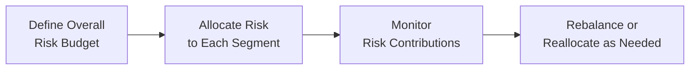

## Understanding the Essence of Risk Budgeting

Risk budgeting is as crucial as it sounds: it’s all about deciding how much risk you—whether you're an individual investor or a large institutional fund—are willing and able to take, and then allocating that risk in a way that gives you the highest chance of meeting your objectives. Think of it like going on vacation with a strict budget. You have a certain amount of money to spend, and you want to make sure each dollar is used in a way that maximizes enjoyment. Here, our “enjoyment” is returns, and our “dollars” are, well, risk allocations.

I remember chatting with an old colleague who used to say—only half-jokingly—“If you don’t risk, you don’t earn.” But the key is to risk appropriately, measure it carefully, and allocate it where you have the best odds of success. That’s the cornerstone of risk budgeting in portfolio construction.

## Why We Care About Risk Budgeting

In portfolio management, you can’t just throw capital into multiple strategies and hope for the best. Each strategy—be it an active equity mandate, fixed income position, or alternative investment—carries unique risk factors. The risk budget clarifies:

• Which parts of the portfolio have permission to take more (or less) risk.  
• How total risk contributes to your overall target volatility or other relevant measures such as Value at Risk (VaR).  
• Where the potential for alpha might reside and how we should size those positions.  

And, honestly, it also scores a few extra points with clients or internal stakeholders when you can clearly articulate where the risk is coming from and why you’re comfortable taking it.

## Setting the Overall Risk Budget

One of the first steps in risk budgeting is deciding on the total amount of risk the portfolio can take. Typically, that might be expressed as target volatility (e.g., a standard deviation of 8% or 10%) or a maximum drawdown threshold. Alternatively, some managers prefer a VaR metric (e.g., daily or monthly 95% VaR). There’s no single right approach; it depends on the investor’s objectives, constraints, and tolerance for fluctuations in returns.

### The Formula for Portfolio Standard Deviation

Just to refresh the fundamental concept, the portfolio’s variance (σ²ᵖ) for n assets can be approximated as:


\sigma_{\text{p}}^{2} = \sum_{i=1}^{n} \sum_{j=1}^{n} w_i \, w_j \, \sigma_i \, \sigma_j \, \rho_{i,j},


where:  
• \\( w_i \\) is the weight of asset \\( i \\).  
• \\( \sigma_i \\) is the standard deviation of asset \\( i \\).  
• \\( \rho_{i,j} \\) is the correlation between asset \\( i \\) and asset \\( j \\).  

And the portfolio standard deviation itself is:


\sigma_{\text{p}} = \sqrt{\sigma_{\text{p}}^{2}}.


Deciding on acceptable levels for \\(\sigma_{\text{p}}\\) is fundamental to your risk budget. The usual logic is: more risk may produce higher returns, but also bigger drawdowns.

## Allocating Risk Across Strategies

Once you nail down how much total risk you’re willing to accept, the next question is: how do we split it up? Some managers like to carve out their risk budgets by asset class (equities, bonds, real assets, etc.). Others break it down by investment strategy (such as momentum-based factor strategies, value-based factor strategies, macro strategies, and so on). Another approach is to do it by manager or sub-advisor. There’s a lot of nuance here.

### Marginal Contribution to Risk

It helps to measure how much risk each position adds to the total portfolio. This is called Marginal Contribution to Risk (MCTR). If you find that one position is responsible for a disproportionately large chunk of total risk, you might dial it back. Or if you spot a position that provides a strong diversification benefit without adding too much risk, you might ramp it up a bit.

In practice, managers often measure MCTR using partial derivatives of portfolio variance with respect to each position’s weight. This helps refine how each portion of the portfolio uses (or “spends”) the available risk budget.

## Tools for Risk Budgeting

### Factor Analysis

Ever wonder what truly drives portfolio returns? Factor analysis is your friend. Let’s say we discover an outsized sensitivity to interest rates or credit spreads. That means we’re using up a big part of our risk budget in that particular factor. Once we know this, we can decide if we want to keep or reduce that exposure. This is especially relevant when combining multiple managers: you might find that everyone’s inadvertently piling into the same factor (like growth stocks or short-volatility trades).

### Stress Testing

If you’re anything like me, you’ve had that moment where you read about a market meltdown in some corner of the world and think, “Will that sink my entire portfolio?” Stress testing—shocking inputs like interest rates or foreign exchange rates—lets you see how your holdings might behave in severe scenarios (e.g., 30% drop in equities, credits widening by 200 bps, or a sudden oil crash). 

Stress tests can reveal correlations that pop up in times of crisis, rearranging your plan if your portfolio’s risk budget was overexposed to one particular meltdown scenario.

### Value at Risk (VaR)

Var has its fans and its critics. Critics say it’s too simplistic to capture tail risks. Fans say it’s a straightforward measure for clarifying how much you might lose over a certain time horizon at a particular confidence level. Either way, VaR is often used in risk budgeting to define a limit on losses—for instance, “We are structured such that monthly 99% VaR is $3 million.” This can ring-fence the total risk budget.

## Communicating the Allocation

A big part of a risk budget is telling folks—clients, trustees, or internal teams—how you’ve divvied up risk. I once sat in a portfolio review where the lead manager explained that 70% of the risk was coming from equities and 30% from alternatives. Clients gulped a bit, but it reassured them to see the breakdown and strategy behind it. Clear communication fosters trust and ensures no big surprises if the equity markets get bumpy.

## Ongoing Monitoring and Adjustments

Even the best-laid plans need a tune-up. Changing market volatilities, shifting correlations, and brand-new alpha opportunities can alter how your portfolio’s risk is allocated. That’s why periodic reviews of your risk budget are critical. If correlations spike during a crisis, your portfolio might blow through its risk budget faster than you expected.

Moreover, as an investor’s goals or constraints evolve—maybe they need more liquidity, or they become more/less risk tolerant—this directly impacts how you design and maintain a risk budget.

## Risk Parity Approaches

Risk Parity is one fancy approach, aiming to equalize the risk contributions of different asset classes. Instead of weighting assets by capital, you weight them by risk. The idea is that, say, a risk-parity portfolio tries to scale up lower-volatility assets (like bonds) to ensure each allocation is an equal contributor to overall portfolio risk. Proponents believe it can lead to more stable returns over the long haul, while critics argue it might underperform traditional allocations in certain growth-driven markets. 

## Common Pitfalls in Risk Budgeting

• Ignoring Correlations: You can’t measure risk in isolation. Assets may be uncorrelated in “normal” times but can become highly correlated in a crisis.  
• Over-Reliance on Historical Data: Past performance may not reflect the future, especially if market regimes shift.  
• Setting Unrealistic Budgets: Some strategies simply can’t deliver the desired returns without exceeding your comfort zone for risk.  
• Failing to Revisit: Market conditions change, so that risk budget from last year may no longer be relevant.

## A Simple Example

Let’s imagine a small pension fund that has a total risk budget measured by standard deviation of 10%. They decide to allocate that risk among three strategies: 

• Global Equities (active, high risk)  
• Core Fixed Income (low risk)  
• Commodities (medium, with potential diversification benefits)  

If the manager found that the global equity portion alone was taking up 8% (out of 10%) of total risk, the question would be: “Do we think the potential alpha from the equity segment is worth devoting so much risk to it?” Possibly yes, but maybe the manager dials down equities or uses a low-volatility approach to free up some risk budget for commodities or alternative credit, if they see a better reward-to-risk trade-off there.

## Visualizing the Risk Budgeting Process

Below is a simple diagram illustrating the broad stages of risk budgeting:

1. Define Overall Risk Budget: Establish total permissible risk (e.g., 10% standard deviation, 5% max drawdown, or a VaR metric).  
2. Allocate Risk to Each Segment: Distribute that budget among strategies, asset classes, or managers.  
3. Monitor Risk Contributions: Perform factor analyses, stress tests, and track correlated drawdowns.  
4. Rebalance or Reallocate: Adjust based on new opportunities or changes in risk tolerance and correlation structures.

## Best Practices and Strategies

• Align Risk Budgeting with Goals: Ensure your risk budget is consistent with your overall investment policy statement (IPS) and the investor’s objectives.  
• Use Diverse Measures: Combine standard deviation, VaR, and scenario analyses to get a holistic view.  
• Communicate Clearly: Provide transparent updates to clients and stakeholders about how risk allocations may shift over time.  
• Emphasize Periodic Reviews: The best risk budgets are living documents, regularly updated with fresh data and changing market dynamics.  
• Encourage Collaboration: Portfolio managers, analysts, and risk officers should work together to calibrate risk budgets.  

## Practical Insights

I recall a time we had an investor who was extremely risk-averse yet wanted higher returns (classic story, right?). We used risk budgeting to outline how certain high-octane strategies could blow through her risk boundary in no time. By showing her the “opportunity cost of risk,” we helped her see where her portfolio might gain the highest returns per unit of risk. She eventually decided that she’d aim for moderate but steadier growth, reining in some of the riskier allocations. That’s the beauty of risk budgeting: making the trade-offs explicit.

## Putting It All Together

With risk budgeting, you’re not just managing a bunch of holdings in a vacuum. You’re intentionally distributing your limited “risk capital” across the strategies and assets that offer the best fit for your objectives. The benefit is clarity—clarity in why certain allocations exist, how they’re measured, and what will happen if markets take a nosedive or present new opportunities. 

Managers who excel at risk budgeting typically combine advanced quant tools (like factor analysis, stress tests, and VaR) with a healthy dose of “common-sense” portfolio construction. They continuously re-evaluate the environment, making sure the risk budget remains relevant as markets evolve.

## Exam Tips

• Understand how to apply risk budgeting to a multi-asset portfolio.  
• Be ready to explain how factor analysis uncovers hidden exposures.  
• Practice scenario-based questions involving correlation spikes.  
• Know how to articulate the difference between total risk and active risk (tracking error).  
• Recognize how risk budgeting ties into the Investment Policy Statement (IPS).  

## References

• Qian, E., Hua, R., & Sorensen, E. (2007). Quantitative Equity Portfolio Management. Chapman & Hall/CRC.  
• Grinold, R. C., & Kahn, R. N. (2000). Active Portfolio Management. McGraw-Hill.  
• CFA Institute. (2019). A guide to risk budgeting (various webinars and articles).  

## Test Your Knowledge: Risk Budgeting Mastery Quiz



### When setting a risk budget, which of the following metrics is commonly used to quantify the total risk tolerance of the portfolio?

- [ ] Net present value spreadsheet  
- [x] Standard deviation of returns  
- [ ] Price-to-earnings ratio  
- [ ] Dividend yield  

> **Explanation:** Standard deviation is frequently used to measure total portfolio volatility and hence a portfolio’s overall risk tolerance.

### Which best describes Marginal Contribution to Risk (MCTR)?

- [ ] A measure of the risk-free rate’s contribution to portfolio returns  
- [ ] A measure of how interest rate changes affect bond prices  
- [ ] The difference between a portfolio’s return and a benchmark’s return  
- [x] The incremental amount of total portfolio risk contributed by a particular asset or strategy  

> **Explanation:** MCTR tells you how much each individual component adds to overall risk, helping managers optimize allocations.

### A portfolio manager wants to ensure that each asset class in the portfolio contributes an equal share to overall risk. This approach is referred to as:

- [x] Risk parity  
- [ ] Asset/liability matching  
- [ ] Alpha targeting  
- [ ] Value investing  

> **Explanation:** Under risk parity, every component of the portfolio has the same share of total risk, regardless of capital allocation.

### What is the primary advantage of using factor analysis in risk budgeting?

- [ ] It eliminates risk entirely from the portfolio  
- [ ] It enables correlation to remain constant  
- [x] It identifies underlying exposures that drive performance  
- [ ] It guarantees positive returns in all market environments  

> **Explanation:** Factor analysis reveals which risk factors (e.g., value, momentum, credit spreads) contribute most to the portfolio’s returns and helps refine allocations.

### In a stress test scenario where the equity market falls 25%, which of the following is most likely the key insight for a manager?

- [x] How the overall portfolio volatility and correlations shift in a market downturn  
- [ ] How the P/E ratio of tech stocks changes each trading day  
- [ ] Whether the bond coupon rates remain constant  
- [ ] Whether the equity market will recover by the next quarter  

> **Explanation:** Stress testing focuses on portfolio behavior under adverse market conditions, particularly changes in volatility and correlations.

### Which of the following is a measure that captures the volatility of returns relative to a benchmark?

- [ ] Sharpe ratio  
- [x] Tracking error  
- [ ] Alpha  
- [ ] Duration  

> **Explanation:** Tracking error (also called active risk) measures how closely a portfolio follows its benchmark, expressed in terms of volatility.

### If an investor ignores correlations and assumes all assets have zero correlation, they are most at risk of:

- [x] Underestimating total portfolio risk  
- [ ] Paying excessive management fees  
- [ ] Missing out on new alpha opportunities  
- [x] Overestimating diversification benefits  
- [ ] Achieving perfect hedging  

> **Explanation:** If correlations rise in a downturn, ignoring them may lead to a false sense of security, causing actual portfolio losses to exceed expectations.

### How frequently should a risk budget typically be reviewed by a portfolio manager?

- [ ] Only when the portfolio experiences a large drawdown  
- [ ] Once every five years, regardless of market events  
- [x] Periodically, and whenever there are significant market or strategy changes  
- [ ] Never; risk budgets remain static  

> **Explanation:** Risk budgets must be dynamic, revisited periodically or when market conditions, strategic objectives, or correlation structures change substantially.

### One reason VaR (Value at Risk) is often used in risk budgeting is:

- [x] It provides a concise estimate of potential losses at a given confidence level  
- [ ] It guarantees no losses will exceed the stated VaR amount  
- [ ] It eliminates tail risk from the portfolio  
- [ ] It forecasts the exact future return of a portfolio  

> **Explanation:** VaR helps define the probable maximum loss over a certain horizon at a specified confidence level, aiding in risk planning—even though it does not account perfectly for tail risks.

### True or False: Risk Parity strategies overweight asset classes with high volatility to ensure an equal share of capital is allocated among all assets.

- [x] True  
- [ ] False  

> **Explanation:** Risk parity strategies often lever up lower-volatility assets (like bonds) and scale down riskier assets (like equities) so that each asset contributes equally to the total risk, not necessarily equal capital allocation.


