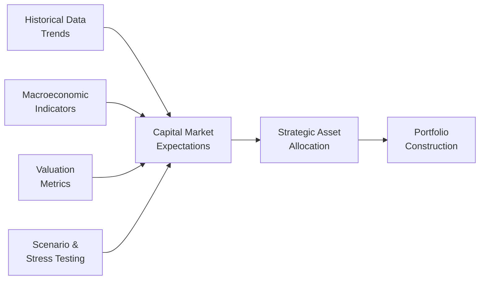

## Introduction

We’ve all seen times when markets soared one season only to nosedive the next, leaving folks scratching their heads, “What on earth changed?” Well, welcome to the world of capital market expectations—those carefully thought-out assumptions (or sometimes not-so-carefully guesswork) that investors use to shape their portfolio decisions.

Capital market expectations (CMEs) form the bedrock of strategic asset allocation. In earlier sections (see 4.1: The Investment Policy Statement, and 4.2: Risk and Return Objectives), we examined how an investor’s objectives and constraints are articulated. But we also need a forward-looking vision of what stocks, bonds, commodities, and other asset classes might deliver. Without a decent forecast, it’s a bit like planning a big road trip without checking the weather.

Below, let’s dig into the who, what, how, and why of CMEs. We’ll poke at some real-world examples, a few personal experiences, and pointers on avoiding pitfalls. I’ll do my best to keep the conversation down to earth, so you can quickly see how it fits into the bigger puzzle of portfolio planning and construction.

## The Purpose and Significance of Capital Market Expectations

When we say “capital market expectations,” we’re talking about your predictions for key variables like:
• Future returns on equities, bonds, real estate, etc.  
• Volatility and correlations among these assets.  
• Macroeconomic elements (like inflation and interest rates).  

Why do they matter so much? Because your forecast of returns, plus an understanding of risk, informs your entire portfolio design. In strategic asset allocation, we usually lay out target weightings (e.g., 60% equity, 40% bonds) to aim for a certain risk-return sweet spot. If your assumptions are off—say you’re way too optimistic about equity returns—you might overallocate to risky assets that eventually underperform, or you might not allocate enough to that one promising asset class. Either way, inaccuracies can lead to disappointment (and let’s face it, no one wants that).

## Building Blocks: Historical Data, Macroeconomic Factors, and Valuation Metrics

It’s no secret that economists, statisticians, and finance professionals harness all sorts of data, news releases, and sometimes even good old gut instinct to form CMEs. Typically, the building blocks include:

### Historical Data

Historical return and volatility patterns can offer valuable perspective. But keep in mind that markets evolve, central banks come and go, and new technologies reshape industries. So while we can analyze 20 or 30 years of returns, it may not always precisely predict the future. My friend once back-tested a strategy using only a narrow slice of data from a high-growth period—concluding that double-digit returns were “guaranteed.” Spoiler alert: reality begged to differ. Moral of the story: historical data is a starting point, not the finish line.

### Macroeconomic Indicators

These are the broad strokes: GDP growth rates, the unemployment picture, inflation, monetary policies, you name it. A change in Federal Reserve rates, for instance, might shift the cost of borrowing for companies, which in turn can influence corporate earnings and stock valuations. Keep an eye on cyclical vs. secular trends. A cyclical upswing in the broader economy might boost earnings for a few years, but a structural change—like moving from coal to renewable energy—might alter the shape of entire sectors for decades.

### Valuation Metrics

Let’s say you’re looking at equities: price-to-earnings ratios (P/E), dividend yields, or even more advanced heuristics like the cyclically adjusted P/E (CAPE) can guide your sense of whether a market is expensive or cheap. In fixed income, yield spreads can be a clue for how markets are pricing in default risk or economic shifts. A wide credit spread might indicate that investors are demanding a high return to compensate for perceived risk.

### Behavioral and Market Sentiment

You might think capital market forecasts are all about math—and that’s a big component, sure. But you can’t ignore investor sentiment. Fear and greed drive short-term market swings, which, if persistent, alter longer-term expectations. Overreaction bias, a frequent behavioral pitfall, pops up when we become too enthusiastic or too pessimistic based on recent data alone (remember the tech bubble in the late ‘90s?). Being aware of these tendencies helps keep your assumptions level-headed.

## Quantitative Tools vs. Qualitative Judgments

Now, there are plenty of fancy quantitative models out there. Mean-variance optimization (MVO) is perhaps the most famous. If you’re not familiar, MVO tries to find a portfolio that maximizes expected return for a given level of risk (or equivalently, minimizes risk for a target return). It uses your assumptions about each asset’s expected return, its volatility, and the correlation it shares with others. The result is that efficient frontier curve you might recall from earlier chapters.

But MVO is only as good as the data you feed it. If your assumptions are off, the “optimal” portfolio might be anything but. So many practitioners combine quantitative results with qualitative judgments. Maybe you factor in an anticipated rate increase from the European Central Bank. Maybe you consider a mid-term election cycle in the U.S. that could nudge policy favorability for certain sectors. The key is that capital market expectation is both science and art.

## Scenario Analysis and Stress Testing

Let’s be honest, the real world can be messy. That’s where scenario analysis and stress testing become invaluable. Instead of working with single-point estimates (e.g., “Equities will return 7% next year,” or “Inflation will be 2.5%”), you model multiple plausible outcomes.

• Base case: GDP at 2%, inflation at 2.2%, stock returns at 6%.  
• Bullish case: GDP at 3%, inflation at 2.8%, stocks at 10%.  
• Bearish case: Recession scenario, negative 1% GDP, inflation dips, stocks at –5%.  

By toggling these assumptions, you can see how your portfolio might fare. Stress testing extends this logic to “what if” extremes. For example, “What if oil spikes to $200 a barrel, or if major supply chain disruptions occur?” This exercise helps reveal vulnerabilities before they strike. It might feel a bit like worrying about improbable scenarios, but markets can (and do) produce some wild surprises.

Here’s a quick visual flow of how capital market expectations feed into portfolio construction:

```

```

## Balancing Updates and Avoiding Overreaction

Capital market expectations shouldn’t remain static year after year, because conditions evolve. However, frequent overhauls to your forecasts can lead to short-termism. Imagine if you drastically dialed down your expectation for stocks each time the market had a bad quarter. You’d likely whipsaw your portfolio into big losses from transaction costs, taxes, and missed rebounds.

One approach: update your CMEs on a fixed schedule—maybe twice a year—to incorporate new data and relevant macro changes. If an extraordinary event hits (like a pandemic or a sovereign debt crisis), you can do a mid-cycle refresh. Resist the urge to get caught in “recency bias,” where you weigh the past few weeks more heavily than months or years of data.

## Common Pitfalls

Even with the best intentions, forging robust CMEs can be tricky. Here are a few traps to watch out for:

• Overly Optimistic Bias: Let’s face it: we love good news. Sometimes we forecast too-high returns, especially if we anchor on a recent bull run.  
• Herd Mentality: Adopting the same outlook as everyone else can be comforting, but it may lead to overlooked risks.  
• Data Mining: Testing a hypothesis against so many data sets that you accidentally find a correlation that doesn’t really exist (hello, spurious relationships).  
• Outdated Models: Markets shift fast, so that academic model from a decade ago might need a revamp if it hasn’t been updated for, say, the low-interest-rate environment or unusual macro conditions.

## Practical Example: Equity Risk Premium Estimation

One area often debated is the equity risk premium (ERP): how much extra return we expect from equities over a risk-free asset. Common approaches include:

• Historical Approach: Use averages from decades of stock returns minus Treasury bill returns.  
• Survey Approach: Gather opinions from experts, CFOs, and market participants.  
• Fundamental Approach: Combine dividend yields, growth rates, and real risk-free returns to arrive at a forward-looking number.

Let’s illustrate with a simple example:

Suppose we rely on historical data from the past 30 years and estimate that broad U.S. equities outperformed T-bills by about 5%. Now we see a low-interest environment and suspect that going forward, the ERP might be closer to 4%. We talk to a few macroeconomists who mention that corporate profit margins might shrink because of supply chain constraints and wage inflation. Putting all this together, we might anchor our ERP at 4% to 4.5% rather than 5%. That difference might look small, but even 1% or 2% changes in assumptions can meaningfully shift our ideal portfolio.

## A Small Python Snippet for Data Exploration

If you’re into coding, you can do a quick check of data trends before forming your forward-looking opinions. For instance:

```python
import pandas as pd
import numpy as np

data = pd.read_csv('monthly_returns.csv')

avg_returns = data.mean() * 12  # annualize from monthly
volatility = data.std() * np.sqrt(12)
correlation_matrix = data.corr()

print("Annualized Returns:")
print(avg_returns)
print("Annualized Volatility:")
print(volatility)
print("Correlation Matrix:")
print(correlation_matrix)
```

All this is just the raw material. You’d still need your own interpretation, blending forward perspectives and scenario analyses. But it’s an example of how technology can help parse large datasets more efficiently.

## Integration with Portfolio Construction

Once you’ve sketched out your capital market expectations, you feed them into your strategic asset allocation (see 4.4: Asset Class Definitions and Strategic Asset Allocation). You might see that your forecast for international equities is bright, leading you to overweight that segment a bit, while you underweight corporate bonds if you predict an economic slowdown that jacks up default risks.

Also, keep in mind your constraints (4.3: Liquidity, Time Horizon, Taxes, Legal, and Unique Constraints). If you have major liquidity needs soon, even the rosiest equity forecasts might not justify going all-in on high-volatility stocks. Or if your client has a time horizon of 30 years, you might accept short-term bumps in favor of a bigger long-term payoff.

## Monitoring and Governance

Remember that capital market forecasts don’t exist in a vacuum. Many firms convene regular committees to debate, challenge, and refine the assumptions. It’s helpful to keep track of the difference between your model’s predictions and actual outcomes over time. If you see a persistent gap, consider re-examining your data sources or market assumptions.

Best practice: keep a log (or “forecast record”) summarizing your annual or quarterly assumptions, the rationale behind them, and any major macro events that influenced the changes. Then evaluate how accurate those turned out once time passes. This process instills discipline and hopefully helps you refine your approach.

## Final Exam Tips and Takeaways

• Understand the synergy between capital market expectations and strategic asset allocation—on the exam, you may see scenario-based questions where you must decide whether to revise target weights based on new financial data or macro conditions.  
• Don’t ignore behavioral biases—they can appear in essay questions prompting you to discuss how to mitigate “recency bias” or “overreaction bias.”  
• Know the foundations—historical data, macro trends, and valuation metrics are your starting kit for forming robust outputs.  
• You will likely have to apply scenario analysis—be prepared to show how different macro assumptions can shift portfolio outcomes.  

Remember: capital market expectations are a forecast, not a guarantee. As your knowledge deepens, focus on a balanced approach—quantitative analysis plus qualitative insight—and watch out for pitfalls like data mining or groupthink.  

Stay curious, diligent, and systematic. Because, let’s face it, the future is never certain, but a thoughtful approach to CMEs is probably our best shot at navigating it.

## Glossary

Capital Market Expectations: Forecasts about returns, risks, and correlations for various investments.  
Mean-Variance Optimization (MVO): A popular optimization technique that selects a portfolio to maximize return given a certain risk level (or minimize risk for a desired return).  
Scenario Analysis: Evaluating how a portfolio might behave under different sets of assumptions, such as changes in inflation or interest rates.  
Macroeconomic Factors: Broad economic indicators—like GDP, inflation, and central bank policies—that can shape market performance.  
Equity Risk Premium (ERP): The extra return investors expect to earn from equities over a risk-free asset.  
Forward-Looking Estimation: Using current data and economic trends to anticipate future market performance.  
Overreaction Bias: A behavioral tendency to adjust forecasts too drastically based on short-term market noise.  
Valuation Metrics: Tools such as P/E ratios or credit spreads that gauge whether an asset may be overvalued or undervalued.

## References

• Ilmanen, A. (2011). Expected Returns: An Investor’s Guide to Harvesting Market Rewards. Wiley.  
• Damodaran, A. (2012). Investment Valuation: Tools and Techniques for Determining the Value of Any Asset. Wiley.  
• CFA Institute Journal Review: Various articles on capital market forecasts (https://www.cfainstitute.org)

---

## Test Your Knowledge: Capital Market Expectations and Portfolio Strategy



### Which of the following best describes capital market expectations?

- [x] They are forecasts regarding future returns, risks, and correlations for various asset classes.
- [ ] They are detailed legal documents specifying trader licensing requirements.
- [ ] They only refer to macroeconomic variables like GDP and inflation.
- [ ] They exclude qualitative judgments in creating asset allocation.

> **Explanation:** Capital market expectations encompass forward-looking assessments of returns, volatilities, and correlations. They may also include macroeconomic insights and incorporate both quantitative and qualitative data.

### What is one common pitfall when updating capital market expectations?

- [x] Overreaction bias, where recent market events significantly skew forecasts.
- [ ] Using the same baseline assumptions for decades.
- [ ] Incorporating macroeconomic data for deeper analysis.
- [ ] Avoiding mean-variance optimization in asset allocation.

> **Explanation:** Overreaction bias involves placing too much emphasis on short-term data and failing to maintain a balanced view of longer time frames.

### In scenario analysis for capital market expectations, which of the following is true?

- [ ] Scenario analysis eliminates the need for point estimates or averages.
- [x] It provides multiple potential outcomes for different economic or market conditions.
- [ ] It relies exclusively on historical data.
- [ ] It only focuses on extreme tail-risk events.

> **Explanation:** Scenario analysis helps investors see how various changes (e.g., inflation, interest rates) might affect returns under different conditions, offering a range of possible outcomes.

### Which approach might be used when an investor is trying to forecast an equity risk premium?

- [ ] Projecting risk-free rates to converge on zero in all scenarios.
- [x] Combining historical data analysis, surveys, and fundamental valuation metrics.
- [ ] Assuming net zero returns to remain conservative in all situations.
- [ ] Ignoring macroeconomic analyses entirely.

> **Explanation:** The ERP is often estimated using multiple sources of information, including historical data, expert surveys, and valuations. Relying on just one dimension can be insufficient.

### An investor sees a short-term dip in equity performance and decides to drastically reduce equity return expectations. This is an example of:

- [x] Recency bias.
- [ ] Fundamental analysis.
- [x] Overreaction bias.
- [ ] Deliberate scenario testing.

> **Explanation:** Recency bias and overreaction bias are closely related and involve overemphasizing the significance of the latest data when forming forecasts.

### Which of the following best explains why a purely historical approach to forecasting returns can be flawed?

- [ ] Historical data is typically free of errors.
- [ ] Past data guarantees future returns under standard normal distribution.
- [x] Structural changes (e.g., new technology, policy shifts) can alter return distributions over time.
- [ ] Regulators often prohibit the use of historical data.

> **Explanation:** Relying solely on historical data can be problematic since markets and economic structures evolve, rendering old patterns potentially less applicable.

### In mean-variance optimization, a more accurate set of capital market expectations primarily impacts:

- [x] The estimated efficient frontier and resulting asset mix.
- [ ] The calculation of the risk-free rate alone.
- [x] The utilization of a single test scenario for stress testing.
- [ ] The elimination of market volatility altogether.

> **Explanation:** MVO relies on expected returns, variances, and covariances of assets. Improving the accuracy of these inputs clarifies the efficient frontier and can improve portfolio construction decisions.

### Which method can enhance the quality of capital market forecasts?

- [ ] Relying purely on personal intuition without data.
- [x] Combining scenario analysis, historical data trends, and qualitative industry insights.
- [ ] Using only short-term trading signals to form a long-term forecast.
- [ ] Ignoring macroeconomic data if it seems contradictory.

> **Explanation:** A blended approach incorporating multiple data sources and analyses can lead to more robust capital market forecasts.

### What is the main reason for regularly updating capital market expectations on a set schedule?

- [ ] To apply a recency bias on a consistent basis.
- [x] To incorporate new information systematically without overreacting to short-term noise.
- [ ] So that portfolio managers can trade more frequently to generate commissions.
- [ ] To ensure the exact same market assumptions regardless of new data.

> **Explanation:** A regular review schedule enables investors to reevaluate forecasts in light of fresh economic or market developments, but helps them avoid whipsawing decisions based on short-term swings.

### True or False: Scenario analysis always relies on a single-point estimate for inflation and growth.

- [ ] True
- [x] False

> **Explanation:** Scenario analysis explores multiple possible outcomes, not just a single outcome for each variable. By looking at variations (e.g., high inflation vs. low inflation), investors can better gauge potential portfolio performance across different states of the world.


